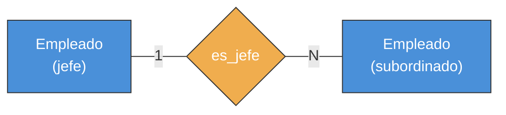
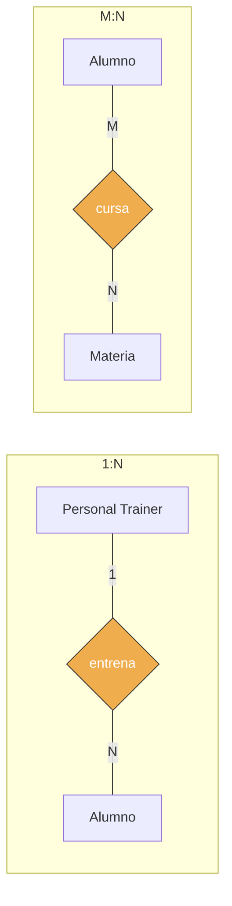
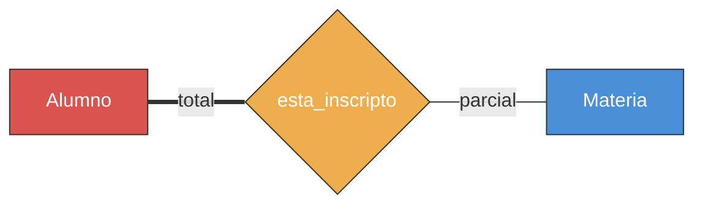
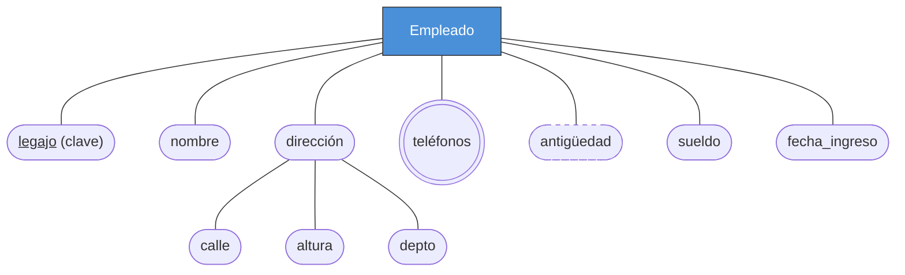
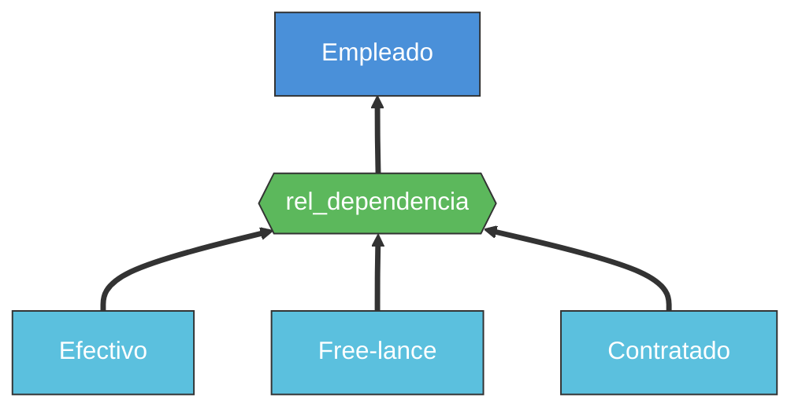
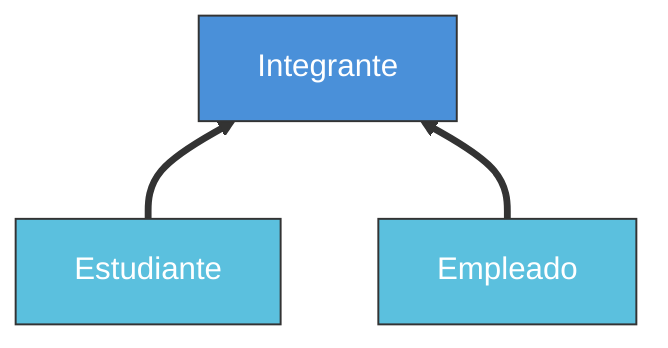
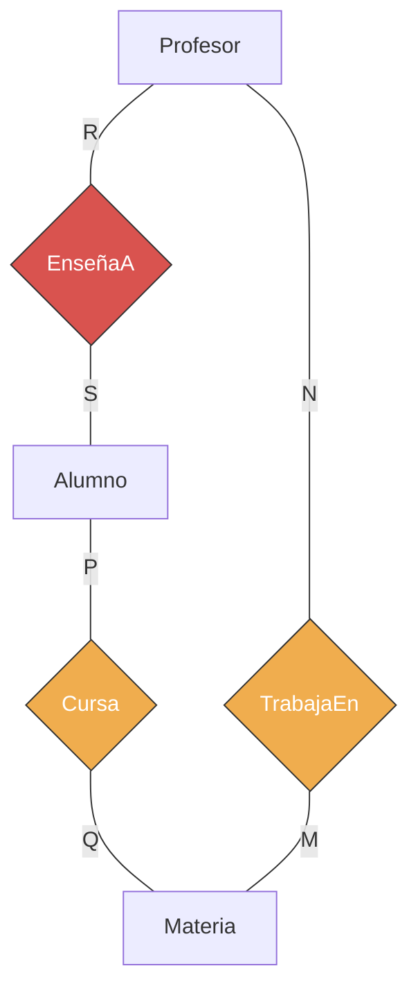
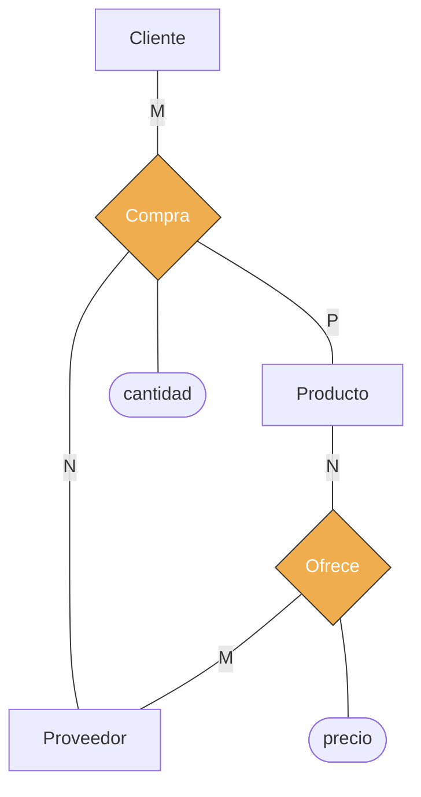
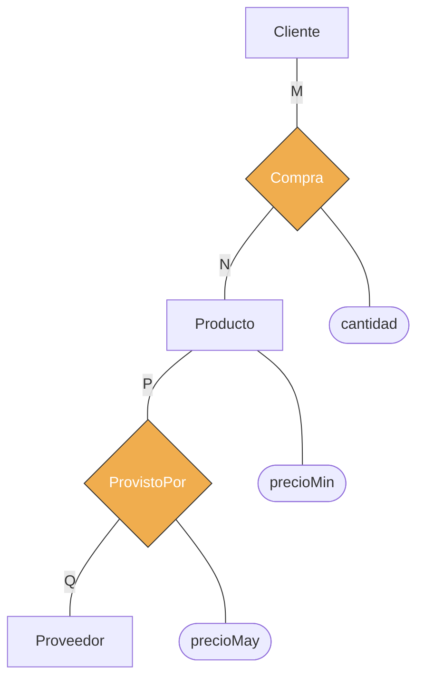

---
categories:
  - "[[ITBA.base|ITBA]]"
Tags:
  - modelo-conceptual
Created: 2026-03-0310:00
Materia: "[[BD.base|Bases de Datos]]"
temas:
  - Modelo E/R
  - Entidades
  - Relaciones
  - Atributos
  - Cardinalidad
  - EER
---
# BD clase 2 — Modelo Entidad-Relación

## Resumen

El **Modelo Entidad-Relación (E/R)** es el modelo conceptual más utilizado para diseñar bases de datos. Fue propuesto por Peter Chen en 1976 (*"The Entity-Relationship Model: Toward a Unified View of Data"*) y luego extendido por Teorey, Yang y Fry (1986) para soportar jerarquías de objetos.

### Pasos de diseño de una BD

1. **Reunir requerimientos**: conversar con usuarios finales, recolectar formularios, manuales, expectativas.
2. **Diseño conceptual**: crear un esquema E/R (sin referenciar ningún DBMS específico). Puede compartirse con usuarios no técnicos.
3. **Diseño lógico**: mapear el esquema conceptual al modelo de implementación elegido (relacional, jerárquico, red, objeto). Salida: especificación DDL.
4. **Diseño físico**: incorporar índices y estructuras de acceso para optimizar performance.
5. **Carga y puesta en marcha**: cargar datos, verificar funcionamiento, corregir si es necesario.

### Entidades

Una **entidad** es cualquier "cosa" del mundo real (concreta o abstracta) que tiene propiedades. Un **conjunto de entidades** (entity set / entity type) agrupa todas las entidades con los mismos atributos. Se nombran en singular.

- **Esquema / intensión**: descripción de la estructura compartida.
- **Extensión**: las entidades individuales concretas.

| Tipo                | Descripción                                                                                                    |
| ------------------- | -------------------------------------------------------------------------------------------------------------- |
| **Fuerte** (strong) | Arma su clave a partir de sus propios atributos                                                                |
| **Débil** (weak)    | Su clave necesita atributos de otra entidad asociada. Siempre tiene participación total. Posee *clave parcial* |

> [!important] Entidad débil ≠ participación total
> Toda entidad débil tiene participación total, pero no toda entidad con participación total es débil. Ej: *licencia_para_conducir* tiene participación total con *persona* pero no es débil (tiene su propio atributo clave *código*).

> Empleado (fuerte, rectángulo simple) — tiene → Dependiente (débil, doble borde, línea gruesa = participación total).

### Relaciones

Una **relación** es una asociación entre entidades particulares. Un **conjunto de relaciones** (relationship set) agrupa todas las relaciones del mismo tipo. Formalmente, dados E₁, E₂, …, Eₙ conjuntos de entidades (n ≥ 2), un conjunto de relaciones R ⊆ E₁ × E₂ × … × Eₙ.

- **Grado / aridad**: cantidad de conjuntos de entidades participantes.
  - *Binaria*: 2 conjuntos (la más común).
  - *Ternaria*: 3 conjuntos.
- **Roles**: función que desempeña una entidad en una relación. Implícitos cuando los conjuntos son distintos; explícitos cuando se repite el mismo conjunto.
- **Relación recursiva**: el mismo conjunto de entidades participa más de una vez con distintos roles. Se consideran *unarias*. Ej: *es_jefe* sobre *empleado* (rol jefe y rol subordinado).
- Las relaciones **también pueden tener atributos**. Ej: *aprobado(alumno, materia)* con atributo *nota*.

> Relación recursiva: el mismo conjunto *Empleado* participa dos veces con roles explícitos (jefe y subordinado).

> [!tip] Migración de atributos de relaciones
> En relaciones M:N los atributos deben quedarse en la relación. En 1:N pueden migrarse al conjunto de entidades del lado N. En 1:1 pueden ir a cualquiera de los dos lados.

### Cardinalidad

Indica el número de relaciones en las que una entidad puede participar con cierto rol. Para una relación binaria entre A y B:

| Cardinalidad | Significado |
|---|---|
| **1:1** | Una entidad en A se asocia con *a lo sumo* una en B, y viceversa |
| **1:N** | Una en A con muchas en B, pero una en B con a lo sumo una en A |
| **N:1** | Una en A con a lo sumo una en B, pero una en B con muchas en A |
| **M:N** | Sin restricciones en ningún sentido |

Para relaciones ternarias la cardinalidad se expresa con tres valores: 1:1:1, 1:1:N, 1:M:N, P:M:N (y permutaciones).

### Participación (existencia)

| Tipo | Definición |
|---|---|
| **Total** (mandatory) | Toda entidad del conjunto debe participar en al menos una relación |
| **Parcial** | Algunas entidades pueden no participar |

- El conjunto con participación total dependiente se llama **subordinado**; el otro es **dominante** (owner/dueño).
- Ej: si el ITBA exige que todo alumno esté inscripto en al menos una materia → *alumno* tiene participación total en *esta_inscripto*.

> Alumno tiene participación **total** (línea gruesa): todo alumno debe estar inscripto. Materia tiene participación **parcial** (línea simple): puede haber materias sin alumnos inscriptos.

### Tipos de atributos

| Clasificación | Tipos | Ejemplo |
|---|---|---|
| **Simple vs Compuesto** | *Simple*: atómico, no se divide. *Compuesto*: jerarquía de sub-atributos | *dirección* = calle + altura + departamento |
| **Univaluado vs Multivaluado** | *Univaluado*: un solo valor. *Multivaluado*: varios valores simultáneos | *color* de un taxi: negro y amarillo |
| **Almacenado vs Derivado** | *Almacenado*: se guarda. *Derivado*: se calcula a partir de otros | *antigüedad* se deriva de *fecha_de_ingreso* |
| **Clave** | Identifica unívocamente a una entidad. Puede ser simple o compuesta | *legajo* en alumno |
| **Clave parcial** | Identifica parcialmente (entidad débil); necesita la clave de la entidad fuerte asociada | *nro_dependiente* en una entidad débil *dependiente* |

> [!important] Restricción de clave
> Un tipo de entidad puede tener **más de una clave** (cada una simple o compuesta). Todo conjunto de entidades debe tener al menos una clave.

> **legajo**: clave (subrayado) · **dirección**: compuesto (sub-atributos calle, altura, depto) · **teléfonos**: multivaluado (doble borde) · **antigüedad**: derivado (línea punteada, se calcula de fecha_ingreso) · **sueldo, nombre**: simples.

### Diagrama E/R — Notación Chen

| Elemento                          | Representación gráfica                             |
| --------------------------------- | -------------------------------------------------- |
| Conjunto de entidades (fuerte)    | Rectángulo con nombre                              |
| Conjunto de entidades (débil)     | Rectángulo con **doble línea**                     |
| Conjunto de relaciones            | Rombo con nombre, unido por líneas a las entidades |
| Relación identificante (de débil) | Rombo con **doble línea**                          |
| Cardinalidad                      | Números (1, N, M, P) a los lados del rombo         |
| Participación total               | **Doble línea** entre entidad y relación           |
| Atributo                          | Óvalo unido a entidad/relación                     |
| Atributo multivaluado             | Óvalo con **doble línea**                          |
| Atributo compuesto                | Estructura arborescente de óvalos                  |
| Atributo derivado                 | Óvalo con **línea punteada**                       |
| Atributo clave                    | Nombre **subrayado**                               |
| Clave parcial (débil)             | Nombre subrayado con **línea punteada**            |

### Modelo E/R Extendido (EER) — Jerarquías

Permite expresar que un conjunto de entidades es **subclase** (más específico) o **superclase** (más general) de otro.

> [!important] Herencia
> La subclase **hereda todos los atributos** y participa de **todas las relaciones** de la superclase.

| Tipo | Condición | Diagrama |
|---|---|---|
| **Generalización** | Subclases **disjuntas** que al unirse forman la superclase completa | Subclases unidas a superclase vía hexágono con el atributo discriminante y doble flecha |
| **Es-un** (is-a) | Subclases **no necesariamente disjuntas** o que no cubren toda la superclase | Similar pero **sin hexágono** |

- Ej. generalización: *empleado* → {*efectivo*, *contratado*, *free-lance*} (disjuntos, completos).
- Ej. es-un: *integrante* → {*estudiante*, *empleado*} (un estudiante puede ser también empleado).

**Generalización** (subclases disjuntas, completas):

> Hexágono con el atributo discriminante. Subclases disjuntas: un empleado es efectivo, contratado **o** free-lance, pero no más de uno.

**Es-un** (subclases no disjuntas o incompletas):

> Sin hexágono. Un integrante puede ser estudiante **y** empleado al mismo tiempo (no disjuntas).

### Semántica de las relaciones

**Relaciones redundantes o derivadas**: una relación es redundante si al eliminarla **no se pierde información** (se puede deducir de las restantes). Las relaciones redundantes **deben eliminarse**. Un ciclo en el grafo E/R no implica necesariamente redundancia.

- Ej. redundante: *EnseñaA(Profesor, Alumno)* cuando ya existen *TrabajaEn(Profesor, Materia)* y *Cursa(Alumno, Materia)*.
- Ej. no redundante: *DirigidoPor(Alumno, Profesor)* (director de tesis) no se puede inferir de las materias cursadas.

> *EnseñaA* (rojo) es **redundante**: se puede deducir de *Cursa* + *TrabajaEn*. Debe eliminarse.

**Binarias vs Ternarias**: no siempre se puede reemplazar una relación ternaria por varias binarias sin perder información.

- Si el precio de un producto depende del proveedor y el cliente lo ve → **ternaria** *Compra(Cliente, Producto, Proveedor)*.
- Si el precio es único sin importar el proveedor → dos **binarias**: *Compra(Cliente, Producto)* y *ProvistoPor(Producto, Proveedor)*.

**Escenario 1 — Ternaria** (precio depende del proveedor):

> La relación ternaria *Compra* asocia cliente, producto y proveedor. *Ofrece* no es redundante.

**Escenario 2 — Binarias** (precio único):

> Dos binarias: no equivale a la ternaria. El cliente no sabe de quién viene el producto.

---

## Notas

- El modelo E/R se usa en la etapa más temprana del diseño, **sin referenciar ningún DBMS** específico.
- Las entidades débiles pueden reemplazarse colocando sus atributos como compuestos multivaluados en la entidad fuerte, pero es decisión del diseñador.
- Los atributos identificatorios (claves) aseguran diferenciación; los descriptivos solo ofrecen características.
- Cada atributo tiene un **dominio** (conjunto de valores permitidos).

## Preguntas

- ¿Cuándo conviene modelar una entidad débil vs. agregar atributos compuestos multivaluados a la entidad fuerte?
- ¿Cómo se determina si una relación en un ciclo del diagrama E/R es realmente redundante?
- ¿Cuál es el criterio para elegir entre una relación ternaria y múltiples binarias?
- ¿En una jerarquía es-un, cómo se manejan los atributos compartidos si una entidad pertenece a dos subclases simultáneamente?
# Guia
[[modelo_entidad_relacion.excalidraw]]
