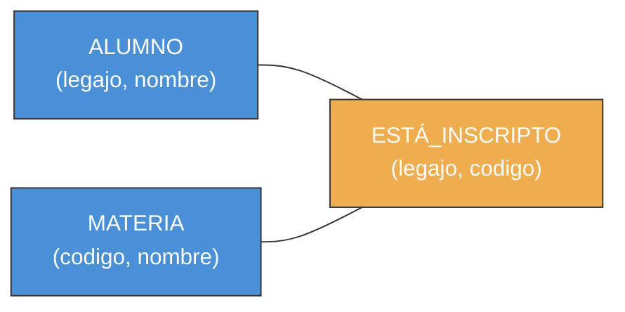

---
categories:
  - "[[ITBA.base|ITBA]]"
Tags:
  - modelo-relacional
Created: 2026-03-0311:00
Materia: "[[BD.base|Bases de Datos]]"
temas:
  - Modelo Relacional
  - Dominio
  - Esquema de Relación
  - Restricciones
  - Claves
  - Operaciones DML
---
# BD clase 3 — Modelo Relacional

## Resumen

El **Modelo Relacional** fue propuesto por Codd (IBM, 1970) y es el modelo de implementación más utilizado. Caracteriza el mini-universo como una colección de **relaciones** (tablas), sustentado por teoría matemática. Es el paso del diseño conceptual (E/R) al diseño lógico.

### Características del Modelo Relacional

| Aspecto | Modelo E/R | Modelo Relacional |
|---|---|---|
| Elementos | Entidades y relaciones | Solo relaciones (con significado distinto) |
| Atributos compuestos | Sí | **NO** — solo atómicos |
| Atributos multivaluados | Sí | **NO** — se mapean aparte |
| Representación | Diagramas | Tablas bidimensionales |

> [!important] Diferencias clave con el modelo E/R
> En el modelo relacional **solo existen relaciones** (no hay distinción entidad/relación). Además, todos los atributos deben ser **atómicos**: no se permiten atributos compuestos ni multivaluados.

**Dominio**: conjunto de valores atómicos (indivisibles) que puede tomar un atributo. Incluye siempre el valor especial **null**.

El valor **null** puede representar tres situaciones diferentes:
1. **No aplicable** — ej: "apartamento" para una dirección que es casa.
2. **Aplicable pero desconocido** — ej: teléfono de alguien que sabemos que tiene uno pero no recordamos el número.
3. **No se sabe si es aplicable** — ej: teléfono de alguien del que ignoramos si tiene.

### Esquema y Relación

Un **esquema de relación** se define como **R(A₁, A₂, …, Aₙ)** donde R es el nombre y cada Aᵢ es un atributo que juega el rol de algún dominio D en el esquema. Varios atributos pueden compartir dominio pero representar roles distintos (ej: *sueldo* y *porcentaje*, ambos ℝ ∪ {null}).

Una **relación r** (instancia) para un esquema R es un subconjunto del producto cartesiano de los dominios:

$$r \subseteq D_1 \times D_2 \times \ldots \times D_n$$

La máxima cantidad de tuplas posibles es |D₁| × |D₂| × … × |Dₙ|.

| Concepto E/R | Concepto Relacional |
|---|---|
| Conjunto de entidades / relaciones (intensión) | Esquema de relación (headers de tabla) |
| Entidades / relaciones concretas (extensión) | Conjunto de tuplas (filas de la tabla) |
| Una entidad o relación particular | Una tupla (fila) |

Como una relación es un **conjunto**, **NO puede tener elementos (tuplas) repetidos**. El orden de las filas no importa: dos tablas que solo difieren en el orden de sus filas son idénticas.

**Convención de notación**:
- Esquemas: R, S, T
- Atributos: A, B, C, A₁…Aₙ
- Instancias: r, s
- Valores: a, b, c
- Tuplas: t, u, v, w
- Conjuntos de atributos: X, Y, Z (también ABC en vez de {A, B, C})
- Restricción de tupla a atributos: t[X]

### Restricciones del Modelo Relacional

| Restricción | Descripción |
|---|---|
| **De dominio** | Todo valor de atributo debe ser atómico y pertenecer a su dominio |
| **De clave** | No pueden existir dos tuplas con la misma combinación de valores de clave; invariante en el tiempo |
| **Integridad de entidad** | Ningún atributo que forme parte de la clave puede ser null |
| **Integridad referencial** | Toda clave foránea debe referenciar una tupla existente en la relación referenciada (o ser null) |

> [!important] Integridad de entidad
> Ningún valor de clave puede ser **null**. Si lo fuera, no podríamos saber qué parte de la realidad representa esa tupla: los tres significados de null (no aplicable, desconocido, no se sabe) son todos absurdos para un atributo identificatorio.

### Claves

**Superclave (superkey)**: un subconjunto X de atributos es superclave si y solo si para toda instancia r, si t₁ ≠ t₂ entonces t₁[X] ≠ t₂[X]. El conjunto de *todos* los atributos siempre es superclave.

**Clave candidata**: una superclave que es **minimal** — si se remueve cualquier atributo, deja de ser superclave.

*Ejemplo*: dada la instancia:

| Atr1 | Atr2 | Atr3 |
|---|---|---|
| 1 | A | X |
| 2 | A | Y |
| 3 | B | Z |

- Atr1 → superclave ✓ y **clave candidata** ✓ (minimal)
- Atr2 → **NO** superclave (t₁[Atr2] = t₂[Atr2] = A, pero t₁ ≠ t₂)
- Atr3 → superclave ✓ y **clave candidata** ✓ (minimal)
- Atr1+Atr2 → superclave ✓ pero **NO** clave candidata (contiene Atr1 que ya es superclave)
- Atr1+Atr2+Atr3 → superclave ✓ pero **NO** clave candidata (no minimal)

Un esquema puede tener **muchas claves candidatas**. En la tabla se marca subrayando los atributos de clave; si hay más de una, se listan por separado.

### Clave Foránea

Un conjunto de atributos X de un esquema R es **clave foránea** (foreign key) si:
1. Los atributos de X tienen el **mismo dominio** que alguna clave Y de otro esquema S.
2. Para toda tupla t de r, existe una tupla u de s tal que **t[X] = u[Y]**, o bien t[X] es null.

Se dice que X **referencia** al esquema S.

*Ejemplo*: en ALUMNO(<u>legajo</u>, nombre), MATERIA(<u>codigo</u>, nombre) y ESTÁ_INSCRIPTO(<u>legajo</u>, <u>codigo</u>):
- *legajo* en ESTÁ_INSCRIPTO es FK → referencia a ALUMNO
- *codigo* en ESTÁ_INSCRIPTO es FK → referencia a MATERIA

### Operaciones DML

Las operaciones de manipulación de datos deben respetar todas las restricciones. Si una operación las viola, el DBMS debe rechazarla o tomar una acción correctiva.

**Inserción**: inserta una nueva tupla t en una relación r. Puede violar las **4 restricciones**:

| Restricción violada | Causa |
|---|---|
| Dominio | Valor de atributo fuera del dominio |
| Clave | Ya existe tupla u con t[X] = u[X] (clave repetida) |
| Integridad de entidad | Algún atributo de la clave es null |
| Integridad referencial | FK referencia a tupla inexistente |

Acciones ante violación: rechazar la inserción o informar error e intentar reparar.

**Borrado**: elimina tupla(s) de una relación r. Solo puede violar la **integridad referencial** (la tupla borrada está referenciada por otras).

> [!tip] Acciones ante violación de integridad referencial en borrado
> - **ON DELETE NO ACTION**: rechazar el borrado.
> - **ON DELETE CASCADE**: borrar en cascada todas las tuplas que referencian a la eliminada (recursivamente).
> - **ON DELETE SET**: modificar las FK que referencian la tupla eliminada para que apunten a otra tupla o a null.

**Modificación**: cambia valores de atributos en tupla(s). Puede violar restricciones según qué atributos se modifiquen:

| Operación | Dominio | Clave | Integridad de entidad | Integridad referencial |
|---|---|---|---|---|
| **Inserción** | ✓ | ✓ | ✓ | ✓ |
| **Borrado** | — | — | — | ✓ |
| **Modificación** | ✓ | ✓ (si se modifica clave) | ✓ (si se modifica clave) | ✓ (si se modifica FK o PK referenciada) |

---

## Notas

- La palabra "relación" en el modelo relacional **no es lo mismo** que en el modelo E/R. En el relacional, tanto entidades como relaciones del E/R se representan como relaciones (tablas).
- Un esquema de relación puede interpretarse como una **afirmación (assertion)**: cada tupla satisface ese predicado. Análogo a inteligencia artificial: la relación dice lo que *está* pero no lo que *no está*.
- Existen restricciones adicionales no cubiertas aquí: dependencias funcionales, multivaluadas y de junta.

## Preguntas

- ¿Por qué el modelo relacional no distingue entre los tres significados de null si semánticamente son diferentes?
- ¿Qué diferencia práctica hay entre ON DELETE CASCADE y ON DELETE SET NULL para mantener integridad referencial?
- Si una clave candidata se define semánticamente antes de poblar, ¿cómo se maneja el caso de descubrir que una clave elegida no es realmente minimal tras insertar datos?

# Guia
[[Mapeo del diagrama MER al modelo relacional]]
