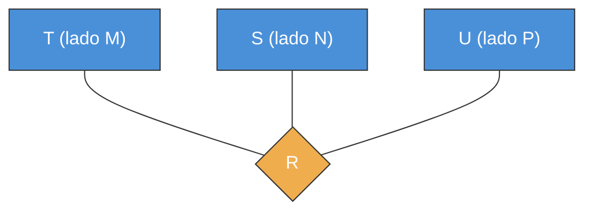
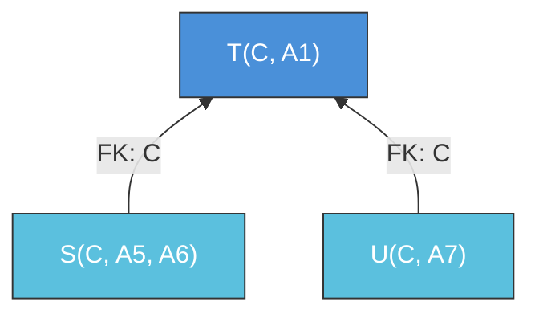

---
categories:
  - "[[ITBA.base|ITBA]]"
Tags:
  - mapeo
Created: 2026-03-0311:30
Materia: "[[BD.base|Bases de Datos]]"
temas:
  - Mapeo EER
  - Entidades Fuertes
  - Entidades Débiles
  - Atributos Multivaluados
  - Relaciones Binarias
  - Relaciones Ternarias
  - Jerarquías
---
# BD clase 4 — Mapeo EER a Relacional

## Resumen

El objetivo del mapeo es pasar del **modelo conceptual** (diagrama EER) al **modelo lógico** (esquema de base de datos relacional). Se siguen pasos sistemáticos para traducir entidades, atributos, relaciones y jerarquías en esquemas de relación con sus restricciones.

### Mapeo de Entidades Fuertes

Por cada conjunto de entidades fuerte, crear un esquema de relación con:
- **Atributos univaluados atómicos** (o componentes atómicas de los compuestos).
- Definir **todas las claves candidatas**.
- **Excluir** atributos multivaluados (se mapean por separado).

*Ejemplo*: una entidad Fuerte con clave compuesta A(A₁, A₂), atributo C y multivaluado M:

| **Fuerte** | | |
|---|---|---|
| **A1** | **A2** | C |

A no aparece (compuesto → solo sus componentes). M no aparece (multivaluado → sección aparte).

### Mapeo de Entidades Débiles

Por cada entidad débil, crear un esquema de relación con:
- Todos sus atributos univaluados/atómicos.
- **FK** con los atributos clave de la entidad **dominante**.
- **Clave** = clave de la dominante + clave parcial de la débil.

> [!important] Participación total obligatoria
> La entidad débil tiene participación total con la dominante: la FK **NO puede ser NULL** y debe declararse **ON DELETE CASCADE** (si desaparece la dominante, desaparece la débil).

*Ejemplo*: Fuerte(A₁, A₂) con entidad débil Debil(clave parcial B, atributo E):

| **Debil** | | | |
|---|---|---|---|
| **A1** | **A2** | **B** | E |

Clave de Debil = A₁ + A₂ + B. El par (A₁, A₂) es FK que referencia a Fuerte.

### Mapeo de Atributos Multivaluados

Por cada atributo multivaluado M, crear una **nueva relación** con:
- La FK que referencia a la relación dueña del atributo.
- El atributo M (o sus componentes si es compuesto).
- **Clave** = FK + M (conjuntamente).

*Ejemplo*: si Fuerte(<u>A₁, A₂</u>, C) tiene atributo multivaluado M:

| **NuevaRelacion** | | |
|---|---|---|
| **A1** | **A2** | **M** |

> [!important] La FK es parte de la clave
> La FK no puede ser NULL (es parte de la clave). La idea es declararla **ON DELETE CASCADE**.

### Mapeo de Relaciones 1:1

Se buscan los esquemas S y T de las entidades participantes, y se embebe la FK del otro lado. La decisión depende de la **participación**:

| Subcaso | FK puede ser null | Restricción FK | Dónde va la FK | Acción ON DELETE |
|---|---|---|---|---|
| **Ninguno participación total** | Sí | UNIQUE | En cualquiera de los dos | SET NULL |
| **Uno con participación total** | No | UNIQUE, NOT NULL | En el que tiene participación total | CASCADE |
| **Doble participación total** | No (ambas) | NOT NULL | En ambos (cruzada) o unificar en un solo esquema | CASCADE |

En **1:1 sin participación total**: la FK es nullable y UNIQUE (garantiza que no se repite → cada instancia se asocia con a lo sumo una del otro lado). Atributos de la relación R van a cualquiera.

En **1:1 con una participación total**: elegir el lado con participación total. FK NOT NULL + UNIQUE. Atributos de R van al lado con participación total.

En **1:1 con doble participación total**: dos opciones:
1. **Referencias cruzadas**: cada esquema incluye FK del otro (ambas NOT NULL, ON DELETE CASCADE).
2. **Unificación**: si ninguna entidad participa en otra relación, se juntan en un solo esquema. Representar **todas** las claves candidatas por separado.

### Mapeo de Relaciones 1:N

> [!tip] Regla general
> En relaciones 1:N, **el lado N recibe la FK** que referencia al lado 1. Los atributos de la relación R también pasan al lado N.

| Subcaso | FK puede ser null | Acción ON DELETE |
|---|---|---|
| **Sin participación total** (del lado N) | Sí | SET NULL |
| **Con participación total** (del lado N) | No | CASCADE |

> [!important] Limitación del lado 1
> Si hay participación total del **lado 1**, no se puede representar con lo visto hasta ahora (no hay FK que embeber en el lado 1). Se necesitarían triggers/PSM para garantizar esta restricción.

### Mapeo de Relaciones M:N

Se debe crear un **nuevo esquema de relación U** (no se puede embeber en ningún lado):
- Incluir como FK las claves de ambas entidades participantes.
- **Clave** = ambas FK conjuntamente.
- Agregar atributos atómicos de la relación R.
- Las FK **NO pueden ser null** → ON DELETE CASCADE.

*Ejemplo*: T(<u>A₁, A₂</u>, C) y S(<u>B</u>, E) con relación R M:N y atributo D:

| **R** | | | |
|---|---|---|---|
| **A1** | **A2** | **B** | D |

> [!important] Limitación de participación total en M:N
> No se puede representar participación total de **ninguno** de los lados con las herramientas vistas (ni de S ni de T). Se pueden insertar tuplas en S o T sin que existan en R. Se necesitan triggers/PSM.

### Mapeo de Relaciones Ternarias

Se crea siempre un nuevo esquema R con las FK de las tres entidades participantes. La formación de la clave depende de la cardinalidad:

| Cardinalidad | Clave de R | Ejemplo (T, S, U) |
|---|---|---|
| **M:N:P** (todos > 1) | Todas las FK juntas | A₁+A₂+A₃+A₅ |
| **1:M:N** (uno es 1) | Las dos FK de los lados con cardinalidad > 1 | A₁+A₂+A₃ (sin la FK del lado 1) |
| **1:1:N** (uno es N) | FK del lado N + cualquiera de las otras → **dos claves** | Claves: A₁+A₂+A₃ y A₅+A₃ |
| **1:1:1** (todos 1) | Cada par de FK → **tres claves** | Claves: A₁+A₂+A₃, A₃+A₅, A₁+A₂+A₅ |

Cuando hay **más de una clave**, no se pueden subrayar todas: se listan por separado y se representan **todas** las claves identificatorias.

> Relación ternaria: siempre se crea un nuevo esquema R con FK de T, S y U. La clave depende de la cardinalidad.

### Mapeo de Jerarquías

**Generalización** (subclases disjuntas, con propiedad discriminante):
- Superclase T(<u>C</u>, A₁, propiedad) — incluye el atributo discriminante.
- Cada subclase incluye la **clave de la superclase como FK** + sus atributos propios.
  - S(<u>C</u>, A₅, A₆) — C es FK → T
  - U(<u>C</u>, A₇) — C es FK → T

**Especialización** (es-un, subclases no necesariamente disjuntas):
- Superclase T(<u>C</u>, A₁) — sin atributo discriminante.
- Subclases con FK igual que en generalización:
  - S(<u>C</u>, A₅, A₆) — C es FK → T
  - U(<u>C</u>, A₇) — C es FK → T

En ambos casos la clave de cada subclase es **la misma clave de la superclase** (que actúa como FK).

> Las subclases heredan la clave C de la superclase como FK y como su propia clave identificatoria.

---

## Notas

- El mapeo es **sistemático**: se puede seguir como receta paso a paso desde el diagrama EER.
- Las relaciones 1:1 y 1:N se **embeben** en esquemas existentes; las M:N y ternarias siempre requieren un **esquema nuevo**.
- Las limitaciones de representación de participación total (lado 1 en 1:N, ambos lados en M:N) se resuelven con **triggers o PSM** (Persistent Stored Modules), que se verán más adelante en la materia.
- En relaciones ternarias, a medida que más lados tienen cardinalidad 1, aparecen **más claves candidatas** (se pasa de 1 clave en M:N:P a 3 claves en 1:1:1).

## Preguntas

- En una relación 1:1 con doble participación total, ¿cuándo conviene unificar esquemas vs. usar referencias cruzadas?
- ¿Cómo se implementaría con triggers la participación total del lado 1 en una relación 1:N?
- En relaciones ternarias 1:1:N, ¿por qué la FK del lado N debe estar en ambas claves candidatas?
- ¿Se pierde información al mapear una generalización si las subclases no son completas (no cubren toda la superclase)?

---

<!-- notas-relacionadas:inicio -->

## Notas relacionadas

**Misma materia (BD)**

- [BD clase 3 modelo relacional](BD%20clase%203%20modelo%20relacional.md) — clase anterior
- [BD clase 5 algebra relacional](BD%20clase%205%20algebra%20relacional.md) — clase siguiente
- [Mapeo del diagrama MER al modelo relacional](Mapeo%20del%20diagrama%20MER%20al%20modelo%20relacional.md) — práctica de este tema
- [BD clase 2 modelo entidad relacion](BD%20clase%202%20modelo%20entidad%20relacion.md) — el MER de origen

<!-- notas-relacionadas:fin -->
