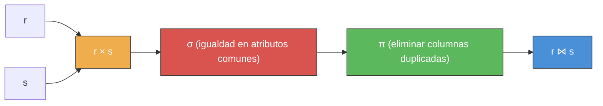

---
categories:
  - "[[ITBA.base|ITBA]]"
Tags:
  - algebra-relacional
Created: 2026-03-0314:00
Materia: "[[BD.base|Bases de Datos]]"
temas:
  - Álgebra Relacional
  - Operaciones Fundamentales
  - Operaciones Derivadas
  - Selección
  - Proyección
  - Producto Cartesiano
  - Junta Natural
  - Outer Join
  - División (Cociente)
  - Manejo de NULLs
---
# BD clase 5 — Álgebra Relacional

## Resumen

El **álgebra relacional** es un lenguaje de consulta **puro y procedural**. Opera sobre **relaciones** (no esquemas) mediante operadores unarios y binarios que producen nuevas relaciones. Es utilizado internamente por los DBMS para evaluar y optimizar consultas. No posee funciones de agregación, ni agrupamiento, ni orden explícito de tuplas.

### Propiedad de Clausura

El resultado de aplicar cualquier operador del álgebra relacional es **siempre una relación**. Esto permite **componer operaciones** (anidar expresiones), de la misma forma que en matemática se componen funciones.

> [!important] Clausura como fundamento
> La propiedad de clausura garantiza que toda expresión del álgebra relacional produce una relación válida. Esto habilita el anidamiento arbitrario de operaciones: $\sigma_F(\pi_L(r \bowtie s))$ es una expresión válida porque cada paso intermedio es una relación.

Sean $e_1$ y $e_2$ expresiones del álgebra relacional, entonces también lo son:

$$\sigma_P(e_1), \quad \pi_S(e_1), \quad e_1 \cup e_2, \quad e_1 - e_2, \quad e_1 \times e_2$$

> Esto permite construir consultas de complejidad arbitraria combinando operadores fundamentales.

### Clasificación de Operadores

Los operadores se clasifican en **fundamentales** (definen la potencia expresiva del lenguaje) y **derivados** (simplifican expresiones pero se definen en función de los fundamentales).

| Operador                | Símbolo      | Tipo        | Aridad  | Requiere compatibilidad | Definición formal resumida                                                 |
| ----------------------- | ------------ | ----------- | ------- | ----------------------- | -------------------------------------------------------------------------- |
| **Selección**           | $\sigma$     | Fundamental | Unario  | --                      | $\sigma_F(r) = \{t \in r \mid F(t) = \text{true}\}$                        |
| **Proyección**          | $\pi$        | Fundamental | Unario  | --                      | $\pi_{a_{i1},\ldots,a_{ik}}(r) = \{t[a_{i1},\ldots,a_{ik}] \mid t \in r\}$ |
| **Unión**               | $\cup$       | Fundamental | Binario | Sí                      | $r \cup s = \{t \mid t \in r \lor t \in s\}$                               |
| **Diferencia**          | $-$          | Fundamental | Binario | Sí                      | $r - s = \{t \mid t \in r \land t \notin s\}$                              |
| **Producto Cartesiano** | $\times$     | Fundamental | Binario | No                      | $r \times s = \{t_1 \cdot t_2 \mid t_1 \in r \land t_2 \in s\}$            |
| **Renombramiento**      | $\rho$       | Fundamental | Unario  | --                      | $\rho_X(e)$ renombra relación; $\rho_{(a_1,\ldots)}(e)$ renombra atributos |
| **Intersección**        | $\cap$       | Derivado    | Binario | Sí                      | $r \cap s = r - (r - s)$                                                   |
| **Theta Join**          | $\theta$     | Derivado    | Binario | No                      | $r \bowtie_\theta s = \sigma_\theta(r \times s)$                           |
| **Equijoin**            | $\theta_{=}$ | Derivado    | Binario | No                      | Theta join con solo operador $=$                                           |
| **Junta Natural**       | $\bowtie$    | Derivado    | Binario | No                      | $r \bowtie s = \pi_Z(\sigma_{r.A_1=s.A_1 \land \ldots}(r \times s))$       |
| **Left Outer Join**     | $⟕$          | Derivado    | Binario | No                      | Junta natural + tuplas de $r$ sin match (con NULLs)                        |
| **Right Outer Join**    | $⟖$          | Derivado    | Binario | No                      | Junta natural + tuplas de $s$ sin match (con NULLs)                        |
| **Full Outer Join**     | $⟗$          | Derivado    | Binario | No                      | Junta natural + tuplas sin match de ambos lados                            |
| **División (Cociente)** | $\%$         | Derivado    | Binario | $S \subseteq R$         | $r\%s$: tuplas de $\pi_{R-S}(r)$ asociadas con **toda** tupla de $s$       |
| **Asignación**          | $\leftarrow$ | Auxiliar    | --      | --                      | Asigna expresión a variable temporal                                       |

> [!tip] Regla mnemotécnica
> Los 6 operadores fundamentales son: $\sigma$, $\pi$, $\cup$, $-$, $\times$, $\rho$. Todo lo demás (joins, intersección, cociente) se puede expresar combinándolos.

### Relaciones Compatibles

Dos relaciones $r(A_1, A_2, \ldots, A_n)$ y $s(B_1, B_2, \ldots, B_n)$ son **compatibles** si:
1. Tienen el **mismo grado** $n$.
2. $\text{dom}(A_i) = \text{dom}(B_i)$ para todo $i$ entre $1$ y $n$.

> [!important] Requisito para operaciones conjuntistas
> La compatibilidad es **obligatoria** para aplicar $\cup$, $-$ y $\cap$. Los nombres de columna del resultado se toman del **operando izquierdo**.

---

### Selección ($\sigma$)

Operación **unaria** que selecciona el subconjunto de tuplas que satisfacen un predicado $F$.

$$\sigma_F(r) = \{t \mid t \in r \land F(t) = \text{true}\}$$

El predicado $F$ se construye con:
- **Operadores de comparación**: $<, \leq, >, \geq, =, \neq$
- **Operadores lógicos**: $\land$ (and), $\lor$ (or), $\neg$ (not)

La condición compara: `atributo op atributo` o `atributo op constante` (del dominio del atributo).

| Propiedad | Resultado |
|---|---|
| **Grado** del resultado | Igual que $r$ |
| **Cardinalidad** del resultado | $\leq \|r\|$ |

> [!important] Propiedades de la selección
> - **Conmutativa**: $\sigma_{c_1}(\sigma_{c_2}(r)) = \sigma_{c_2}(\sigma_{c_1}(r))$
> - **Cascada** (colapso de selecciones anidadas): $\sigma_{c_1}(\sigma_{c_2}(\ldots(\sigma_{c_n}(r))\ldots)) = \sigma_{c_1 \land c_2 \land \ldots \land c_n}(r)$

*Ejemplo*: Obtener alumnos con legajo > 1000 y legajo $\leq$ 1900:

$$\sigma_{\text{legajo}>1000 \;\land\; \text{legajo} \leq 1900}(\text{alumno})$$

---

### Proyección ($\pi$)

Operación **unaria** que genera una nueva relación con solo las columnas indicadas, **eliminando duplicados** automáticamente para garantizar la propiedad de clausura.

$$\pi_{a_{i1}, a_{i2}, \ldots, a_{ik}}(r) = \{t[a_{i1}, \ldots, a_{ik}] \mid t \in r\}$$

| Propiedad | Resultado |
|---|---|
| **Grado** del resultado | $k$ (cantidad de atributos listados) |
| **Cardinalidad** del resultado | $\leq \|r\|$ (igual si la lista incluye la clave) |

> [!important] Propiedad de proyecciones anidadas
> Si $\text{lista}_1 \subseteq \text{lista}_2$, entonces: $\pi_{\text{lista}_1}(\pi_{\text{lista}_2}(r)) = \pi_{\text{lista}_1}(r)$

> [!tip] Eliminación de duplicados
> Si la lista de atributos proyectados **no incluye la clave**, pueden aparecer tuplas repetidas. El operador $\pi$ las elimina para que el resultado siga siendo una relación válida.

---

### Unión ($\cup$)

Operación **binaria** sobre relaciones **compatibles**. Incluye todas las tuplas de $r$, de $s$, o de ambas (sin duplicados).

$$r \cup s = \{t \mid t \in r \lor t \in s\}$$

> [!important] Propiedades
> - **Conmutativa**: $r \cup s = s \cup r$
> - **Asociativa**: $(r \cup s) \cup t = r \cup (s \cup t)$

---

### Diferencia ($-$)

Operación **binaria** sobre relaciones **compatibles**. Devuelve las tuplas que están en $r$ pero no en $s$.

$$r - s = \{t \mid t \in r \land t \notin s\}$$

> [!important] La diferencia es NO conmutativa
> $r - s \neq s - r$ en general. El orden de los operandos importa.

---

### Producto Cartesiano ($\times$)

Operación **binaria** que combina cada tupla de $r$ con cada tupla de $s$.

Sean $r(A_1, \ldots, A_n)$ con $|r|$ tuplas y $s(B_1, \ldots, B_m)$ con $|s|$ tuplas:

$$r \times s : \quad |r \times s| = |r| \cdot |s| \text{ tuplas}, \quad n + m \text{ atributos}$$

Para una tupla $u$ del resultado: $\exists\, t_1 \in r,\; t_2 \in s : u[R] = t_1[R] \land u[S] = t_2[S]$

> [!tip] Desambiguación de atributos
> Si un atributo aparece en ambos esquemas, se prefija con el nombre de la relación: `relacion.atributo`. Si las relaciones tienen el mismo nombre, se usa $\rho$ para renombrar primero.

---

### Renombramiento ($\rho$)

Permite cambiar el nombre de una relación o de sus atributos para resolver ambigüedades.

| Sintaxis | Efecto |
|---|---|
| $\rho_X(e)$ | Renombra la **relación** $e$ como $X$ |
| $\rho_{(a_1, a_2, \ldots, a_n)}(e)$ | Renombra los **atributos** de $e$ (debe listar todos) |

> [!important] Diferencia sutil
> $\rho_a(A)$ renombra la **relación** $A$ como $a$. En cambio $\rho_{(a)}(A)$ renombra el **atributo** de $A$. Los paréntesis en el subíndice distinguen ambos casos.

Para renombrar relación y atributos simultáneamente se encadenan dos $\rho$:

$$\rho_{\text{alu}}(\rho_{(\text{milegajo, nombre})}(\text{alumno}))$$

---

### Intersección ($\cap$) -- Derivada

Operación **binaria** sobre relaciones **compatibles**. Devuelve las tuplas presentes en ambas relaciones.

$$r \cap s = r - (r - s)$$

| Propiedad | Fórmula |
|---|---|
| **Conmutativa** | $r \cap s = s \cap r$ |
| **Asociativa** | $(r \cap s) \cap t = r \cap (s \cap t)$ |

---

### Theta Join ($\theta$-join) -- Derivada

Es un producto cartesiano seguido de una selección sobre una condición que compara atributos de ambas relaciones.

$$r \bowtie_\theta s = \sigma_\theta(r \times s)$$

Donde $\theta$ tiene la forma $A_i \;\text{op}\; B_j$ con $\text{op} \in \{<, \leq, >, \geq, =, \neq\}$.

*Ejemplo*: $\text{alumno} \bowtie_{\text{legajo} < \text{examen.legajo}} \text{examen}$ devuelve combinaciones donde el legajo del alumno es menor que el legajo del examen.

---

### Equijoin -- Derivada

Caso particular del theta join donde la condición usa **exclusivamente** el operador $=$. Se indica la **sublista de atributos** con nombre coincidente en ambas relaciones.

$$r \bowtie_{\text{eq}(A)} s = \sigma_{r.A = s.A}(r \times s)$$

En el resultado aparecen **columnas duplicadas** (los atributos de la condición de junta), desambiguadas con prefijo.

> [!tip] Equivalencia con theta join
> $\text{alumno} \;\theta_{\text{legajo}}\; \text{examen}$ equivale a $\text{alumno} \bowtie_{\text{alumno.legajo}=\text{examen.legajo}} \text{examen}$

---

### Junta Natural ($\bowtie$) -- Derivada

Es la operación más usada. Combina tuplas que coinciden en **todos los atributos con el mismo nombre**, y **elimina las columnas duplicadas** del resultado.

Sean $R$ y $S$ con atributos en común $\{A_1, \ldots, A_n\}$ y sea $Z = R \cup S$ (unión de conjuntos de atributos):

$$r \bowtie s = \pi_Z\Big(\sigma_{r.A_1 = s.A_1 \;\land\; \ldots \;\land\; r.A_n = s.A_n}(r \times s)\Big)$$

> Descomposición interna de la junta natural: producto cartesiano, selección por igualdad, proyección para eliminar duplicados.

> [!important] Caso sin atributos en común
> Si $r$ y $s$ no comparten ningún nombre de atributo en sus esquemas, entonces $r \bowtie s = r \times s$ (se degrada a producto cartesiano).

Las tuplas de $r$ o $s$ que **no tienen correspondencia** en el otro lado **no aparecen** en el resultado de la junta natural.

---

### Outer Joins (Semijunta Natural) -- Derivadas

Variantes de la junta natural que **conservan las tuplas sin correspondencia**, completando con **NULL** los atributos faltantes.

| Variante | Símbolo | Qué conserva |
|---|---|---|
| **Left Outer Join** | $r ⟕ s$ | Todas las tuplas de $r$ (completa con NULL si no matchea en $s$) |
| **Right Outer Join** | $r ⟖ s$ | Todas las tuplas de $s$ (completa con NULL si no matchea en $r$) |
| **Full Outer Join** | $r ⟗ s$ | Todas las tuplas de ambas relaciones |

> [!tip] Cuándo usar outer join
> Cuando se necesita que **ninguna tupla se pierda** en la junta. Ejemplo típico: listar todos los alumnos con sus exámenes, incluyendo los que nunca rindieron (aparecen con nroActa y nota como NULL).

*Ejemplo*: $\text{alumno} ⟕ \text{examen}$ produce la junta natural, pero los alumnos sin exámenes (legajos 1100 y 1300) aparecen con `nroActa = null` y `nota = null`.

---

### División / Cociente ($\%$) -- Derivada

Operación **binaria** que resuelve consultas del tipo **"para todo"**. Sean $r(R)$ y $s(S)$ donde $S \subseteq R$:

Una tupla $t$ está en $r \% s$ si y solo si:
1. $t \in \pi_{R-S}(r)$
2. Para **toda** tupla $t_s \in s$, existe una tupla $t_r \in r$ tal que $t_r[S] = t_s[S]$ y $t_r[R-S] = t$

> [!important] Fórmula del cociente en operaciones fundamentales
> Esta es la expresión clave para resolver el cociente sin usar el operador $\%$:
> $$r \% s = \pi_{R-S}(r) - \pi_{R-S}\Big(\big(\pi_{R-S}(r) \times s\big) - \pi_{R-S,\,S}(r)\Big)$$

**Explicación algorítmica** de la fórmula:

| Paso | Expresión | Significado |
|---|---|---|
| 1 | $T_1 = \pi_{R-S}(r)$ | Todos los candidatos posibles |
| 2 | $T_2 = T_1 \times s$ | Todas las combinaciones posibles candidato-tupla de $s$ |
| 3 | $T_3 = T_2 - \pi_{R-S,\,S}(r)$ | Combinaciones que **no existen** en $r$ (candidatos que fallan) |
| 4 | $T_4 = \pi_{R-S}(T_3)$ | Candidatos que **no cubren** todo $s$ |
| 5 | Resultado $= T_1 - T_4$ | Candidatos que sí cubren todo $s$ |

*Ejemplo*: obtener los legajos de alumnos que rindieron **todas** las materias:

$$\pi_{\text{legajo, nombreMateria}}(\text{examen2}) \;\%\; \text{materia}$$

---

### Manejo de NULLs

Al extender el modelo relacional con NULL, pasamos de una lógica **2VL** (TRUE/FALSE) a una lógica **3VL** (TRUE/FALSE/NULL). Para mapear de 3VL a 2VL en las operaciones de selección y junta se adoptó la siguiente regla:

| Comparación | Resultado |
|---|---|
| `NULL op NULL` | **FALSE** |
| `NULL op valor` | **FALSE** |
| `valor op NULL` | **FALSE** |
| `IsNull(atributo)` con atributo = NULL | **TRUE** |

> [!important] Consecuencia práctica
> Una tupla con NULL en un atributo de junta o en un atributo comparado en una selección **nunca será recuperada** por comparación directa. Para recuperar tuplas con NULL se debe usar la función `IsNull()`.

*Ejemplo*: si `examen` tiene tuplas con `nota = NULL`:
- $\sigma_{\text{nota} = \text{null} \;\land\; \text{legajo} \leq 1900}(\text{examen})$ -- **no recupera** esas tuplas (NULL = NULL es FALSE).
- $\sigma_{\text{IsNull(nota)} \;\land\; \text{legajo} \leq 1900}(\text{examen})$ -- **sí recupera** las tuplas con nota NULL y legajo $\leq$ 1900.

> La razón: dos valores NULL no son comparables porque pueden representar semánticamente tres conceptos diferentes (valor desconocido, valor inaplicable, valor ausente).

---

### Tabla de Propiedades de los Operadores

| Operador | Conmutativo | Asociativo | Notas |
|---|---|---|---|
| $\sigma$ (selección) | Sí (entre selecciones) | -- | Se pueden colapsar con $\land$ |
| $\pi$ (proyección) | -- | Absorbente si $L_1 \subseteq L_2$ | $\pi_{L_1}(\pi_{L_2}(r)) = \pi_{L_1}(r)$ |
| $\cup$ (unión) | Sí | Sí | Elimina duplicados |
| $-$ (diferencia) | **No** | **No** | $r - s \neq s - r$ |
| $\times$ (producto) | Sí | Sí | $\|r \times s\| = \|r\| \cdot \|s\|$ |
| $\cap$ (intersección) | Sí | Sí | $r \cap s = r - (r-s)$ |
| $\bowtie$ (junta natural) | Sí | Sí | Sin atributos comunes $\Rightarrow$ $\times$ |

---

### Asignación ($\leftarrow$)

El símbolo $\leftarrow$ permite asignar una expresión del álgebra relacional a una **variable temporal** para reutilizarla en expresiones posteriores.

*Ejemplo*:

$$\text{auxi} \leftarrow \sigma_{c_1.\text{codCli} < c_2.\text{codCli} \;\land\; c_1.\text{ciudad} = c_2.\text{ciudad}}(\rho_{c_1}(\text{cliente}) \times \rho_{c_2}(\text{cliente}))$$

$$\pi_{c_1.\text{nombreCli},\; c_2.\text{nombreCli}}(\text{auxi})$$

> [!tip] La asignación no altera la base de datos
> Las variables temporales solo existen durante la evaluación de la consulta. Permiten descomponer expresiones complejas en pasos legibles.

---

## Notas

- El álgebra relacional es **procedural**: se especifica el "cómo" paso a paso. En contraste, el cálculo relacional (y SQL en gran parte) es **declarativo**: se especifica el "qué".
- Los 6 operadores fundamentales ($\sigma, \pi, \cup, -, \times, \rho$) son **suficientes** para expresar cualquier consulta. Los derivados ($\cap, \bowtie, \theta, \%, \text{outer joins}$) son azúcar sintáctico.
- La **eliminación de duplicados** ocurre implícitamente en toda operación (porque las relaciones son conjuntos).
- El producto cartesiano rara vez se usa solo; casi siempre se combina con selección (= theta join) o se usa la junta natural directamente.
- Para consultas de tipo "para todo" (cuantificador universal), la herramienta correcta es el **cociente** ($\%$).
- Las limitaciones del álgebra relacional: **no tiene** funciones de agregación (SUM, COUNT, AVG...), ni agrupamiento (GROUP BY), ni ordenamiento (ORDER BY).

## Preguntas

- ¿Cómo se expresaría en álgebra relacional una consulta con "no existe" vs. una con "para todo" usando cociente?
- ¿Es posible expresar el full outer join puramente con operaciones fundamentales sin introducir NULLs?
- ¿Cómo afecta la presencia de NULLs a la conmutatividad de la junta natural?
- ¿Por qué el álgebra relacional no incluye funciones de agregación? ¿Qué extensión se propone para soportarlas?
- En la fórmula del cociente, ¿qué pasa si $s$ es vacía?

---

<!-- notas-relacionadas:inicio -->

## Notas relacionadas

**Misma materia (BD)**

- [[BD clase 4 mapeo EER a relacional]] — clase anterior
- [[BD clase 6 calculo relacional]] — clase siguiente: equivalencia
- [[BD clase 8 SQL consultas]] — cómo se escribe en SQL

<!-- notas-relacionadas:fin -->
