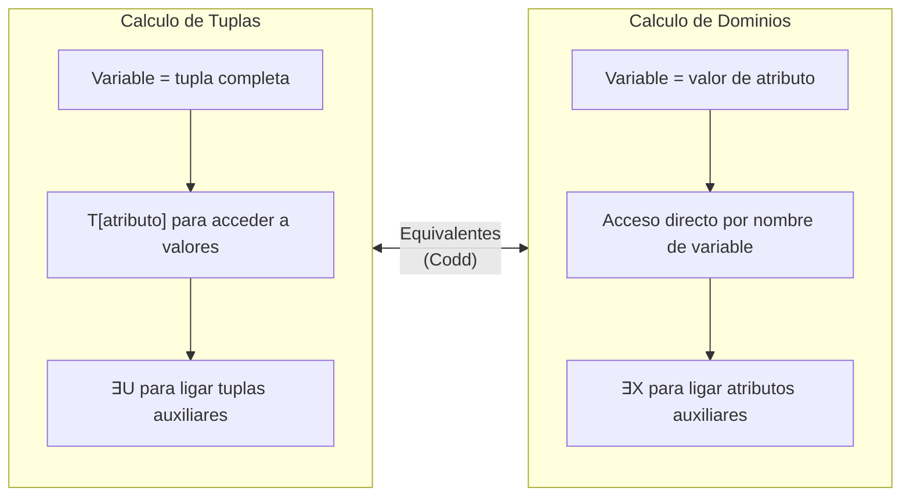

---
categories:
  - "[[ITBA.base|ITBA]]"
Tags:
  - calculo-relacional
Created: 2026-03-0314:00
Materia: "[[BD.base|Bases de Datos]]"
temas:
  - Cálculo Relacional de Tuplas (TRC)
  - Cálculo Relacional de Dominios (DRC)
  - Átomos y Fórmulas
  - Variables Libres y Ligadas
  - Cuantificadores
  - Fórmulas Seguras
  - Equivalencia con Álgebra Relacional
  - Transformaciones Lógicas
---
# BD clase 6 — Cálculo Relacional

## Resumen

El **cálculo relacional** es un lenguaje de consulta **declarativo** (no procedural) basado en el cálculo de predicados de primer orden. A diferencia del álgebra relacional, donde se especifica *cómo* obtener el resultado (secuencia de operaciones), en el cálculo relacional solo se especifica *qué* se desea obtener. Existen dos variantes: el **Cálculo Relacional de Tuplas** (TRC) y el **Cálculo Relacional de Dominios** (DRC).

| Aspecto | Álgebra Relacional | Cálculo Relacional |
|---|---|---|
| **Paradigma** | Procedural | Declarativo |
| **Se especifica** | Secuencia de operaciones | Condición que deben cumplir las tuplas |
| **Potencia expresiva** | Equivalente (Codd) | Equivalente (Codd) |
| **Optimización** | Manual (orden importa) | El sistema decide la estrategia |

> [!important] Teorema de Codd
> La potencia expresiva del **álgebra relacional** y del **cálculo relacional seguro** son equivalentes: toda consulta expresable en uno puede expresarse en el otro.

### Cálculo Relacional de Tuplas (TRC)

Las variables representan **tuplas completas** de una relación. Una consulta recupera las tuplas que satisfacen una fórmula:

$$\{ \; T \;\mid\; \text{fórmula}(T) \;\}$$

> Las únicas **variables libres** permitidas en la expresión son las que aparecen a la izquierda del pipe ($|$).

#### Átomos en TRC

Un **átomo** es la unidad mínima de una fórmula. En TRC existen tres tipos:

| Tipo de Átomo | Forma | Significado |
|---|---|---|
| **Pertenencia** | $r(T)$ | $T$ es una tupla de la relación $r$ (equivale a $T \in r$) |
| **Comparación entre variables** | $U[i] \;\text{op}\; V[j]$ | Compara atributo $i$ de $U$ con atributo $j$ de $V$ |
| **Comparación con constante** | $U[i] \;\text{op}\; c$ | Compara atributo $i$ de $U$ con una constante $c$ |

Los operadores de comparación son: $<, \leq, >, \geq, =, \neq$

#### Fórmulas en TRC

Las fórmulas se construyen recursivamente a partir de átomos:

- Un **átomo** es una fórmula (sus variables son libres).
- Si $f_1$ y $f_2$ son fórmulas, entonces:
  - $f_1 \lor f_2$ (disyuncion)
  - $f_1 \land f_2$ (conjuncion)
  - $\lnot f_1$ (negacion)
- Si $f$ es fórmula: $(\exists\, U)(f_U)$ es fórmula. La variable $U$ queda **ligada**.
- Si $f$ es fórmula: $(\forall\, U)(f_U)$ es fórmula. La variable $U$ queda **ligada**.

> [!tip] Variables libres vs. ligadas
> Las variables **libres** (globales) no están bajo el alcance de ningun cuantificador. Las variables **ligadas** (locales) estan dentro del alcance de $\exists$ o $\forall$. En la expresion $\{ T \mid \text{formula}(T) \}$, la unica variable libre es $T$.

#### Cuantificadores y transformaciones logicas

Las equivalencias clave para manipular cuantificadores:

$$(\forall\, X)(p_X) \;\equiv\; (\lnot \exists\, X)(\lnot p_X)$$

$$(\exists\, X)(p_X) \;\equiv\; (\lnot \forall\, X)(\lnot p_X)$$

La **implicacion** se elimina asi:

$$p \Rightarrow q \;\equiv\; \lnot p \lor q$$

> [!important] Patron "para todo" en consultas
> Cuando una consulta dice "todos" o "cada uno", se traduce con $\forall$. Como $\forall$ puede generar formulas inseguras, se transforma: $(\forall\, X)(p_X) \to (\lnot \exists\, X)(\lnot p_X)$. Esto convierte el "para todo" en "no existe uno que no cumpla", permitiendo escribir formulas seguras.

### Formulas Seguras

Una formula puede ser sintacticamente correcta pero producir un resultado **infinito**. Esto ocurre, por ejemplo, con $\{ T \mid \lnot r(T) \}$, que devolveria todas las tuplas que *no* estan en $r$ (infinitas).

**Dominio activo** de una BD: el conjunto de todos los valores que aparecen en las relaciones de la BD.

**Dominio de una formula**: los valores constantes en la formula + los valores de los atributos de todas las relaciones mencionadas en la formula.

| Concepto | Definicion |
|---|---|
| **Formula segura** | $\{ T \mid f(T) \}$ es segura si para toda BD, todos los valores del resultado pertenecen al dominio de $f$ |
| **Formula insegura** | El resultado incluye valores fuera del dominio activo (resultado infinito) |

> [!important] Detectar formulas inseguras
> Prestar atencion a formulas con $\lnot\, \text{relacion}(V)$. Usar leyes logicas para transformarlas. Si una variable negada tiene **binding** (esta ligada a otra relacion mediante $\land$), la formula puede ser segura. Ejemplo: $\{ T \mid \text{alumno}(T) \land (\exists\, M)(\text{alumno\_1999}(M) \land \lnot\, \text{alumno\_2000}(M) \land M[\text{legajo}] = T[\text{legajo}]) \}$ es segura porque $M$ esta ligada a `alumno_1999`.

### Equivalencia Algebra Relacional ↔ TRC

La siguiente tabla muestra como reescribir cada operador del algebra relacional en TRC:

| Algebra Relacional | Calculo Relacional de Tuplas | Notas |
|---|---|---|
| $r \cup s$ | $\{ T \mid r(T) \lor s(T) \}$ | $r$ y $s$ mismo grado, dominios compatibles |
| $r - s$ | $\{ T \mid r(T) \land \lnot\, s(T) \}$ | Segura: $T$ tiene binding en $r$ |
| $r \times s$ | $\{ T \mid (\exists\, U)(r(U) \land (\exists\, V)(s(V) \land T[1]{=}U[1] \land \ldots \land T[n]{=}U[n] \land T[n{+}1]{=}V[1] \land \ldots \land T[n{+}m]{=}V[m])) \}$ | $r$ grado $n$, $s$ grado $m$, $T$ grado $n+m$ |
| $\pi_{A_1,\ldots,A_k}(r)$ | $\{ T \mid (\exists\, U)(r(U) \land T[1]{=}U[1] \land \ldots \land T[k]{=}U[k]) \}$ | Relacion resultante de grado $k$ |
| $\sigma_{\text{cond}}(r)$ | $\{ T \mid r(T) \land \text{cond}' \}$ | $\text{cond}'$ es $\text{cond}$ con sintaxis TRC |
| $r \bowtie s$ | $\{ T \mid (\exists\, U)(r(U) \land (\exists\, V)(s(V) \land U[k]{=}V[k] \land \ldots)) \}$ | Se igualan atributos comunes |
| $r \div s$ | $\{ T \mid (\exists\, U)(r(U) \land (\lnot \exists\, V)(s(V) \land (\lnot \exists\, W)(r(W) \land \ldots))) \}$ | Usa patron $\forall \to \lnot\exists\lnot$ |

> [!tip] Division en TRC — paso a paso
> La division $r \div s$ dice "los valores de $r$ que se asocian con **todos** los valores de $s$". Se traduce con $\forall$, luego se convierte a $\lnot\exists\lnot$ para obtener una formula segura. Ejemplo:
> $$\{ T \mid (\exists\, U)(r(U) \land (\lnot\exists\, V)(s(V) \land (\lnot\exists\, W)(r(W) \land V[\text{datoB}]{=}W[\text{datoB}] \land U[\text{datoA}]{=}W[\text{datoA}])) \land U[\text{datoA}]{=}T[\text{datoA}]) \}$$

### Calculo Relacional de Dominios (DRC)

En DRC las variables representan **valores individuales de atributos** (no tuplas completas). Una consulta tiene la forma:

$$\{ \; X_1, X_2, \ldots, X_n \;\mid\; \text{fórmula}(X_1, X_2, \ldots, X_n) \;\}$$

> Se "construye" la respuesta a traves de sus atributos, no de tuplas enteras.

#### Atomos en DRC

| Tipo de Atomo | Forma | Significado |
|---|---|---|
| **Pertenencia** | $r(X_1, X_2, \ldots, X_n)$ | Los valores $X_1, \ldots, X_n$ forman una tupla de $r$ |
| **Comparacion entre variables** | $X_i \;\text{op}\; X_j$ | Compara dos variables de dominio |
| **Comparacion con constante** | $X_i \;\text{op}\; c$ | Compara variable con constante |

Las formulas se construyen igual que en TRC (conectivos logicos + cuantificadores), con la diferencia de que los cuantificadores ligan **variables de dominio** en lugar de variables de tupla.

### TRC vs. DRC — Comparacion sintactica

| Operacion | TRC | DRC |
|---|---|---|
| **Seleccion** | $\{ T \mid \text{alumno}(T) \land T[\text{legajo}] > 1000 \}$ | $\{ L, N \mid \text{alumno}(L, N) \land L > 1000 \}$ |
| **Proyeccion** | $\{ T \mid (\exists\, U)(\text{alumno}(U) \land T[\text{nombre}]{=}U[\text{nombre}]) \}$ | $\{ N \mid (\exists\, L)(\text{alumno}(L, N)) \}$ |
| **Producto cartesiano** | $\{ T \mid (\exists\, U)(\text{alumno}(U) \land (\exists\, V)(\text{examen}(V) \land \ldots)) \}$ | $\{ L_1, N, L_2, A, Nt \mid \text{alumno}(L_1, N) \land \text{examen}(L_2, A, Nt) \}$ |
| **Junta natural** | Producto + igualar atributos comunes en $\land$ | Usar la **misma variable** para atributos comunes |
| **Division** | Patron $\lnot\exists(\ldots \land \lnot\exists(\ldots))$ con variables de tupla | Patron $\lnot\exists(\ldots \land \lnot\exists(\ldots))$ con variables de dominio |

> [!important] Junta natural en DRC
> En DRC la junta natural es mas directa: se usa la **misma variable** en ambas relaciones para el atributo comun. Ejemplo: `alumno(Legajo, Nombre) ∧ examen(Legajo, NroActa, Nota)` — al compartir `Legajo`, se obtiene la junta sin necesidad de una condicion de igualdad explicita.

> TRC opera con tuplas completas y accede a atributos con la notacion $T[\text{attr}]$; DRC opera con variables de dominio individuales y las usa directamente en las formulas.

### Formulas Seguras en DRC

La definicion es analoga a TRC pero con tres condiciones explicitas:

1. Todos los valores del resultado son valores del **dominio de $f$**.
2. Para cada subfórmula $(\exists\, X)(f(X))$: es verdadera sii hay un valor de $X$ en el dominio de $f$ tal que $f(X)$ es verdadero.
3. Para cada subfórmula $(\forall\, X)(f(X))$: es verdadera sii $f(X)$ es verdadero para **todos** los valores del dominio de $f$.

> [!tip] Notacion abreviada para cuantificadores multiples
> En lugar de $(\exists\, X_1)(\exists\, X_2)\ldots(\exists\, X_n)$ se puede escribir $(\exists\, X_1, X_2, \ldots, X_n)$.

### Division en DRC — Ejemplo detallado

Para obtener $r \div s$ (los valores de `datoA` que se asocian con **todos** los valores de `datoB` en $s$):

**Paso 1** — Plantear con $\forall$:
$$\{ \text{DatoA} \mid (\exists\, \text{DatoB})(r(\text{DatoA}, \text{DatoB}) \land (\forall\, \text{DatoD})(s(\text{DatoD}) \Rightarrow r(\text{DatoA}, \text{DatoD}))) \}$$

**Paso 2** — Eliminar implicacion ($p \Rightarrow q \equiv \lnot p \lor q$):
$$\{ \text{DatoA} \mid (\exists\, \text{DatoB})(r(\text{DatoA}, \text{DatoB}) \land (\forall\, \text{DatoD})(\lnot s(\text{DatoD}) \lor r(\text{DatoA}, \text{DatoD}))) \}$$

**Paso 3** — Convertir $\forall$ a $\lnot\exists\lnot$ para obtener formula segura:
$$\{ \text{DatoA} \mid (\exists\, \text{DatoB})(r(\text{DatoA}, \text{DatoB}) \land (\lnot\exists\, \text{DatoD})(s(\text{DatoD}) \land \lnot r(\text{DatoA}, \text{DatoD}))) \}$$

> [!important] Verificar seguridad despues de transformar
> En el paso 3, aunque aparece $\lnot r(\text{DatoA}, \text{DatoD})$, la variable `DatoA` tiene binding en $r$ y `DatoD` tiene binding en $s$ (mediante $\land$). Por lo tanto, la formula es **segura**.

### Resumen de transformaciones logicas

| Expresion original | Equivalente | Uso tipico |
|---|---|---|
| $\forall X\, (p_X)$ | $\lnot \exists X\, (\lnot p_X)$ | Convertir "para todo" a forma segura |
| $\exists X\, (p_X)$ | $\lnot \forall X\, (\lnot p_X)$ | Rara vez necesaria |
| $p \Rightarrow q$ | $\lnot p \lor q$ | Eliminar implicacion (no existe en TRC/DRC) |
| $\lnot(p \land q)$ | $\lnot p \lor \lnot q$ | De Morgan |
| $\lnot(p \lor q)$ | $\lnot p \land \lnot q$ | De Morgan |

---

## Notas

- El calculo relacional es la base teorica de SQL. SQL es esencialmente un calculo relacional de tuplas con azucar sintactica.
- En TRC, la **diferencia** $r - s$ se expresa como $r(T) \land \lnot s(T)$. Es segura porque $T$ tiene binding en $r$.
- En DRC, la **junta natural** es mas elegante: basta con usar la misma variable para el atributo comun en ambas relaciones.
- El patron $\forall \to \lnot\exists\lnot$ es la herramienta fundamental para expresar la **division relacional** de forma segura.
- A diferencia del algebra relacional, en el calculo relacional no hace falta calcular proyecciones intermedias antes de una division: se indica directamente lo que se quiere obtener.

## Preguntas

- ¿Como se expresa la interseccion ($r \cap s$) en TRC y DRC? (Pista: se puede derivar de union y diferencia, o directamente con $r(T) \land s(T)$).
- ¿Por que $\{ T \mid \lnot r(T) \}$ es insegura, pero $\{ T \mid r(T) \land \lnot s(T) \}$ es segura?
- ¿Puede una formula con $\lnot$ ser segura sin tener un binding explicito en otra relacion?
- En el ejemplo de la division, ¿que ocurre si $s$ es vacia? ¿El resultado de $r \div s$ deberia ser todo $\pi_{\text{datoA}}(r)$?
- ¿Como se traduciria al calculo relacional una consulta con "al menos dos" en lugar de "todos"?

---

<!-- notas-relacionadas:inicio -->

## Notas relacionadas

**Misma materia (BD)**

- [[BD clase 5 algebra relacional]] — equivalencia con el álgebra
- [[BD clase 7 SQL DDL y DML]] — clase siguiente

<!-- notas-relacionadas:fin -->
