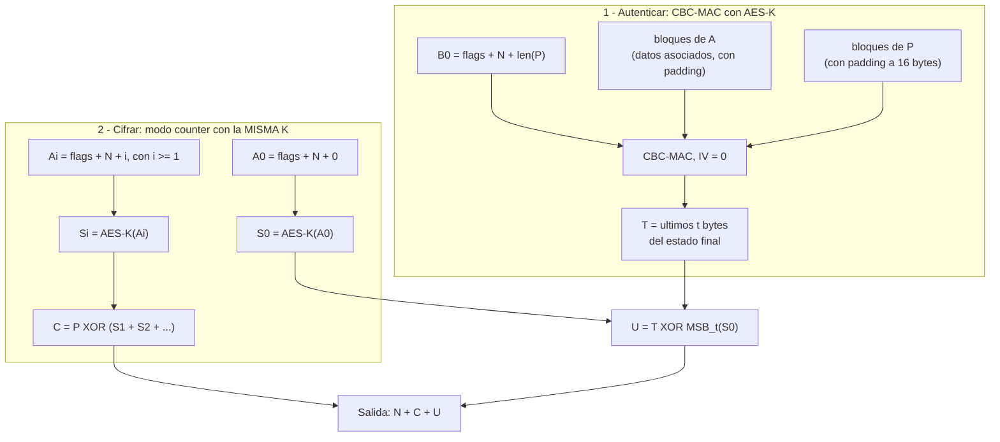

---
categories:
  - "[[ITBA.base|ITBA]]"
Tags: []
Created: 2026-08-2809:38
Materia: "[[Criptografía y Seguridad.base|Criptografia y seguridad]]"
temas:
  - Maleabilidad
  - Ataque de texto cifrado escogido (CCA)
  - Integridad
  - MAC (Message Authentication Code)
  - Mac-Forge
  - CBC-MAC
  - Extension attack
  - Funciones de hash criptográficas
  - Resistencia a preimágenes
  - Resistencia a segundas imágenes
  - Resistencia a colisiones
  - Paradoja del cumpleaños
  - Merkle-Damgård
  - MD5
  - SHA-1
  - SHA-2
  - SHA-3
  - HMAC
  - Encrypt-then-MAC
  - Cifrado autenticado
  - AES-CCM
  - AES-GCM
---
# Clase 3 - Criptografia - MACs y modo autenticado

> [!abstract] Idea de la clase
> Hasta acá toda la seguridad se definió como **confidencialidad**: que el adversario no aprenda nada del mensaje. Esta clase muestra que eso no alcanza — un atacante que no puede *leer* igual puede *modificar* — y que el problema que falta es la **integridad**. La primitiva que la resuelve es el **MAC**, y la combinación de ambas cosas es el **cifrado autenticado**.

## Repaso: de dónde venimos

Un **criptosistema** es una terna de algoritmos (ver [[Criptografia y seguridad Clase 2 - Cifrado]]):

$$
Gen: () \rightarrow K
\qquad
Enc: K \times P \rightarrow C
\qquad
Dec: K \times C \rightarrow P
$$

con la propiedad básica $d_k(e_k(m)) = m$ para todo $m$ y $k$ válidos.

El nivel de seguridad al que habíamos llegado era **CPA** (*Chosen Plain Text indistinguishability*), $CPA_{A,\Pi}$:

1. Se genera una clave $k \leftarrow K$.
2. $A$ obtiene el oráculo $f(x) = e_k(x)$ y emite $(m_0, m_1)$.
3. Se sortea $b \leftarrow \{0,1\}$.
4. $A$ recibe $c = e_k(m_b)$.
5. $A$ emite $b' \in \{0,1\}$.

$CPA_{A,\Pi} = 1$ si $b = b'$. Si $Pr[CPA_{A,\Pi}=1] = \tfrac{1}{2} + \varepsilon$ despreciable, $\Pi$ es indistinguible bajo CPA.

Eran CPA-Secure:

- **Criptosistemas de flujo con tweaks**: usan un parámetro extra, el **IV**, para no reutilizar la misma semilla en el generador. El IV es público pero se elige aleatoriamente.
- **Criptosistemas de bloque** con encadenamiento CBC, Counter, OFB o CFB, sobre una primitiva de bloque segura.

> [!warning] Observación clave
> CPA solo modela un adversario que puede **cifrar**. No dice absolutamente nada sobre qué pasa si el adversario puede **tocar el ciphertext**. Todo el resto de la clase sale de tirar de ese hilo.

## Un nuevo tipo de ataque
![[Pasted image 20260828132850.png]]

se asume que es CPA-secure

el atacante sabe si alguien conoce el legajo de X empleado que cobra mas, puedo copiar su valor y pegarlo

sigue sin poder decifrar pero generar problemas

![[Clase 3 - Ataque de copia de fila.png|620]]

El atacante conoce su legajo (2678) y el de su jefe (2890). No necesita **descifrar** nada: copia la celda cifrada de la fila 2890 sobre la suya y se autoaumenta el sueldo. El criptosistema sigue siendo CPA-Secure — la confidencialidad nunca se rompió — y aun así el sistema quedó comprometido.

![[Pasted image 20260828133208.png]]

La primera mitigación que aparece es cifrar `empleado||sueldo` **junto**, así el texto plano de la fila del jefe dice `2890 $...` y la copia se detecta al descifrar. Pero tampoco alcanza:

![[Clase 3 - Maleabilidad quirurgica.png|620]]

Esto es **maleabilidad** (*malleability*): la propiedad de que modificar el ciphertext produzca un cambio *predecible* en el texto plano. No es un bug de implementación, es una consecuencia directa de cómo está construido el cifrado de flujo.

### Backstage del ataque
![[Screenshot 2026-08-28 at 13.32.58.png]]

![[Pasted image 20260828133346.png]]
se hace el XOR de cada uno para obtener el valor y eso hace que sepas el valor


![[Pasted image 20260828133456.png]]

El ataque necesita conocer el criptosistema y el **formato del mensaje**:

| Campo    | Tipo     | Bytes |
| -------- | -------- | ----- |
| `IV`     | `byte[]` | 12    |
| `empl`   | `int`    | 4     |
| `sueldo` | `int`    | 4     |

Sobre el registro `0x F4933E107178B88D8EE00F40 | E43A9A3C | 9D2EDF79`, los últimos 4 bytes son el sueldo cifrado.

La aritmética es la del cifrado de flujo:

$$
Enc_k(m) = G(k) \oplus m = c
\qquad\Longrightarrow\qquad
c' = c \oplus x
\;\;\Rightarrow\;\;
Dec_k(c') = m \oplus x
$$

El atacante **no conoce $G(k)$**, pero conoce $m$ (su propio sueldo, 12345) y sabe qué quiere poner (100000). Entonces elige

$$
x = m \oplus m_{deseado} = 12345 \oplus 100000
$$

y le hace XOR al ciphertext. En la slide esto se muestra en dos pasos: primero cancelar el sueldo viejo (queda $0\ldots0$) y después inyectar el nuevo.

> [!bug] Discrepancia verificada con la slide
> La slide (y el ciphertext de la slide anterior) dan como resultado `2F69F0`. La cuenta correcta es **`2F69E0`**:
> - $\texttt{0x2EDF79} \oplus \texttt{12345} = \texttt{0x2EEF40}$
> - $\texttt{0x2EEF40} \oplus \texttt{100000} = \texttt{0x2F69E0}$
>
> Equivalente: el delta que hay que aplicar es $12345 \oplus 100000 = \texttt{0x01B699}$, mientras que el delta que se lee de la slide (`2EDF79` → `2F69F0`) es `0x01B689` — difiere en un bit. La fila de bits de la propia slide (`00101111 01101001 11110000`) también termina en `F0` en lugar de `E0`. Es un typo de la cátedra, la mecánica del ataque no cambia.

> [!tip] Lo que hay que llevarse
> El ataque solo necesita tres cosas: (1) saber el formato del mensaje, (2) conocer *un* texto plano, (3) poder escribir el ciphertext. Nada de esto es "romper AES".

## Ataques de texto cifrado escogido (EJERCICIO)
![[Pasted image 20260828134046.png]]

Formalmente, **CCA** (*Chosen Ciphertext Attack*), $CCA_{A,\Pi}$, dado un nivel de seguridad $n$:

1. Se genera una clave $k \leftarrow K$.
2. $A$ obtiene los oráculos $f(x) = e_k(x)$ **y $g(x) = d_k(x)$**, y emite $(m_0, m_1)$.
3. Se sortea $b \leftarrow \{0,1\}$.
4. $A$ recibe $c = e_k(m_b)$, y **no puede calcular $g(c)$**.
5. $A$ emite $b' \in \{0,1\}$.

$CCA_{A,\Pi} = 1$ si $b = b'$. Si $Pr[CCA_{A,\Pi}=1] < \tfrac{1}{2} + neg(n)$, $\Pi$ es indistinguible bajo CCA.

| | CPA | CCA |
| --- | --- | --- |
| Oráculos | $e_k(\cdot)$ | $e_k(\cdot)$ y $d_k(\cdot)$ |
| Restricción | ninguna | no puede pedir $d_k(c)$ del challenge |
| Modela | atacante que puede hacer cifrar | atacante que además ve el **resultado** de descifrar (mensajes de error, comportamiento del sistema) |

> [!note] Por qué el oráculo de descifrado no es ciencia ficción
> En un sistema real casi nunca hay un botón "desciframe esto", pero sí hay señales equivalentes: un mensaje de error distinto según si el padding era válido, un tiempo de respuesta distinto, un log. Todo eso funciona como $g(x)$ parcial. Los *padding oracle attacks* son exactamente esto.

### Resolución del ejercicio: el cifrado de flujo no es CCA-Secure

**Enunciado.** Demostrar que el cifrado de flujo en general no es CCA-Secure. *Ayuda: considerar $m_0 = (0\ldots0)$ y $m_1 = (1\ldots1)$ y verificar qué consultas se pueden hacer a $g(x)$ al recibir $c$.*

**Adversario $A$:**

1. Emite $m_0 = 0^n$ y $m_1 = 1^n$.
2. Recibe el challenge $c = Enc_k(m_b) = G(k) \oplus m_b$.
3. Construye $c' = c \oplus (0^{n-1} \| 1)$, es decir, **le da vuelta el último bit**.
   - Como $c' \neq c$, la consulta $g(c')$ **está permitida**: la única restricción del experimento es no pedir $g(c)$.
4. Consulta $m' = g(c') = Dec_k(c')$. Por linealidad del flujo:
   $$
   Dec_k(c') = Dec_k(c \oplus x) = m_b \oplus x = m_b \oplus (0^{n-1}\|1)
   $$
   o sea, $m'$ es **idéntico a $m_b$ salvo en el último bit**.
5. Mira cualquier bit **no modificado** de $m'$ (por ejemplo el primero) y emite:
   - $b' = 0$ si ese bit es $0$
   - $b' = 1$ si ese bit es $1$

**Análisis.** Como $m_0$ y $m_1$ son constantes y difieren en todos sus bits, el primer bit de $m'$ vale exactamente $b$. Entonces

$$
Pr[CCA_{A,\Pi} = 1] = 1 \;\gg\; \tfrac{1}{2} + neg(n)
$$

y $\Pi$ **no** es CCA-Secure. $\blacksquare$

> [!example] Generalización
> El argumento no usa nada propio del cifrado de flujo salvo que es **maleable**, así que se adapta a todos los esquemas vistos:
>
> | Esquema | Cómo se modifica $c$ | Efecto en $m$ |
> | --- | --- | --- |
> | OTP / flujo | $c \oplus x$ | $m \oplus x$ |
> | CTR / OFB | $c_i \oplus x$ | $m_i \oplus x$ |
> | CBC | $c_{i-1} \oplus x$ | $m_i \oplus x$ (rompiendo $m_{i-1}$) |
> | ECB | permutar / repetir bloques | permutar / repetir $m_i$ |
>
> Conclusión de la slide: **ningún criptosistema visto hasta el momento es CCA-Secure.**

## De la confidencialidad a la integridad

CCA no es un problema que el cifrado pueda resolver solo. Lo que falta es un **control de integridad**: identificar adulteraciones. La primitiva que lo provee es el **MAC** (*Message Authentication Code*).

## MAC- Message Authentication Code
![[Pasted image 20260828135402.png]]
un etiquetador que a partir de una clave y un mensaje genera una etiqueta, 

Es una terna de algoritmos:

$$
Gen: () \rightarrow K
\qquad
Mac: K \times P \rightarrow T
\qquad
Vrfy: K \times P \times T \rightarrow \{0,1\}
$$

con la propiedad básica $Vrfy_k(m, Mac_k(m)) = 1$ para todo $m, k$ válidos. $T$ es el **espacio de etiquetas**.

> [!info] MAC vs. criptosistema
> Misma forma (terna), objetivo opuesto: el criptosistema esconde $m$ y **debe** ser invertible; el MAC no esconde nada — la etiqueta viaja junto al mensaje — y **no** necesita ser invertible. La etiqueta es corta y de tamaño fijo, no crece con el mensaje.

### Seguridad de un MAC: infalsificabilidad

se busca que el atacante no pueda falsificar una etiqueta, es bueno encarar el problema del negativo

*Message Authentication Experiment*, $\text{Mac-forge}_{A,\Pi}$, dado un nivel de seguridad $n$:

1. Se genera una clave $k \leftarrow K$.
2. $A$ obtiene el oráculo $f(x) = Mac_k(x)$.
3. $A$ hace todas las evaluaciones que quiera de $f(x)$. Sea $Q$ el conjunto de esas evaluaciones.
4. $A$ emite $(m, t)$ con $m \notin Q$.

$\text{Mac-Forge}_{A,\Pi} = 1$ si $Vrfy_k(m,t) = 1$. Si $Pr[\text{Mac-Forge}_{A,\Pi}=1] \leq neg(n)$, el MAC es **infalsificable**.

**Observaciones de la cátedra:**

- El adversario puede obtener un MAC para **cualquier** mensaje que elija.
- Se considera roto el MAC si el adversario puede falsificar **cualquier** mensaje, ==independientemente de si tiene sentido o no==.

> [!quote] Lección de 2004 (mencionada en clase)
> El segundo punto suena excesivo — "¿a quién le importa falsificar un mensaje que es basura?" — y esa fue exactamente la reacción de la comunidad cuando en 2004 Wang, Feng, Lai y Yu presentaron colisiones en MD5 sobre pares de bloques sin sentido. Cuatro años después esas colisiones se usaron para **falsificar un certificado de CA** y firmar certificados HTTPS arbitrarios; en 2012 el malware Flame usó la misma idea contra una firma de Microsoft.
>
> Moraleja: una falsificación "sin sentido" es una falsificación. Nunca se descarta un ataque porque el mensaje falsificado no parezca útil.

### Ejercicio: seguridad de tres MACs propuestos

**Enunciado.** Considerar la seguridad de los siguientes MACs:

1. $Mac_k(m) = G(k) \oplus m$, con $G(\cdot)$ generador pseudoaleatorio
2. $Mac_k(m) = k \oplus \text{first\_k\_bits}(m)$
3. $Mac_k(m) = Enc_k(|m|)$, con $Enc$ CPA-Secure

**Los tres son inseguros.** Cada uno falla por un motivo distinto, y los tres motivos son las tres cosas que un MAC tiene que hacer bien.

#### 1. $Mac_k(m) = G(k) \oplus m$ — falla por *determinismo y linealidad*

Es un OTP usado como etiqueta, y la etiqueta **filtra la clave efectiva**.

- $A$ consulta un mensaje cualquiera $m_1$ y obtiene $t_1 = G(k) \oplus m_1$.
- Despeja: $G(k) = t_1 \oplus m_1$.
- Para cualquier $m \notin Q$ emite $t = G(k) \oplus m$. Verifica siempre.

$Pr[\text{Mac-Forge}] = 1$ con **una sola consulta**. Además la etiqueta tiene el largo del mensaje ($|t| = |m|$), lo cual ya de por sí es una mala señal.

#### 2. $Mac_k(m) = k \oplus \text{first\_k\_bits}(m)$ — falla por *ignorar bits del mensaje*

La etiqueta solo depende de los primeros $|k|$ bits.

- $A$ consulta $m = m_{pref} \| m_{suf}$ (con $|m_{pref}| = |k|$) y obtiene $t$.
- Emite $m' = m_{pref} \| m'_{suf}$ con $m'_{suf} \neq m_{suf}$, y la **misma** $t$.
- $m' \notin Q$ y $Vrfy_k(m', t) = 1$.

$Pr[\text{Mac-Forge}] = 1$. De yapa también filtra la clave: $k = t \oplus \text{first\_k\_bits}(m)$.

#### 3. $Mac_k(m) = Enc_k(|m|)$ — falla por *depender solo de la longitud*

La etiqueta no depende del **contenido**, solo del **largo**.

- $A$ consulta cualquier $m$ de longitud $L$ y obtiene $t$.
- Emite cualquier $m' \neq m$ con $|m'| = L$ y la misma $t$.

$Pr[\text{Mac-Forge}] = 1$.

> [!question] La vuelta de tuerca de este caso (lo que se discutió en clase)
> Como $Enc$ es **CPA-Secure**, es necesariamente **no determinístico**: cifrar dos veces la misma longitud da etiquetas distintas. Entonces $Vrfy$ **no puede** recalcular el MAC y comparar — la comparación fallaría siempre. La verificación tiene que **invertirse**:
> $$
> Vrfy_k(m,t) = 1 \iff Dec_k(t) = |m|
> $$
> Es un MAC "no determinístico" perfectamente bien definido... y aun así trivialmente falsificable. Sirve para ver que **no determinismo ≠ seguridad**.

> [!success] Las tres condiciones que salen del ejercicio
> Un MAC seguro tiene que:
> 1. **Depender de todos los bits del mensaje** (falla 2 y 3).
> 2. **No filtrar la clave a partir de $(m,t)$** (falla 1 y 2).
> 3. Tener **etiqueta de tamaño fijo y corto**, independiente de $|m|$ (falla 1).

## Como construir un MAC
![[Pasted image 20260830171847.png]]
dos grandes formas de armarlo
la primera es usar un CBC-MAC que es una funcion pseudoaleatoria
recicla el cifrado en modo CBC
el mensaje m se divide en bloques con padding en el ultimo bloque
toma el estado y lo mezcla con el bloque y a eso lo llamamos el proximo estado

Formalmente, sea $F$ una función pseudoaleatoria. **CBC-MAC (tamaño fijo de mensajes)**:

- **Gen:** $k \leftarrow \{0,1\}^n$
- **Mac:** sea $m = m_1\|m_2\|m_3\ldots\|m_j$ y $t_0 = 00\ldots0$
  $$
  t_i = F_k(t_{i-1} \oplus m_i)
  \qquad
  Mac_k(m) = t_j
  $$
- **Vrfy:** $Vrfy_k(m,t) = 1 \iff t = Mac_k(m)$

> [!warning] Diferencias con el cifrado CBC (fáciles de confundir en el parcial)
> | | Cifrado CBC | CBC-MAC |
> | --- | --- | --- |
> | IV | aleatorio y público | **fijo en cero**, nunca aleatorio |
> | Salida | todos los bloques $c_1\ldots c_j$ | **solo el último**, $t_j$ |
> | Reversible | sí (hay que descifrar) | no (nunca se descifra) |
>
> El IV va en cero justamente **porque nunca se descifra**: no hace falta transmitirlo. Y si el IV fuera aleatorio y público el MAC sería falsificable — el atacante ajusta $IV' = IV \oplus \Delta$ y $m_1' = m_1 \oplus \Delta$ y la etiqueta no cambia.
>
> La otra gran familia de construcción es a partir de **funciones de hash** (→ HMAC, más abajo).

## CBC-MAC
![[Pasted image 20260830172305.png]]

### El ataque de longitud variable, paso a paso

La construcción anterior es infalsificable **solo si todos los mensajes tienen la misma longitud**. Con longitud variable:

1. Crear dos bloques aleatorios $A$ y $B$.
2. $m_1 = A\|B$, $m_2 = A$.
3. Consultar $t_1 = Mac_k(m_1)$ y $t_2 = Mac_k(m_2)$.
4. Emitir $\big(A \,\|\, B \,\|\, (A \oplus t_1)\,,\ t_2\big)$.

**Por qué funciona.** Se calcula el CBC-MAC del mensaje forjado $M_3 = A\|B\|(A \oplus t_1)$, arrancando de $t_0 = 0$:

$$
\begin{aligned}
s_1 &= F_k(0 \oplus A) = F_k(A) = t_2 \\
s_2 &= F_k(s_1 \oplus B) = F_k(t_2 \oplus B) = t_1 \\
s_3 &= F_k(s_2 \oplus (A \oplus t_1)) = F_k(t_1 \oplus A \oplus t_1) = F_k(A) = t_2
\end{aligned}
$$

El $t_1$ del tercer bloque **cancela** el estado acumulado y la cadena vuelve al estado que tenía después de procesar $A$ sola. Por eso la etiqueta del mensaje de 3 bloques es la del mensaje de 1 bloque, y $M_3 \notin Q$. $\blacksquare$

> [!note] Verificado
> Implementé el ataque con una PRF de juguete ($F_k(x) = \text{trunc}_4(\text{SHA-256}(k\|x))$) y da `True`: $Mac_k(A\|B\|(A \oplus t_1)) = t_2$ exactamente.

### Extensiones seguras para mensajes arbitrarios

Las tres variantes de la slide:

| Variante | Construcción | Costo |
| --- | --- | --- |
| **Clave derivada de la longitud** | $k' = F_k(\lvert m\rvert)$, luego $t_i = F_{k'}(t_{i-1} \oplus m_i)$, $Mac_k(m) = t_j$ | 1 evaluación extra de $F$ |
| **Longitud como prefijo** | $m' = \lvert m\rvert \mathbin{\Vert} m$, $\;Mac_k(m) = \text{CBC-MAC}_k(m')$ | 1 bloque extra |
| **Doble clave** | $t' = \text{CBC-MAC}_{k_1}(m)$, $\;t = F_{k_2}(t')$ | el doble de clave (la menos usada) |

La intuición común a las tres: **la longitud tiene que entrar en el cómputo antes o fuera de la cadena**, de manera que dos mensajes de largo distinto nunca compartan estados intermedios.

### Por qué la longitud como *sufijo* NO sirve

$m' = m \, \| \, |m|$, $\;Mac_k(m) = \text{CBC-MAC}_k(m')$. Algoritmo atacante:

1. Bloques aleatorios $A$, $B$, $C$.
2. $m_1 = AAA \rightarrow m_1' = AAA3$, &nbsp; $t_1 = f(m_1)$
3. $m_2 = BBB \rightarrow m_2' = BBB3$, &nbsp; $t_2 = f(m_2)$
4. $m_3 = AAA3CC \rightarrow m_3' = AAA3CC6$, &nbsp; $t_3 = f(m_3)$
5. Sea $X = t_1 \oplus t_2 \oplus C$.
6. Emitir $(BBB3XC,\ t_3)$.

**Por qué funciona.** El mensaje forjado es $M = B\,B\,B\,3\,X\,C$, de 6 bloques, así que se le anexa el sufijo $6$: $M' = BBB3XC6$. Su cadena:

- Estado después de `BBB3` $= t_2$.
- Siguiente bloque $X$: $\;F_k(t_2 \oplus X) = F_k(t_2 \oplus t_1 \oplus t_2 \oplus C) = F_k(t_1 \oplus C)$.
- En $m_3' = AAA3CC6$, el estado después de `AAA3` es $t_1$, y el bloque siguiente es $C$: $\;F_k(t_1 \oplus C)$. **Mismo estado.**
- A partir de ahí las dos cadenas procesan los mismos bloques restantes (`C`, `6`) → mismo tag final $t_3$.

Y $M = BBB3XC \notin Q = \{AAA, BBB, AAA3CC\}$. $\blacksquare$

> [!note] Verificado
> También lo implementé: `mac_suf(BBB3XC) == t3` da `True`, con $M \notin Q$.

> [!tip] La moraleja de los dos ataques
> Son el mismo truco: **con acceso al estado intermedio (= la etiqueta de un prefijo) se puede empalmar una cadena en otra**. Es la misma familia que los *length extension attacks* de Merkle–Damgård que aparecen más abajo. Poner la longitud al final no ayuda porque el atacante ya controla lo que pasa *antes* de que la longitud entre.

## Funciones de hash criptográficas

gran diferencia con lo visto hasta ahora -> **NO hay clave involucrada**

se habla de familias de funciones de hash, existe una funcion de seleccion que lige el hash

puede ser parecido a la generacion de claves

Son **pares** de algoritmos:

$$
Gen: s \leftarrow S
\qquad
Hash: h = H_s(m) \in \{0,1\}^L
$$

donde $L$ es la longitud del hash.

> [!important] Diferencia importante
> $s$ **no es una clave**: es simplemente un *selector* de la familia. En muchas implementaciones $S = \{s_0\}$, o sea hay una sola función en la familia. Por eso se las llama **funciones de resumen** o **etiquetadores universales**: son análogas a los MACs pero **sin clave**, y por lo tanto cualquiera puede calcularlas (incluido el atacante).

tiene que tomar en cuenta todo el mensaje, cualquier mensaje arbitrario se convierte en un hash de igual longitud, cambiar algo del mensaje cambia todo el hash, similar a los macs, pero sin la necesidad de una clave

![[Clase 3 - Hash etiquetador universal.png|600]]

Cambiar un solo carácter de la entrada cambia el digest por completo (*avalanche effect*).
### Colisiones

Una **colisión** es un par $x \neq x'$ con $h(x) = h(x')$.

Por *pigeonhole*: si hay $n+1$ mensajes y $n$ valores de salida, existe al menos una colisión. Como el dominio es infinito y el codominio tiene $2^L$ elementos, **las colisiones siempre existen**; lo que se pide es que sean computacionalmente imposibles de encontrar.

### Propiedades (definición informal)

tiene que actuar como una funcion de una sola via, no podes volver como con el cifrado, es muy dificil volver a una misma etiqueta

| Propiedad | Definición | Se rompe si... |
| --- | --- | --- |
| **Resistencia a preimágenes** | para todo $y$, es computacionalmente imposible hallar $x$ tal que $h(x)=y$ | se puede invertir el hash |
| **Resistencia a segundas imágenes** | para todo $x$, es computacionalmente imposible hallar $x' \neq x$ con $h(x')=h(x)$ | dado un mensaje, se puede fabricar otro con el mismo digest |
| **Resistencia a colisiones** | es computacionalmente imposible hallar $x, x'$ con $h(x)=h(x')$ y $x \neq x'$ | se puede fabricar **cualquier** par que colisione |

Resistencia a colisiones es la más fuerte: implica resistencia a segundas imágenes (no al revés).
se realiza como una prueba estadistica

**Experimento formal** — *Collision resistance*, $\text{Hash-Coll}_{A,H}$:

1. Se selecciona una función $s \leftarrow S$.
2. $A$ obtiene acceso a $H(x) = H_s(x)$.
3. $A$ emite $x, x'$.

$\text{Hash-Coll}_{A,H} = 1$ si $x \neq x'$ y $H(x) = H(x')$. Si $Pr[\text{Hash-Coll}_{A,H}=1] < neg(n)$, la función es **libre de colisiones**.

### Modelo general iterativo (Merkle–Damgård)

Propuesto por Merkle en 1989, usado por MD5, SHA-1 y SHA-2.

![[Clase 3 - Modelo iterativo Merkle.png|420]]

g es una funcion no reversible, hace paddings, divide en bloques, hay una funcion f que se le pasa un bloque con y le vamos agregando bloques, y despues pasamos por la funcion g

- **Preprocesamiento:** ajustar el tamaño del mensaje (padding) y **agregar un bloque con el tamaño**.
- **Función de compresión $f$:** similar al hash pero opera sobre bloques chicos. Se itera $H_i = f(H_{i-1}, x_i)$ arrancando de $H_0 = IV$.
- **La seguridad está dada por la función de compresión**: si $f$ es libre de colisiones, el hash completo lo es (teorema de Merkle–Damgård).
- Una función de salida $g$ produce $h(x) = g(H_t)$.

> [!warning] Length extension
> Es la **misma estructura de cadena que CBC-MAC**, y sufre el mismo problema: quien conoce $H(m)$ y $|m|$ puede calcular $H(m \| pad \| m_2)$ sin conocer $m$. Por eso $Mac_k(m) = H(k \| m)$ es **inseguro**, y por eso HMAC hace dos pasadas anidadas. SHA-3, al ser esponja y no Merkle–Damgård, no tiene este problema.

### Primitivas concretas

| Función | Entrada | Salida | Estado |
| --- | --- | --- | --- |
| **MD5** | hasta $2^{64}$ bits | 128 bits | ==Quebrada== (colisiones desde 2004) |
| **SHA-1** | hasta $2^{64}$ bits | 160 bits | Se construye sobre la base de MD5. ==Quebrada== (2017) |
| **SHA-2** | — | 256/384/512 bits | Vigente |
| **SHA-3** | arbitraria | 224/256/384/512 bits | Modelo **esponja**. Estándar recomendado para proyectos nuevos |

Ejemplos de la slide (**los verifiqué todos con `hashlib`, están correctos**):

```
MD5   ""    -> d41d8cd98f00b204e9800998ecf8427e
MD5   "a"   -> 0cc175b9c0f1b6a831c399e269772661
MD5   "abc" -> 900150983cd24fb0d6963f7d28e17f72

SHA1  ""    -> da39a3ee5e6b4b0d3255bfef95601890afd80709
SHA1  "a"   -> 86f7e437faa5a7fce15d1ddcb9eaeaea377667b8
SHA1  "abc" -> a9993e364706816aba3e25717850c26c9cd0d89d

SHA3-256 ""    -> a7ffc6f8bf1ed76651c14756a061d662f580ff4de43b49fa82d80a4b80f8434a
SHA3-256 "a"   -> 80084bf2fba02475726feb2cab2d8215eab14bc6bdd8bfb2c8151257032ecd8b
SHA3-256 "abc" -> 3a985da74fe225b2045c172d6bd390bd855f086e3e9d525b46bfe24511431532
```

> [!bug] Discrepancias con las slides
> - **SHA-3 no fue estandarizado en 2013.** NIST eligió Keccak como ganador del concurso en **octubre de 2012** y publicó el estándar **FIPS 202 el 5 de agosto de 2015**.
> - **SHA-3 no tiene el límite de $2^{64}$ bits de entrada.** Ese límite viene del bloque de longitud de MD5/SHA-1 (Merkle–Damgård); la construcción esponja acepta entrada de longitud arbitraria. Parece copy-paste de la slide anterior.
> - **SHA-1 figura como vigente en la slide.** Hoy está roto: colisión práctica *SHAttered* (Google/CWI, 2017) y colisión de prefijo elegido *SHAmbles* (2020). NIST anunció en 2022 la transición fuera de SHA-1, con retiro total para **2030**.
> - **Keccak** está escrito "Kekkak" en la slide.

### Seguridad: costos de fuerza bruta

Sea $h: A \rightarrow B$:

| Objetivo del atacante | Fuerza bruta |
| --- | --- |
| **Preimagen**: dado $y \in B$, hallar $x$ con $h(x)=y$ | $\lvert B\rvert$ intentos |
| **Segunda imagen**: dado $(x,y)$ con $h(x)=y$, hallar $x' \neq x$ con $h(x')=y$ | $\lvert B\rvert$ intentos |
| **Colisión**: hallar $x, x'$ con $h(x)=h(x')$ | $\lvert B\rvert^{1/2}$ intentos — **paradoja del cumpleaños** |

$$
\text{con } L \text{ bits de salida: preimagen } \approx 2^{L}, \quad \text{colisión } \approx 2^{L/2}
$$

**En la práctica**, tamaño mínimo de salida: **160 bits** → $2^{160}$ operaciones para imágenes, $2^{80}$ para colisiones.

> [!tip] Por qué el hash necesita el doble de bits que la clave
> Buscar colisiones cuesta la raíz cuadrada de buscar preimágenes. Por eso una clave simétrica de 128 bits se empareja con un hash de **256** bits: ambos dan $2^{128}$ de seguridad efectiva.

### Funciones de hash y MACs: HMAC

se puede construir una MAC a partir de un HASH

Es posible construir un MAC a partir de una función de hash. Dado $H(x)$ libre de colisiones:

$$
\begin{aligned}
&\textbf{GEN: } k \leftarrow K,\; s \leftarrow S \\
&\textbf{MAC: } t = H_s\big((k \oplus opad) \,\|\, H_s((k \oplus ipad) \,\|\, m)\big)
\end{aligned}
$$

Es infalsificable (Mac-Forge).

la etiqueta es el resultado de un Hash a el mensaje utilizando como prefijo la clave XOR una constante (puede ser un IV). a ese valor se vuelve a aplicar hash con un nuevo prefijo con la clave XOR otra constante

> [!bug] Discrepancia con la slide: ipad y opad están invertidos
> La slide dice `opad = 0x36...36`, `ipad = 0x5c5c...5c`. Según RFC 2104 es al revés:
> - **`ipad` = `0x36`** repetido (*inner*, va en el hash de adentro)
> - **`opad` = `0x5C`** repetido (*outer*, va en el hash de afuera)
>
> La fórmula anidada de la slide sí es correcta; lo que está intercambiado son los nombres de las constantes.

> [!note] Por qué dos pasadas
> El anidado es lo que corta el *length extension* de Merkle–Damgård. Además, la seguridad real de HMAC no requiere que $H$ sea libre de colisiones sino que su función de compresión sea una PRF — por eso **HMAC-MD5 sigue sin estar roto en la práctica** aunque MD5 lo esté. Igual, para diseño nuevo va HMAC-SHA-256.

## Privacidad e integridad: cómo combinarlas

Tres formas, **solo dos seguras**:

| Orden | Construcción | Veredicto (slide) | En la vida real |
| --- | --- | --- | --- |
| **Encrypt-and-MAC** | $c \leftarrow Enc_{k_1}(m)$, $\;t \leftarrow Mac_{k_2}(m)$ | ❌ $t$ puede brindar información de $m$ | SSH |
| **MAC-then-Encrypt** | $c \leftarrow Enc_{k_1}(m \,\|\, Mac_{k_2}(m))$ | ⚠️ Puede ser seguro, **requiere prueba de seguridad** | TLS ≤ 1.2 (padding oracles: Lucky13, POODLE) |
| **Encrypt-then-MAC** | $c \leftarrow Enc_{k_1}(m)$, $\;t \leftarrow Mac_{k_2}(c)$ | ✅ **Siempre es seguro** | IPsec, TLS 1.3 (vía AEAD) |

> [!warning] Dos detalles que se cobran caro
> - Las claves $k_1$ y $k_2$ deben ser **independientes**. Reusar la misma clave para cifrar y para el MAC rompe las pruebas.
> - En Encrypt-then-MAC el receptor **verifica primero y descifra después**. Descifrar antes de verificar es exactamente lo que habilita los padding oracles.

## Cifrado autenticado

Combina cifrado y control de integridad. Sean $\Pi_e(Gen_e, Enc, Dec)$ un criptosistema **CPA-Secure** y $\Pi_m(Gen_m, mac, vrfy)$ un MAC **infalsificable**. Se define:

$$
\begin{aligned}
&\textbf{Gen: } k_1 \leftarrow Gen_e,\; k_2 \leftarrow Gen_m \\
&\textbf{Enc: } c \leftarrow Enc_{k_1}(m),\; t \leftarrow Mac_{k_2}(c) \\
&\textbf{Dec: } \text{si } vrfy_{k_2}(c,t)=1 \rightarrow m = Dec_{k_1}(c); \text{ sino } \rightarrow \bot \text{ (fallo)}
\end{aligned}
$$

**El criptosistema resultante es CCA-Secure.**

> [!success] El cierre del círculo
> Es el mismo Encrypt-then-MAC de la tabla anterior. El adversario CCA ya no saca provecho del oráculo de descifrado: cualquier $c'$ que fabrique falla la verificación y devuelve $\bot$, que no le dice nada de $b$. El ataque del sueldo del principio de la clase queda muerto: la fila modificada no verifica.

## Encadenamiento CCM

**CCM = Counter with CBC-MAC.**

- Es un **"authenticate-then-encrypt"**: $e_k(\text{cbc-mac}_k(M) \,\|\, m)$.
- Existe una **prueba de seguridad específica**: si el IV y el nonce no coinciden ni se reutilizan, la construcción es **CCA-Secure usando LA MISMA CLAVE** (ver material adicional en Campus).

> [!question] ¿No contradice esto la tabla de arriba?
> Aparentemente sí: "authenticate-then-encrypt" era el caso ⚠️. La salida es que **CCM no es un authenticate-then-encrypt genérico**, es una construcción concreta con su propia demostración. La regla general sigue valiendo para cuando uno arma el esquema a mano.
>
> Y usa **una sola clave** para el MAC y para el cifrado — algo que arriba dijimos que estaba mal — porque los bloques están **formateados para no poder colisionar**: los bloques del CBC-MAC empiezan con un byte de flags distinto al de los bloques counter, así que $F_k$ nunca se evalúa en la misma entrada por los dos caminos.

### Ejercicio: esquematizar un cifrado utilizando AES-CCM

**Parámetros.** Clave $K$ (AES-128), *nonce* $N$ (7 a 13 bytes), texto plano $P$, datos asociados $A$ (se autentican pero no se cifran), longitud de tag $t \in \{4,6,8,10,12,14,16\}$ bytes.

**Esquema:**



**Cifrado (paso a paso):**

1. Formatear $B_0 = \text{flags} \| N \| len(P)$, donde `flags` codifica $t$, el tamaño del campo de longitud, y si hay datos asociados.
2. $T = \text{CBC-MAC}_K(B_0 \,\|\, \text{bloques de } A \,\|\, \text{bloques de } P)$, truncado a $t$ bytes.
3. Generar los bloques counter $A_i = \text{flags} \| N \| i$ y los keystream $S_i = AES_K(A_i)$.
4. $C = P \oplus (S_1 \| S_2 \| \ldots)$.
5. $U = T \oplus MSB_t(S_0)$ — el tag también se cifra, con el bloque counter $0$ que **no se usa** para el keystream.
6. Transmitir $N \,\|\, C \,\|\, U$ (y $A$ en claro, si lo hay).

**Descifrado / verificación:**

1. Recalcular $S_i$ a partir de $N$ y obtener $P = C \oplus (S_1\|S_2\|\ldots)$, y $T = U \oplus MSB_t(S_0)$.
2. Recalcular $T' = \text{CBC-MAC}_K(B_0 \| A \| P)$.
3. Si $T' \neq T$ → **rechazar y no devolver $P$**. Si son iguales → devolver $P$.

> [!danger] Condición que no se puede violar
> El **nonce $N$ nunca se puede repetir con la misma clave $K$**. Repetirlo reusa el keystream (mismo problema que reusar el OTP) y además permite forjar tags. Es el mismo requisito que en CTR de [[Criptografia y seguridad Clase 2 - Cifrado]].

## Encadenamiento GCM

**GCM = Galois/Counter Mode.** Forma de encadenar un criptosistema de bloque que provee **cifrado autenticado** en una sola pasada.

![[Clase 3 - Encadenamiento GCM.png|640]]

- **Cifrado**: modo counter.
- **Auth tag (MAC)**: GHASH, sobre el cuerpo finito $GF(2^{128})$.
  $$
  H = E_k(0000\ldots0000)
  \qquad
  Mult_h(x) = Mult(x,h)
  $$
  $$
  Mult(x,y) = x \cdot y \bmod \left(x^{128}+x^{7}+x^{2}+x+1\right)
  $$
- El tag se calcula sobre los **ciphertexts** (es un encrypt-then-MAC) y sobre los datos asociados, cerrando con el bloque $len(A) \| len(C)$.

> [!info] CCM vs GCM
> | | CCM | GCM |
> | --- | --- | --- |
> | MAC | CBC-MAC (bloque a bloque, serial) | GHASH (multiplicación en $GF(2^{128})$) |
> | Pasadas sobre los datos | 2 | 1 |
> | Paralelizable | no | **sí** |
> | Aceleración por hardware | AES-NI | AES-NI + `PCLMULQDQ` |
> | Uso típico | 802.11i (WPA2), redes con poco cómputo | **TLS 1.3, IPsec, QUIC** |
>
> Ambos son **AEAD** (*Authenticated Encryption with Associated Data*): además del mensaje cifrado autentican metadatos que viajan en claro (headers, números de secuencia).

## Aplicaciones prácticas

En términos generales, **solo utilizar cifrado autenticado en sistemas reales**:

- El cifrado "normal" puede ser manipulado.
- En aplicaciones reales, el requerimiento de privacidad **lleva implícito el de integridad**.
- Muy pocas veces se tiene control sobre el material que va a ser cifrado y descifrado. La solución debería funcionar independientemente de esto.

> [!success] Regla práctica
> No armar el esquema a mano. Usar AES-GCM, AES-CCM o ChaCha20-Poly1305 con una API AEAD, y que la librería maneje nonces y verificación.

## Lectura recomendada

**Capítulo 4** de *Introduction to Modern Cryptography*, Katz & Lindell.

# Resumen Wispr Flow

Clase de criptografía sobre ataques de texto cifrado escogido (CCA): se mostró la maleabilidad de los criptosistemas de flujo, se demostró que ninguno de los vistos es CCA Secure, y se introdujo el concepto de MAC para integridad.

  

### Motivación: maleabilidad y ataque al sistema de sueldos

- Ejemplo: cifrar sueldos en base de datos; atacante copia fila de jefe para subirse el sueldo, no violaba CPA
- Mitigación parcial: cifrar legajo+sueldo juntos para detectar copias entre filas
- Ataque de maleabilidad en flujo: XOR sobre texto cifrado modifica texto plano de forma predecible
- - Sabiendo el sueldo propio, se hace XOR con valor actual y con valor deseado (ej. 100.000)
### Prueba CCA y criptosistemas de flujo

- CCA (Chosen Ciphertext Attack): atacante puede cifrar y descifrar, salvo el C objetivo
- Ningún criptosistema visto (flujo, bloque, OTP) es CCA Secure
- Demostración: con M0=000... y M1=111..., se descifra C'=C XOR 0...01 y se mira un bit no modificado
### Integridad y MACs

- CCA evidencia problema de integridad, no de confidencialidad; se introduce MAC (Message Authentication Code)
- MAC = terna (gen clave, etiquetar, verificar); propiedad clave: infalsificabilidad (MAC forge)
- Lección 2004 (ataque chino a funciones hash): no ignorar ataques "sin sentido", derivaron en falsificación de certificados
- Tres MACs propuestos fallan: determinismo (G(k) XOR M), ignorar bits del mensaje, cifrar solo la longitud
### CBC-MAC: construcción e inseguridad

- CBC-MAC: cifrado tipo CBC bloque a bloque, se conserva solo el último bloque como etiqueta
- - IV hardcodeado en cero porque nunca se descifra
- Solo infalsificable si los mensajes tienen longitud fija; con longitud variable es atacable
- Ataque: con MACs de A y de A||B se recupera T1 y se forja M3 = A||B||(A xor T1) con etiqueta T2
### Variantes seguras de CBC-MAC

- Derivar K' cifrando la longitud del mensaje y usarla en la iteración
- Prependear la longitud del mensaje como primer bloque (no como sufijo, vulnerable a extension attacks)
- Doble clave: recifrar el estado final con K2 (menos usada, requiere el doble de clave)
### MAC no determinístico (CPA-secure)

- Verificación no puede recalcular el MAC; se invierte descifrando la etiqueta y comparando con |M|
- Es falsificable: cualquier M' de la misma longitud que M pasa la verificación con la misma etiqueta

---

<!-- notas-relacionadas:inicio -->

## Notas relacionadas

**Misma materia (Criptografía y Seguridad)**

- [[Criptografia y seguridad Clase 2 - Cifrado]] — clase anterior: define CPA, los criptosistemas de flujo y bloque y los modos CBC/CTR que acá se atacan y se reciclan como CBC-MAC
- [[Criptografia y seguridad intro]] — define criptosistema y secreto perfecto, la terna que el MAC replica con otro objetivo
- [[Materia - Criptografía y Seguridad]] — índice de la materia
- [[Practica 1 - criptografia y seguridad]] — práctica asociada
- [[Guia 1 - criptografia y seguridad]] — ejercicios previos, sobre cifrados clásicos

**Otras materias**

- **Data Structures and Algorithms** — [[EDA - Hashing]] — misma palabra, objetivo opuesto: ahí la colisión es un caso a resolver con chaining u open addressing, acá es el ataque; y la función se elige por velocidad y distribución, no por irreversibilidad
- **Protos** — [[9. Protos - SSH]] — SSH usa encrypt-and-MAC (el caso ❌ de la tabla de combinación) y negocia HMAC-SHA-2 como algoritmo de integridad
- **Protos** — [[2. Protos - HTTP]] — HTTPS/TLS 1.3 solo admite AEAD (AES-GCM, ChaCha20-Poly1305), que es exactamente el cifrado autenticado de esta clase

<!-- notas-relacionadas:fin -->
