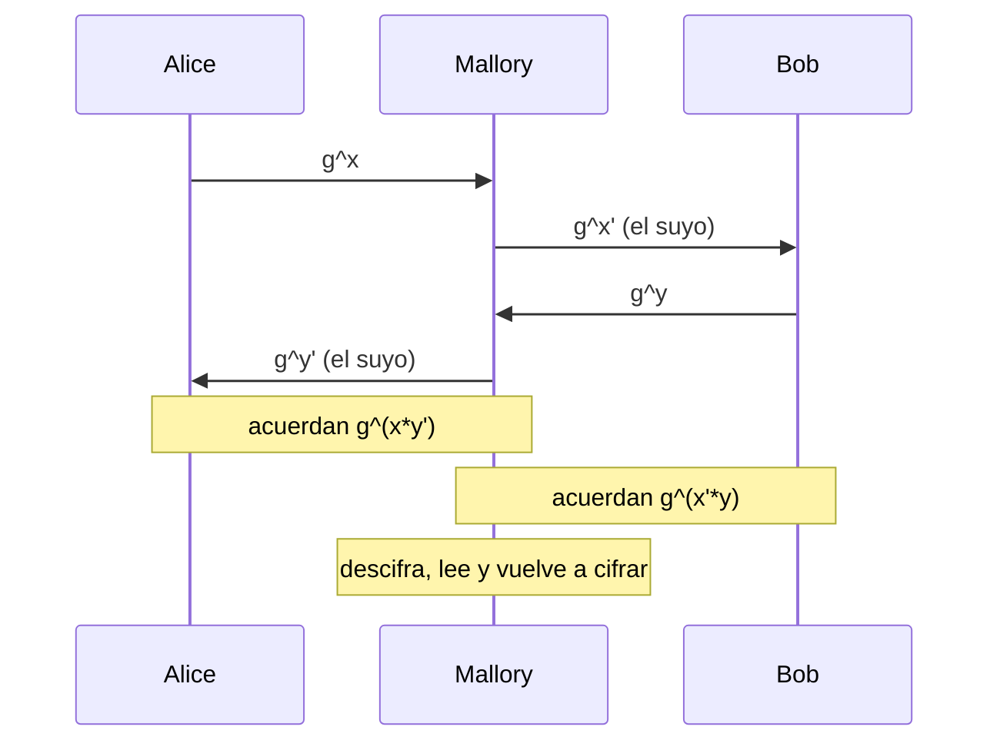

---
categories:
  - "[[ITBA.base|ITBA]]"
Tags: []
Created: 2026-09-1318:02
Materia: "[[Criptografía y Seguridad.base|Criptografia y seguridad]]"
temas:
  - Distribución de claves
  - KDC (Key Distribution Center)
  - Kerberos
  - Criptografía asimétrica
  - Intercambio de claves
  - Diffie-Hellman
  - Problema del logaritmo discreto
  - Conjetura de decisión DH (DDH)
  - Man in the middle
  - Grupos, anillos y cuerpos
  - Campo de Galois
  - Aritmética modular
  - Teorema de Euler
  - Función φ de Euler
  - Criptosistema asimétrico
  - RSA
  - Textbook RSA
  - PKCS #1 v1.5
  - ElGamal
  - Curvas elípticas
  - Firma digital
  - Sig-forge
  - No repudio
  - RSA-Signature
  - Hashed RSA
  - DSS / DSA
  - Algoritmo de Shor
  - Ley 25.506
---
# Clase 4 - Criptografía - Cifrado asimétrico y Firma digital

> [!abstract] De qué va la clase
> Toda la [clase anterior](Clase%203%20-%20Criptografia%20-%20MACs%20y%20modo%20autenticado.md) asumía que las dos partes **ya** compartían una clave. Esta clase ataca justamente ese supuesto, en tres pasos:
> 1. **Cómo acordar la clave** — KDC (solución centralizada) y Diffie-Hellman (solución criptográfica).
> 2. **Cómo cifrar con dos claves distintas** — criptosistemas asimétricos: RSA y ElGamal.
> 3. **Cómo firmar de manera públicamente verificable** — RSA-Signature, Hashed RSA y DSS.
>
> Bibliografía de la cátedra: Katz & Lindell, *Introduction to Modern Cryptography*, capítulos 9-12.

## Distribucion de claves

si quiero comunicar de manera segura necesito que tanto emisor como receptor tengan la misma clave

Lo unico en lo cual puede descansar una prueba de seguridad es en el atacante no conoce la clave

no podemos mandar la clave por el canal
se necesitan $\frac{N(N-1)}{2}$ ([Discrete Math - Caminos y Conexidad](Discrete%20Math%20-%20Caminos%20y%20Conexidad.md)) de claves para N clientes en un caso de multiples puntos

> [!warning] Corregido respecto de lo que estaba anotado
> Estaba escrito $\frac{N-1}{2}$. El número correcto es $\frac{N(N-1)}{2}$, que es la cantidad de aristas del grafo completo $K_N$: cada **par** de entidades necesita su propia clave.
> Lo que sí vale $N-1$ es lo que dice la slide: la cantidad de claves que administra **cada** parte. Sumando sobre las $N$ partes y dividiendo por 2 (cada clave se cuenta desde sus dos extremos) se llega a $\frac{N(N-1)}{2}$.

El punto central es el **crecimiento**: con claves de a pares el costo es cuadrático ($O(N^2)$), y por eso no escala. Las dos salidas que plantea la clase:

| Estrategia | Claves totales | Claves por entidad | Problema |
|---|---|---|---|
| Una clave por cada par | $\frac{N(N-1)}{2}$ | $N-1$ | Escala cuadráticamente |
| Punto único de confianza (KDC) | $N$ | $1$ | Único punto de falla |
| Criptografía asimétrica | $N$ pares (pk, sk) | $1$ par | Hay que autenticar las claves públicas |

Con dos puntos alcanza con usar un canal seguro una sola vez (un sobre, un encuentro en persona). El problema aparece recién cuando son muchos.

### KDC  (Key distribution centers)
centralizan el intercambio de claves, comparten una clave con cada entidad que participa

si A quiere comunicarse con C, envia un pedido KDC. el KDC crea una clave $K_S$ clavde de sesion, y se la envia a A y C. cifrando con $K_a$ y $K_c$ respectivamente

permite tener n claves para n entidades, pero es un unico punto de falla

El KDC es un caso particular de **Trusted Third Party (TTP)**: una entidad en la que todos confían y con la que todos comparten de antemano una clave de larga duración ($K_a$, $K_b$, $K_c$, …). La clave de sesión $K_S$ es efímera: se usa para esa conversación y se descarta.

$$\text{KDC} \rightarrow A: \operatorname{Enc}_{K_a}(K_S) \qquad \text{KDC} \rightarrow C: \operatorname{Enc}_{K_c}(K_S)$$

**Implementaciones reales** (las dos que nombró la clase):

- **Kerberos** — el estándar del mundo Unix; el logo es el perro de tres cabezas. El "Trent" de los ejercicios de protocolos es exactamente esto.
- **Active Directory** (Microsoft) — internamente usa Kerberos como mecanismo de autenticación de dominio.

> [!important] Los dos límites del KDC
> 1. **No resuelve el problema, lo mueve.** Sigue haciendo falta establecer de antemano $K_a$, $K_b$, … por un canal seguro. Reduce el problema de $O(N^2)$ claves iniciales a $O(N)$, pero no lo elimina.
> 2. **Punto único de falla**, en los dos sentidos: si el KDC se cae nadie puede empezar una comunicación nueva, y si lo comprometen el atacante puede leer *todo* el tráfico de *todos* (conoce todas las claves de larga duración).
>
> La criptografía asimétrica resuelve (1) de raíz: ya no hace falta ningún secreto compartido previo, solo un canal **autenticado** (que es un requisito mucho más débil que uno secreto).

# Criptografia Asimetrica

> "We stand today on the brink of a revolution in cryptography" — Whitfield **Diffie** y Martin **Hellman**, *New Directions in Cryptography* (1976).

asimetria de ciertos problemas (por ejemplo un candado fisico, es facil de cerrar y dificil de abrir sin la llave)

Una clave para cifrar, otra para decifrar

criptografia de clave publica: dos claves donde una de ellas es publica

La idea de fondo: existen problemas donde **hacer** es fácil y **deshacer** es difícil. El ejemplo del candado es el intuitivo; el ejemplo formal que dio la clase es **SAT**, difícil de resolver pero fácil de verificar una solución. Si el cifrado se apoya en un problema así, se puede publicar la clave de cifrado a propósito: aun teniéndola, el atacante no puede recuperar el mensaje.

De esa asimetría salen **tres primitivas nuevas**:

| Primitiva | Qué permite | Análogo simétrico |
|---|---|---|
| **Intercambio de claves** | que dos partes generen una clave compartida en línea, sin secreto previo | no existe — es genuinamente nuevo |
| **Cifrado asimétrico** | cifrar con $pk$, descifrar con $sk$ | cifrado simétrico |
| **Firma digital** | firmar con $sk$, verificar con $pk$ | MAC |

## Intercambio de claves

el protocolo de intercambio de claves es un protocolo de comunicación

genera un transcript con dos claves $K_a, K_b$
la clave a es conocida solo por una de las partes mientras que b es conocida solo por la otra parte

Condición Fundamental: $K_a=K_b$ 

Formalmente es un protocolo $\Pi(n)$ ejecutado por dos partes, donde $n$ es el parámetro de seguridad:

$$\Pi: (n) \rightarrow \textit{Trans},\; k_a,\; k_b$$

- **No tiene entrada** más allá del parámetro de seguridad. Esto lo distingue de un criptosistema: no hay mensaje que proteger, la salida *es* la clave.
- $\textit{Trans}$ es el conjunto de mensajes intercambiados, que el atacante ve entero.
- La corrección del protocolo es $k_a = k_b$; la **seguridad** es otra cosa y se define aparte.

## Seguridad frente a ataques pasivos

El experimento $KE_{A,\Pi}$ sigue el mismo molde que todos los de la materia (comparar lo real contra lo aleatorio):

1. Se ejecuta $\Pi$; sea $k = k_a = k_b$.
2. Se sortea $b \leftarrow \{0,1\}$.
3. Si $b=0$, $k' \leftarrow \{0,1\}^n$ (aleatoria); si $b=1$, $k' = k$ (la real).
4. $A$ recibe $\textit{Trans}$ **y** $k'$, y emite $b'$.

$KE_{A,\Pi}=1$ si $b=b'$. El protocolo es seguro si $\Pr[KE_{A,\Pi}=1] < \tfrac12 + \varepsilon$ con $\varepsilon$ despreciable.

> [!tip] Lo importante del experimento
> El adversario recibe el transcript **completo**. O sea: no alcanza con que no pueda calcular la clave; tiene que ser incapaz de *distinguirla* de un string aleatorio. Es la misma diferencia que hay entre "no puede recuperar el mensaje" y CPA-security.
> Ojo también con el alcance: este experimento modela un adversario **pasivo** (solo escucha). Un adversario activo queda afuera, y de ahí sale el problema de la sección "Diffie-Hellman en la práctica".

## Intercambio Diffie-Hellman

## Repaso de Algebra

El **grupo algebraico G,+**: conjunto de elementos y operacion
cumple 4 propiedades:
1. **Clausura**: Aplicar la operacion y que el resultado este en el conjunto
2. **Asociatividad**: la operacion a tres elementos no importa el orden: (a+b)+c = a+(b+c) 
3. **Neutro**: Un elemento que en la operacion da el otro numero (a+0 = a), (a x 1=1)
4. **Inverso**:todo numero tiene un complemento que al hacer aplicar la operacion entre ellos da el neutro
**Subgrupos**
**Grupo abeliano**: Grupos con conmutatividad
**Grupos finitos ciclicos**: cantidad finita de elementos, se puede construir a partir de un unico elemento aplicandole una operacion multiples veces
**Generador**: g / g es primo relativo de n
**Anillo**: grupo con dos operaciones donde la primera operacion forma un grupo albeliano y distributiva de la segunda sobre la primera operacion

**Subgrupo** $(G, G', +)$: $(G,+)$ y $(G',+)$ son ambos grupos, $G \supseteq G'$ y $G' \neq \emptyset$.

**Cuerpo o campo** $(G,+,*)$: es un anillo donde además $*$ es **conmutativa**, tiene **neutro** y todo elemento salvo el neutro de $+$ tiene **inverso** para $*$. La diferencia con el anillo es exactamente poder **dividir**.

| Estructura | Operaciones | Qué agrega respecto de la anterior |
|---|---|---|
| Grupo | $+$ | clausura, asociatividad, neutro, inverso |
| Grupo abeliano | $+$ | conmutatividad |
| Anillo | $+, *$ | $(G,+)$ abeliano; $*$ con clausura, asociatividad y distributiva sobre $+$ |
| Cuerpo / campo | $+, *$ | $*$ conmutativa, con neutro e inverso (salvo el $0$) |

**Campo de Galois** (campo finito): todo campo finito tiene tamaño $p^n$ con $p$ primo y $n$ entero, y dos campos del mismo tamaño son isomorfos. Los dos casos que importan en esta materia:

- $\mathbb{Z}_p$ con $p$ primo — la base de RSA, Diffie-Hellman y ElGamal.
- $GF(2^n)$, las **potencias de 2** — es el campo sobre el que trabaja AES (la MixColumns de [Criptografia y seguridad Clase 2 - Cifrado](Criptografia%20y%20seguridad%20Clase%202%20-%20Cifrado.md) son cuentas en $GF(2^8)$).

En los grupos finitos cíclicos hay $\phi(n)$ generadores, $\operatorname{ord}(g)$ es la cantidad de elementos del subgrupo cíclico que genera $g$, y $g$ es **elemento primitivo** si $\operatorname{ord}(g) = n$.

> [!bug] Dos errores en las slides del repaso de álgebra
> **1. El grupo canónico $\mathbb{Z}_n$.** La slide lo escribe $\mathbb{Z}_n = (\{1, 2, 3, \dots, n-1\}, +)$. Falta el $0$: sin él no hay neutro para $+$, así que ni siquiera sería un grupo. Es $\mathbb{Z}_n = \{0, 1, \dots, n-1\}$, y de hecho la propia slide de Diffie-Hellman lo escribe bien ($Z_q = \{0, 1, \dots, q-1\}$).
>
> **2. El "campo canónico" de tamaño $p-1$.** La slide de campos de Galois dice que todo campo finito tiene tamaño $p^n$ y dos renglones después define el campo canónico como $\{k \in \mathbb{Z}_p - \{0\} : \gcd(k,p)=1\}$ **de tamaño $p-1$**, que se contradice sola (para $p=7$ daría un campo de 6 elementos, y 6 no es potencia de primo). Lo que está describiendo es $\mathbb{Z}_p^{*}$, que es un **grupo multiplicativo** de orden $p-1$, no un campo. El campo canónico es $\mathbb{Z}_p$ **entero**, con el $0$ incluido, de tamaño $p$.

### Repaso de aritmética modular

$$a \equiv b \pmod n \iff a - b = k \cdot n$$

y se reduce siempre al representante canónico $0 \le a < n$. Ejemplos de la slide (ambos correctos): $2+8 \bmod 5 = 0$ y $4 \cdot 3 \bmod 7 = 5$.

- Si $n$ es **primo** → $\mathbb{Z}_n$ es un **campo finito**.
- Si $n$ **no** es primo → $\mathbb{Z}_n$ es un **anillo**; quedándose solo con los $k$ coprimos con $n$ se obtiene el grupo multiplicativo $(\mathbb{Z}_n^{*}, *)$.

**Inversos y teorema de Euler:**

$$\gcd(k,n)=1 \implies \exists\, k^{-1} \text{ tal que } k \cdot k^{-1} \equiv 1 \pmod n$$
$$a^{\phi(n)} \equiv 1 \pmod n \quad \text{con } \phi(n) = \lvert \mathbb{Z}_n^{*} \rvert$$

y el caso particular (pequeño teorema de Fermat) $a^{p-1} \equiv 1 \pmod p$ para $p$ primo.

> [!warning] Condición que la slide omite
> El teorema de Euler pide $\gcd(a,n)=1$. Sin esa hipótesis es falso: $2^{\phi(4)} = 2^2 = 4 \equiv 0 \pmod 4$, no $1$.

**Cálculo de $\phi(n)$** — las dos reglas que hacen falta para RSA:

$$\phi(n \cdot m) = \phi(n)\cdot\phi(m) \quad \text{si } \gcd(n,m)=1$$
$$\phi(p^a) = p^a - p^{a-1} = p^{a-1}(p-1) \quad \text{si } p \text{ es primo}$$

De las dos juntas sale lo único que se usa en RSA: si $n = p \cdot q$ con $p, q$ primos distintos, entonces $\phi(n) = (p-1)(q-1)$.

> [!info] Por qué este repaso está acá
> La factorización y el logaritmo discreto son los dos problemas asimétricos sobre los que se apoya todo lo que viene: multiplicar dos primos es trivial, factorizar el producto no; exponenciar es trivial, tomar logaritmo discreto no.

## Intercambio Diffie-Hellman — paso a paso

1. $A$ define $(G, q, g)$: un grupo, su tamaño y un generador.
2. $A$ elige $x \leftarrow \mathbb{Z}_q$ y calcula $h_1 = g^x$.
3. **$A \rightarrow B$: $(G, q, g, h_1)$**
4. $B$ elige $y \leftarrow \mathbb{Z}_q$ y calcula $h_2 = g^y$.
5. **$B \rightarrow A$: $(h_2)$**
6. $A$ calcula $k_a = h_2^{\,x}$
7. $B$ calcula $k_b = h_1^{\,y}$

$$K_S = (g^x)^y \bmod p = (g^y)^x \bmod p = g^{xy} \bmod p$$

Si $A$ y $B$ ya se conocen pueden tener $(G, q, g)$ predefinidos y ahorrarse mandarlos (es lo que hacen los grupos fijos de TLS e IPsec).

Lo que ve el atacante es $g^x$ y $g^y$; lo que necesita es $g^{xy}$, y **no puede** obtenerlo componiéndolos porque $g^x \cdot g^y = g^{x+y} \neq g^{xy}$.

## La seguridad Diffie-Hellman

No solo no puede recuperar la clave sino que no puede recuperar informacion

Esas son exactamente las dos conjeturas, una más fuerte que la otra:

| Supuesto | Enunciado | Rol |
|---|---|---|
| **Logaritmo discreto (DL)** | dados $g$ y $g^x$, no se puede obtener $x$ | necesaria, **no suficiente** |
| **Computational DH (CDH)** | dados $g, g^x, g^y$, no se puede calcular $g^{xy}$ | intermedia |
| **Decisional DH (DDH)** | dados $g, g^x, g^y$, no se puede **distinguir** $g^{xy}$ de un valor aleatorio | la que realmente hace falta |

La clase remarcó que DL es necesaria pero **no suficiente**: si el atacante pudiera sacar aunque sea un bit de $g^{xy}$ (por ejemplo su paridad), ya rompería el experimento $KE_{A,\Pi}$ sin haber calculado nunca $x$ ni $y$. Por eso la definición correcta es DDH. Un dato lindo de la clase: DDH se formuló **muchos años después** de que se publicara el algoritmo — primero se usó, después se entendió por qué funcionaba.

> [!bug] "Hoy se sabe que es un problema NP-Hard" — es falso
> La slide de *La seguridad de DH* (y el repaso de la clase) afirma que el problema del logaritmo discreto / la conjetura DDH es **NP-Hard**. No es así, y es un error que conviene tener claro:
> - DL está en $NP \cap co\text{-}NP$, y **no se sabe** que sea NP-completo ni NP-hard. De hecho se cree que **no** lo es: si lo fuera, colapsaría la jerarquía polinomial.
> - Además, NP-hardness es dureza en el **peor caso**, y la criptografía necesita dureza en el **caso promedio** (una instancia random tiene que ser difícil). Son cosas distintas: un problema NP-hard puede ser fácil para casi todas las instancias y sería inútil como base criptográfica.
> - Lo que sí es cierto: no se conoce algoritmo clásico en tiempo polinomial para DL. Los mejores son subexponenciales (index calculus / GNFS sobre $\mathbb{Z}_p^{*}$), y por eso los módulos tienen que ser tan grandes.
>
> Misma historia con la factorización, que tampoco es NP-hard. La frase correcta es "se conjetura difícil", no "es NP-hard".

## Diffie-Hellman en la practica

si el atacante pudiera cambiar el mensaje romperia todo (man in the middle)

se complementa con macs o firmas digitales

DH **puro** solo resiste adversarios pasivos: el experimento $KE_{A,\Pi}$ ni siquiera modela un atacante que modifique mensajes. Contra un atacante activo cae de la forma más directa:

$M$ queda en el medio con **dos** claves distintas, descifra todo lo que pasa y lo vuelve a cifrar. Ni $A$ ni $B$ notan nada, porque nada en el protocolo ata $g^x$ a la identidad de $A$.

> [!important] El requisito no es confidencialidad, es autenticación
> DH necesita un canal **autenticado**, no secreto. Todo el intercambio puede ser público — lo que hace falta es que $B$ pueda verificar que $g^x$ vino realmente de $A$. Por eso se complementa con MACs o firmas digitales, y por eso el ejercicio 7 de la guía firma $(g^x, g^y)$.

# Criptosistema Asimetrico

se generan dos claves (una publica y otra secreta)

se encripta con la clave publica pero se decifra con la clave secreta, 

>[!bug] importante
>Las claves no son intercambiables

Es una **terna de algoritmos**, igual que el criptosistema simétrico de [Criptografia y seguridad intro](Criptografia%20y%20seguridad%20intro.md) pero con las claves separadas:

$$\text{Gen}: () \rightarrow PK \times SK \qquad \text{Enc}: PK \times P \rightarrow C \qquad \text{Dec}: SK \times C \rightarrow P$$

**Propiedad básica (corrección):** para todo $m$ y todo par $(pk, sk)$ válido, $d_{sk}(e_{pk}(m)) = m$.

> [!note] Matiz sobre "las claves no son intercambiables"
> Como **regla de uso** es correctísima: quien tiene $pk$ solo puede cifrar, y jamás hay que usar el mismo par de claves para cifrar y para firmar.
> Pero en **RSA puntualmente** la matemática sí es simétrica: $e$ y $d$ son intercambiables porque $(m^e)^d = (m^d)^e = m \bmod n$. Eso es exactamente lo que explota RSA-Signature más abajo, que "cifra con la privada". En ElGamal, en cambio, no hay tal simetría: ahí $sk$ y $pk$ tienen forma distinta ($x$ contra $g^x$) y no se pueden intercambiar ni aunque uno quisiera.

## Prueba de Indistinguibilidad
muy parecida a la anterior que la anterior
al pasarle la clave publica se le da al atacante la funcion de cifrado

El test $Eav_{A,\Pi}$:

1. Se genera $(pk, sk) \leftarrow K$.
2. **$A$ obtiene $pk$** y genera $(m_0, m_1)$.
3. Se sortea $b \leftarrow \{0,1\}$.
4. $A$ recibe $c = e_{pk}(m_b)$.
5. $A$ emite $b'$.

$Eav_{A,\Pi}=1$ si $b=b'$; $\Pi$ es indistinguible si $\Pr[Eav_{A,\Pi}=1] < \tfrac12 + \varepsilon$.

### Consecuencias
todo criptosistema asimetrico tiene que ser **no** deterministico, si pasa la prueba de indistinguibilidad entonces tambien es CPA-secure

> [!bug] Corregido respecto de lo que estaba anotado
> Estaba escrito "tiene que ser determinístico". Es exactamente **al revés**: la slide dice *"CPA-Secure REQUIERE cifrado no determinístico"*, y este es el error que más caro sale en un parcial.
>
> El razonamiento es de una línea: el atacante **tiene** $pk$, así que puede cifrar por su cuenta. Si el cifrado fuera determinístico, ante el desafío $c$ calcula $e_{pk}(m_0)$ y compara — gana con probabilidad 1. Por eso **todo** criptosistema asimétrico necesita aleatoriedad en el `Enc` (el padding $r$ de PKCS#1, el exponente $y$ de ElGamal).

La otra consecuencia, y es una diferencia real con el mundo simétrico: en asimétrico **indistinguibilidad frente a un adversario pasivo $\implies$ CPA-Secure**, gratis. En simétrico había que dar acceso a un oráculo de cifrado aparte; acá el oráculo *es* la clave pública, que el atacante ya tiene.

## "Textbook" RSA

**Generación de claves:**

1. Elegir $p, q$ primos grandes. $n = p \cdot q$.
2. Elegir $e \leftarrow (0, \phi(n))$ con $\gcd(e, \phi(n)) = 1$.
3. Calcular $d$ tal que $e \cdot d \equiv 1 \pmod{\phi(n)}$ (con **Euclides extendido**).
4. $pk = (n, e)$, $sk = (n, d)$.

$$\operatorname{Enc}_{pk}(m) \equiv m^{e} \bmod n \qquad \operatorname{Dec}_{sk}(c) \equiv c^{d} \bmod n$$

Funciona por el teorema de Euler: $c^d = m^{ed} = m^{1 + k\phi(n)} = m \cdot (m^{\phi(n)})^k \equiv m \bmod n$.

La seguridad se apoya en que **factorizar $n$ es difícil**: quien pueda factorizar obtiene $\phi(n)=(p-1)(q-1)$ y de ahí $d$ invirtiendo $e$.

### Problemas 

1. **Es determinístico** → por lo de arriba, no puede ser CPA-Secure. Cifrar dos veces el mismo mensaje da el mismo ciphertext.
2. **$e$ y $m$ chicos.** Si $m^e < n$ la reducción modular nunca ocurre y $c = m^e$ en los enteros: se recupera $m$ tomando la raíz $e$-ésima, sin factorizar nada. Durante mucho tiempo se usó $e=3$ para que el cifrado fuera rápido.
3. **Módulo compartido.** Si dos pares de claves usan el mismo $n$ con distinto $e$, cada uno de los dos dueños puede obtener la clave privada del otro (y un tercero que vea el mismo $m$ cifrado con $e_1$ y $e_2$ coprimos lo recupera con Bézout).
4. Es **maleable**: $\operatorname{Enc}(m_1)\cdot\operatorname{Enc}(m_2) = \operatorname{Enc}(m_1 m_2)$. Es lo mismo que la maleabilidad de [Clase 3 - Criptografia - MACs y modo autenticado](Clase%203%20-%20Criptografia%20-%20MACs%20y%20modo%20autenticado.md) y es literalmente el **ejercicio 17** de la guía.

> [!bug] Dos imprecisiones en la slide *Problemas*
> - Dice *"se puede calcular el **logaritmo**"*. No: lo que se calcula es la **raíz $e$-ésima** de $c$ sobre los enteros. El logaritmo discreto es el problema de ElGamal, no el de RSA — mezclarlos es un error clásico.
> - Dice *"si dos pares de claves comparten el mismo $n$, es posible recuperar $n$"*. $n$ es **público**, recuperarlo es gratis. Lo que se recupera es la **factorización** de $n$ (o directamente la clave privada ajena): con $e_1 d_1 - 1$ múltiplo de $\phi(n)$ se factoriza $n$ y se deduce $d_2$.

### Ejemplo RSA

Parámetros de juguete, a modo ilustrativo:

| | |
|---|---|
| $p = 2357$, $q = 2551$ | $n = p\cdot q = 6\,012\,707$ |
| $\phi(n) = (p-1)(q-1)$ | $= 2356 \cdot 2550 = 6\,007\,800$ |
| $e = 3\,674\,911$ (al azar) | $d = 422\,191$ (Euclides extendido) |

$$e(m) = 5\,234\,673^{\,3\,674\,911} \bmod 6\,012\,707 = 3\,650\,502$$
$$d(m') = 3\,650\,502^{\,422\,191} \bmod 6\,012\,707 = 5\,234\,673$$

> [!success] Verificado
> Chequeado con Python: $p$ y $q$ son primos, $n$ y $\phi(n)$ dan, $\gcd(e,\phi(n))=1$, $e\cdot d \equiv 1 \pmod{\phi(n)}$ y las dos exponenciaciones dan exactamente los valores de la slide. **La slide está bien.**

## PKCS 1 v1.5

es parecido a agregarle im IV a algo no deterministico para hacerlo deterministico

> [!warning] Al revés (typo propio)
> Es agregarle algo tipo IV a un esquema **determinístico para hacerlo no determinístico**. La analogía en sí es buenísima: el padding aleatorio $r$ cumple para RSA el mismo rol que el IV para CBC — que cifrar dos veces el mismo mensaje dé cosas distintas.

*RSA Labs Public Key Cryptography Standard.* Con $k$ = longitud de $n$ **en bytes** y $D$ = longitud de $m$ en bytes:

$$m' = \texttt{0x00} \;\|\; \texttt{0x02} \;\|\; r \;\|\; \texttt{0x00} \;\|\; m$$

donde $r$ son $k - D - 3$ bytes aleatorios **distintos de cero** (esa condición es para que el $\texttt{0x00}$ separador sea inequívoco y se pueda encontrar dónde empieza $m$ al despadear).

- El $\texttt{0x00}$ inicial garantiza $m' < n$.
- Se puede cifrar como máximo $k - 11$ bytes (los 3 bytes fijos más un mínimo de 8 bytes de padding).
- Se **cree** CPA-Secure, pero **no es CCA-Secure**: el ataque de Bleichenbacher (1998) usa el servidor como oráculo de padding, preguntándole por ciphertexts modificados y viendo si el padding resultó válido. Es el mismo espíritu del padding oracle de CBC.

> [!bug] Typo en la slide
> Dice *"solo se permiten cifrar mensajes de hasta **n**-11 bytes"*. Es **$k$-11**, donde $k$ es la longitud de $n$ en bytes, que la propia slide define dos renglones más arriba. Con RSA-2048, $k=256$ y el máximo es 245 bytes — no "$n-11$", que sería un número de 617 cifras.

## Elgamal (basado en DH)

Es Diffie-Hellman convertido en criptosistema: en lugar de acordar $g^{xy}$ interactivamente, el receptor publica $h=g^x$ de una vez y el emisor hace su mitad del DH en cada mensaje.

**Generación de claves:** seleccionar $(G, q, g)$; elegir $x \leftarrow \mathbb{Z}_q$ y calcular $h = g^{x}$.

$$pk = (G, q, g, h) \qquad sk = (G, q, g, x)$$

**Cifrado** — se sortea $y \leftarrow \mathbb{Z}_q$ **nuevo en cada mensaje**:

$$e_{pk}(m) = (c_1, c_2) = (g^{y},\; h^{y} \cdot m)$$

**Descifrado:**

$$d_{sk}(c) = \frac{c_2}{c_1^{\,x}} = \frac{h^y m}{(g^y)^x} = \frac{g^{xy} m}{g^{xy}} = m$$

**Resultado teórico:** si DDH es difícil en $G$, ElGamal es **CPA-Secure** — demostrable, no conjeturado. Es la gran diferencia con RSA, que no tiene prueba de seguridad.

> [!warning] El $y$ no se reusa jamás
> Si se cifran $m_1$ y $m_2$ con el mismo $y$, entonces $c_2/c_2' = m_1/m_2$ y con conocer un solo mensaje se obtiene el otro. Es el mismo desastre que reusar el keystream de un cifrado de flujo.

### Diferencias con RSA

| | RSA (textbook) | ElGamal |
|---|---|---|
| Problema duro | factorización | logaritmo discreto / DDH |
| Determinismo | determinístico (por eso inseguro sin padding) | **probabilístico** por diseño |
| Prueba de seguridad | no tiene; hay que parchear con padding | CPA-Secure demostrable bajo DDH |
| Parámetros | $n$ propio de cada usuario | $(G,q,g)$ **reutilizables** por todos |
| Expansión del ciphertext | $\lvert c \rvert = \lvert n \rvert$ | $\lvert c \rvert = 2\lvert q \rvert$ (el doble) |
| Dominio | solo campos numéricos | cualquier grupo: anillos de polinomios, **curvas elípticas** |

Los dos puntos que remarcó la clase:

- **Anillos de polinomios**: tienen $2^n$ elementos, así que mapear mensajes (que son strings de bits) al grupo es directo. En $\mathbb{Z}_p^{*}$ no, porque $p-1$ no es potencia de 2.
- **Curvas elípticas**: el problema de decisión DH es *más difícil* ahí — no se conocen ataques subexponenciales tipo index calculus. Por eso se pueden usar claves mucho más chicas para la misma seguridad.

### Ejemplo El Gamal

Con $G = \mathbb{Z}_q^{*}$, $q = 2357$, $g = 2$, $x = 1751$:

$$h = g^{x} \bmod q = 2^{1751} \bmod 2357 = 1185$$

Cifrado de $m = 2035$ con $y = 1520$:

$$e(m) = \left(2^{1520} \bmod 2357,\;\; 2035 \cdot 1185^{1520} \bmod 2357\right) = (1430,\; 697)$$

Descifrado: $d(m') = 1430^{-1751} \cdot 697 \bmod 2357 = 2035$.

> [!success] Verificado
> Las tres cuentas dan exactamente lo de la slide. Además chequeé que $\operatorname{ord}(2) = 2356 = q-1$ en $\mathbb{Z}_{2357}^{*}$, o sea que $g=2$ **sí** es generador (elemento primitivo), que es lo que el esquema necesita.

> [!warning] Abuso de notación en la slide
> La slide llama $q$ tanto al primo del módulo como al tamaño del grupo. Son cosas distintas: acá el módulo es $p = 2357$ y el grupo $\mathbb{Z}_{2357}^{*}$ tiene orden $q = 2356$. Los exponentes $x$ e $y$ viven en $\mathbb{Z}_{2356}$, no en $\mathbb{Z}_{2357}$. También dice *"campo $G$ de tamaño $q$"*: $G$ es un **grupo** multiplicativo, no un campo.

## Cifrado asimétrico en números

El nivel de seguridad es relativo al tamaño de los conjuntos involucrados: en RSA $n = p\cdot q$, en ElGamal $n = q$.

| Esquema | Lo que dice la slide | Estado actual |
|---|---|---|
| RSA / ElGamal sobre campos numéricos | $\ge 1024$ bits; "se recomiendan 1536 o 2048" | **2048 mínimo** (112 bits de seguridad), **3072** para 128 bits |
| Curvas elípticas | $\ge 320$ bits | **256 bits** ya dan 128 bits de seguridad (P-256, Curve25519) |

> [!warning] Números desactualizados
> Las cifras de la slide son de otra época. RSA-1024 está **prohibido** por NIST desde 2013 (SP 800-131A); el piso hoy es 2048 y lo recomendado para 128 bits de seguridad es 3072. La cuenta importante para el parcial es la **asimetría de crecimiento**: para pasar de 112 a 128 bits de seguridad, RSA necesita saltar de 2048 a 3072 bits mientras que ECC pasa de 224 a 256. Ese es el argumento de por qué ECC ganó en dispositivos chicos.

El ejemplo de la slide *Tamaño de claves* es el módulo del desafío **RSA-2048**: 617 dígitos decimales, 2048 bits exactos (verificado contando los dígitos del PDF). Nunca fue factorizado.

# Firma digital

Es una **terna de algoritmos**, el espejo asimétrico del MAC:

$$\text{Gen}: () \rightarrow PK \times SK \qquad \text{Sign}: SK \times P \rightarrow S \qquad \text{Vrfy}: PK \times P \times S \rightarrow \{0,1\}$$

**Propiedad básica:** para todo $m$ y $(pk,sk)$ válidos, $\operatorname{vrfy}_{pk}(m, \operatorname{sign}_{sk}(m)) = 1$.

Ojo con la dirección de las claves, que es la **opuesta** a la del cifrado:

| | Cifrado asimétrico | Firma digital |
|---|---|---|
| Clave pública | **cifra** | **verifica** |
| Clave privada | descifra | firma |
| Objetivo | confidencialidad | integridad + autenticación |

## Seguridad de una firma digital

El experimento $\textit{Sig-forge}_{A,\Pi}$ es el mismo molde que $\textit{Mac-forge}$:

1. Se generan $(sk, pk) \leftarrow K$.
2. $A$ obtiene $pk$ **y** acceso al oráculo $f(x) = \operatorname{Sign}_{sk}(x)$.
3. $A$ hace todas las evaluaciones que quiera; sea $Q$ el conjunto de mensajes consultados.
4. $A$ emite $(m, s)$ con $m \notin Q$.

$\textit{Sig-forge}_{A,\Pi}=1$ si $\operatorname{Vrfy}_{pk}(m,s)=1$ y $m \notin Q$. El esquema es seguro si esa probabilidad es despreciable.

> [!tip] Por qué el modelo es tan exigente
> Es una falsificación **existencial** bajo **mensajes elegidos**: al atacante le alcanza con producir *un* par válido cualquiera, aunque $m$ sea basura sin sentido. No hace falta que falsifique un mensaje que él elija de antemano. Esto importa para el ejercicio 16 de la guía, donde la falsificación produce un $m$ totalmente aleatorio y **igual cuenta como ataque exitoso**.

## Firmas digitales vs MACs

Las firmas son similares a los MACs (mismo objetivo: **integridad**), pero tienen tres ventajas que el MAC no puede dar:

| Propiedad | MAC | Firma digital |
|---|---|---|
| **Públicamente verificable** | ❌ solo quien tiene la clave | ✅ cualquiera con $pk$ |
| **Transferible** | ❌ | ✅ se puede reenviar y sigue siendo verificable |
| **No repudio** | ❌ (la clave la tienen los dos) | ✅ el firmante no puede negar haber firmado |
| Costo | barato (hash/cifrado simétrico) | caro (exponenciación modular) |

El **no repudio** es la propiedad clave y sale de una asimetría concreta: con un MAC, Alice y Bob comparten $k$, así que cualquiera de los dos pudo haber generado el tag — un tercero no puede dirimir quién fue. Con una firma, solo Alice tiene $sk_A$. Por eso el no repudio es lo que permite que la firma digital tenga valor **jurídico**, y por eso es exactamente lo que se pregunta en el ejercicio 8 de la guía.

## RSA-Signature

Idéntico a RSA-Encryption pero invirtiendo los papeles de las claves:

$$\operatorname{Sign}_{sk}(m) \equiv m^{d} \bmod n \qquad \operatorname{Vrfy}_{pk}(m, s) : \;\text{¿}\, m = s^{e} \bmod n \,\text{?}$$

> [!bug] Typo en la slide *RSA-Signature*
> La generación de claves dice *"$d \leftarrow (0, \phi(n))\mid \gcd(\mathbf{e}, \phi(n))=1$"* y en el renglón siguiente *"calcular $d$"*. Es copy-paste de la slide de cifrado: el que se elige al azar es **$e$**, y $d$ es el que se calcula después. Tal como está, $d$ se elegiría y se calcularía dos veces.

> [!danger] Este esquema es inseguro
> La propia slide lo aclara: *"aunque común en la literatura, es inseguro"*. Nunca implementarlo así.

### Problemas de RSA-Signature

**Ataque 1 — falsificación sin mensaje (*no-message attack*).** Es el **ejercicio 16.1** de la guía:

1. $A$ elige una firma al azar $s \leftarrow S$.
2. Calcula $m = s^{e} \bmod n$ (puede: $e$ es público).
3. Emite $(m, s)$.

La verificación es $s^e \stackrel{?}{=} m$, y por construcción da. El atacante **nunca vio una firma legítima** y aun así falsifica. El $m$ que sale es un número sin sentido, pero según $\textit{Sig-forge}$ eso alcanza.

**Ataque 2 — multiplicativo.** Dadas dos firmas legítimas $s_1 = f(m_1)$ y $s_2 = f(m_2)$, se emite $(m_1 m_2,\; s_1 s_2)$:

$$(s_1 s_2)^{e} = s_1^{e} s_2^{e} = m_1 m_2 \bmod n \;\;\checkmark$$

Sale de la misma **homomorfía multiplicativa** de RSA que rompe el cifrado en el ejercicio 17. Acá, además, el atacante **elige** mensajes con sentido y arma un producto con sentido.

> [!success] Verificado
> Implementé los dos ataques en Python con un RSA de juguete ($p=1000003$, $q=1000033$, $e=65537$): ambos pasan `Vrfy` con éxito.

## Hashed RSA

Busca solucionar los problemas anteriores introduciendo una función de hash **libre de colisiones**:

$$\operatorname{Sign}_{sk}(m) \equiv H(m)^{d} \bmod n \qquad \operatorname{Vrfy}_{pk}(m,s): \;\text{¿}\, H(m) = s^{e} \bmod n \,\text{?}$$

Resuelve **tres** cosas a la vez:

1. **Tamaño.** $H(m)$ tiene tamaño fijo y chico, así que se pueden firmar mensajes arbitrariamente largos sin partirlos.
2. **Ataque sin mensaje.** Ahora el atacante que elige $s$ y calcula $x = s^e$ necesita encontrar un $m$ con $H(m) = x$ — o sea, romper **resistencia a preimágenes** ([Clase 3 - Criptografia - MACs y modo autenticado](Clase%203%20-%20Criptografia%20-%20MACs%20y%20modo%20autenticado.md)). Inviable.
3. **Ataque multiplicativo.** $H(m_1)\cdot H(m_2)$ casi con seguridad no es $H(m_1 m_2)$, así que la estructura algebraica que hacía funcionar el ataque se rompe.

Contra: **no tiene prueba de seguridad** salvo que se asuma un modelo ideal de $H$ (random oracle model). Funciona en la práctica, pero la garantía es más débil que la de ElGamal.

## Digital Signature Standard (DSS/DSA)

**Generación de claves:**

- Seleccionar $H(x)$: SHA-1 o SHA-2.
- Tamaños $(L, N)$: $(1024,160)$, $(2048,224)$, $(2048,256)$ o $(3072,256)$.
- $q \leftarrow$ primo de $N$ bits; $p \leftarrow$ primo de $L$ bits tal que $p - 1 \equiv 0 \bmod q$.
- $g \leftarrow$ generador de orden $q$ mod $p$, con $g^{(p-1)/q} \neq 1$.
- $x \leftarrow \mathbb{Z}_q$, $y = g^{x} \bmod p$. Con $G = \mathbb{Z}_p^{*}$:

$$pk = (p,q,g,y) \qquad sk = (p,q,g,x)$$

**Firma** — con $k \leftarrow \mathbb{Z}_q$ **aleatorio y distinto en cada firma**:

$$r = (g^{k} \bmod p) \bmod q \qquad s = \left[H(m) + x\cdot r\right]\cdot k^{-1} \bmod q$$
$$\operatorname{Sign}_{sk}(m) = (r,s)$$

**Verificación:**

$$u_1 = H(m)\cdot s^{-1} \bmod q \qquad u_2 = r \cdot s^{-1} \bmod q$$
$$\text{¿}\; r = \left(g^{u_1} y^{u_2} \bmod p\right) \bmod q \;\text{?}$$

> [!bug] Tres cosas mal en las slides de DSS
> 1. **$v_1, v_2$ vs $u_1, u_2$.** La slide define $v_1$ y $v_2$ y después verifica con $g^{u_1} y^{u_2}$, que nunca definió. Son el mismo valor, con dos nombres. Arriba lo dejé unificado como $u_1, u_2$.
> 2. **"$p \leftarrow$ primo de tamaño $P$"** — es de tamaño **$L$**; $P$ no está definido en ningún lado.
> 3. **SHA-1 como opción vigente.** NIST lo prohibió para *generar* firmas desde 2013; está roto en colisiones (SHAttered 2017). Es el mismo punto que ya quedó anotado en la [Clase 3](Clase%203%20-%20Criptografia%20-%20MACs%20y%20modo%20autenticado.md).

> [!danger] DSA ya no es el estándar vigente
> La clase dijo que "DSS es el estándar actual". Ya no lo es en esa forma: **FIPS 186-5** (3 de febrero de 2023) **sacó a DSA** como método aprobado para *generar* firmas — queda únicamente para *verificar* firmas viejas. Los motivos que dio NIST: poco uso en la industria y vulnerabilidades cuando los parámetros de dominio no se generan bien.
>
> Lo aprobado hoy por FIPS 186-5 es **RSA**, **ECDSA** y **EdDSA** (con Ed25519 y Ed448), más una variante determinística de ECDSA. Lo que sí sigue valiendo del comentario de la clase es la idea general: estos esquemas trabajan sobre grupos algebraicos cualesquiera, **incluidas curvas elípticas** — ECDSA es literalmente DSA con $\mathbb{Z}_p^{*}$ reemplazado por una curva.

> [!warning] El $k$ nunca se repite
> Igual que el $y$ de ElGamal. Si dos firmas usan el mismo $k$, se despeja $k$ de las dos ecuaciones de $s$ y de ahí sale $x$ — la clave privada entera. Es exactamente el bug con el que se sacó la clave de firma de la PlayStation 3 en 2010: Sony usaba $k$ constante.

# Criptografía post-cuántica

El **algoritmo de Shor** (1994) corre en tiempo polinomial en una computadora cuántica y rompe RSA, DH, ElGamal y DSA por igual.

> [!bug] Corrección a lo que se dijo en clase
> En el repaso quedó anotado que Shor *"amenaza a RSA por factorización, no directamente el logaritmo discreto"*. Es al revés de lo que sugiere: el paper de Shor se titula literalmente **"Algorithms for quantum computation: discrete logarithms and factoring"** y resuelve **los dos** problemas en tiempo polinomial — incluido el logaritmo discreto sobre **curvas elípticas**, que de hecho cae con *menos* qubits que RSA del mismo nivel de seguridad.
>
> O sea: **toda** la criptografía asimétrica de esta clase cae ante una computadora cuántica suficientemente grande. Lo que sobrevive es lo simétrico, y solo a medias: **Grover** da una aceleración cuadrática contra búsqueda de claves, que se compensa duplicando el largo de la clave (AES-256 sigue dando ~128 bits de seguridad).
>
> Por eso NIST estandarizó esquemas post-cuánticos basados en **retículos** (ML-KEM/Kyber, ML-DSA/Dilithium) y **hashes** (SLH-DSA/SPHINCS+), que no dependen ni de factorización ni de logaritmo discreto.

# Marco legal argentino

La **Ley 25.506 de Firma Digital** (sancionada el 14/11/2001) es lo que le da valor jurídico a todo esto, y es el tema del **ejercicio 14** de la guía.

- **Art. 2 — Firma digital**: resultado de aplicar a un documento digital un procedimiento matemático que requiere información de exclusivo conocimiento del firmante, verificable por terceros, que permite identificar al firmante y detectar alteraciones del documento.
- **Art. 3 — Equiparación**: *"Cuando la ley requiera una firma manuscrita, esa exigencia también queda satisfecha por una firma digital"*.
- **Art. 5 — Firma electrónica**: es la categoría residual — todo lo que se usa para identificarse electrónicamente pero **no** cumple alguno de los requisitos de la firma digital. La diferencia práctica es la **carga de la prueba**: la firma digital se presume válida y quien la desconoce debe probarlo; en la firma electrónica pasa al revés, quien la invoca debe probar su validez.
- **Art. 19** — funciones de los certificadores licenciados.
- **Art. 29** — la autoridad de aplicación (hoy en la órbita de la **Jefatura de Gabinete de Ministros**), que es también el **ente licenciante** y opera la **AC Raíz** de la República Argentina.

> [!tip] Firma digital ≠ firma electrónica
> Es la distinción que más se pregunta. Toda firma digital es una firma electrónica; la recíproca es falsa. Para ser *digital* en el sentido de la ley hace falta criptografía asimétrica **y** un certificado emitido por un certificador licenciado.

---

# Mini-resumen para la Guía 4

Lo mínimo que hay que tener a mano para resolver la guía, agrupado por bloques de ejercicios.

## A. Ataques a protocolos (ejercicios 1 a 9)

Los cuatro ataques del ejercicio 1 son el vocabulario de todo el bloque:

| Ataque | En qué consiste | Cómo se evita |
|---|---|---|
| **Replay** | reenviar un mensaje válido capturado antes | **nonces**, timestamps, contadores de secuencia |
| **Key reuse** | usar la misma clave en contextos distintos, o reusar un valor de un solo uso ($k$, $y$, IV) | clave de sesión por conversación, separación de claves por propósito |
| **Man in the middle** | interponerse y hablar con cada parte por separado | **autenticar** el canal: firmas, certificados, secreto precompartido |
| **Masquerading** | hacerse pasar por otra identidad | **atar la identidad a la clave** (certificado), challenge-response |

**Herramientas que aparecen una y otra vez:**

- **Nonce** ($N_1$, $N_2$, `randA`): número aleatorio de un solo uso. Sirve para **frescura** — probar que el mensaje es de *ahora* y no una repetición. La respuesta típica es devolver $N+1$ o $N-1$ cifrado, para probar a la vez que se conoce la clave y que se leyó el nonce.
- **Challenge-response**: mandar un desafío impredecible y pedir una respuesta que solo pueda producir quien tiene la clave.
- **Clave de sesión** $K_S$: efímera, una por conversación. Limita el daño si se roba.
- **El principio general de la guía**: un protocolo es inseguro cuando un mensaje **no está atado** a (a) quién lo mandó, (b) a quién va dirigido, (c) a qué sesión pertenece, o (d) en qué momento se generó. Casi todos los ejercicios de este bloque son un caso de alguno de esos cuatro.

**Por ejercicio, qué hay que mirar:**

- **Ej. 2** — intercambio de claves públicas **sin autenticar** → MITM de manual. $Z$ sustituye $Kp_A$ por $Kp_Z$ y queda en el medio. Es el ataque de la sección *Diffie-Hellman en la práctica*.
- **Ej. 3** — una firma $S_A\{N_1, K_S\}$ es **pública**: firmar no es cifrar. Pensar quién puede leer $K_S$ ahí adentro, y si el mensaje dice a quién va dirigido.
- **Ej. 4** — autenticación mutua simétrica: el protocolo es simétrico y $A$ y $B$ hacen lo mismo. Pensar en el **ataque de reflexión / sesiones paralelas**: qué pasa si el atacante abre una segunda sesión contra $A$ y usa a $A$ como oráculo para cifrar lo que necesita en la primera.
- **Ej. 5** — Needham-Schroeder. El problema del original es que $A$ le manda a $B$ un ticket que $B$ **no puede saber si es fresco**. La variante agrega `randX` generado por **Bob** antes de que Alice hable con Trent: ese nonce viaja hasta el KDC y vuelve dentro del ticket, así que Bob puede verificar que el ticket se armó *después* de su propio pedido.
- **Ej. 6** — DH a tres partes. La clave es $g^{xyz}$ y hace falta **una ronda más**: cada uno eleva lo que recibe a su exponente y lo pasa al siguiente ($g^x \rightarrow g^{xy} \rightarrow g^{xyz}$).
- **Ej. 7** — DH autenticado. La parte (a) es la sección *DH en la práctica*. Para (b): mirar **qué falta adentro de las firmas** — $S_B(g^x, g^y)$ firma los valores públicos pero **no las identidades**. Mallory puede reenviar la firma de Alice cambiando de quién dice venir.
- **Ej. 8** — tabla firma vs MAC. Usar la tabla de *Firmas digitales vs MACs* de arriba. Ojo: ni la firma ni el MAC protegen contra **replay** por sí solos (caso b), porque el mensaje reenviado tiene firma perfectamente válida — hace falta un nonce o timestamp.
- **Ej. 9** — certificados emitidos por Trent. Para (b): mirar qué contiene $E_B(S_A(K_S, time_A))$ y qué **no** contiene (el destinatario).

## B. Certificados y PKI (ejercicios 10 a 14)

- **Certificado digital** = (clave pública + identidad del dueño) **firmado por una CA**. Es lo que resuelve el problema que DH dejaba abierto: atar una clave pública a una identidad.
- **Cadena de confianza**: certificado de usuario ← firmado por CA intermedia ← firmada por **AC Raíz**, que está autofirmada. La confianza se ancla en el certificado raíz que uno ya tiene instalado.
- **CSR** (Certificate Signing Request): la solicitud. Contiene la **clave pública** y los datos del sujeto (nombre X.500), y va **autofirmada con la privada** para probar posesión.

> [!warning] Error en el enunciado del ejercicio 10
> Dice *"en dicha solicitud, habrá que incluir la clave privada"*. **No**: en un CSR va la clave **pública**. La privada nunca sale de la máquina — `openssl req -new -key priv.pem` usa la privada localmente para firmar el CSR y **derivar** la pública, pero no la incluye en el archivo.

**Comandos del bloque:**

| Qué | Comando |
|---|---|
| Crear CSR | `openssl req -new -key priv.pem -out solicitud.csr` |
| Autocertificarse | `openssl req -x509 -key priv.pem -in solicitud.csr -out autocertif.pem` |
| Certificado de CA (10 años) | `openssl req -new -key CApriv.key -out ca.cer -config CAconf2.cfg -x509 -days 3650` |
| Firmar un CSR como CA | `openssl x509 -req -in req.pem -CA ca.cer -CAkey CApriv.key -CAcreateserial -days 365 -sha1 -out USRcert.cer -text` |
| Inspeccionar | `openssl x509 -in cert.cer -text -noout` |

- **Ej. 13 — modelo de confianza (PGP/web of trust).** No hay jerarquía: la confianza se compone. Distinguir **confianza en la clave** (creo que esta clave es de Fred) de **confianza en las firmas de esa persona** (creo en lo que Fred certifica), que son las etiquetas H/L. El argumento se arma desde Alice hacia afuera: Alice confía en Harold y Jane → eso le da confianza en Ellen → Ellen certifica a George → y así hasta Fred. A Tiago hay que descartarlo porque Alice no sabe si sus opiniones son confiables.
- **Ej. 14 — PKI argentina.** Ley 25.506, sección *Marco legal argentino* de arriba. La autoridad de aplicación, el ente licenciante y la **AC Raíz** están hoy en la órbita de la Jefatura de Gabinete de Ministros; las funciones de los certificadores licenciados están en el **art. 19**. La lista de certificadores licenciados vigentes conviene sacarla de argentina.gob.ar, que es la fuente oficial y cambia seguido.

## C. Ataques concretos (ejercicios 15 a 17)

**Ej. 15 — CCA sobre un esquema CPA-seguro.** El esquema es $\operatorname{Enc}_k(m) = r \,\|\, (f_k(r) \oplus m)$ con $\lvert r \rvert = \lvert m \rvert = n$.

- (a) $\operatorname{Dec}_k(c)$: partir $c$ en $r \,\|\, c_2$ y devolver $f_k(r) \oplus c_2$.
- (b) El esquema es **maleable**: XOR-eando el segundo bloque con un $\Delta$ se XOR-ea el plaintext con $\Delta$, sin tocar $r$. Con $m_0 = 00000001$ y $m_1 = 11111110$ (que son complementos), tomar el desafío $c = r\,\|\,c_2$, pedirle al oráculo que descifre $c' = r \,\|\, (c_2 \oplus \texttt{11111111})$ y ver si sale $m_0$ o $m_1$. Es el mismo ataque de maleabilidad de [Clase 3 - Criptografia - MACs y modo autenticado](Clase%203%20-%20Criptografia%20-%20MACs%20y%20modo%20autenticado.md).

**Ej. 16 — Textbook RSA para firma.** Es el *no-message attack* de la sección *Problemas de RSA-Signature*: elegir $\sigma$ al azar, calcular $m = \sigma^{e} \bmod N$, emitir $(m,\sigma)$. Para la parte 2, Hashed RSA lo frena porque falsificar requeriría hallar una **preimagen** de $\sigma^e$ bajo $H$.

**Ej. 17 — Textbook RSA para cifrado, CCA.** Usar $(m\cdot m')^e = m^e \cdot m'^e \bmod N$:

1. Dado el desafío $c = m^e$, elegir $r$ cualquiera.
2. Calcular $c' = c \cdot r^{e} \bmod N$ (se puede: $e$ y $N$ son públicos). Como $c' \neq c$, el oráculo CCA lo descifra.
3. El oráculo devuelve $m' = m \cdot r \bmod N$.
4. Recuperar $m = m' \cdot r^{-1} \bmod N$.

> [!success] Verificado
> Implementé los ejercicios 16 y 17 con un RSA de juguete: la firma falsificada pasa `Vrfy` y el ataque CCA recupera el mensaje exacto.

## D. TLS (ejercicio 18)

- **Dos fases**: **handshake** (negocia versión y cipher suite, autentica al servidor con su certificado y establece las claves con DH efímero) y **record** (protege los datos de aplicación con la clave derivada). Ver también [2. Protos - HTTP](2.%20Protos%20-%20HTTP.md) y [9. Protos - SSH](9.%20Protos%20-%20SSH.md).
- **AEAD** — *Authenticated Encryption with Associated Data*. Confidencialidad + integridad en una sola primitiva, más integridad (sin cifrado) para los datos asociados como las cabeceras. Es el cifrado autenticado de [Clase 3 - Criptografia - MACs y modo autenticado](Clase%203%20-%20Criptografia%20-%20MACs%20y%20modo%20autenticado.md). TLS 1.3 **solo** admite AEAD.
- **HKDF** — *HMAC-based Key Derivation Function* (RFC 5869). Dos pasos: **extract** (concentra la entropía del secreto DH en una pseudorandom key) y **expand** (deriva de ahí todas las claves que hacen falta, cada una con su etiqueta). Sirve para que un mismo secreto maestro produzca claves independientes por dirección y por propósito.

**Verdadero o falso:**

| | Afirmación | |
|---|---|---|
| a | Por defecto cliente y servidor se autentican mutuamente | **Falso** — el servidor siempre se autentica, el cliente es **opcional** (mutual TLS hay que habilitarlo) |
| b | TLS es una versión de SSL | **Falso** con matiz — TLS **desciende** de SSL 3.0, pero es un protocolo distinto y con otro nombre; SSL 2.0 y 3.0 están prohibidos (RFC 6176 y RFC 7568) |
| c | TLS 1.3 tiene 37 cipher suites | **Falso** — RFC 8446 define **5** (las de AES-GCM, ChaCha20-Poly1305 y AES-CCM). Justamente una de las mejoras de 1.3 fue **podar** la explosión combinatoria de 1.2, sacando el intercambio de claves y la autenticación de la suite |
| d | TLS usa DH con autenticación | **Verdadero** — TLS 1.3 usa exclusivamente **(EC)DHE** (efímero, para *forward secrecy*) autenticado con el certificado del servidor. Es exactamente el ejercicio 7 de esta guía |

---

<!-- notas-relacionadas:inicio -->

## Notas relacionadas

**Misma materia (Criptografía y Seguridad)**

- [Clase 3 - Criptografia - MACs y modo autenticado](Clase%203%20-%20Criptografia%20-%20MACs%20y%20modo%20autenticado.md) — clase anterior: define Mac-forge (molde de Sig-forge), la maleabilidad que reaparece en RSA, y las funciones de hash que hacen falta para Hashed RSA y DSS
- [Criptografia y seguridad Clase 2 - Cifrado](Criptografia%20y%20seguridad%20Clase%202%20-%20Cifrado.md) — define CPA y el rol del IV, que es lo que el padding de PKCS#1 y el $y$ de ElGamal replican en el mundo asimétrico; además $GF(2^8)$ de AES es el campo de Galois del repaso
- [Criptografia y seguridad intro](Criptografia%20y%20seguridad%20intro.md) — define criptosistema como terna de algoritmos; acá la terna se repite dos veces, con claves separadas (Gen/Enc/Dec) y para firma (Gen/Sign/Vrfy)
- [Materia - Criptografía y Seguridad](Materia%20-%20Criptografía%20y%20Seguridad.md) — índice de la materia
- [Practica 1 - criptografia y seguridad](Practica%201%20-%20criptografia%20y%20seguridad.md) — práctica asociada

**Otras materias**

- **Discrete Math** — [Discrete Math - Caminos y Conexidad](Discrete%20Math%20-%20Caminos%20y%20Conexidad.md) — el $\frac{N(N-1)}{2}$ del problema de distribución de claves son las aristas del grafo completo $K_N$
- **Protos** — [9. Protos - SSH](9.%20Protos%20-%20SSH.md) — SSH hace exactamente el DH autenticado de esta clase: intercambio DH efímero + firma del servidor con su host key, y el cliente verifica contra `known_hosts` en lugar de una CA
- **Protos** — [2. Protos - HTTP](2.%20Protos%20-%20HTTP.md) — HTTPS/TLS es donde se usan todas las piezas juntas: certificados X.509, (EC)DHE y AEAD
- **Protos** — [4. Protos - MAIL](4.%20Protos%20-%20MAIL.md) — DKIM firma los mails con RSA y publica la clave pública en un registro DNS: firma digital sin PKI jerárquica
- **Derecho** — [Derecho - U5 Propiedad Intelectual, Marcas y Patentes](Derecho%20-%20U5%20Propiedad%20Intelectual,%20Marcas%20y%20Patentes.md) — misma lógica que la Ley 25.506: un instrumento técnico al que la ley le asigna efectos jurídicos, con un registro público como tercero de confianza

<!-- notas-relacionadas:fin -->
