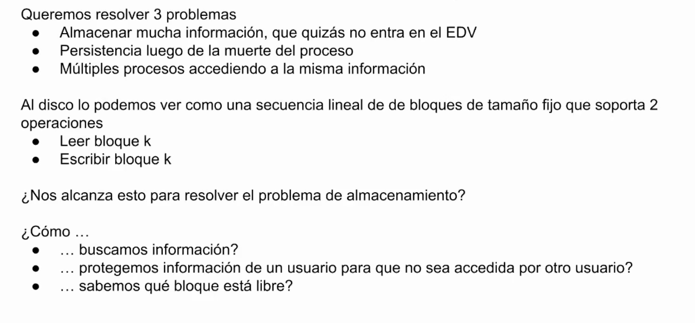

# File System

## Motivaciones

32 bits y queremos almacenar mas de 4G, no podemos no en EDV

## Abstracciones

un proceso es una abstracción del CPU. guardamos el snapshot

lo mismo pasa con la memoria virtual. 

# Implementación

# File System

## Asignación Continua

es una asignación vieja pero la mas simple. se usa en discos de pasta, bluerays, etc

la fragmentación externa puede pasar al borrar un archivo. en la imagen nos quedamos sin espacio para almacenar un archivo de 11 bloques aunque los tengamos (5 y 6).

## Asignación con listas enlazadas (en disco)

se resuelve la fragmentacion externa ya que se pueden enlazar los bloques 

no hay acceso random

## Asignación con listas enlazadas (en memoria)

## I-nodes (index-node)

# Casos de usos

## Basic Disc Layout

## SuperBlock

toda la metadata del file system esta en el superblock, si se corrompe se pierde el superblock

### Contenidos SuperBlock

el numero magico es el numero con el cual se identifica

gracias a esto se puede reconstruir luego de una particion mal hecha

## Inodos

mode, user id, groupd id

link count = referencias al nodo. el mismo archivo puede tener muchos nombres

access time → se suele de deshabilitar

creation time

modification time

### Data Blocks

## Inodo (3)

# Manejo de consistencia

# Problemas 

## primera mejora: BSD FFS

## ext4

los extents son grupos logicos de bloques continuos( mas grandes y mas faciles de manejar )

# Problemas de FS tradicionales

# ZFS

se puede curar a si mismo

---

<!-- notas-relacionadas:inicio -->

## Notas relacionadas

**Misma materia (SO)**

- [PIPELINES](PIPELINES.md) — todo es un archivo
- [SysCall](SysCall.md) — open, read, write

**Otras materias**

- **Arqui**  [Clase 4 Intro transmisión Digital](Clase%204%20Intro%20transmisión%20Digital.md) — el sistema de entrada y salida y el bus por donde viaja lo que el FS lee del disco
- **EDA**  [EDA - Árboles](EDA%20-%20Árboles.md) — el FS es un árbol de directorios
- **Protos**  [sendfile()](sendfile%28%29.md) — transferencia entre descriptores

<!-- notas-relacionadas:fin -->
