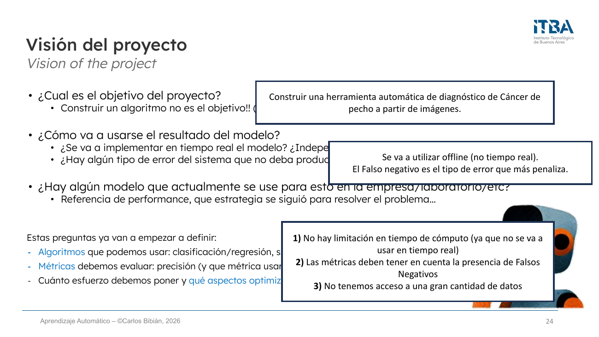
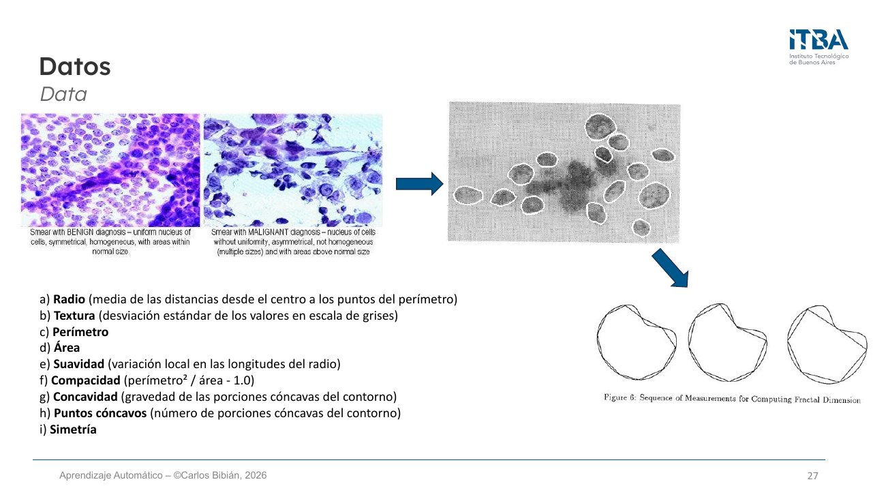
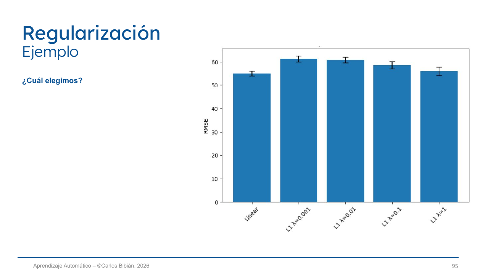
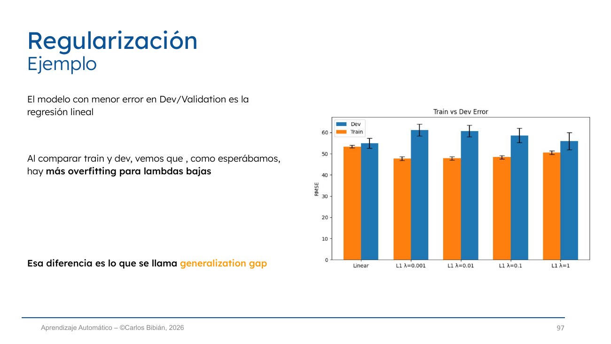

---
categories:
  - "[[ITBA.base|ITBA]]"
Tags: []
Created: 2026-08-1916:19
Materia: "[[Machine Learning.base|Machine Learning]]"
temas:
  - EDA (Análisis Exploratorio de Datos)
  - Escalado de variables (min-max, z-score)
  - Maldición de la dimensionalidad
  - Feature selection (filtros, wrappers, embedded)
  - Regularización (L1, L2, Elastic Net)
  - Métricas de regresión (RMSE, R²)
  - Overfitting a la validación
---

# Clase 3 - EDA, Feature selection, Regularización y Métricas

> [!abstract] Plan de la sesión
> 1. Problema - Datos - Features
> 2. EDA
> 3. Feature selection
> 4. Regularización
> 5. Métricas
>
> Viene de [Clase 2](ML%20Clase%202%20-%20Datos,%20variables,%20overfitting%20y%20métricas.md): tipos de variables, limpieza de datos, primer supervisado (regresión) y data splits.

## ¿Qué estamos estimando en realidad?

**Performance_validation** = **Performance_real** + **validation noise**

>[!ruido]
>Ese ruido proviene de varias fuentes, la principal es que los datos de validación son un subconjunto finito de los datos (también las características son sólo una parte de toda la información disponible para resolver el problema)

 el cross validation busca atenuar el ruido

Al elegir el modelo usando los datos de validación, evitamos seleccionar simplemente el modelo que mejor se ajustó a las particularidades —y al ruido— del conjunto de entrenamiento.

La validación nos permite pasar de mejor ajuste a los datos de entrenamiento a mejor generalización

### Entonces… ¿por qué separamos también un test?

Porque **la performance en validación también es una estimación ruidosa** de la performance real.

Si probamos muchos modelos y elegimos el que obtiene el mejor resultado en validación, tendemos a seleccionar no sólo un modelo bueno, sino **uno que además tuvo una estimación favorable por azar**.

> [!tip] Solución
> Tener un conjunto **nuevo (test)** para hacer una estimación fresca de cómo funciona el modelo ya elegido.

> [!example] Por qué esto importa (mismo diagrama, tres validation sets distintos)
> | | M1 | M2 | M3 | M4 | M5 |
> |---|---|---|---|---|---|
> | **Val A** | 0.67 | 0.72 | 0.69 | **0.77** | 0.74 |
> | **Val B** | 0.66 | 0.72 | 0.72 | 0.75 | **0.76** |
> | **Val C** | 0.65 | 0.70 | **0.76** | 0.74 | 0.73 |
>
> Con los mismos 5 modelos, cambiando sólo el conjunto de validación, **gana un modelo distinto cada vez**. Ese es exactamente el "validation noise". Los 5 modelos están dentro del ruido entre sí → elegir "el mejor" es en buena parte elegir al más afortunado.

## Recap ([Clase 2](ML%20Clase%202%20-%20Datos,%20variables,%20overfitting%20y%20métricas.md))

| Split | Para qué | Qué se decide ahí |
|---|---|---|
| **Train** | Aprender los **parámetros** del modelo | El modelo ajusta a los patrones de esos datos |
| **Validation / Dev** | Elegir todo el **pipeline** | Modelos, hiperparámetros, features… evitando elegir los que mejor ajustan las particularidades del train |
| **Test** | Estimar la **generalización** del pipeline final | Nada. Sólo se mide. Da un estimador insesgado sobre datos nuevos |

> [!warning] La frase que resume la clase
> **El modelo aprende del train. Nosotros aprendemos del validation.**
> Cada decisión que tomamos mirando el dev es una forma de "entrenar" sobre el dev.

[K-fold cross validation](ML%20Clase%202%20-%20Datos,%20variables,%20overfitting%20y%20métricas.md#6.5%20Cross%20Validation%20%28k-fold%29)

- Usa los datos de forma más eficiente: **cada observación se usa una vez para validación** y el resto de las veces para entrenar.
- Da una **estimación más estable**: en vez de depender de una única partición, promediamos sobre varios splits.
- Reduce la dependencia de un único validation split, que puede ser afortunado (o desafortunado).
- **k = 5 o 10** son los valores más usados y alcanzan.

# Proyecto de ML
## pipeline clasico de un proyecto 

clase de hoy -> EDA

> [!note] Los 11 pasos del diagrama
> 1. Definición del problema → 2. Recolección de datos → 3. **Data splitting** → 4. Limpieza de datos → 5. **EDA** → 6. **Feature engineering / selection** → 7. Modelado → 8. **Regularización** → 9. Evaluación (en Dev) → 10. Iteración/mejora → 11. Selección del modelo y evaluación final en Test.
>
> Los pasos 1-4 fueron la [clase anterior](ML%20Clase%202%20-%20Datos,%20variables,%20overfitting%20y%20métricas.md). Hoy: 5, 6, 8, 9. El **modelado (7)** es el módulo siguiente.
> Ojo con el orden: **el split (3) va ANTES de la limpieza y del EDA** → si no, hay data leakage.

## Visión del proyecto

Antes de tocar datos, tres preguntas:

- **¿Cuál es el objetivo del proyecto?** → construir un algoritmo **no** es el objetivo (casi nunca).
- **¿Cómo va a usarse el resultado del modelo?** ¿Tiempo real o no? ¿Independiente o parte de otro sistema? ¿Hay algún error que no deba producirse nunca?
- **¿Hay algún modelo que ya se use para esto?** → sirve de referencia de performance y de estrategia.

Estas preguntas ya definen:
- **Algoritmos** que podemos usar (clasificación/regresión, supervisado/no supervisado, DL o ML…)
- **Métricas** a evaluar (precisión y *cuál* métrica, tiempo de cómputo, complejidad del sistema)
- Cuánto esfuerzo poner y **qué aspectos optimizar**

> [!example] Ejemplo de la clase (Breast Cancer Wisconsin - Kaggle/UCI)
> - **Objetivo**: herramienta automática de diagnóstico de cáncer de mama a partir de imágenes.
> - **Uso**: offline (no tiempo real). El **falso negativo** es el error que más penaliza.
> - **Consecuencias**: 1) no hay limitación de tiempo de cómputo; 2) las métricas deben tener en cuenta los FN (→ **recall**, no accuracy); 3) no hay acceso a gran cantidad de datos.
>
> Este ejemplo es el que se usa en todos los gráficos de la clase (matriz de correlación, MI, ANOVA, RF importance).

## Datos
hay que entender como harias las cosas de forma manual
preguntar a expertos en el tema (multidisciplinar!)
¿Hay problemas similares ya resueltos?

Además:
- ¿Qué **capacidad de cómputo y almacenamiento** tenemos?
- ¿Tenemos ya los datos? → entender bien la estructura y **qué es cada característica**.

> [!important] Antes de seguir: crear el conjunto de test
> Separar el test **y no volver a mirarlo hasta el final del proyecto**.
> Típicamente **20%** aleatorio (a no ser que el dataset sea muy grande).

> [!example] Cómo un patólogo diagnostica (= de dónde salen las features)
> - **Uniformidad nuclear** — benigno: núcleos pequeños y uniformes / maligno: grandes e irregulares
> - **Mitosis** — benigno: rara o ausente / maligno: frecuente
> - **Contorno nuclear** — benigno: liso / maligno: irregular o dentado
>
> De ahí salen las 9 mediciones del dataset: radio, textura, perímetro, área, suavidad, compacidad, concavidad, puntos cóncavos y simetría (cada una con *mean*, *se* y *worst*).

> [!tip] Observación
> Preguntarle al experto **cómo lo resuelve a mano** es literalmente feature engineering gratis. Las features del dataset no aparecieron solas: son la formalización del criterio del patólogo.

# Análisis Exploratorio de Datos (EDA)
hace falta entender los datos que tenemos
EDA es el proceso siguiente y consiste en explorar y resumir un dataset

En la clase anterior vimos cómo transformar variables a valores numéricos y cómo limpiar datos erróneos o anómalos. Aunque hayamos participado en la creación del dataset, todavía necesitamos entender mejor su **estructura, patrones y posibles problemas**.

## Objetivos

El EDA consiste en **examinar y visualizar** los datos para comprender su estructura y patrones antes de entrenar modelos:

1. **Detectar problemas** en los datos (limpieza — clase anterior)
2. **Entender las variables** del dataset
3. **Descubrir relaciones** entre variables

## Distribución de las variables/características
 

- **Estadísticas descriptivas** (media, mediana, desvío, mín, máx) → primera comprensión.
- **Histogramas y boxplots** → entender la forma de la distribución y detectar outliers y valores erróneos.

ejemplo

esto no es continua sino discreta

> [!example] Ejemplo 1 — variable "peso" en un sistema de envío
> Parecía numérica continua, pero el histograma muestra picos en 5, 10, 20 y 50 → está **discretizada** por categoría de precio del envío.
> **Solución**: tratarla como numérica discreta → *one-hot encoding*, o crear una feature binaria (ej. `>15 kg`).

ejemplo 2

> [!example] Ejemplo 2 — visitas a una web por día
> Un pico enorme cerca de 0-10 y **otro pico en torno a 120/día** → probablemente **bots**: son **dos poblaciones distintas**.
>
> Hay que decidir si el modelo también debe modelar esa población:
> - **Si no** → sacarla del dataset.
> - **Si sí**, dos opciones:
>   - a) Darle esa info al sistema: crear variable `is_bot` (binaria, 1 si `nvisitas > 80`).
>   - b) Separar el dataset en dos y entrenar **dos modelos distintos**.
>
> Para decidir: ver la cantidad de datos y relevancia del segundo grupo, y **mirar el histograma de las otras variables por separado en cada población** para confirmar que realmente son distintas (en la clase, la duración de sesión de los bots es ~0 min vs. ~8 min de los humanos → confirmado).

> [!example] Ejemplo 3 — superficie de una propiedad
> Mismo patrón: un pico en valores bajos (0-200) y una campana en 600-1200 → dos poblaciones mezcladas (¿departamentos vs. casas? ¿unidades distintas: m² vs. pies²?). Mismo tratamiento que el ejemplo 2.

> [!tip] Patrón a recordar
> **Un histograma bimodal casi siempre significa "hay dos poblaciones acá"**, no "esta variable es rara". La pregunta correcta no es cómo transformarla, sino **qué mecanismo generó cada modo**.

## Escalado de variables

### Relevancia
  

Las variables numéricas pueden tener escalas muy diferentes:
- edad → 0-100
- ingresos → 0-100000
- número de compras → 0-50

El error de regresión será mucho mayor en las variables de mayor rango, y por lo tanto **el modelo priorizará reducir el error en esas variables**.

> [!important]
> Antes de comparar características o entrenar cualquier clasificador, es recomendable **siempre escalar las variables** para que todas estén en el mismo rango.

### min-max scaling

se acotan los valores en un rango fijo que hace que esten entre \[0, 1] para que tenga sentido

$$x' = \frac{x - x_{min}}{x_{max} - x_{min}}$$

Recomendado cuando:
- el rango [0,1] tiene sentido práctico
- redes neuronales (si la función de activación requiere ese rango: tanh, sigmoid…)

**Contra: muy sensible a outliers** (un solo valor extremo aplasta todo el resto contra 0).

### z-score normalization

restamos la media y dividimos por el desvio

$$x' = \frac{x - \mu}{\sigma}$$

- Se usa **por defecto** en la mayoría de los modelos.
- Mucho **menos sensible a outliers**.
- Si la variable es gaussiana: el 68, 95 y 99 % de los datos tendrán $z < 1, 2$ y $3$ respectivamente.

> [!warning] Data leakage al escalar
> $\mu$, $\sigma$, $x_{min}$ y $x_{max}$ se calculan **sólo sobre el train** y se aplican al dev/test. Si se calculan sobre todo el dataset, estás filtrando información del test al entrenamiento (ver [data leakage, Clase 2](ML%20Clase%202%20-%20Datos,%20variables,%20overfitting%20y%20métricas.md#9.%20Pipeline%20completo%20y%20data%20leakage)).

> [!note] Modelos que NO necesitan escalado
> Árboles de decisión y Random Forest: cortan por umbrales sobre cada variable por separado, así que la escala les da igual. Sí lo necesitan: KNN, SVM, regresión con regularización, redes neuronales, PCA — todo lo que use **distancias** o **penalice coeficientes**.

## Variables: Cuantas más… ¿mejor?

**No.**

no todas las variables aportan información nueva, agregar variables != agregar informacion
Aumentar la dimensionalidad hace el problema más complejo: hay más grados de libertad y más formas posibles de separar o ajustar los datos.
Si parte de esas features aporta poco valor, añadimos ruido que el modelo puede aprender en train.
Más dimensionalidad → mayor riesgo de overfitting.

> [!note] Dos fuentes frecuentes de complejidad innecesaria
> 1. **Variables poco informativas**: poca o nula relación con `y`.
> 2. **Variables redundantes**: contienen información muy similar entre sí.
>
> Son problemas distintos y se detectan con herramientas distintas: las poco informativas con la **relación con y**; las redundantes con la **relación entre x**.

### Siguientes pasos
1. Analizar si las características de nuestro dataset son **"buenas"** → relación con `y`
2. Analizar si todas esas variables son **necesarias** → relación entre `x`
3. *(Opcional)* Buscar **combinaciones** de variables que puedan ser útiles → feature engineering / projection

## Relación con la variable objetivo (y)

Esta manera ayuda a saber que informacion es buena para dejar/sacar variables

- En **regresión** → correlación de cada variable con `y`.
- En **clasificación** → boxplot/histograma de cada variable separado por clase. Si las cajas de las dos clases están **desplazadas entre sí**, esa variable discrimina; si se superponen del todo, no aporta.

## Relación entre variables (x)

se hace la correlacion entre dos variables

$$\rho_{X,Y} = \frac{\text{cov}(X,Y)}{\sigma_X \, \sigma_Y}$$

La correlación mide qué tan alineadas están las variaciones de dos variables: los cambios de una tienden a ir acompañados por cambios en la otra.

>[!warning]
la relacion de Pearson mira relaciones lineales, no siempre es relacion lineal

>[!warning]
>¡Correlación no implica causalidad!

> [!example] Correlaciones espurias (los ejemplos de la clase)
> - Ventas de helado ↔ ataques de tiburón (la causa común es el verano)
> - Ahogamientos en piletas ↔ películas de Nicolas Cage
> - Consumo de margarina per cápita ↔ tasa de divorcio en Maine (r = 0.993, p < 0.01)
>
> Un r altísimo con un p-value bajísimo **no dice nada** sobre causalidad. Para *predecir* alcanza con la correlación; para *intervenir* hace falta causalidad.

### Matriz de correlación

correlaciones muy altas indica que dos variables pueden tener alta relacion
ej: no aporta informacion agregar el radio y el parametro. con uno estamos

> [!note] En el ejemplo del dataset
> `radius_worst`, `perimeter_worst` y `area_worst` tienen correlaciones de **0.94-0.97** entre sí. Tiene sentido: el perímetro y el área de un círculo son funciones del radio. Con una de las tres alcanza — las otras dos son redundantes.

## So far...

Hasta acá analizamos:
- La distribución de las variables
- Outliers y valores anómalos o faltantes
- Posibles inconsistencias en los datos
- Relaciones entre variables

Y terminamos ajustando la escala de las variables cuando hace falta.

Con toda esta información, la siguiente pregunta es: **¿qué variables deberíamos usar en el modelo?**

# Selección de características
 forma mas serias de elegir caracteristicas
 no siempre es necesario hacerlo, pero se recomienda hacerlo

Tener un número elevado de variables (alta dimensionalidad) tiene efectos negativos:
- El modelo se vuelve **más lento y menos fiable**.
- Más features implica más ruido y por lo tanto **más datos necesarios**.
- **Más riesgo de overfitting.**

## La maldición de la dimensionalidad
cuantas mas dimenciones mas se complican las cosas, se esparcen mas

cuanto menor mejor

- A medida que aumenta el número de dimensiones, los datos se vuelven **más dispersos** (*sparse*).
- Cada región del espacio contiene **menos ejemplos**.
- Más dimensiones requieren **exponencialmente más datos** para mantener una densidad comparable.
- **Las distancias pierden poder discriminativo** → los métodos basados en vecinos o similitud (KNN, SVM con kernel RBF, clustering) funcionan peor.
- Consecuencia: **aumenta el riesgo de overfitting**, porque el modelo tiene más oportunidades de ajustar ruido o patrones accidentales.

## Dos estrategias para reducir la dimensionalidad

1. **Feature selection**
Elegir qué variables conservar 
	Conserva un subconjunto de las variables originales. 
	Puede apoyarse en importancia de variables, asociación con y o criterios estadísticos. 
2. **Feature Projection**
Crear nuevas variables
	Combina las variables originales en una representación más compacta. / Combines the original features into a more compact representation.
	Busca reducir dimensionalidad preservando la mayor cantidad posible de información relevante. Aims to reduce dimensionality while preserving as much relevant information as possible.

## Selección características - Métodos

| Método | Cómo funciona | Ejemplos |
|---|---|---|
| **Filtros** | Aplican métricas o criterios estadísticos **independientes del modelo**. Rápidos y fáciles, pero **no consideran interacciones** entre variables | Pearson, ANOVA F-test, Chi², Mutual Information |
| **Wrappers** | Evalúan **subsets** de variables entrenando un modelo y eligen el que maximiza la performance. Consideran interacciones, pero son **muy costosos** | Forward Selection, Backward Elimination, RFE |
| **Embedded** | Selección automática **dentro del entrenamiento** del modelo. Buen balance precisión/coste | Random Forest (feature importance), Lasso (L1), Elastic Net |

## Filtros de características
### Correlación de Pearson

cuanto mas cercano a 1 mejor
Tener en cuenta que ¡únicamente capta relaciones lineales!

Dos aplicaciones distintas en selección de features:
1. **Correlación con el target (y)** → si un feature está correlacionado con `y`, será más útil. *(Se queda con los de |r| alto.)*
2. **Correlación entre variables (x)** → si dos features están muy correlacionadas entre sí, se puede **eliminar una** porque aportan información muy similar. *(Se queda con una de cada grupo.)*

> [!tip] Observación
> Son criterios opuestos y hay que aplicar los dos: **alta correlación con y = bueno**, **alta correlación entre x = redundante**. Si sólo mirás el ranking contra `y`, te quedás con 5 variables que son básicamente la misma.

### Información Mutua - Mutual Information (MI)

Mide **cuánta información aporta un feature sobre la variable objetivo**: cuánta incertidumbre sobre `Y` reducimos por conocer `X`.

$$I(X;Y) = \sum_{y \in \mathcal{Y}} \sum_{x \in \mathcal{X}} P_{(X,Y)}(x,y) \, \log\left(\frac{P_{(X,Y)}(x,y)}{P_X(x) \, P_Y(y)}\right)$$

- **Ventaja: detecta relaciones no lineales** (a diferencia de Pearson). Sirve tanto en clasificación como en regresión.
- **Limitación: más costosa de calcular.**
- En scikit-learn: `mutual_info_classif` (clasificación) y `mutual_info_regression` (regresión).

> [!note] Interpretación
> $I(X;Y) = 0$ ⟺ X e Y son independientes. No está acotada a [0,1] como Pearson, así que se usa para **rankear** features, no como valor absoluto.

### ANOVA F-test

Compara la **varianza entre clases vs. la varianza dentro de cada clase**.

> Si la **varianza entre clases ≫ varianza dentro de clases**, el feature es relevante.

- Se usa en **clasificación**: features numéricos con target categórico.
- Asume **normalidad y varianzas similares**.
- Pasos: 1) calcular el estadístico F para cada feature vs. target; 2) conservar los de mayor F (o con p-value significativo).

### Chi² (Chi-cuadrado)
como la ANOVA pero sobre variables categoricas

Mide la **dependencia entre dos variables categóricas** (feature vs. target). Si hay alta dependencia, el feature es informativo.

- Uso: clasificación con **variables categóricas**.
- Se calcula el p-value de cada feature vs. target y se seleccionan los de **p-value menor a un umbral** (ej. 0.05).

> [!summary] Cuándo usar cada filtro
> | Filtro | Feature | Target | Capta no lineal |
> |---|---|---|---|
> | **Pearson** | numérico | numérico | ✗ |
> | **ANOVA F** | numérico | categórico | ✗ |
> | **Chi²** | categórico | categórico | — |
> | **Mutual Information** | cualquiera | cualquiera | ✓ |

## Selección características - Métodos

el foward selection es mas barata porque partimos de 0 (mas rapido)
si al agregar una caracteristica no mejora corto ahi

## Wrappers
### RFE (Recursive Feature Elimination)
la importancia de cada feature se puede medir con la performance

**Entrenar el modelo sucesivamente eliminando cada vez la feature menos importante** y evaluar el impacto en la clasificación. *(También se puede al revés, añadiendo de a una — Forward Selection.)*

Pasos:
1. Entrenar un modelo inicial (ej. regresión lineal o SVM)
2. Medir la importancia de cada feature\*
3. Eliminar la menos importante
4. Repetir hasta llegar al número deseado de variables o hasta que la performance baje

\* **¿Cómo medir la importancia?** → impacto en performance de añadirla, o el valor del coeficiente de esa feature en modelos lineales, o la reducción de impureza que aporta (DT o RF)…

En scikit-learn: `RFE` o `RFECV` (con validación cruzada para elegir el número óptimo de features).

## Embedded

Selección automática de variables **dentro del entrenamiento** del modelo:
- **Random Forest** → feature importance (reducción de impureza)
- **Lasso (L1)** → lleva coeficientes exactamente a 0 (ver [L1 (Lasso)](#L1%20%28Lasso%29) abajo)
- **Elastic Net**

## Wrappers vs Filtros

en 8 podriamos dejar de agregar variables. 
se mezclan los dos metodos

> [!note] Lo que muestra el gráfico
> Se rankean features con RF importance (**filtro/embedded, barato**) y después se entrena con los top-k (**wrapper, caro**) para ver dónde saturar. La accuracy sube hasta ~8 features y ahí se aplana: **con 8 de 30 variables se llega a la misma performance que con todas**.
>
> Además, al comparar RF vs SVM sobre los mismos top-k, **SVM está sistemáticamente por encima**: el subset óptimo de features depende del modelo. El ranking hecho con RF no es necesariamente el mejor ranking para SVM.

> [!tip] La estrategia práctica
> **Filtro para prefiltrar barato → wrapper para afinar sobre lo que quedó.** Correr un wrapper sobre 30 variables desde cero es carísimo; sobre las 15 que sobrevivieron al filtro, es viable.

## ¿y si todas las variables son relevantes?

Feature Selection nos quedamos con las variables originales más útiles (de 20 tests médicos, elegir los 5 más predictivos).

Pero… **¿qué pasa si todas las variables aportan algo?** Por ejemplo, en una imagen cada píxel tiene información, no podemos descartar alegremente.

En vez de elegir, hay que **transformar y combinar** las variables para generar un espacio más compacto perdiendo poca información.

→ Esto es **Feature Projection (Dimensionality Reduction)**. Se ve en el **Módulo 4** (PCA, etc.).

## Selección de características - Resumen

| Método | Cómo funciona | Ventajas | Desventajas | Ejemplos |
|---|---|---|---|---|
| **Filtro** | Evalúa cada feature de forma independiente del modelo (tests estadísticos, correlación) | Muy rápido, simple, escalable a alta dimensión | No captura interacciones entre features | Chi², Pearson, ANOVA F-test |
| **Wrapper** | Evalúa subsets de features entrenando un modelo repetidamente | Considera interacciones, suele mejorar performance | Muy costoso computacionalmente, no garantiza subset óptimo | Forward selection, Backward elimination, RFE |
| **Embedded** | El modelo decide durante el entrenamiento qué features conservar | Buen equilibrio precisión/coste, selección más "natural" | Depende del modelo elegido, puede sesgar | Random Forest importance, Lasso (L1), Elastic Net |

> [!warning] Regla de oro
> La selección de features es **parte del pipeline**, así que se hace **dentro del cross-validation**, usando sólo el train de cada fold. Seleccionar features mirando todo el dataset (incluido el dev) es data leakage y te infla la performance.

# Regularización
## Complejidad del modelo

Los modelos complejos pueden ajustarse demasiado a los datos de entrenamiento y **generalizar mal a datos nuevos**.

| | Modelo | Diagnóstico |
|---|---|---|
| $w_1x + b$ | recta | **underfitting** / alto sesgo (*high bias*) |
| $w_1x + w_2x^2 + b$ | parábola | **buen ajuste** |
| $w_1x + w_2x^2 + w_3x^3 + w_4x^4 + \dots + b$ | polinomio de grado alto | **overfitting** / alta varianza (*high variance*) |

**Objetivo: controlar la complejidad del modelo para que generalice mejor.**

## idea principal

En modelos lineales:

$$y = w_1x_1 + w_2x_2 + \dots + w_nx_n$$

La complejidad del modelo está relacionada con el **tamaño de los coeficientes $w$**.

> [!important]
> **Coeficientes muy grandes pueden indicar un modelo demasiado sensible a los datos.** Un $w$ enorme significa que una variación mínima en esa variable cambia mucho la predicción → el modelo está siguiendo el ruido.

### ¿Cómo?

Modificando la **función de coste** para penalizar coeficientes altos:

$$J(w) = \text{Error}(w) + \lambda \cdot \text{Penalización}(w)$$

- **Error(w)** mide el ajuste a los datos
- **λ** controla la **intensidad** de la regularización

Esto obliga al modelo a **equilibrar ajuste y simplicidad**.

### L1 (Lasso)

La penalización es la **suma de los valores absolutos** de los coeficientes:

$$J(w) = \text{Error}(w) + \lambda \sum_{j=1}^{p} |w_j|$$

- Favorece soluciones donde **$w = 0$** para algunas variables → modelos más **sparse**.
- Si $w = 0$, la variable **no se usa** → por eso Lasso es también un **método de selección de variables** (embedded).
- **λ** es un hiperparámetro: cuanto mayor, más se fuerza al modelo a tener coeficientes pequeños. Se elige **en validación**.

### L2 (Ridge)

La penalización es la **suma del cuadrado** de los coeficientes:

$$J(w) = \text{Error}(w) + \lambda \sum_{j=1}^{p} w_j^2$$

- Los coeficientes grandes reciben una **penalización mayor** (crece al cuadrado).
- **Empuja los coeficientes hacia valores pequeños, pero raramente los hace exactamente cero.**
- **Todas las variables siguen participando** en el modelo.

### Elastic Net

Combina ambos mediante **alpha**:

$$J(\mathbf{w}) = \text{Error}(\mathbf{w}) + \lambda \left[ \alpha \sum_j |w_j| + (1-\alpha) \sum_j w_j^2 \right]$$

- **λ** = la "fuerza" de la regularización
- **α** = el balance entre L1 y L2

L1 empuja algunos coeficientes exactamente a 0; L2 mantiene muchos coeficientes pequeños y estabiliza el modelo. Elastic Net intenta obtener las dos ventajas.

> [!summary] L1 vs L2 de un vistazo
> | | L1 (Lasso) | L2 (Ridge) |
> |---|---|---|
> | Penalización | $\sum \lvert w_j \rvert$ | $\sum w_j^2$ |
> | Coeficientes en 0 | **Sí** | Casi nunca |
> | Sirve como feature selection | **Sí** | No |
> | Con features correlacionadas | elige una y anula el resto (arbitrario) | reparte el peso entre todas |
> | Cuándo | muchas features, se sospecha que pocas importan | features correlacionadas, se quiere estabilidad |

> [!warning] La regularización exige escalado
> La penalización suma coeficientes de todas las variables por igual. Si una variable está en 0-100000 y otra en 0-1, sus $w$ no son comparables y la penalización castiga arbitrariamente a una de las dos. **Siempre escalar (z-score) antes de regularizar.**

## Ejemplo — ¿cómo elegir λ?

**Dataset**: Diabetes (Kaggle). Se separa el **20% para test**. Se entrena sobre el 80% con **5-fold cross-validation** y se usa **RMSE** como métrica.

Modelos a probar:
- regresión lineal
- regresión polinómica (grado 2) + L1, λ = 0.001
- regresión polinómica (grado 2) + L1, λ = 0.01
- regresión polinómica (grado 2) + L1, λ = 0.1
- regresión polinómica (grado 2) + L1, λ = 1

**¿Cuál elegimos?** El modelo con menor error en Dev/Validation → **la regresión lineal**.
**Validation RMSE (Linear): 53.853**

> [!question] ¿Cuál esperaría que tuviese más diferencia entre train y dev error?
> Las de **λ bajo** — casi no están regularizadas, así que ajustan mucho el train.

Al comparar train y dev vemos que, como esperábamos, hay **más overfitting para lambdas bajas**. Esa diferencia es lo que se llama [generalization gap](ML%20Clase%202%20-%20Datos,%20variables,%20overfitting%20y%20métricas.md#7.4%20Generalization%20gap).

> [!tip] Observación
> A medida que λ crece, el error de train **sube** (el modelo ajusta peor a propósito) y el gap con dev **se achica**. Regularizar es literalmente cambiar ajuste por generalización.
>
> Y ojo con el resultado: **el polinomio regularizado nunca le gana a la regresión lineal simple**. Regularizar un modelo demasiado complejo no lo vuelve mejor que un modelo bien elegido — el modelo simple sigue siendo la respuesta correcta acá.

# Métricas de evaluación

## Métricas para regresión
### Error de predicción y RMSE

El **error de predicción** mide la diferencia entre el valor predicho por el modelo y el valor real observado:

$$e_i = y_i - \hat{y}_i$$

El **Root Mean Squared Error** mide el promedio de los errores al cuadrado entre las predicciones y los valores reales:

$$RMSE = \sqrt{\frac{1}{n}\sum_{i=1}^{n}(y_i - \hat{y}_i)^2}$$

> [!note] Por qué RMSE y no MSE
> Al sacar la raíz, el RMSE queda **en las mismas unidades que `y`**, así que es interpretable directamente ("me equivoco en promedio 53.8 unidades de glucosa").
> Como eleva al cuadrado, **penaliza más los errores grandes** que el MAE ($\frac{1}{n}\sum|y_i - \hat y_i|$) → es más sensible a outliers.

### Coeficiente de determinación (R²)

El coeficiente **R²** mide **qué proporción de la variabilidad de la variable objetivo es explicada por el modelo**.

$$R^2 = 1 - \frac{\sum_i (y_i - \hat{y}_i)^2}{\sum_i (y_i - \bar{y})^2}$$

**Interpretación:**
- Valores cercanos a **1** → buen ajuste del modelo
- Valores cercanos a **0** → modelo poco informativo (no es mejor que predecir siempre la media)
- Puede ser **negativo** si el modelo es peor que predecir la media

> [!tip] RMSE vs R²
> **RMSE** es absoluto (depende de la escala de `y`) → sirve para **comparar modelos sobre el mismo dataset**.
> **R²** es relativo/adimensional → sirve para **comparar entre datasets** o comunicar "cuánto explica" el modelo.

# Ejemplo final

> [!question] El caso
> Un equipo prueba **200 configuraciones distintas** sobre el mismo validation set. Elige la mejor:
> **Train: 96 % · Validation: 91 % · Test: 84 %**
> ¿Qué ha podido pasar?

**Al elegir el mejor resultado entre muchas estimaciones ruidosas, tendemos a seleccionar también una configuración que tuvo ruido favorable.**

Hay dos overfittings encadenados acá:
- Train 96 % → Val 91 %: overfitting **al train** (normal, esperable).
- Val 91 % → Test 84 %: overfitting **al validation set**, causado por las 200 pruebas. El 91 % ya no era una estimación honesta.

> [!important]
> **El modelo aprende del train. Nosotros aprendemos del validation.**
> *The model learns from the train set. We learn from the validation set.*

## Cómo reducimos el overfitting a la validación (Avanzado)

- **Cross-validation** → reduce la dependencia de un único validation split.
- **Limitar búsquedas ad hoc** → cuantas más decisiones tomamos mirando validation, mayor riesgo de adaptarnos a él. *(200 configuraciones es demasiado.)*
- **Mantener otro test set intacto** (*holdout / shallow test set*) → se usa sólo al final para estimar la generalización del pipeline elegido. Puede usarse unas pocas veces.
- **Nested cross-validation** → para selección intensiva de modelos o datasets pequeños: **CV interna** para elegir y **CV externa** para evaluar.

> [!tip] Regla mental
> Cada vez que mirás el dev y tomás una decisión, "gastás" un poco de su capacidad de estimar. Con 200 miradas, el dev se convirtió de hecho en un segundo train set.

# Cierre — dónde estamos en el pipeline

Cubrimos los pasos **5 (EDA)**, **6 (Feature selection)**, **8 (Regularización)** y **9 (Evaluación en Dev)**.

**Siguiente módulo → paso 7: Modelado** (los clasificadores propiamente dichos).

> [!summary] Resumen de la clase en 6 líneas
> 1. La performance en validación es **performance real + ruido**; por eso hace falta un test intacto.
> 2. **EDA** = entender distribuciones, outliers, relación con `y` y relación entre `x`, antes de modelar.
> 3. **Escalar siempre** (z-score por defecto), calculando los parámetros sólo sobre el train.
> 4. Más variables ≠ más información: **maldición de la dimensionalidad** → filtros / wrappers / embedded.
> 5. **Regularizar** = penalizar coeficientes grandes. L1 hace selección (sparse), L2 estabiliza, Elastic Net mezcla.
> 6. **El modelo aprende del train, nosotros del validation** → limitar cuántas veces miramos el dev.

---

<!-- notas-relacionadas:inicio -->

## Notas relacionadas

**Misma materia (Machine Learning)**

- [ML Clase 4 - Regresión Logística y Métricas de Evaluación](ML%20Clase%204%20-%20Regresión%20Logística%20y%20Métricas%20de%20Evaluación.md) — clase siguiente: arranca el paso de Modelado con el primer clasificador, y cambia de métricas de regresión (RMSE, R²) a métricas de clasificación
- [ML TP1 - Insurance](ML%20TP1%20-%20Insurance.md) — el TP1 aplica esta clase en código: el EDA, el escalado z-score y la regularización L1 salen de acá
- [ML Clase 2 - Datos, variables, overfitting y métricas](ML%20Clase%202%20-%20Datos,%20variables,%20overfitting%20y%20métricas.md) — clase anterior: de ahí vienen los data splits, el k-fold, el generalization gap y la limpieza de datos que el EDA continúa
- [ML Clase 1 - Machine Learning Intro](ML%20Clase%201%20-%20Machine%20Learning%20Intro.md) — el encuadre general de supervisado/no supervisado que define qué métricas aplican
- [Terminologia ML](Terminologia%20ML.md) — parámetros vs. hiperparámetros y qué es el pipeline: λ y k de feature selection son hiperparámetros, se eligen en validación
- [Materia - Machine Learning](Materia%20-%20Machine%20Learning.md) — índice de la materia; Feature Projection (PCA) queda para el Módulo 4

**Otras materias**

- **MNA** — [Resumen MNA](Resumen%20MNA.md) — cuadrados mínimos y ecuaciones normales ($A^\top A x = A^\top b$): Ridge (L2) es exactamente ese sistema con $\lambda I$ sumado para estabilizarlo. La SVD de ahí es la base del PCA del Módulo 4
<!-- notas-relacionadas:fin -->
