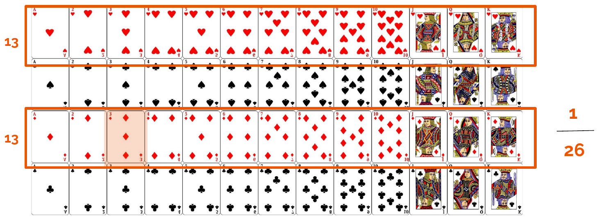
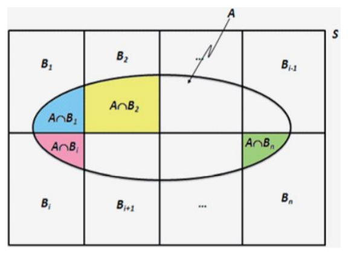
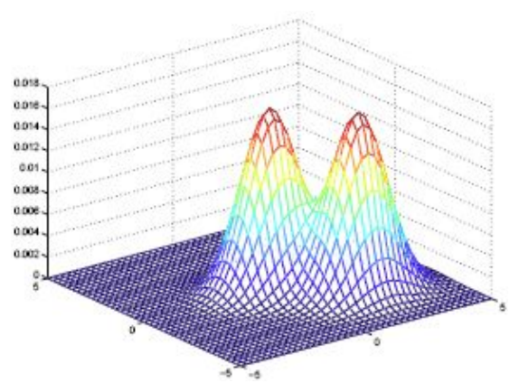
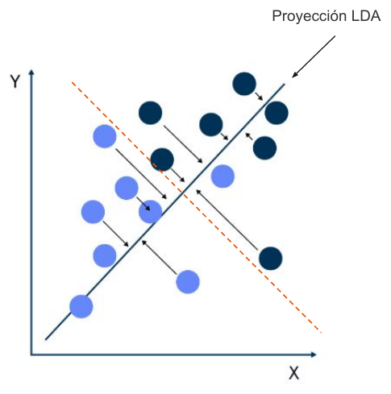
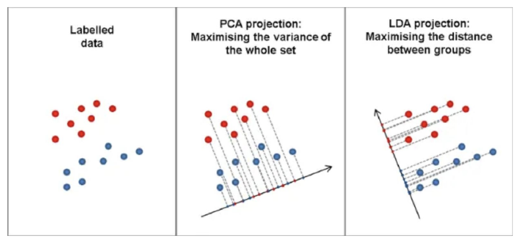
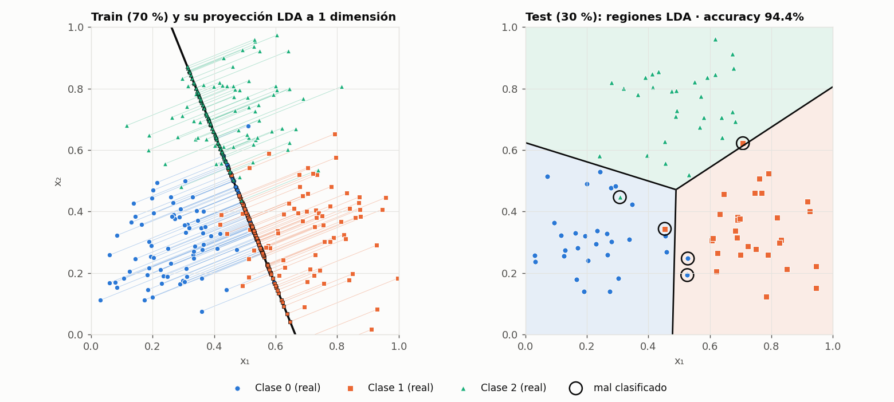
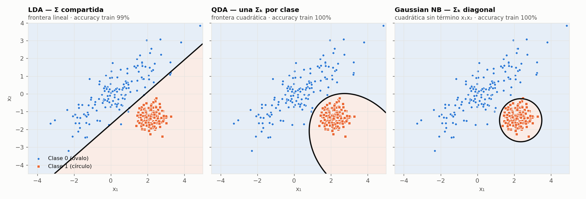

---
categories:
  - "[[ITBA.base|ITBA]]"
Tags: []
Created: 2026-09-1111:21
Materia: "[[Machine Learning.base|Machine Learning]]"
temas:
  - Modelos generativos vs discriminativos
  - Probabilidad conjunta y condicional
  - Independencia e independencia condicional
  - Teorema de probabilidad total
  - Teorema de Bayes (prior, verosimilitud, evidencia, posterior)
  - Maximum a Posteriori (MAP)
  - Máxima verosimilitud (ML)
  - Gaussiana multivariada y matriz de covarianza
  - Distancia de Mahalanobis
  - LDA (Linear Discriminant Analysis)
  - Función discriminante lineal
  - Criterio de Fisher
  - LDA vs PCA
  - QDA (Quadratic Discriminant Analysis)
  - GDA (Gaussian Discriminant Analysis)
  - Gaussian Naive Bayes
  - Naive Bayes categórico
  - Naive Bayes multinomial (spam)
  - Corrección de Laplace
---

# Clase 6 - GDA y Naive Bayes

> [!abstract] Plan de la sesión
> 1. Repaso de probabilidades y modelos generativos
> 2. Inferencia Bayesiana (MAP vs. ML)
> 3. LDA (protagonista), QDA y GDA
> 4. Naive Bayes
>
> Viene de [Clase 4](ML%20Clase%204%20-%20Regresión%20Logística%20y%20Métricas%20de%20Evaluación.md): según la slide, la sesión anterior fue regresión logística.

> [!info] Cómo está armada esta nota
> No había apunte propio de esta clase: todo sale del PDF de la cátedra (versión *WIP*, 50 slides). Los números de slide que cito son las **páginas del PDF**. Los ejercicios que la cátedra deja como "Resolverlo" están resueltos acá, y todas las cuentas están verificadas con python. Las dos figuras marcadas como *(figura propia)* no están en las slides: las generé para mostrar cosas que la clase dice pero no dibuja.

---

## 1. Modelos discriminativos vs. generativos

**¿Cómo aprendemos a clasificar?** Hay dos maneras de llegar a $P(y \mid x)$:

| | Discriminativo | Generativo |
| --- | --- | --- |
| Ejemplo | Regresión logística ([Clase 4](ML%20Clase%204%20-%20Regresión%20Logística%20y%20Métricas%20de%20Evaluación.md)) | GDA (LDA, QDA), Naive Bayes |
| Qué aprende | el **límite de decisión** (la frontera) | **cómo se distribuye cada clase** por separado |
| Qué modela | $P(y \mid x)$ directamente — ej. $P(\text{gato} \mid x) = 0.35$ | $P(x \mid y)$ (la **verosimilitud**) y $P(y)$ (el **prior**) |
| ¿Puede generar datos nuevos? | No | Sí: si sé cómo se distribuye la clase, puedo muestrear de ahí |

El generativo llega a la predicción "dando la vuelta" por Bayes:

$$
P(y \mid x) = \frac{P(x \mid y)\,P(y)}{P(x)}
$$

> [!observacion] Discriminativo y generativo pueden terminar en la misma frontera
> Más adelante sale que LDA (generativo) da una frontera **lineal**, igual que la regresión logística. No es casualidad: si cada clase es gaussiana con la misma $\Sigma$, el posterior $P(y=1 \mid x)$ que sale de Bayes es **exactamente una sigmoide** de una función lineal de $x$ (lo verifiqué numéricamente; está demostrado en las notas de CS229 de Andrew Ng).
>
> La diferencia está en **cómo se ajustan** los parámetros: la logística busca $w, b$ directamente maximizando $P(y \mid x)$; LDA estima medias, covarianza y priors, y los enchufa en Bayes. Según CS229, el generativo asume más (gaussianidad), así que necesita **menos datos** cuando el supuesto se cumple; si el supuesto falla, la logística es **más robusta** porque no asume nada sobre cómo se distribuye $x$.

---

## 2. Repaso de probabilidad

### Espacio muestral, eventos y frecuencia relativa
- **Espacio muestral** $S$: conjunto de todos los resultados posibles de un experimento.
- **Suceso / evento**: cualquier subconjunto del espacio muestral.
- **Frecuencia relativa**: si repetimos $n$ veces el experimento (en forma independiente y bajo las mismas condiciones) y el suceso $A$ ocurre $n_A$ veces,

$$
f_A = \frac{n_A}{n}
$$

Ejemplo de la clase: 200 tiradas de una moneda → 106 caras ($f = 0.53$) y 94 cecas ($f = 0.47$), contra la probabilidad real de $0.5$ y $0.5$.

> [!observacion] Por qué importa para esta clase
> La frecuencia relativa se acerca a la probabilidad a medida que crece $n$. Eso es **exactamente** lo que hace Naive Bayes al entrenar: estima cada $P(a_i \mid v_j)$ contando frecuencias en el dataset. Y el caso $n_A = 0$ ("nunca lo vi" → probabilidad 0) es el problema que arregla la corrección de Laplace (§8).

### Probabilidad conjunta
¿Probabilidad de que salgan dos caras al tirar dos monedas? Hay 4 resultados equiprobables (CC, CX, XC, XX) y uno solo favorable:

$$
P(H \cap H) = 0.25 \qquad\qquad P(A \cap B) = P(B \cap A) \;\;\text{(es conmutativa)}
$$

### Independencia
- $A$ y $B$ son **independientes** si $P(A \cap B) = P(A)\,P(B)$. (Las dos caras: $0.5 \cdot 0.5 = 0.25$.)
- Si $A$ y $B$ son independientes, $A$ y $B^c$ también lo son.
- Si $A$ y $B$ son **mutuamente excluyentes** ($A \cap B = \varnothing$), **no** son independientes.

> [!note] Letra chica de la última propiedad
> Vale cuando $P(A) > 0$ y $P(B) > 0$: ahí $P(A \cap B) = 0 \neq P(A)\,P(B)$. Intuición: si son excluyentes, saber que pasó $A$ te dice **todo** sobre $B$ (que no pasó), que es lo opuesto a ser independientes.

### Probabilidad condicional
La probabilidad de que ocurra un evento **dado que** otro ya ocurrió:

$$
P(A \mid B) = \frac{P(A \cap B)}{P(B)}
$$

Ejemplo: ¿probabilidad de sacar el 3 de diamantes **dado que** salió una carta roja?



$$
P(3\diamondsuit) = \frac{1}{52}, \qquad P(R) = \frac{26}{52} = \frac12 \qquad\Rightarrow\qquad P(3\diamondsuit \mid R) = \frac{1/52}{1/2} = \frac{1}{26}
$$

> [!observacion] Condicionar = achicar el espacio muestral
> Saber que la carta es roja descarta las 26 negras: el universo pasa de 52 cartas a 26 y el 3♦ es 1 de esas 26. En la cuenta se usa $P(3\diamondsuit \cap R) = P(3\diamondsuit)$ porque el 3♦ **ya es rojo**: la intersección no saca nada.

### Teorema de probabilidad total
Si $B_1, \dots, B_n$ es una **partición** de $S$ y $A$ es otro evento en $S$:

$$
P(A) = \sum_{i=1}^{n} P(A \cap B_i) = \sum_{i=1}^{n} P(B_i)\,P(A \mid B_i)
$$



El evento $A$ (el óvalo) queda repartido en pedazos $A \cap B_i$ que no se pisan; sumarlos da $A$ entero. La segunda forma reescribe cada pedazo con la probabilidad condicional.

### Teorema de Bayes
Thomas Bayes fue un matemático inglés (nació en Londres hacia 1701–1702 y murió en Tunbridge Wells, Kent, en 1761). Sean $A$ y $B$ dos eventos en $S$:

$$
P(A \mid B) = \frac{P(A)\,P(B \mid A)}{P(B)}
$$

> [!bug] Slide 13: fecha de muerte
> La slide dice que murió el **17** de abril de 1761. Según Wikipedia (que se basa en la lápida), fue el **7 de abril de 1761**. El año de nacimiento tampoco es seguro: la lápida dice que murió a los 59, así que nació en 1701 o 1702 (la slide pone 1702 como si fuera exacto).

Leído en clave de aprendizaje, con una hipótesis $h$ y datos $D$:

$$
\underbrace{P(h \mid D)}_{\text{posterior}} \;=\; \frac{\overbrace{P(h)}^{\text{prior}}\;\overbrace{P(D \mid h)}^{\text{verosimilitud}}}{\underbrace{P(D)}_{\text{evidencia}}}
$$

| Término | Qué es | Pregunta que responde |
| --- | --- | --- |
| **Prior** $P(h)$ | lo que creo antes de ver los datos | ¿qué tan común es $h$ en general? |
| **Verosimilitud** $P(D \mid h)$ | qué tan bien explica $h$ los datos | si $h$ fuera cierta, ¿qué tan probable sería ver $D$? |
| **Evidencia** $P(D)$ | probabilidad de los datos sumando sobre todas las hipótesis | normaliza; por probabilidad total, $P(D) = \sum_i P(D \mid h_i)\,P(h_i)$ |
| **Posterior** $P(h \mid D)$ | lo que creo **después** de ver los datos | ¿qué tan probable es $h$ ahora? |

El razonamiento bayesiano da un enfoque probabilístico para hacer inferencias. Los algoritmos basados en él compiten con árboles de decisión y redes neuronales, y en algunas aplicaciones hasta les ganan (Michie et al., citado en la slide 14).

---

## 3. Inferencia bayesiana: MAP vs. ML

**Buscamos la mejor hipótesis.** Dado un conjunto de hipótesis $H = \{h_1, \dots, h_n\}$ y un conjunto de entrenamiento $D$, un camino es quedarse con la hipótesis **más probable**, y el teorema de Bayes da la forma de calcular esas probabilidades.

### Maximum a Posteriori (MAP)
Maximizar la probabilidad a posteriori de las hipótesis, dado el conjunto de entrenamiento:

$$
h_{MAP} = \underset{h \in H}{\arg\max}\; P(h \mid D) = \underset{h \in H}{\arg\max}\; \frac{P(D \mid h)\,P(h)}{P(D)} = \underset{h \in H}{\arg\max}\; P(D \mid h)\,P(h)
$$

$P(D)$ se va porque **no depende de $h$**: es la misma constante para todas las hipótesis, así que no cambia cuál gana.

### Máxima verosimilitud (ML, *Maximum Likelihood*)
Si todas las hipótesis son **equiprobables** ($P(h_i) = P(h_j)\ \forall i, j$), el prior también es una constante y se va:

$$
h_{ML} = \underset{h \in H}{\arg\max}\; P(D \mid h)
$$

Cuando las hipótesis son equiprobables, $h_{MAP} = h_{ML}$.

> [!bug] Slide 19: $H$ no es el conjunto de entrenamiento
> La slide dice "si todas las hipótesis en el **conjunto de entrenamiento H** son equiprobables". $H$ es el **conjunto de hipótesis**; el de entrenamiento es $D$, como lo define la misma cátedra en la slide 17.

| | MAP | ML |
| --- | --- | --- |
| Maximiza | $P(D \mid h)\,P(h)$ | $P(D \mid h)$ |
| ¿Usa el prior? | Sí | No (lo asume uniforme) |
| ¿Cuándo coinciden? | cuando el prior es uniforme | cuando el prior es uniforme |

> [!question] Concept check (slide 20): el poder del prior
> Tenés un detector de metales en la playa que suena. Tanto una lata como un tesoro lo hacen sonar: $P(\text{sonido} \mid \text{lata}) \approx P(\text{sonido} \mid \text{tesoro}) \approx 1$. **¿Por qué, a pesar del sonido, es mucho más probable haber encontrado una lata que un tesoro pirata?**
>
> > [!success]- Respuesta
> > Porque las verosimilitudes son iguales, así que el sonido **no discrimina** entre las dos hipótesis. El cociente de posteriors queda igual al cociente de priors:
> > $$\frac{P(\text{lata} \mid \text{sonido})}{P(\text{tesoro} \mid \text{sonido})} = \frac{P(\text{sonido} \mid \text{lata})\,P(\text{lata})}{P(\text{sonido} \mid \text{tesoro})\,P(\text{tesoro})} \approx \frac{P(\text{lata})}{P(\text{tesoro})}$$
> > y en una playa hay muchísimas más latas que tesoros. **ML** queda empatado (no puede decidir); **MAP** elige lata gracias al prior. Es la balanza de la slide: prior de un lado, verosimilitud del otro.

> [!tip] De hipótesis a clases
> En clasificación, la "hipótesis" es la **clase**: $\hat y = \underset{k}{\arg\max}\; P(x \mid C_k)\,P(C_k)$. Todo lo que sigue (LDA, QDA, Naive Bayes) usa esta misma regla; lo único que cambia es **cómo se modela** $P(x \mid C_k)$.

---

## 4. ¿Cómo estimamos $P(x \mid C_k)$? La campana de Gauss

Para atributos **continuos**, se modela $P(x \mid y)$ como la densidad de cada clase asumiendo **distribución normal**, con una campana de Gauss en varias dimensiones. Para definir la campana de la clase $k$ hay que estimar dos cosas:

- **Media $\mu_k$**: dónde está centrado el grupo; el punto de máxima densidad.
- **Covarianza $\Sigma_k$**: la forma, el estiramiento y la orientación de la nube de puntos.

$$
f(x) = \frac{1}{(2\pi)^{d/2}\,\lvert\Sigma\rvert^{1/2}} \exp\!\left(-\frac12\,(x-\mu)^\top \Sigma^{-1} (x-\mu)\right)
$$

donde $d$ es la cantidad de atributos (la slide 22 lo llama $n$).

Los estimadores de máxima verosimilitud no están en las slides, pero son los que usa cualquier implementación. Con $n_k$ ejemplos en la clase $k$ y $n$ en total:

$$
\hat P(C_k) = \frac{n_k}{n} \qquad\quad \hat\mu_k = \frac{1}{n_k}\sum_{i:\,y_i = k} x_i \qquad\quad \hat\Sigma_k = \frac{1}{n_k}\sum_{i:\,y_i=k} (x_i - \hat\mu_k)(x_i - \hat\mu_k)^\top
$$

> [!observacion] Qué mide el exponente
> $(x-\mu)^\top\Sigma^{-1}(x-\mu)$ es la **distancia de Mahalanobis** al cuadrado: qué tan lejos está $x$ del centro, medido en "unidades de la nube". Dos puntos a la misma distancia euclídea del centro no están igual de lejos: el que está en la dirección en la que la nube es angosta es más "raro" que el que está en la dirección en la que la nube es ancha.
>
> En la diagonal de $\Sigma$ están las varianzas de cada atributo; fuera de la diagonal, las covarianzas (cuánto se inclina la nube). Esa distinción es justamente lo que separa a LDA, QDA y Naive Bayes (§7).

---

## 5. LDA: Análisis Discriminante Lineal (el protagonista)

### Supuestos
1. **Distribución normal por clase**: $P(x \mid C_k) = \mathcal N(\mu_k, \Sigma)$.
2. **La misma matriz de covarianza (dispersión) para todas las clases**: cada clase tiene su propio centro $\mu_k$, pero todas comparten la forma $\Sigma$.



Dos gaussianas con la **misma forma**, solo desplazadas: eso es lo que asume LDA.

### Deducción de la función discriminante

**Paso 1: Bayes en logaritmos.** Como $P(x)$ no depende de la clase, alcanza con comparar

$$
\text{Score}(k) = \ln P(x \mid C_k) + \ln P(C_k)
$$

El logaritmo es creciente, así que **no cambia el argmax**, y además se come la exponencial de la gaussiana.

**Paso 2: reemplazamos $P(x \mid C_k)$ por la gaussiana multivariada** (con la $\Sigma$ compartida):

$$
\text{Score}(k) = -\frac d2 \ln(2\pi) - \frac12 \ln\lvert\Sigma\rvert - \frac12 (x-\mu_k)^\top \Sigma^{-1} (x-\mu_k) + \ln P(C_k)
$$

**Paso 3: expandimos el término cuadrático** (como $\Sigma^{-1}$ es simétrica, $x^\top\Sigma^{-1}\mu_k = \mu_k^\top\Sigma^{-1}x$ y los dos cruzados se juntan):

$$
\text{Score}(k) = \underbrace{-\frac12\, x^\top \Sigma^{-1} x}_{\text{cuadrático en } x} \;+\; \underbrace{x^\top \Sigma^{-1} \mu_k}_{\text{lineal en } x} \;\underbrace{-\; \frac12\, \mu_k^\top \Sigma^{-1} \mu_k + \ln P(C_k)}_{\text{no depende de } x} \;+\; \text{cte}
$$

**Paso 4: la "cancelación mágica".** Para decidir entre dos clases miramos si $\text{Score}(1) - \text{Score}(0) > 0$. El término $-\frac12 x^\top\Sigma^{-1}x$ es **idéntico en las dos clases** porque $\Sigma$ es compartida: al restar se cancela y **desaparece el $x^2$**. Quedan solo términos lineales en $x$ y constantes. (Si cada clase tuviera su propia $\Sigma_k$, como en QDA, no se cancelaría.)

**Resultado: la función discriminante lineal**

$$
\delta_k(x) = x^\top \left(\Sigma^{-1}\mu_k\right) - \frac12\, \mu_k^\top \Sigma^{-1}\mu_k + \ln P(C_k) \;=\; w_k^\top x + b_k
$$

Se predice la clase con mayor $\delta_k(x)$. Es una ecuación de primer grado: la frontera entre dos clases ($\delta_1 = \delta_0$) es un **hiperplano** (en 2D, una recta), y su normal es

$$
w \;\propto\; \Sigma^{-1}(\mu_1 - \mu_0)
$$

> [!check] Verificado con python
> Con medias, $\Sigma$ y priors al azar: $\text{Score}(1)-\text{Score}(0)$ calculado con la densidad gaussiana completa coincide con $\delta_1(x)-\delta_0(x)$; la expansión del paso 3 da lo mismo que la forma sin expandir; y la dirección `coef_` que devuelve `sklearn` es la misma que $\hat\Sigma^{-1}(\hat\mu_1-\hat\mu_0)$ (coseno = 1).

> [!observacion] Qué hace cada pieza
> - **$w$ decide la orientación** de la frontera: depende de las medias y de $\Sigma$, no del prior.
> - **El prior solo la corre en paralelo**: $\ln P(C_k)$ está en $b_k$. Si una clase es más común, la frontera se aleja de ella (le "cede" más territorio).
> - Sin el $\ln P(C_k)$, LDA es **"asignar al centro más cercano en distancia de Mahalanobis"**: $\delta_k(x)$ es $-\frac12 d_M^2(x,\mu_k)$ más un término que es igual para todas las clases.

> [!observacion] Conexión con la Clase 4: el posterior de LDA es una sigmoide
> Para dos clases,
> $$P(C_1 \mid x) = \frac{1}{1 + e^{-(w^\top x + b)}}, \qquad w = \Sigma^{-1}(\mu_1-\mu_0), \qquad b = -\tfrac12\mu_1^\top\Sigma^{-1}\mu_1 + \tfrac12\mu_0^\top\Sigma^{-1}\mu_0 + \ln\tfrac{P(C_1)}{P(C_0)}$$
> Es **la misma forma** que la regresión logística de la [Clase 4](ML%20Clase%204%20-%20Regresión%20Logística%20y%20Métricas%20de%20Evaluación.md) (verificado numéricamente). Lo que cambia es de dónde salen $w$ y $b$: acá se calculan con medias y covarianza; allá se optimizan directamente.

### La mejor separación lineal: criterio de Fisher
Hay otra forma de llegar a la misma dirección, sin hablar de gaussianas: buscar la recta sobre la que, al **proyectar** los puntos, las clases queden lo más separadas posible. LDA maximiza la **distancia entre los centros relativa a cuán apretada está cada clase**:

$$
J(w) = \frac{\left(w^\top(\mu_1 - \mu_0)\right)^2}{w^\top S_W\, w} \qquad\Longrightarrow\qquad w^* \propto S_W^{-1}(\mu_1-\mu_0)
$$

$S_W$ es la dispersión *dentro* de las clases (la $\Sigma$ compartida). Numerador grande: los centros proyectados quedan lejos. Denominador chico: cada clase proyectada queda compacta. Sale la **misma dirección** que por Bayes.



Cada punto se proyecta sobre la recta azul (la dirección $w$); la línea punteada naranja, perpendicular a ella, es la frontera de decisión.

**Reducción de dimensionalidad.** Como proyecta sobre direcciones que separan clases, LDA también sirve para bajar dimensiones: con $K$ clases da **como máximo $K-1$ ejes** (verificado con `sklearn`: con 3 clases y 5 atributos, `transform` devuelve 2 columnas).

### LDA vs. PCA



| | PCA | LDA |
| --- | --- | --- |
| Tipo | **no supervisado**: ignora las etiquetas | **supervisado**: usa las etiquetas |
| Qué maximiza | la **varianza** de todo el conjunto | la **separación entre clases** (Fisher) |
| Cantidad de ejes | hasta $d$ | hasta $K - 1$ |
| En la figura | eje poco inclinado: rojos y azules proyectados quedan **superpuestos** | eje casi vertical: rojos arriba y azules abajo, **separados** |

> [!observacion] La dirección de más varianza no tiene por qué ser la que separa
> PCA elige la dirección en la que la nube **completa** está más estirada, sin mirar colores; proyectados sobre ella, rojos y azules se pisan. LDA elige una dirección con menos varianza total pero que es la que distingue rojo de azul. PCA es la *feature projection* que la [Clase 3](ML%20Clase%203%20-%20EDA,%20Feature%20selection,%20Regularización%20y%20Métricas.md) dejó para el Módulo 4.

### Ejercicio (slide 29), resuelto
> Generar un conjunto de puntos en $[0,1]\times[0,1]$ con 3 clases. Dividirlo en 70 % entrenamiento y 30 % test. Visualizar los puntos con las clases en colores. Mostrar la transformación con LDA (a una dimensión) sobre el mismo gráfico. Predecir el 30 % de test con LDA y mostrar los resultados.

```python
import numpy as np
import matplotlib.pyplot as plt
from sklearn.discriminant_analysis import LinearDiscriminantAnalysis
from sklearn.model_selection import train_test_split
from sklearn.metrics import accuracy_score, confusion_matrix

# 1. Datos: 3 nubes gaussianas recortadas al cuadrado [0,1]x[0,1]
rng = np.random.default_rng(42)
centros = np.array([[0.25, 0.30], [0.72, 0.35], [0.50, 0.75]])

def muestra(c, n, sd=0.13):
    pts = []
    while len(pts) < n:                      # rechazo: solo puntos dentro de [0,1]^2
        p = rng.normal(c, sd)
        if ((0 <= p) & (p <= 1)).all():
            pts.append(p)
    return np.array(pts)

X = np.vstack([muestra(c, 100) for c in centros])
y = np.repeat([0, 1, 2], 100)

# 2. Split 70/30 (estratificado para que las 3 clases queden balanceadas)
X_tr, X_te, y_tr, y_te = train_test_split(X, y, test_size=0.3, random_state=42, stratify=y)

# 3-4. LDA: ajuste + transformación a 1 dimensión
lda = LinearDiscriminantAnalysis(n_components=1).fit(X_tr, y_tr)
z_tr = lda.transform(X_tr)                   # shape (210, 1): la proyección 1D
w = lda.scalings_[:, 0]                      # dirección del eje LDA 1

# 5. Predicción sobre el 30 % de test
pred = lda.predict(X_te)
print("accuracy:", accuracy_score(y_te, pred))
print(confusion_matrix(y_te, pred))

# Gráfico: puntos + eje LDA dibujado sobre el mismo plano
u, m = w / np.linalg.norm(w), X_tr.mean(axis=0)
t = np.linspace(-0.75, 0.75, 2)
plt.scatter(*X_tr.T, c=y_tr, cmap="brg", s=15)
plt.plot(*(m + t[:, None] * u).T, "k-", lw=2, label="eje LDA 1")
proy = m + ((X_tr - m) @ u)[:, None] * u     # pie de la proyección de cada punto
plt.scatter(*proy.T, c=y_tr, cmap="brg", s=8, marker="x")
plt.xlim(0, 1); plt.ylim(0, 1); plt.gca().set_aspect("equal"); plt.legend(); plt.show()
```


*(figura propia: mismos datos y misma semilla que el código, con estilo más prolijo)*

Resultados sobre el test (90 puntos): **accuracy 94.4 %** (85 de 90).

| real ↓ / predicho → | 0 | 1 | 2 |
| --- | --- | --- | --- |
| **0** | 28 | 2 | 0 |
| **1** | 1 | 28 | 1 |
| **2** | 1 | 0 | 29 |

> [!observacion] Lo que muestra el panel izquierdo
> Proyectados sobre el eje LDA 1, los verdes (clase 2) quedan bien separados, pero **azules y naranjas se superponen**: una sola dimensión no alcanza para 3 clases. `explained_variance_ratio_` da $[0.56,\ 0.44]$: el primer eje se queda con el 56 % de la separación entre clases y el segundo con el resto.
>
> Con $K = 3$, LDA puede usar hasta $K-1 = 2$ ejes, y `predict` usa los dos aunque le pidas `n_components=1` (ese parámetro solo afecta a `transform`; lo chequeé). Por eso el panel derecho separa las tres clases con fronteras rectas.

---

## 6. QDA: qué pasa si el supuesto falla (y la familia GDA)

**El problema de LDA.** Si una clase es un círculo chico y la otra un óvalo enorme, forzar una sola $\Sigma$ da una mala frontera (**mucho sesgo**).

**La solución de QDA.** Cada clase tiene **su propia** matriz de covarianza $\Sigma_k$. Los términos $x^\top\Sigma_k^{-1}x$ ya no se cancelan y la frontera se vuelve **cuadrática** (curva):

$$
\delta_k(x) = -\frac12 \ln\lvert\Sigma_k\rvert - \frac12 (x-\mu_k)^\top \Sigma_k^{-1}(x-\mu_k) + \ln P(C_k)
$$

(El $\ln\lvert\Sigma_k\rvert$ ahora tampoco se cancela: una clase muy dispersa "paga" por ser dispersa. Fórmula verificada con python contra la densidad gaussiana.)

**Trade-off.** QDA es más flexible, pero estima muchos más parámetros.

La familia de métodos (LDA, QDA y Gaussian Naive Bayes) se llama **Gaussian Discriminant Analysis (GDA)**.


*(figura propia: el caso "círculo chico vs. óvalo enorme" de la slide 30, ajustado con los tres modelos de `sklearn`)*

- **LDA** tiene que usar la misma $\Sigma$ para el óvalo y para el círculo: con una recta, algunos azules quedan del lado naranja.
- **QDA** encierra la zona del círculo con una curva.
- **Gaussian NB** también curva, pero su frontera queda con los ejes **alineados a $x_1$ y $x_2$**: con $\Sigma_k$ diagonal no hay término $x_1 x_2$, así que la elipse no se puede inclinar.

> [!bug] Slides 30 y 32: ¿GDA es la familia o es QDA?
> La slide 30 dice que **GDA es el nombre de la familia**. La slide 32 titula "**GDA / QDA** (Quadratic Discriminant Analysis)", como si fueran lo mismo. Para la cátedra conviene quedarse con la slide 30: GDA es la familia, y LDA, QDA y Gaussian NB son sus miembros.
>
> Ojo al leer otras fuentes: en las notas de **CS229 (Andrew Ng)**, "GDA" es el modelo con **una sola $\Sigma$ compartida**, o sea, lo que acá se llama LDA.

### ¿Cuántos parámetros estima cada uno?
Con $d$ atributos y $K$ clases (una matriz de covarianza simétrica de $d \times d$ tiene $d(d+1)/2$ valores libres):

| Modelo | Medias | Covarianza | Priors | Total con $d = 500$, $K = 2$ |
| --- | --- | --- | --- | --- |
| LDA | $Kd$ | $\frac{d(d+1)}{2}$ (una sola) | $K-1$ | **126 251** |
| QDA | $Kd$ | $K \cdot \frac{d(d+1)}{2}$ | $K-1$ | **251 501** |
| Gaussian NB | $Kd$ | $Kd$ (solo las varianzas) | $K-1$ | **2 001** |

Más parámetros significa más flexibilidad pero también más varianza: es el balance de *overfitting vs. underfitting* de la [Clase 2](ML%20Clase%202%20-%20Datos,%20variables,%20overfitting%20y%20métricas.md). LDA tiene más sesgo y menos varianza; QDA, al revés.

> [!question] Concept check (slide 31): ¿LDA o QDA en la práctica?
> Dataset de imágenes médicas: **200 pacientes y 500 características** por paciente. Sospechamos que las clases tienen dispersiones un poco distintas. **¿Elegimos LDA o QDA?**
>
> > [!success]- Respuesta
> > **LDA** (y regularizado). Aunque las dispersiones difieran "un poco", QDA tendría que estimar una $\Sigma_k$ de $500 \times 500$ (125 250 valores) **por clase** con unos 100 pacientes en cada una: imposible. Con menos ejemplos que atributos la covarianza estimada es **singular** (no se puede invertir): con 100 pacientes su rango es como mucho 99 de 500 (verificado con numpy).
> >
> > Un detalle que la slide no dice: **incluso LDA se rompe tal cual está**. La $\Sigma$ compartida se estima con los 200 pacientes y su rango queda en 198 de 500, así que tampoco se puede invertir. En la práctica se usa LDA con **shrinkage** (`LinearDiscriminantAnalysis(solver="lsqr", shrinkage="auto")`, que mezcla $\hat\Sigma$ con un múltiplo de la identidad), o se reduce la dimensión antes (PCA), o se va directo a Gaussian NB. Es la [maldición de la dimensionalidad](ML%20Clase%203%20-%20EDA,%20Feature%20selection,%20Regularización%20y%20Métricas.md) en versión matrices.

---

## 7. De GDA a Naive Bayes

| Modelo | Matriz de covarianza $\Sigma$ | Frontera | Cuándo conviene |
| --- | --- | --- | --- |
| **LDA** (principal) | idéntica para todas las clases | lineal (separación óptima) | clases con forma parecida |
| **QDA** (alternativa) | distinta para cada clase | cuadrática (curvas) | formas distintas y **muchos** datos |
| **Gaussian Naive Bayes** | diagonal (sin correlación) | lineal / cuadrática simple | **pocos datos o muchas dimensiones** |

- **QDA**: cada clase tiene su propia media y su propia matriz de covarianza. Fronteras cuadráticas: mucha flexibilidad, muchos parámetros.
- **LDA**: cada clase tiene su media, pero **todas comparten la misma matriz de covarianza**. Las curvas se vuelven rectas.
- **Gaussian Naive Bayes**: asume que los atributos son **independientes entre sí dada la clase**. Eso equivale a que $\Sigma_k$ sea una **matriz diagonal** (ceros fuera de la diagonal): solo importa la varianza de cada variable por separado, y la densidad se factoriza en gaussianas de una dimensión:

$$
P(x \mid C_k) = \prod_{j=1}^{d} \mathcal N\!\left(x_j;\ \mu_{kj},\ \sigma_{kj}^2\right)
$$

> [!observacion] Por qué "lineal / cuadrática simple"
> Si cada clase tiene sus propias varianzas (lo que hace `GaussianNB` de sklearn), la frontera es cuadrática pero **sin términos cruzados $x_i x_j$**: elipses con los ejes alineados a los atributos (se ve en la figura de §6). Si además las varianzas fueran las mismas para todas las clases, el cuadrático se cancela como en LDA y queda lineal.

Material de la cátedra: [Colab de la clase](https://colab.research.google.com/drive/1Yi1uDe242eiW4vEEo6hqGNxG0ixa8dNH#scrollTo=opeorUAVRAwA) (link de la slide 32).

---

## 8. Naive Bayes (atributos categóricos)

### Independencia condicional
Sean $X$, $Y$ y $Z$ tres variables aleatorias discretas. $X$ es **condicionalmente independiente** de $Y$ dado $Z$ si

$$
P(X \mid Y, Z) = P(X \mid Z)
$$

La probabilidad de $X$ dados $Y$ y $Z$ es la probabilidad de $X$ dado $Z$: una vez que conozco $Z$, saber $Y$ no agrega nada sobre $X$. Equivalente:

$$
P(X, Y \mid Z) = P(X \mid Z)\,P(Y \mid Z)
$$

> [!observacion] Independencia condicional no es lo mismo que independencia
> Dos síntomas pueden estar muy correlacionados en la población (aparecen juntos porque los causa la misma enfermedad) y aun así ser independientes **dada** la enfermedad. Naive Bayes solo pide lo segundo: independencia **dentro de cada clase**.

> [!question] Concept check (slide 36): ¿es realmente independiente?
> Clasificamos propiedades inmobiliarias con dos atributos: `tamaño_en_m²` y `numero_de_habitaciones`. **¿Se cumple la independencia condicional de Naive Bayes?**
>
> > [!success]- Respuesta
> > **No.** Aun dentro de una misma clase, una casa más grande tiende a tener más habitaciones: saber una variable cambia la distribución de la otra. Naive Bayes las trata como dos evidencias independientes y **cuenta dos veces** la misma información.
> >
> > Consecuencia práctica: suele **clasificar** bien igual (lo que importa es qué clase gana), pero las **probabilidades** que devuelve quedan exageradas. Lo probé con `GaussianNB` duplicando un atributo (correlación perfecta): la accuracy no cambió (69.7 % en los dos casos), pero un $P(1 \mid x) = 0.74$ pasó a $0.89$.

### El clasificador bayesiano naive
La clase con mayor probabilidad posterior, dados los valores de los atributos $a_1, \dots, a_n$:

$$
v_{opt} = \underset{v_j \in V}{\arg\max}\; P(v_j \mid a_1, \dots, a_n) = \underset{v_j \in V}{\arg\max}\; \frac{P(a_1, \dots, a_n \mid v_j)\,P(v_j)}{P(a_1, \dots, a_n)} = \underset{v_j \in V}{\arg\max}\; P(a_1, \dots, a_n \mid v_j)\,P(v_j)
$$

(el denominador es constante porque no depende de la clase). Se llama **ingenuo** porque asume que los valores de los atributos son **independientes dada la clase**:

$$
P(a_1, \dots, a_n \mid v_j) = \prod_i P(a_i \mid v_j) \qquad\Longrightarrow\qquad v_{NB} = \underset{v_j \in V}{\arg\max}\; P(v_j) \prod_{i=1}^{n} P(a_i \mid v_j)
$$

Los $P(a_i \mid v_j)$ y los $P(v_j)$ se estiman con la **frecuencia** de los datos observados.

> [!observacion] El supuesto ingenuo es lo que hace posible el modelo
> Sin él habría que estimar $P(a_1, \dots, a_n \mid v_j)$ para **cada combinación** de valores. En el ejemplo del tenis de abajo son $3 \cdot 3 \cdot 2 \cdot 2 = 36$ combinaciones por clase (35 probabilidades libres) y hay solo 14 días de datos: la mayoría de las combinaciones nunca aparece. Con el supuesto naive alcanzan $2+2+1+1 = 6$ probabilidades libres por clase: una tablita por atributo.

> [!tip] En la práctica se suman logaritmos
> Multiplicar muchas probabilidades chicas (por ejemplo, cientos de palabras en un mail) da números tan chicos que la computadora los redondea a 0 (*underflow*). Por eso las implementaciones comparan $\ln P(v_j) + \sum_i \ln P(a_i \mid v_j)$: el logaritmo no cambia el argmax. Es el mismo truco del paso 1 de LDA.

### Algoritmo (slide 45)
Queremos clasificar según el conjunto $V = \{v_j,\ j = 1, \dots, k\}$, dado un conjunto de entrenamiento $D$ con atributos $\{a_i,\ i = 1, \dots, n\}$:

1. Para cada valor posible de la clase $v_j$:
    1. Obtener la estimación $\hat P(v_j)$.
    2. Para cada valor de cada atributo $a_i$, obtener la estimación $\hat P(a_i \mid v_j)$.
2. Dar como salida $v_{NB} = \underset{j \in \{1,\dots,k\}}{\arg\max}\; \hat P(v_j) \prod_{i=1}^{n} \hat P(a_i \mid v_j)$: la probabilidad más alta da la clasificación.

"Entrenar" Naive Bayes es solo **contar**: no hay optimización ni iteraciones.

### Ejemplo: ¿Pepe juega al tenis el sábado a la mañana? (slides 39–41)
La variable objetivo es binaria (sí/no). Cada sábado se describe con 4 atributos: **pronóstico** (soleado, nublado, lluvioso), **temperatura** (cálido, templado, frío), **humedad** (alta, normal) y **viento** (fuerte, débil). Hay 14 ejemplos de entrenamiento:

| Día | Pronóstico | Temperatura | Humedad | Viento | ¿Juega? |
| --- | --- | --- | --- | --- | --- |
| D1 | soleado | cálido | alta | débil | no |
| D2 | soleado | cálido | alta | fuerte | no |
| D3 | nublado | cálido | alta | débil | sí |
| D4 | lluvioso | templado | alta | débil | sí |
| D5 | lluvioso | frío | normal | débil | sí |
| D6 | lluvioso | frío | normal | fuerte | no |
| D7 | nublado | frío | normal | fuerte | sí |
| D8 | soleado | templado | alta | débil | no |
| D9 | soleado | frío | normal | débil | sí |
| D10 | lluvioso | templado | normal | débil | sí |
| D11 | soleado | templado | normal | fuerte | sí |
| D12 | nublado | templado | alta | fuerte | sí |
| D13 | nublado | cálido | normal | débil | sí |
| D14 | lluvioso | templado | alta | fuerte | no |

Clasificar el sábado **⟨pronóstico = soleado, temperatura = frío, humedad = alta, viento = fuerte⟩**:

$$
v_{NB} = \underset{\text{sí},\ \text{no}}{\arg\max} \begin{cases} P(\text{sí})\,P(\text{soleado} \mid \text{sí})\,P(\text{frío} \mid \text{sí})\,P(\text{alta} \mid \text{sí})\,P(\text{fuerte} \mid \text{sí}) \\[4pt] P(\text{no})\,P(\text{soleado} \mid \text{no})\,P(\text{frío} \mid \text{no})\,P(\text{alta} \mid \text{no})\,P(\text{fuerte} \mid \text{no}) \end{cases}
$$

**Resolución** (la slide lo deja como "Resolverlo"). Hay 9 días con "sí" y 5 con "no". Contando en la tabla:

| | sí (9 días) | no (5 días) |
| --- | --- | --- |
| Prior | $9/14$ | $5/14$ |
| soleado | $2/9$ | $3/5$ |
| frío | $3/9$ | $1/5$ |
| alta | $3/9$ | $4/5$ |
| fuerte | $3/9$ | $3/5$ |
| **Producto** | $\frac{9}{14}\cdot\frac29\cdot\frac39\cdot\frac39\cdot\frac39 = \frac{1}{189} \approx \mathbf{0.0053}$ | $\frac{5}{14}\cdot\frac35\cdot\frac15\cdot\frac45\cdot\frac35 = \frac{18}{875} \approx \mathbf{0.0206}$ |

$\Rightarrow$ **$v_{NB} = \text{no}$**: Pepe no juega. Normalizando, $P(\text{no} \mid x) = \frac{0.0206}{0.0206 + 0.0053} \approx 0.795$.

> [!check] Verificado
> Los conteos, los productos exactos ($1/189$ y $18/875$) y el 79.5 % salen de recorrer la tabla con código. Es el ejemplo *PlayTennis* del libro de Mitchell (*Machine Learning*, cap. 6), que llega al mismo resultado: 0.005 contra 0.021, clase "no".

### ¿Probabilidades nulas? Corrección de Laplace
Si algún valor **nunca aparece** con una clase en el entrenamiento, su probabilidad estimada es 0 y, como todo se multiplica, **anula el producto entero** sin importar lo que digan los demás atributos. Ejemplo de la slide 42: si la humedad pudiera ser "baja" pero no hay ningún día así en el conjunto, $P(\text{humedad} = \text{baja} \mid \text{juega}) = 0$.

La **corrección de Laplace** asume que la variable siempre puede tomar cualquiera de sus valores posibles y le suma una observación "ficticia" a cada uno:

$$
p = \frac{n_i}{N} \qquad\longrightarrow\qquad \hat p = \frac{n_i + 1}{N + k}
$$

- $n_i$: cantidad de veces que la variable toma el valor $i$ en la muestra.
- $N$: cantidad de veces que la variable toma algún valor (el total).
- $k$: **cantidad de valores distintos que puede tomar la variable**.

El $+k$ del denominador compensa los $k$ "+1" del numerador, así que las $\hat p$ siguen sumando 1.

La figura de la slide 43 tiene los números superpuestos (es una animación aplanada en el PDF). Reconstruida, es una variable con 4 valores observada 8 veces:

| Valor | $n_i$ | $p = n_i / 8$ | $\hat p = (n_i + 1) / 12$ |
| --- | --- | --- | --- |
| $p_1$ | 3 | 0.375 | 0.333 |
| $p_2$ | 1 | 0.125 | 0.167 |
| $p_3$ | 0 | **0** | **0.083** |
| $p_4$ | 4 | 0.500 | 0.417 |

El que valía 0 ahora vale 0.083, y todos se acercan un poco al uniforme (0.25): los grandes bajan y los chicos suben.

> [!bug] Slide 43: "$k$ el número de clases posibles"
> La slide 43 define $k$ como "el número de **clases** posibles"; la slide 44 lo define como "la cantidad de **valores diferentes que la variable puede tomar**". La correcta es la de la **slide 44**, y la propia figura de la slide 43 lo confirma: usa $k = 4$ porque la variable tiene 4 valores.
>
> Con $k$ igual a la cantidad de clases las probabilidades dejan de sumar 1: en el ejemplo del spam (más abajo), usando $k = 2$ en lugar de 3, las $P(\text{palabra} \mid \text{spam})$ sumarían $\frac{5 + 4 + 2}{10} = 1.1$. La confusión probablemente viene de que para el **prior** $P(v_j)$ la variable *es* la clase, y ahí sí $k$ es la cantidad de clases.

**El tenis con Laplace** (solo en las condicionales; los priors quedan $9/14$ y $5/14$): $\hat P(\text{soleado} \mid \text{sí}) = \frac{2+1}{9+3} = \frac14$ porque el pronóstico tiene 3 valores, $\hat P(\text{alta} \mid \text{sí}) = \frac{3+1}{9+2} = \frac{4}{11}$ porque la humedad tiene 2, y así con el resto. El resultado sigue siendo **no**, con $P(\text{no} \mid x) \approx 0.72$ en vez de 0.795: Laplace suaviza y acerca las probabilidades a 50/50.

> [!tip] En sklearn
> El $+1$ se generaliza a $+\alpha$ ($\alpha = 1$ es Laplace; $\alpha < 1$ se llama suavizado de Lidstone). Es el parámetro `alpha` de `CategoricalNB`, `MultinomialNB` y `BernoulliNB` (por defecto `alpha=1.0`) y es un **hiperparámetro**: se elige en validación (ver [Terminologia ML](Terminologia%20ML.md)).

### Ejemplo: ¿este correo es spam? (slide 46)
Dataset sintético: 4 correos por clase, priors $P(\text{spam}) = P(\text{no spam}) = \frac12$. La slide muestra 2 de los 4 correos de cada clase: spam «oferta urgente» y «oferta oferta»; no spam «reunión reunión» y «oferta reunión».

| Palabra | Spam | No spam |
| --- | --- | --- |
| oferta | 4 | 1 |
| urgente | 3 | 1 |
| reunión | 1 | 6 |
| **Total** | **8** | **8** |

Con Laplace ($\alpha = 1$) y un vocabulario de 3 palabras: $P(\text{palabra} \mid \text{clase}) = \frac{\text{conteo} + 1}{8 + 3}$. Para el correo **«oferta urgente»**:

$$
\text{Score(spam)} = \tfrac12 \cdot \tfrac{4+1}{11} \cdot \tfrac{3+1}{11} = \tfrac{10}{121} \approx 0.0826 \qquad\quad \text{Score(no spam)} = \tfrac12 \cdot \tfrac{1+1}{11} \cdot \tfrac{1+1}{11} = \tfrac{2}{121} \approx 0.0165
$$

$$
P(\text{spam} \mid \text{correo}) = \frac{10}{10 + 2} = 83.3\,\% \qquad\Rightarrow\qquad \textbf{spam}
$$

Los scores se normalizan (se dividen por su suma) para obtener el posterior del modelo.

> [!check] Verificado
> Las cuentas de la slide están bien ($10/121$, $2/121$ y $5/6 = 83.3\,\%$). Los totales también cierran: con correos de 2 palabras, 4 correos son 8 palabras por clase, y los 2 correos que no se muestran pueden completar exactamente los conteos que faltan.

> [!observacion] Esto es Naive Bayes **multinomial**
> Acá los atributos no son "pronóstico" o "viento" sino **las palabras del mail**: se cuentan ocurrencias y cada palabra aporta un factor $P(\text{palabra} \mid \text{clase})$ (por eso "oferta" repetida contaría dos veces). El $k$ de Laplace es el tamaño del vocabulario (3), no la cantidad de clases (2). Sin Laplace daría 92.3 % en vez de 83.3 %: el suavizado también "baja el tono" de las probabilidades.

### Problema ejemplo: ¿inglés o escocés? (slides 48–50)
Vector de atributos **binarios** con las preferencias de una persona: (scones, cerveza, whiskey, avena, fútbol). Por ejemplo, $x = (1, 0, 1, 1, 0)$ significa: le gustan los scones, no toma cerveza, le gusta el whiskey, le gusta la avena y no ve fútbol.

El conjunto de entrenamiento tiene 6 personas inglesas y 7 escocesas. En la slide 49 cada persona es una **columna**; acá está traspuesto a una fila por persona (el formato de la slide 50: columnas = atributos, filas = registros):

| Persona | scones | cerveza | whiskey | avena | fútbol | Nacionalidad |
| --- | --- | --- | --- | --- | --- | --- |
| I1 | 0 | 0 | 1 | 1 | 1 | I |
| I2 | 1 | 0 | 1 | 1 | 0 | I |
| I3 | 1 | 1 | 0 | 0 | 1 | I |
| I4 | 1 | 1 | 0 | 0 | 0 | I |
| I5 | 0 | 1 | 0 | 0 | 1 | I |
| I6 | 0 | 0 | 0 | 1 | 0 | I |
| E1 | 1 | 0 | 0 | 1 | 1 | E |
| E2 | 1 | 1 | 0 | 0 | 1 | E |
| E3 | 1 | 1 | 1 | 1 | 0 | E |
| E4 | 1 | 1 | 0 | 1 | 0 | E |
| E5 | 1 | 1 | 0 | 1 | 1 | E |
| E6 | 1 | 0 | 1 | 1 | 0 | E |
| E7 | 1 | 0 | 1 | 0 | 0 | E |

> [!note] La tabla "Datos" de la slide 50 es parcial
> Muestra 8 de los 13 registros (5 ingleses y 3 escoceses, en otro orden). Chequeé fila por fila que esas 8 coinciden con la slide 49; faltan I6 y cuatro de los escoceses.

**Resolución.** ¿$x = (1, 0, 1, 1, 0)$ es inglés o escocés? Frecuencia de "le gusta" (valor 1) en cada clase; cuando el atributo de $x$ vale 0, el factor es $1 - P(\cdot = 1 \mid \text{clase})$:

| Atributo | Valor en $x$ | $P(\cdot = 1 \mid I)$ | $P(\cdot = 1 \mid E)$ | Factor para $I$ | Factor para $E$ |
| --- | --- | --- | --- | --- | --- |
| scones | 1 | $3/6$ | $7/7$ | $1/2$ | $1$ |
| cerveza | 0 | $3/6$ | $4/7$ | $1/2$ | $3/7$ |
| whiskey | 1 | $2/6$ | $3/7$ | $1/3$ | $3/7$ |
| avena | 1 | $3/6$ | $5/7$ | $1/2$ | $5/7$ |
| fútbol | 0 | $3/6$ | $3/7$ | $1/2$ | $4/7$ |
| **Producto** $P(x \mid \cdot)$ | | | | $\frac{1}{48} \approx 0.0208$ | $\frac{180}{2401} \approx 0.0750$ |

Con los priors $P(I) = 6/13$ y $P(E) = 7/13$:

$$
P(E \mid x) = \frac{\frac{7}{13}\cdot 0.0750}{\frac{7}{13}\cdot 0.0750 + \frac{6}{13}\cdot 0.0208} = \frac{0.0404}{0.0404 + 0.0096} \approx 0.808 \qquad\Rightarrow\qquad \textbf{escocés}
$$

Con Laplace ($k = 2$ porque cada atributo es binario) da $P(E \mid x) \approx 0.764$: sigue siendo escocés.

> [!warning] El problema del cero aparece en el propio dataset
> A **los 7 escoceses** les gustan los scones, así que sin corrección $P(\text{scones} = 0 \mid E) = 0$: **cualquier persona a la que no le gusten los scones sale inglesa con probabilidad 1**, aunque tome whiskey, coma avena y todo lo demás apunte a "escocés". Es exactamente el caso de la slide 42. Con Laplace pasa a $\frac{0+1}{7+2} = \frac19$ y el resto de los atributos vuelve a pesar.

---

> [!note] Otros detalles menores de las slides (no cambian nada)
> - Slide 11: "baraja **de manos**" → mazo. Slide 14: "incuso" → incluso. Slide 32: "Froneteras" → fronteras.
> - Slide 44: la definición de $N$ queda cortada ("es la cantidad de veces que la variable toma algún valor y…").
> - Notación que cambia entre slides: la dimensión es $n$ en la 22 y $d$ en la 25; la dirección de Fisher es $\Sigma^{-1}(\mu_1-\mu_0)$ en la 26 y $\Sigma^{-1}(\mu_1-\mu_2)$ en la 27. Es el mismo concepto con otro índice; además es "proporcional a" y no "igual a", porque cualquier múltiplo de $w$ da la misma frontera.
> - La slide 39 lista la temperatura como "calurosa, templada, fría" y la tabla de la 40 usa "cálido, templado, frío".

> [!summary] Resumen de la clase en 8 líneas
> 1. **Discriminativo** (logística) modela $P(y \mid x)$ y aprende la frontera; **generativo** (GDA, NB) modela $P(x \mid y)$ y $P(y)$, y llega a $P(y \mid x)$ por **Bayes**.
> 2. Bayes: posterior $\propto$ verosimilitud × prior; la evidencia $P(D)$ solo normaliza.
> 3. **MAP** maximiza $P(D \mid h)\,P(h)$; **ML** ignora el prior. Coinciden si el prior es uniforme. El prior manda cuando la verosimilitud no discrimina (lata vs. tesoro).
> 4. **LDA**: gaussianas con **la misma $\Sigma$** → el término cuadrático se cancela → frontera **lineal** con normal $w \propto \Sigma^{-1}(\mu_1-\mu_0)$, la dirección de **Fisher**. Su posterior es una sigmoide, como la logística.
> 5. LDA también **reduce dimensión** (hasta $K-1$ ejes) maximizando la separación entre clases; **PCA** maximiza varianza e ignora las etiquetas.
> 6. **QDA**: una $\Sigma_k$ por clase → frontera **cuadrática** y muchos más parámetros. Con menos datos que atributos no se puede estimar (y LDA necesita shrinkage).
> 7. **Naive Bayes**: atributos **independientes dada la clase** → $v_{NB} = \arg\max_j P(v_j)\prod_i P(a_i \mid v_j)$; entrenar es contar. Gaussian NB es GDA con $\Sigma_k$ diagonal.
> 8. Un conteo en 0 anula todo el producto → **Laplace**: $\hat p = \frac{n_i+1}{N+k}$, con $k$ = cantidad de valores de la **variable** (no de clases).

## Referencias

- Material de la cátedra: [Colab de la clase](https://colab.research.google.com/drive/1Yi1uDe242eiW4vEEo6hqGNxG0ixa8dNH#scrollTo=opeorUAVRAwA).
- T. Mitchell, *Machine Learning*, McGraw-Hill, 1997, cap. 6 (*Bayesian Learning*). La notación $h_{MAP}$, $h_{ML}$, $v_{NB}$ y el ejemplo del tenis salen de ahí.
- A. Ng, *CS229 Lecture Notes: Generative Learning Algorithms*. https://cs229.stanford.edu/notes-spring2019/cs229-notes2.pdf (GDA con $\Sigma$ compartida y por qué su posterior es una logística).
- "Thomas Bayes", Wikipedia. https://en.wikipedia.org/wiki/Thomas_Bayes (fecha de muerte).
- El ejemplo inglés/escocés parece adaptado de D. Barber, *Bayesian Reasoning and Machine Learning*, cap. 10 (Naive Bayes); no lo pude contrastar contra el libro.

---

<!-- notas-relacionadas:inicio -->

## Notas relacionadas

**Misma materia (Machine Learning)**

- [ML Clase 7 - Arboles de decision](ML%20Clase%207%20-%20Arboles%20de%20decision.md) — clase siguiente: el enfoque opuesto. En vez de modelar la distribución de cada clase, el árbol parte el espacio con reglas; es de **alta varianza**, y por eso bagging/Random Forest le sirven a él y no a LDA
- [ML Clase 4 - Regresión Logística y Métricas de Evaluación](ML%20Clase%204%20-%20Regresión%20Logística%20y%20Métricas%20de%20Evaluación.md) — clase anterior: la regresión logística es el modelo **discriminativo** contra el que se define todo lo generativo, y el posterior de LDA termina siendo la misma sigmoide
- [ML Clase 3 - EDA, Feature selection, Regularización y Métricas](ML%20Clase%203%20-%20EDA,%20Feature%20selection,%20Regularización%20y%20Métricas.md) — maldición de la dimensionalidad (el concept check de 200 pacientes y 500 atributos) y *feature projection*: LDA es la versión supervisada de la reducción de dimensionalidad que ahí queda planteada para PCA
- [ML Clase 2 - Datos, variables, overfitting y métricas](ML%20Clase%202%20-%20Datos,%20variables,%20overfitting%20y%20métricas.md) — LDA vs. QDA es el balance entre overfitting y underfitting, medido en cantidad de parámetros de $\Sigma$
- [Terminologia ML](Terminologia%20ML.md) — medias, covarianzas y priors son **parámetros** (se estiman al entrenar); el $\alpha$ de Laplace y el `shrinkage` de LDA son **hiperparámetros**
- [Materia - Machine Learning](Materia%20-%20Machine%20Learning.md) — índice de la materia

**Otras materias**

- **Criptografía y Seguridad** — [Criptografia y seguridad Clase 2 - Cifrado](Criptografia%20y%20seguridad%20Clase%202%20-%20Cifrado.md) — el secreto perfecto $Pr[M=m \mid C=c] = Pr[M=m]$ es Bayes con verosimilitud "plana", la misma situación que el detector de metales: si la evidencia no discrimina entre hipótesis, el posterior queda igual al prior. En cripto eso es lo que se busca; en clasificación, un atributo así no sirve
- **MNA** — [Resumen MNA](Resumen%20MNA.md) — LDA necesita **invertir** $\Sigma$, así que tiene que ser definida positiva (todos los autovalores $> 0$); con menos datos que atributos es singular. Con varias clases, las direcciones de Fisher salen de un problema de autovalores, y el solver por defecto de sklearn usa la SVD para no invertir nada

<!-- notas-relacionadas:fin -->
