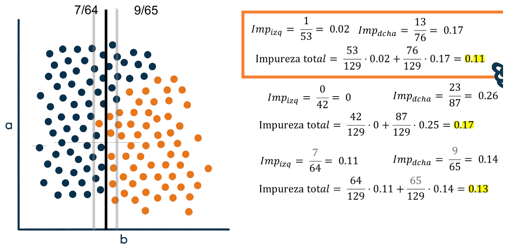
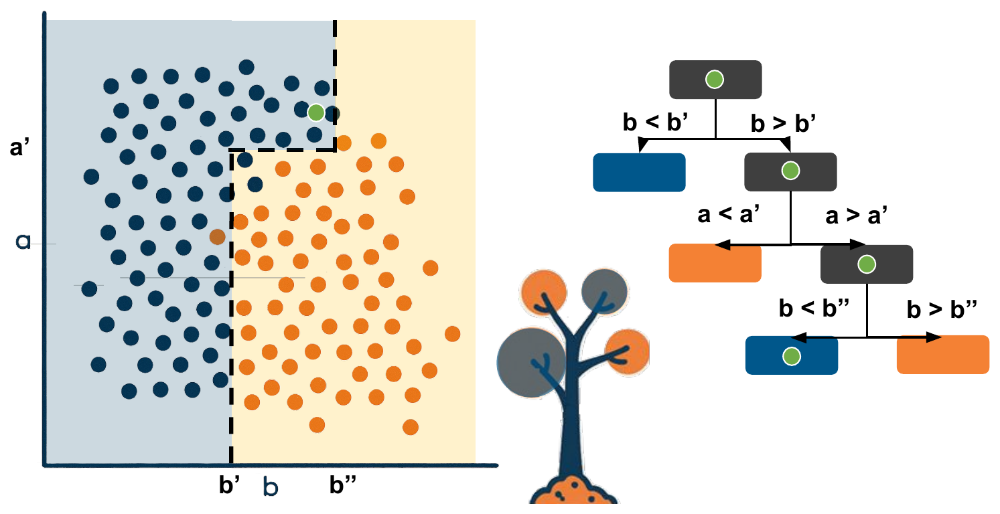
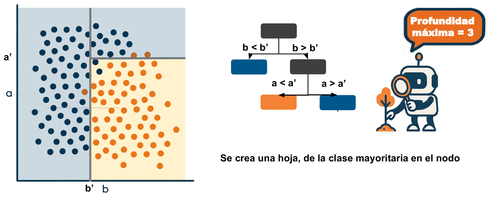
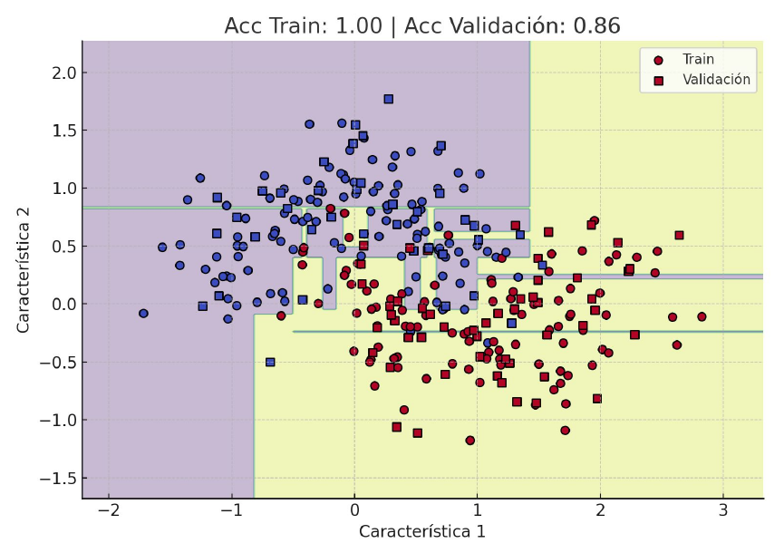
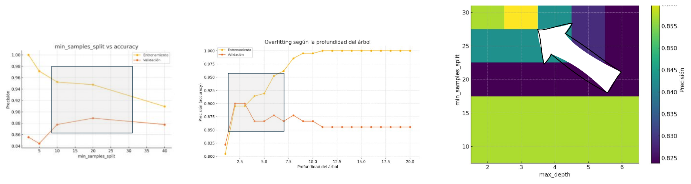
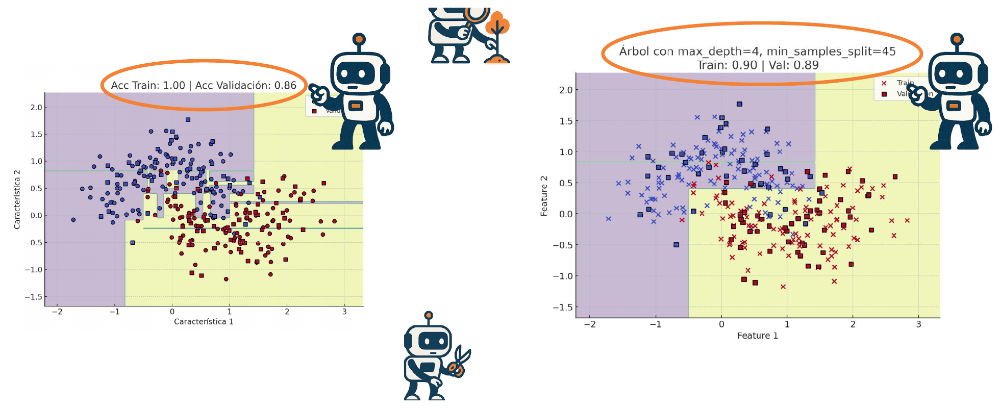
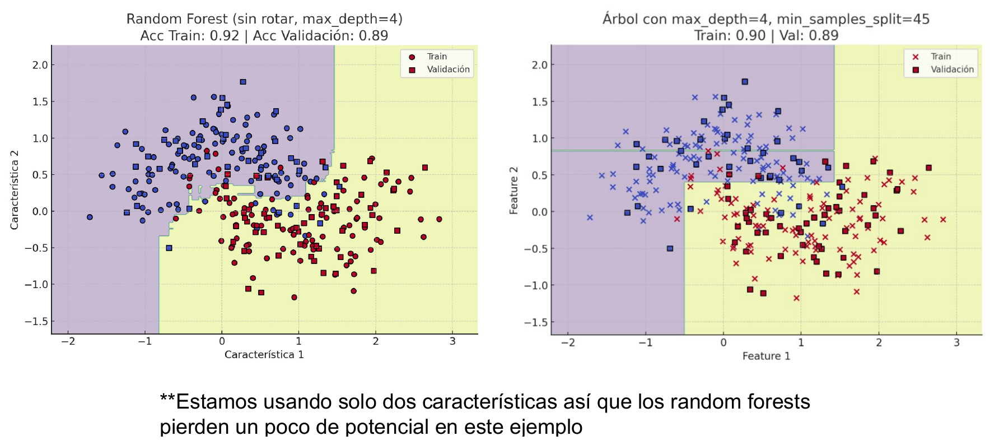
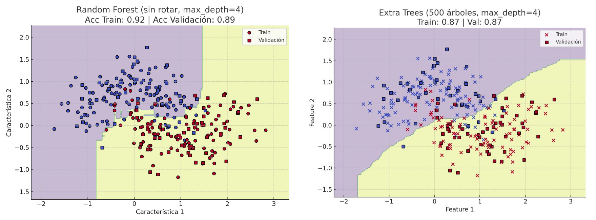
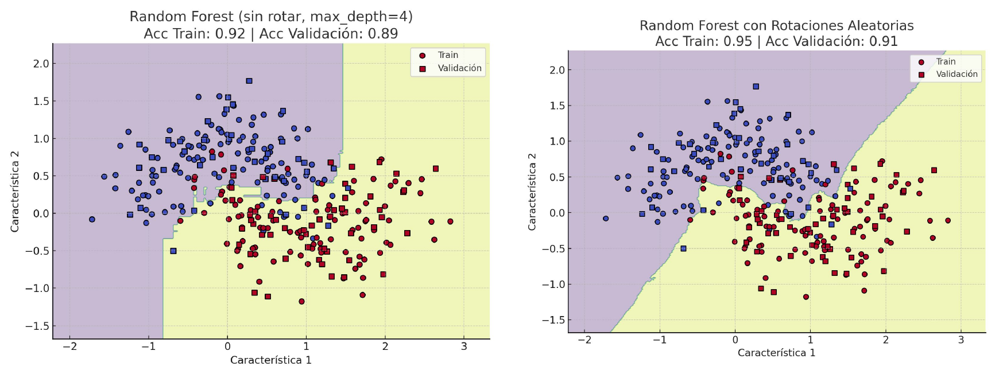

---
categories:
  - "[[ITBA.base|ITBA]]"
Tags: []
Created: "2026-09-1717:18"
Materia: "[[Machine Learning.base|Machine Learning]]"
temas:
  - Árboles de decisión
  - Impureza de un split
  - Error de clasificación
  - Impureza de Gini
  - Entropía de Shannon
  - Hojas y nodos
  - Fronteras de decisión perpendiculares a los ejes
  - Sobreajuste en árboles
  - Pre-poda (restricciones durante el crecimiento)
  - Poda (post-pruning)
  - max_depth, min_samples_split, min_samples_leaf
  - Algoritmo CART
  - ID3 y C4.5
  - Hiperparámetros
  - Curvas de validación
  - Gap de generalización
  - Grid Search
  - Overfitting a la validación
  - Bootstrap (muestreo con reemplazo)
  - Out-of-bag (OOB)
  - Bagging
  - Random Forest
  - max_features
  - Votación de árboles
  - Extra Trees (Extremely Randomized Trees)
  - Stacking
  - Importancia de features
  - Blending RF + KNN
  - Log-loss
---
# ML Clase 7 - Arboles de decision

[Machine Learning.base](Categories/Machine%20Learning.base)

> [!abstract] Resumen de la clase
> - Un **árbol de decisión** parte el espacio de features con preguntas binarias del tipo $x_j < t$, de forma jerárquica, hasta llegar a **hojas** lo bastante homogéneas. Cada corte es **perpendicular a un eje**.
> - Para elegir cada corte se prueban todos los umbrales de todas las features y se queda el de **menor impureza ponderada**. La impureza puede ser el error de clasificación, **Gini** (la usual) o la **entropía**.
> - Un árbol sin límites **sobreajusta** (una hoja por punto). Se controla con **pre-poda** (`max_depth`, `min_samples_split`, `min_samples_leaf`, mejora mínima), que es lo que se usa porque es más barata, o con **poda** a posteriori.
> - Los hiperparámetros se eligen con **curvas de validación** y, si son varios, con **Grid Search**, dejando margen hacia valores permisivos porque las restricciones se suman.
> - **Random Forest** = muchos árboles entrenados sobre muestras **bootstrap** y viendo solo un **subconjunto aleatorio de features** en cada nodo; votan. Cada árbol es más débil, pero el conjunto tiene **menos varianza**. **Extra Trees** además sortea los umbrales.

## Idea principal


Es la lógica del *¿Quién es quién?* o del Akinator: cada pregunta de sí/no descarta una parte del espacio de posibilidades, hasta que queda una sola respuesta. El algoritmo hace lo mismo, pero **aprende qué preguntas hacer** a partir de los datos.

El profe lo presenta como un enfoque "casi opuesto" a la clase anterior ([GDA / Naive Bayes](ML%20Clase%206%20-%20GDA%20y%20Naive%20Bayes.md)): ahí se modelaba la **distribución estadística** de cada clase; acá no se asume ninguna distribución, solo se parte el espacio con reglas. A cambio, las fronteras pueden ser mucho más versátiles.

## Que es un arbol de decision

divide en 2 subespacios de a dos deciciones


- **Nodo**: una pregunta sobre **una sola** feature, $x_j < t$ (en el dibujo, $b < b'$).
- **Rama**: cada una de las dos respuestas. Cada subespacio se vuelve a tratar igual que el original.
- **Hoja**: un subespacio que ya no se divide más; predice la clase mayoritaria de los puntos de entrenamiento que cayeron ahí.

> [!quote] La definición que más le gusta al profe
> Secuencia de decisiones jerárquicas que dividen el espacio de características en regiones **cada vez más homogéneas**.
>
> La idea es buscar subespacios lo bastante homogéneos como para que no valga la pena seguir partiéndolos.

## como decidimos donde colocar cada corte?
como dividimos cada decision binaria?


El enfoque más simple: **probar todos los cortes posibles** (todos los umbrales de todas las features), calcular qué tan bueno es cada uno con una métrica de **impureza**, y quedarse con el mínimo. Al elegir el corte se está eligiendo también **qué feature** mirar en ese nodo.

La impureza de un split es el **promedio ponderado** de la impureza de cada lado:

$$
\text{Impureza del split} = \frac{n_{izq}}{n}\,\text{Imp}_{izq} + \frac{n_{der}}{n}\,\text{Imp}_{der}
$$

La ponderación por $n_{izq}/n$ y $n_{der}/n$ está para que un corte que deja **un solo punto** de un lado (que siempre está "bien clasificado") no parezca bueno si el otro lado es un desastre.

La métrica más simple es el **error de clasificación**: la fracción de puntos que **no** son de la clase mayoritaria de ese lado,

$$
\text{Error} = 1 - \max_i p_i
$$

Con dos clases va de 0 (lado puro) a 0.5 (mitad y mitad).


Se comparan tres cortes posibles sobre $b$ (129 puntos en total):



| Corte | Izquierda | Derecha | Impureza total (slide) | Impureza exacta |
|---|---|---|---|---|
| 1 (el del medio) | $1/53 = 0.02$ | $13/76 = 0.17$ | **0.11** | $14/129 = 0.109$ |
| 2 (más a la izquierda) | $0/42 = 0$ | $23/87 = 0.26$ | 0.17 | $23/129 = 0.178$ |
| 3 (más a la derecha) | $7/64 = 0.11$ | $9/65 = 0.14$ | 0.13 | $16/129 = 0.124$ |

Gana el **corte 1**. Correrse a la izquierda deja la izquierda pura, pero mete 10 azules más a la derecha, y eso pesa más.

> [!tip] Atajo
> Con el error de clasificación, la impureza ponderada es simplemente $\dfrac{\text{minoritarios izq} + \text{minoritarios der}}{n}$: el promedio ponderado de fracciones se simplifica a contar puntos mal clasificados.

> [!bug] Cuentas de las slides 8–10 (verificado con python)
> - **Slide 8:** calcula $\text{Imp}_{dcha} = 23/87 = 0.26$ pero en la línea siguiente usa **0.25**: $\frac{42}{129}\cdot 0 + \frac{87}{129}\cdot 0.25 = 0.17$. Con 0.26 (o exacto) da **0.18** ($23/129 = 0.178$).
> - **Slide 9:** el 0.13 sale de redondear antes de promediar ($0.11$ y $0.14$). Exacto da $16/129 = 0.124 \approx$ **0.12**.
> - Los conteos de clase tampoco cierran por un punto: los cortes 1 y 2 implican 65 azules y 64 naranjas ($52 + 13$ azules), pero el corte 3 implica $57 + 9 = 66$ azules.
> - Nada de esto cambia la conclusión: el corte 1 sigue siendo el mejor (0.109 < 0.124 < 0.178).

### Problemas de este metodo


El error de clasificación es **lineal**: penaliza igual cualquier punto que pasa de la clase mayoritaria a la minoritaria, esté donde esté. Entonces un lado 65/35 (error 0.35) y uno 55/45 (error 0.45) dan valores parecidos, cuando 55/45 es **casi aleatorio** (lo peor posible es 50/50).

La idea del profe: los cortes malos **nunca** los vamos a elegir, así que no importa distinguirlos bien. Lo que queremos es **resolución en la zona buena** (cerca de 85/15 o 90/10), que es donde "se juega el partido". Para eso hace falta una curva que no sea lineal.

## Alternativas


> [!bug] La fórmula de Gini de la slide está incompleta (slides 12 y 13)
> La slide escribe $\text{Gini} = \sum_i p_i^2$. Eso es la **pureza** (la probabilidad de que dos puntos sacados al azar sean de la misma clase): vale 1 en un nodo puro y 0.5 en uno 50/50 con dos clases. Una **impureza** tiene que valer 0 en un nodo puro. La fórmula correcta es
> $$\text{Gini} = 1 - \sum_{i=1}^{n} p_i^2$$
> Es la que usan las propias curvas de la cátedra: el máximo de 0.5 en $p = 0.5$ de la slide 15 y el eje de 0.13 a 0.50 del ejemplo de las slides 16–17. Verificado con sklearn: la impureza que guarda en la raíz de un dataset 50/50 es 0.5 $= 1 - (0.5^2 + 0.5^2)$.

**Impureza de Gini** (Corrado Gini, 1912). Viene de la economía, donde el **índice de Gini** mide la desigualdad de una distribución (por ejemplo, del ingreso). Elevar al cuadrado hace que penalice fuerte cuando hay mezcla de clases, **aunque una clase sea claramente dominante**.

$$
\text{Gini} = 1 - \sum_{i=1}^{n} p_i^2
$$

**Entropía** (Claude Shannon, 1948). Viene de teoría de la información: es la cantidad promedio de información (o incertidumbre) que contiene un mensaje aleatorio, o sea, qué tan impredecible es la fuente. Por el logaritmo es **todavía más sensible a proporciones bajas**.

$$
H = -\sum_{i=1}^{n} p_i \log_2 p_i
$$

En las dos, $p_i$ es la proporción de la clase $i$ en el nodo y $n$ es la cantidad de clases (el profe aclara que es **proporción**, no probabilidad).

## Comparacion de metricas


Para ver la resolución en números, la impureza de **un lado** del corte con dos clases:

| Proporción | Error | Gini | Entropía (bits) |
|---|---|---|---|
| 55/45 | 0.450 | 0.495 | 0.993 |
| 65/35 | 0.350 | 0.455 | 0.934 |
| 85/15 | 0.150 | 0.255 | 0.610 |
| 90/10 | 0.100 | 0.180 | 0.469 |

Entre 85/15 y 90/10, el error baja un 33 %, Gini un 29 % y la entropía un 23 %. Lo que cambia es la **forma**: Gini y entropía son **cóncavas**, así que penalizan la mezcla más que proporcionalmente. Eso hace que una partición que deja un lado casi puro reduzca la impureza **estrictamente**, cosa que con el error lineal muchas veces no pasa (dos cortes distintos pueden empatar).

> [!note] "El error de clasificación es constante para todo p" (slide 15)
> Lo constante no es el error, sino su **pendiente**: el error es una recta a cada lado de $p = 0.5$ (la línea punteada con forma de triángulo). Gini y entropía son curvas.

> [!warning] Lapsus en la clase
> En un momento se escucha "es muchísimo más eficiente hacer Shannon que hacer Gini". Es al revés, y así lo dice la slide: **se usa Gini porque es más eficiente** (un cuadrado es una multiplicación; la entropía necesita un logaritmo por clase) y en la práctica los dos eligen casi siempre el mismo corte. Es el `criterion="gini"` por defecto de sklearn.

Recalculando los tres cortes de arriba con cada métrica, gana el mismo corte en los tres casos:

| Corte | Error | Gini | Entropía |
|---|---|---|---|
| 1 | **0.109** | **0.182** | **0.444** |
| 2 | 0.178 | 0.262 | 0.562 |
| 3 | 0.124 | 0.217 | 0.539 |

### ejemplo calculo de Gini 


Para la *Feature 1* se calcula el Gini del split para **todos** los umbrales posibles (curva naranja; el eje X de las dos gráficas es el mismo). El mejor umbral es el **mínimo** de la curva, alrededor de 0.13, y cae justo entre las dos nubes (la línea amarilla de la slide 17). Con eso ya está resuelto el primer paso del algoritmo; lo que sigue es repetirlo recursivamente a cada lado.

## Como se construye un arbol de decision

Se aplica el mismo procedimiento de forma **recursiva** en cada subespacio. En cada nodo se evalúan **todos los umbrales en todas las dimensiones** (por eso importa tanto no hacer cálculos de más; ver [Mejoras de eficiencia en el algoritmo CART](#Mejoras%20de%20eficiencia%20en%20el%20algoritmo%20CART)).

1. **Primer corte** en $b = b'$. La izquierda ya tiene impureza lo bastante baja → se vuelve una **hoja azul**. La derecha sigue mezclada → es un **nodo**, se sigue cortando.
2. En la derecha, el mejor corte ahora es sobre la **otra feature**, $a = a'$. Lo de abajo queda casi todo naranja → **hoja naranja**.
3. Arriba a la derecha queda mezcla → un corte más en $b = b''$, que separa azul de naranja.


**¿Cómo predice?** Un punto nuevo recorre el árbol desde la raíz: en cada nodo se mira **solo la feature de ese nodo**, se compara con su umbral y se va a la izquierda o a la derecha, hasta caer en una hoja. En el ejemplo de la slide 25 el punto verde tiene $b > b'$ → $a > a'$ → $b < b''$ → **azul**.



## Ventajas de arboles de decision


- **Interpretabilidad clara.** Se le puede explicar a un experto del dominio en dos frases ("si el tamaño es < 12 es tal fruta; si no, miramos el color…"). También sirve para **validar el modelo nosotros**: si conocemos las features, podemos juzgar si tiene sentido que decida así. En LDA/GDA se pueden mirar los coeficientes, pero no es tan directo; en deep learning, mucho menos.
- **Maneja datos numéricos y categóricos, y mezclas de ambos.** Cada feature se evalúa por separado y lo que se compara entre features es la **impureza**, no distancias. Da igual qué tipo de variable sea.
- **No necesita normalización.** Por lo mismo: la impureza depende de la **proporción de puntos** a cada lado, no del rango. Una feature de 0 a 1 000 000 y otra de 0 a 1 se tratan igual.

> [!warning] Igual normalizá
> El profe insiste: que el árbol no la necesite **no** es excusa para no hacerla. No le hace daño al árbol, y si después cambiás de algoritmo o lo comparás con otro (la mayoría sí se ven afectados), te la vas a olvidar. Ver [escalado de variables](ML%20Clase%203%20-%20EDA,%20Feature%20selection,%20Regularización%20y%20Métricas.md#Escalado%20de%20variables).

## Desventajas de Árboles de decision


- **Propenso al sobreajuste.** Si el único criterio para dejar de cortar es que la hoja sea pura, puede terminar haciendo **una hoja por punto**, con fronteras horribles (el recuadro de la slide).
- **Fronteras de decisión muy rígidas.** Cada corte usa **una sola** feature, así que las fronteras son **siempre perpendiculares a los ejes** ("eso es innegociable"). LDA, en cambio, combina features y puede trazar rectas con cualquier ángulo.
- **Vulnerable a la orientación de las features.** Consecuencia de lo anterior: si se rotan los datos (por ejemplo 45°), el mismo árbol funciona mejor o peor. Una frontera diagonal se aproxima con una **escalera** de cortes. Es una curiosidad, no algo que se haga con un árbol solo.
- **Sensible a pequeñas variaciones (inestable).** Agregar uno o dos puntos puede cambiar el primer umbral, y eso desencadena una **cascada** de umbrales distintos: un árbol completamente distinto. En los modelos estadísticos de la clase anterior, un punto más casi no cambia las medias ni las covarianzas, así que la frontera casi no se mueve. Esto se va a **aprovechar** en Random Forest.

## Tecnicas para controlar el sobreajuste


| | **Pre-poda** (restricciones durante el crecimiento) | **Poda** (post-pruning) |
|---|---|---|
| Idea | Frenar al árbol mientras crece | Dejarlo crecer "salvaje" y después **recortar de abajo hacia arriba** las hojas que aportan poca mejora |
| Ejemplos | Profundidad máxima; no crear un nodo si tiene pocos datos; mejora mínima de impureza para crear un nodo | 1) crecer sin restricciones; 2) eliminar ramas que aportan poca mejora |
| Calidad | Puede cortar antes de un split que después hubiera sido muy bueno | Suele llegar a una solución mejor: ve el árbol completo antes de decidir |
| Costo | **Barato**: con `max_depth = 3` solo hay que encontrar pocos umbrales | **Caro**: la cantidad de nodos crece exponencialmente con la profundidad (hasta $2^d$ hojas; profundidad 25 son muchísimas), y después hay que recorrerlas todas |

> [!important] Generalmente se usa la pre-poda
> Porque es **mucho más eficiente computacionalmente**. El CART de scikit-learn ya trae estas restricciones incorporadas como hiperparámetros.

Ejemplos de restricciones de pre-poda:
- **Profundidad máxima**: al llegar al nivel $k$, lo que quede de cada lado es hoja con la clase mayoritaria.
- **Mejora mínima de impureza**: si el nodo anterior tenía impureza 0.22 y el nuevo corte la deja en 0.21, partir los datos en dos por tan poco no vale la pena → hoja.
- **Mínimo de puntos para partir un nodo**: si de un lado quedan 6 puntos, por más mezclados que estén, no se sigue partiendo.

> [!question] La pregunta de la clase: ¿qué se pierde con la pre-poda?
> Un compañero (Felipe) lo planteó: al restringir durante el crecimiento, podés no llegar a una división que era clave, que con poda hubieras visto antes de recortar.
>
> > [!success]- Respuesta del profe
> > Es 100 % cierto. En **entrenamiento** la pre-poda **siempre** rinde peor que dejarlo crecer ("ya vale, no estudies más, vamos al examen"). Cuando ponemos la restricción es porque **sospechamos overfitting**; nada garantiza que el valor óptimo no esté un nivel más abajo. Pasa con todos los hiperparámetros de cualquier algoritmo, pero acá se ve muy claro. Por eso el valor se elige mirando **validación** (ver [Ajuste de hiperparametro](#Ajuste%20de%20hiperparametro)).

**Profundidad máxima = 3.** Al llegar al tercer nivel, el último nodo (arriba a la derecha) no se sigue partiendo: se vuelve una hoja de la clase mayoritaria (azul). Quizás un corte más habría sido mejor, pero tampoco es una mala partición.



## Algoritmo Cart

Como construimos un arbol?


Históricamente hubo varios algoritmos (**ID3**, **C4.5**). Hoy el más usado es **CART** (*Classification And Regression Trees*): es simple, intuitivo y tiene amplio soporte en librerías. Es el que implementa scikit-learn (la documentación dice "una versión optimizada de CART").

### Como funciona el algoritmo CART


El diagrama de flujo, en pseudocódigo:

```text
construir(nodo):
    si el nodo es puro (una sola clase)
       o se cumple algún criterio de parada (tamaño mínimo del split, profundidad máxima…):
        crear una hoja con la clase más frecuente
        return

    para cada característica (¡todas!):
        para cada umbral posible:
            calcular la impureza (Gini) del split
    elegir la característica y el umbral con menor impureza

    si se cumple algún criterio de parada (ej: la mejora de impureza no alcanza el mínimo):
        crear una hoja con la clase más frecuente
    si no:
        dividir el espacio con ese umbral → dos nodos hijos
        construir(hijo_izq); construir(hijo_der)
```

> [!note] El "criterio de parada" tiene la pregunta invertida
> En clase el profe se enredó con esto: la pregunta del rombo es "¿se cumple algún criterio de parada?". Si **no** se cumple (el corte mejora lo suficiente, hay suficientes puntos…), se **divide**. Si **sí** se cumple, se **crea una hoja**. En el primer nodo nunca se cumple: la raíz tiene la impureza máxima, cualquier buen corte la mejora.

Hay dos lugares donde se chequea parada: **antes** de buscar el corte (nodo puro, pocos puntos, profundidad máxima) y **después** de encontrarlo (mejora mínima de impureza, que recién se conoce cuando se evaluó el corte).

## Mejoras de eficiencia en el algoritmo CART


El paso caro es "calcular Gini para cada umbral posible de cada característica": con $n$ muestras y $d$ features hay

$$
(n-1)\cdot d \text{ umbrales posibles}
$$

**en cada nodo**. Por eso todos los algoritmos que conoce el profe optimizan esa parte.

**Optimización:** ordenar los valores de la feature y **evaluar solo los umbrales donde hay un cambio de clase**. Entre el umbral 1 y el 2 de la slide no cambia de lado ningún punto de la otra clase: moverse de 1 a 2 solo pasa azules a la izquierda, así que el 2 es **siempre** mejor que el 1 y el 1 no hace falta probarlo. En las zonas puras (todo azul o todo naranja) no se prueba nada; solo se prueban umbrales en la zona de mezcla. Ahorrar un tercio o la mitad de los cálculos, en cada nodo, está buenísimo.

> [!note] Qué hace sklearn en realidad (verificado en el código fuente, v1.8)
> La idea es correcta: para impurezas cóncavas como Gini o entropía, el umbral óptimo siempre cae en un **cambio de clase** (Fayyad & Irani, 1992, para entropía). Pero el `BestSplitter` de scikit-learn no usa ese filtro. Ordena los valores y evalúa **todas** las posiciones donde el valor cambia, poniendo el umbral en el **punto medio** entre dos valores consecutivos. Lo que lo hace barato es que, con los valores ordenados, pasar de un umbral al siguiente **actualiza los conteos de clase incrementalmente** (un punto cambia de lado), en vez de recalcular desde cero.

## Como evaluar el rendimiento

Ejemplo real con dos "lunas" de datos (`make_moons` de sklearn) y un árbol **sin restricciones**:



**Acc Train = 1.00 | Acc Validación = 0.86.** Las fronteras están hiper ajustadas a cada punto y el 100 % en train ya es "muy mal comienzo": es **overfitting**, con toda seguridad.

Cómo evaluarlo (slide 50):
1. **Definir la métrica** (acá accuracy) y calcularla en entrenamiento y validación.
2. **Validación cruzada (K-fold)** para una estimación más estable (ver [Clase 2](ML%20Clase%202%20-%20Datos,%20variables,%20overfitting%20y%20métricas.md#6.5%20Cross%20Validation%20%28k-fold%29)).
3. **Gap de generalización**: diferencia entre train y validación.
   - Gap **grande** → sobreajuste.
   - Gap **chico** pero precisión **baja** → subajuste. Ahí conviene **liberar** un poco al algoritmo: mover los hiperparámetros en la dirección contraria a la que se usa contra el overfitting.
4. **Curvas de validación**: cómo varía el rendimiento al cambiar un hiperparámetro (rendimiento vs. complejidad: número de nodos, profundidad, mínimo de puntos por split…).

## Ajuste de hiperparametro


**Hiperparámetro**: valor del modelo que **no** se aprende del train sino que lo fijamos nosotros para que funcione lo mejor posible con estos datos (ver [Terminologia ML](Terminologia%20ML.md)). En los árboles: profundidad máxima, mínimo de puntos para crear un nodo, mínimo por hoja, mejora mínima de impureza.

**Curva de validación**: probar varios valores del hiperparámetro y graficar el rendimiento en train y en validación.

| Curva | Qué pasa | Valor elegido |
|---|---|---|
| `min_samples_split` (mínimo de puntos para partir un nodo) | Con valores bajos (~3) es como no poner mínimo: train ≈ 1 y gap enorme. Al subirlo, train baja y validación sube; después caen las dos | **20** (máximo de validación) |
| `min_samples_leaf` (mínimo de puntos por hoja) | Parecido: máximo y después cae | **4** |
| `max_depth` | Profundidad 1: train y validación bajas → **underfitting**. Al subir, suben las dos; después se separan: train sigue a 1 y validación baja → **overfitting** | **2 o 3** |

> [!tip] Que baje el train no es mala noticia
> Si al restringir **baja el train pero sube la validación**, el sobreajuste está bajando: el modelo deja de aprenderse puntos ruidosos. El problema es cuando **bajan las dos**.

## Y si queremos evaluar varios hiperparametros?


> [!warning] Los óptimos individuales no se suman
> Si se elige cada hiperparámetro por separado en su mejor punto (profundidad 2, `min_samples_split` 20, `min_samples_leaf` 4), cada uno fue evaluado **con los otros libres**. Al combinarlos, las restricciones se **suman**: probablemente queda **demasiado restrictivo** y se empuja al modelo al **underfitting**.

Dos formas de hacerlo:

1. **Escalonada** (a mano): fijar un hiperparámetro, rehacer la curva del siguiente con ese fijo, y así. Si se hace así, conviene ser **un poco más permisivo** en el primero (profundidad 3 en vez de 2) porque después viene otra restricción. Es artesanal: está buenísimo para el TP porque obliga a entender lo que se hace, pero en la práctica se tiende a automatizar.
2. **Grid Search** (búsqueda de rejilla):
   1. Graficar un rango amplio de cada hiperparámetro por separado.
   2. Elegir un rango más acotado donde funciona bien, **pero dándole margen hacia valores permisivos** (profundidad mayor, mínimo de muestras menor), porque lo que se ve como overfitting en un hiperparámetro individual puede quedar compensado por los otros.
   3. Probar **todas las combinaciones** (un for anidado) con cross-validation y graficar un mapa de calor (amarillo = mayor precisión).

Conviene combinar hiperparámetros que ataquen **aspectos distintos** del árbol. `min_samples_split` y `min_samples_leaf` son medio parecidos; por eso el ejemplo cruza `max_depth` con `min_samples_split`.

Primera grilla (`min_samples_split` de 10 a 30):



El máximo sale en **profundidad 3 y `min_samples_split` = 30**. Acá los dos valores más restrictivos resultaron ser los mejores combinados, pero eso se ve **con la grilla**, no se puede suponer.

Como el máximo cayó en el **borde** del rango probado (30), se **amplía la grilla** (hasta 50, la de la captura de arriba). Ahí el máximo pasa a **profundidad 4 y `min_samples_split` = 45**: uno se movió a un valor más restrictivo y el otro a uno más permisivo, **se compensan**.

> [!tip] Si el máximo cae en el borde de la grilla, ampliala
> El óptimo puede estar afuera del rango que probaste.

Resultado (slide 54): de **Train 1.00 / Val 0.86** a **Train 0.90 / Val 0.89**. Baja el train, pero sube la validación y la frontera es mucho más razonable. Ese sería el modelo a comparar en validación contra otros (por ejemplo, un LDA); el ganador pasa a test.



> [!question] ¿Y si pruebo todas las combinaciones de todos los hiperparámetros?
> > [!success]- Respuesta del profe
> > En el mundo ideal, sí. El límite es el **costo computacional**, y eso lo decidís vos (si cada entrenamiento tarda 10 minutos y son 100 combinaciones…). Las curvas de validación son una forma **informada** de no tener que probarlo todo.
> >
> > **Asterisco:** cuantas más pruebas hacés mirando validación (miles de combinaciones, varios algoritmos), más riesgo de **overfitting a la validación**: al ir a test ves una caída. Para evitarlo se usa **validación cruzada anidada** (un K-fold adentro de cada train de otro K-fold). Está fuera de la materia; ver [Clase 3](ML%20Clase%203%20-%20EDA,%20Feature%20selection,%20Regularización%20y%20Métricas.md#Cómo%20reducimos%20el%20overfitting%20a%20la%20validación%20%28Avanzado%29).

La moraleja del profe: **entender qué hace cada hiperparámetro** (en qué dirección y desde dónde restringe al algoritmo) vale más que copiar los valores de un foro o un paper. Así se puede anticipar el resultado y saber si un máximo tiene sentido.

### Resumen DT (slide 55)

- Un árbol de decisión es fácil de entender, pero propenso a sobreajustar.
- Se aplica **pre-poda** para limitar su complejidad y reducir el overfitting.
- Se pueden optimizar varios hiperparámetros juntos para reducir el overfitting sin perder mucha precisión.
- La frontera todavía es rígida y el error es alto para una distribución tan simple. ¿Se puede mejorar?

## Bootstrap


> [!warning] Lapsus en la clase
> Al principio se escucha "sin reemplazos"; el profe se corrige enseguida: bootstrap es **con** reemplazo, como dice la slide.

Bootstrap = muestrear **con reemplazo**: de un dataset de tamaño $n$ se arman nuevas muestras también de tamaño $n$, devolviendo cada punto sacado. Algunos puntos aparecen varias veces y otros no aparecen. El reemplazo permite sacar **tantos subconjuntos distintos como se necesite** de un dataset limitado.

### ¿Por qué bootstrap mejoraría los árboles? (slide 57)

- **Genera variedad entre árboles.** Un árbol es muy sensible a qué puntos hay en la frontera, así que cada muestra da un árbol bastante distinto. Si se entrenan muchos y se **promedian**, el resultado tiene **menos varianza** que un árbol solo.
- Cada árbol "ve" una versión ligeramente distinta del problema.
- Mejora la **generalización**: modelo más estable y menos sensible a outliers o ruido.

La **inestabilidad**, que era una desventaja, se vuelve **materia prima**. A un modelo estadístico (LDA, GDA) no le sirve tanto: las muestras bootstrap tienen casi la misma distribución, así que las fronteras salen casi iguales y promediarlas no aporta.

**¿Por qué el 63 %?** Con muestras del mismo tamaño que el dataset, la probabilidad de que un punto dado **no** salga en ninguna de las $n$ extracciones es

$$
\left(1 - \frac{1}{n}\right)^n \xrightarrow{\;n\to\infty\;} e^{-1} \approx 0.368
$$

Entonces cada muestra bootstrap contiene en promedio $1 - e^{-1} \approx$ **63.2 %** de los datos únicos (el resto son repeticiones). El **~37 %** que no salió se puede usar como validación interna: **out-of-bag (OOB)**. Verificado por simulación con $n = 1000$: 63.21 % de únicos.

En datasets **muy grandes** se usan muestras más chicas, y en general no se usa bootstrap sino **submuestreos aleatorios sin reemplazo**: ya hay datos de sobra para armar subconjuntos distintos.

## Random Forest



**Random Forest** = conjunto de árboles de decisión entrenados con **variaciones aleatorias**. Promediar predicciones de árboles **individualmente más débiles** da una predicción **más robusta**.

### ¿Cómo funciona? (slide 59)

1. **Cada árbol se entrena sobre una muestra bootstrap** del train, del mismo tamaño que el original.
2. **No se evalúan los umbrales en todas las features**: en **cada división de nodo** se considera solo un **subconjunto aleatorio de variables** (por ejemplo, 3 o 4 de 10), y **dentro de ese subconjunto** se busca el mejor umbral igual que en un árbol normal.
3. **Cada árbol clasifica el punto y vota**; gana la clase con más votos (si 63 de 100 árboles dicen clase 1, es clase 1). Si se quiere una probabilidad en vez de una clase: el % de árboles que votó esa clase.

> [!important] Aleatorio ≠ al azar
> Lo aleatorio es **qué features se evalúan**. El umbral sigue siendo **el mejor** entre las que entraron, así que la información sigue llegando al modelo. Si todo fuera aleatorio, promediar no lo salvaría: "por más que promediemos algo aleatorio, nunca va a ser algo distinto de aleatorio".

La idea es **dificultarle el aprendizaje** a cada árbol a propósito: cada uno probablemente sufra **underfitting**, pero al combinarlos se obtiene algo más robusto que el mejor árbol individual con los mejores hiperparámetros.

> [!note] El subconjunto de features es por **nodo**, no por árbol
> En clase se dijo "para cada árbol elegiríamos los subconjuntos… para cada umbral, digamos". La slide y sklearn lo hacen **en cada split**: cada nodo sortea sus propias features. Sortear una vez por árbol es otro método (*random subspace*).

> [!note] Cómo combina sklearn (verificado en el código fuente, v1.8)
> `RandomForestClassifier` no cuenta votos duros. `predict_proba` **promedia las probabilidades** de cada árbol (la fracción de cada clase en la hoja donde cae el punto) y `predict` devuelve la clase con mayor promedio (*soft voting*). Si los árboles crecen hasta hojas puras, cada árbol da 0 o 1 y coincide con el % de votos de la slide. Con `max_depth` u otras restricciones, las hojas son mixtas y los dos métodos pueden diferir un poco.

### DT vs RF (slide 60)

| | Decision Trees | Random Forests |
|---|---|---|
| **Ventajas** | Interpretabilidad | Precisión y robustez; maneja grandes volúmenes de datos y variables; reduce overfitting |
| **Desventajas** | Propenso al overfitting; muy sensible a los datos | Mayor costo computacional; menor interpretabilidad (son decenas o cientos de árboles); posible overfitting en datasets pequeños |

Sobre el overfitting en datasets pequeños: si hay pocos puntos, todos pesan mucho y cualquiera puede ser punto frontera, así que cada árbol igual termina sobreajustado. No hay que pensar que RF **siempre** evita el overfitting.

### Hiperparámetros de un Random Forest (slide 61)

| Hiperparámetro | Qué controla | Default en sklearn (verificado) |
|---|---|---|
| `n_estimators` | Cantidad de árboles. Más árboles, más estabilidad, **hasta cierto punto** | 100 |
| `max_features` | Cuántas features se consideran en cada split. **Clave** para que los árboles no se parezcan: cuanto menor, más diversidad. Con todas las features, los árboles salen muy parecidos | `"sqrt"` ($\sqrt{d}$) |
| `max_depth`, `min_samples_split`, `min_samples_leaf` | Los mismos de un árbol solo | Sin límite / 2 / 1 |

De nuevo: hay que entender qué hace cada uno para no ser demasiado restrictivo en todos a la vez.

### ¿Por qué introducir aleatoriedad reduce el overfitting? (slide 62)

- **Rompe la homogeneidad** entre árboles: cada uno ve datos y features distintos, así que **comete errores distintos**.
- Al combinarlos, **los errores se atenúan** y solo **sobreviven los patrones consistentes**, los que aparecen en todos los subconjuntos de datos y de features → mejor generalización.

## Extra Trees



**Extra Trees** (*Extremely Randomized Trees*) es el caso extremo: igual que RF, pero **los umbrales a evaluar también son aleatorios**. Cada árbol es aún más débil, pero si los errores no están correlacionados, promediando muchos se diluyen y queda lo que consistentemente separa las clases. Se usan menos que los RF.

> [!note] Cómo es exactamente (verificado en sklearn v1.8)
> - Por cada feature candidata se sortea **un solo umbral**, uniforme entre el mínimo y el máximo de esa feature en el nodo. Después se elige el **mejor** de esos candidatos por impureza. (El "5 % de los umbrales" que dijo el profe fue un ejemplo inventado; la slide 64 dice "un umbral aleatorio por cada feature", que es lo que hace sklearn.)
> - `ExtraTreesClassifier` tiene **`bootstrap=False` por defecto**: cada árbol ve **todo** el train, y la diversidad viene solo del sorteo de features y umbrales (así es también el paper original, Geurts et al. 2006). En eso no es "igual que RF", que sí usa bootstrap por defecto.

> [!warning] Tiene que quedar alguna elección
> Si se probara **una sola** feature con **un solo** umbral, ya no hay nada que optimizar: es poner la frontera al azar, y eso no funciona por más árboles que se promedien. Tiene que haber comparación de impureza entre varios candidatos.

### Comparación (slide 64)

| | Decision Tree | Random Forest | Extra Trees |
|---|---|---|---|
| **Selección de feature** | Todas las disponibles | Subconjunto aleatorio | Subconjunto aleatorio |
| **Selección de umbral** | Mejor umbral (óptimo) | Mejor umbral (óptimo) | Un umbral aleatorio por feature |
| **¿Qué optimiza?** | Mejor split global | Mejor split dentro de las features elegidas | Mejor split entre esos candidatos aleatorios |

### Ejemplos (slides 65–67)

| Modelo | Acc Train | Acc Val | Frontera |
|---|---|---|---|
| Árbol (`max_depth=4`, `min_samples_split=45`) | 0.90 | 0.89 | Escalones rectos |
| Random Forest (100 árboles, `max_depth=4`) | 0.92 | 0.89 | Mucho más **suave** |
| Extra Trees (500 árboles, `max_depth=4`) | 0.87 | 0.87 | Menos rígida, casi diagonal, pero más débil |
| RF con **rotaciones aleatorias** por árbol | 0.95 | **0.91** | Se ajusta mejor a la forma de los datos |

En validación el RF no mejora al árbol en este ejemplo porque hay **solo dos features**: el subconjunto aleatorio es una de las dos, así que se pierde gran parte del potencial. Con 10 o 20 features, que es lo normal, el RF funciona mejor casi siempre.

La última variante es un experimento del profe (no es un método muy usado): a cada árbol le aplica una **rotación aleatoria** de las features, para atacar la debilidad de las fronteras perpendiculares a los ejes. Cada árbol tiene su propia orientación, así que el promedio ya no queda en escalera.



> [!tip] ¿Cómo se dibuja la frontera de un bosque?
> No se pueden "promediar nodos" (cada árbol usa features y órdenes distintos). Se arma una **grilla densa de puntos**, se predice cada uno y se pinta donde cambia la clase. Es poco elegante y caro; se hace solo para visualizar al final, no en cada iteración.

## Extras (slides 69–73)

El profe dejó estas slides "por si había preguntas"; están en el campus.

### ¿Bagging aplicable a otros clasificadores?

**Bagging** (*bootstrap aggregating*) = entrenar el mismo modelo sobre muestras bootstrap y combinar las salidas. Se usa sobre todo con árboles porque son de **alta varianza** (sensibles al dataset) y bagging reduce justamente eso. Modelos como la regresión logística o SVM tienen **baja varianza y alto sesgo**, así que el bagging aporta poco. Se puede aplicar a otros modelos, pero es con modelos de alta varianza donde brilla.

### Stacking (*stacked generalization*)

- **Versión estándar:** un **meta-modelo** recibe como entrada solo las salidas de los modelos base.
- **Versión extendida** (*stacking with passthrough*): el meta-modelo recibe las predicciones **y** las features originales. Así puede "reconocer" en qué regiones del espacio funciona mejor cada modelo.

### Importancia de las features

Los árboles (y los RF) dicen qué variables son más importantes: cada vez que se elige un umbral, se suma la **reducción de impureza** que produjo a la cuenta de esa feature. Al final queda un vector con cuánta impureza redujo cada una. En sklearn es `feature_importances_` (normalizado para que sume 1).

> [!note] Ojo con esta importancia
> La documentación de sklearn advierte que la importancia por reducción de impureza está **sesgada a favor de features con muchos valores distintos** y se calcula sobre el train. Como alternativa propone la *permutation importance* sobre validación.

### Mejoras útiles para estos métodos

- **Selección de características**: menos variables → menos ruido y menos sobreajuste (ver [Clase 3](ML%20Clase%203%20-%20EDA,%20Feature%20selection,%20Regularización%20y%20Métricas.md#Selección%20de%20características)).
  - Con la importancia del propio RF (`feature_importances_`).
  - Por varianza, correlación o **discriminabilidad**: graficar la distribución de cada feature por clase para ver qué tan distintas son.
  - Mirar la **matriz de correlación** y, de cada grupo de variables correlacionadas, quedarse con una.
- **Blending RF + KNN**: el RF captura diferencias más **globales** y el KNN más **locales**, así que es probable que cometan errores distintos. Se entrenan por separado, cada uno da una probabilidad, y se combinan (promedio, promedio ponderado o algo más complejo).

### ¿Gini o entropía para métodos avanzados?

La slide dice "ninguna de las dos: **log-loss**", porque es **derivable** (permite gradientes) y crece muy rápido cuando el modelo se equivoca con mucha confianza (predecir $p \approx 0$ cuando la clase real es 1).

> [!note] Matiz
> Como criterio de **split** en un árbol, la log-loss de un nodo **es** la entropía: en sklearn `criterion="log_loss"` y `criterion="entropy"` son lo mismo (verificado: dan exactamente los mismos umbrales). Donde la log-loss sí es otra cosa es en métodos como **gradient boosting** (XGBoost, etc.), que la usan como **función de pérdida** sobre las probabilidades predichas y construyen cada árbol siguiendo su gradiente.

## Referencias

- Slides de la cátedra: *Clase 7 - Árboles de decisión y Random Forest* (C. Bibián, 2026).
- Breiman, L. (2001). *Random Forests*. Machine Learning 45.
- Geurts, P., Ernst, D., Wehenkel, L. (2006). *Extremely randomized trees*. Machine Learning 63.
- Fayyad, U., Irani, K. (1992). *On the handling of continuous-valued attributes in decision tree generation*. Machine Learning 8.
- scikit-learn 1.8: `sklearn/tree/_splitter.pyx` y `sklearn/ensemble/_forest.py` (defaults y comportamiento verificados).

---

<!-- notas-relacionadas:inicio -->

## Notas relacionadas

**Misma materia (Machine Learning)**

- [ML Clase 6 - GDA y Naive Bayes](ML%20Clase%206%20-%20GDA%20y%20Naive%20Bayes.md) — clase anterior: el enfoque opuesto. LDA/GDA modela la distribución de cada clase y traza fronteras con cualquier ángulo y **baja varianza**; el árbol no asume distribución, corta perpendicular a los ejes y tiene **alta varianza**. Por eso el bagging sirve con árboles y no con LDA
- [ML Clase 2 - Datos, variables, overfitting y métricas](ML%20Clase%202%20-%20Datos,%20variables,%20overfitting%20y%20métricas.md) — overfitting/underfitting, el split train/dev/test y el **k-fold** que se usan para elegir `max_depth` y compañía. Además, los modelos que ahí **soportan categóricas sin encodear** (CatBoost, LightGBM, XGBoost) son todos ensembles de árboles: la ventaja de "maneja numéricos y categóricos" es de la familia
- [ML Clase 3 - EDA, Feature selection, Regularización y Métricas](ML%20Clase%203%20-%20EDA,%20Feature%20selection,%20Regularización%20y%20Métricas.md) — el **gap de generalización**, el **overfitting a la validación** y la nested CV de la respuesta sobre probar todas las combinaciones. La reducción de entropía de un split es la **información mutua** entre el corte y la clase, el mismo concepto del filtro MI de feature selection
- [Terminologia ML](Terminologia%20ML.md) — los umbrales y las features de cada nodo son **parámetros** (se aprenden); `max_depth`, `min_samples_split`, `n_estimators` y `max_features` son **hiperparámetros**
- [ML TP1 - Insurance](ML%20TP1%20-%20Insurance.md) — el mismo procedimiento de elegir hiperparámetros con k-fold sobre el train (ahí con grado y λ), ahora con curvas de validación y grid search
- [Materia - Machine Learning](Materia%20-%20Machine%20Learning.md) — índice de la materia

**Otras materias**

- **Data Structures and Algorithms** — [EDA - Árboles](EDA%20-%20Árboles.md) — predecir es recorrer un **árbol binario** de la raíz a una hoja comparando contra un valor en cada nodo, como una búsqueda en un BST: el costo es la **altura**, no la cantidad de nodos. La diferencia es que acá cada nodo puede comparar una clave (feature) distinta
- **Discrete Math** — [Discrete Math - Árboles y Recorridos](Discrete%20Math%20-%20Árboles%20y%20Recorridos.md) — un árbol binario de profundidad $d$ tiene a lo sumo $2^d$ hojas: es la cuenta detrás de por qué dejar crecer el árbol y podar después es exponencialmente caro

<!-- notas-relacionadas:fin -->
