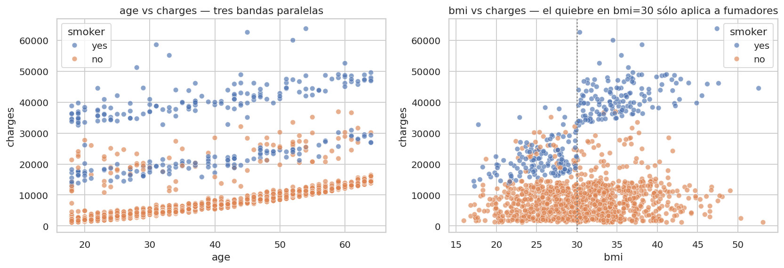
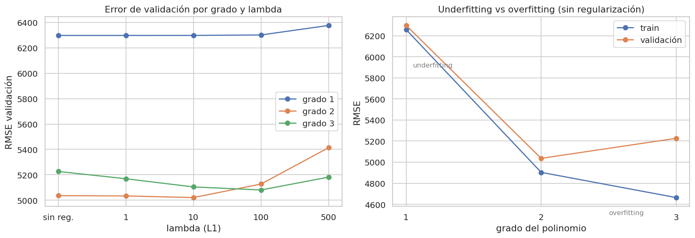
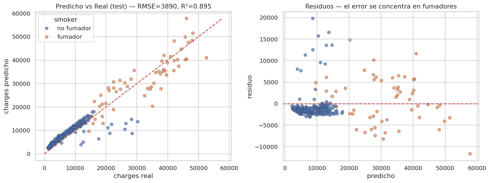

---
categories:
  - "[[ITBA.base|ITBA]]"
Tags: []
Created: 2026-08-2318:37
Materia: "[[Machine Learning.base|Machine Learning]]"
temas:
  - TP
  - Regresión lineal
  - Regresión polinómica
  - Cross validation (k-fold)
  - Regularización L1 (Lasso)
  - RMSE
  - Limpieza de datos
  - Outliers
  - One-hot encoding
  - Data leakage
  - Train/dev/test
---

# ML TP1 - Insurance

> [!info] Datos del TP
> **Consigna:** TP1 — Regresión e Introducción a la evaluación de modelos
> **Defensa:** 26/08/2026 · 10 min de presentación + 8 min de preguntas
> **Entrega:** código + presentación **24 h antes** → 25/08
> **Dataset elegido:** Insurance Charges (Kaggle) — predecir `charges`, el costo médico anual
> **Código:** `ML TP1/TP1_insurance.ipynb` (notebook ejecutado, junto a `insurance.csv`)

Preguntas anticipadas y sus respuestas → [ML TP1 - Preguntas de defensa](ML%20TP1%20-%20Preguntas%20de%20defensa.md)

## Checklist de la consigna

- [x] **Intro teórica** — separación train/validación/test: qué es y por qué
- [x] **1.1** Variables categóricas → estrategia + justificación
- [x] **1.2** Valores faltantes → estrategia + justificación
- [x] **1.3** Outliers → criterio de detección + decisión justificada
- [x] **1.4** Características incluidas + escalado, ambos justificados
- [x] **2.1** Separación train/test, explicando cómo y por qué
- [x] **2.2** k-fold cross-validation **sólo sobre train**
- [x] **2.3** Regresión lineal dentro del CV, RMSE de train y validación
- [x] **3.1** Transformación polinómica
- [x] **3.2** Entrenamiento sobre las variables transformadas
- [x] **3.3** Regularización L1 con varios λ (opcional)
- [x] **4** Tabla de RMSE de validación, indicando grado y λ de cada uno
- [x] **5** Comparación de modelos + las 3 preguntas

---

## Introducción teórica — train / validación / test

Los tres conjuntos tienen **roles distintos**, y confundirlos es el error clásico:

| Conjunto | Para qué sirve | Qué estima |
| --- | --- | --- |
| **Train** | Ajustar los **parámetros** del modelo (los pesos $w$) | Nada — el error de train es optimista por construcción |
| **Validación (dev)** | Elegir **hiperparámetros**: grado del polinomio, $\lambda$, qué features usar | $E_{out}$, pero **sesgado hacia abajo** porque elegimos mirando este conjunto |
| **Test** | Nada. Se toca **una sola vez**, al final | La única estimación honesta de $E_{out}$ |

**Por qué hacen falta los tres:** el error de train no mide generalización — un modelo con suficiente complejidad memoriza el training set y tiene error casi nulo mientras falla en datos nuevos. Por eso hace falta un conjunto que el modelo nunca vio. Y hacen falta **dos** conjuntos separados porque *cada vez que usamos un conjunto para decidir algo, lo contaminamos*: si elegimos el grado del polinomio mirando el test, el test deja de ser una estimación honesta.

> [!tip] La frase que resume todo
> **El dev elige, el test estima.** Ver [Clase 2 §6.3](ML%20Clase%202%20-%20Datos,%20variables,%20overfitting%20y%20métricas.md#6.3%20Train%20vs%20Dev%20vs%20Test).

**Cross-validation (k-fold):** en vez de partir el train en un único train/dev — que desperdicia datos y depende de la suerte de esa partición — lo partimos en $k$ folds y rotamos: entrenamos con $k-1$ y validamos con el restante, $k$ veces. El error de validación es el promedio de los $k$, y la **dispersión entre folds** nos dice cuán confiable es esa estimación. Es lo indicado con datasets chicos como éste.

---

## 0. El dataset

1338 filas × 7 columnas. Target: `charges` (numérico continuo) → **problema de regresión**.

| Variable | Tipo | Detalle |
| --- | --- | --- |
| `age` | Numérica | 18–64 |
| `bmi` | Numérica | 15.96–53.13 |
| `children` | Numérica discreta | 0–5 |
| `sex` | Categórica binaria | 662 F / 676 M |
| `smoker` | Categórica binaria | 1064 no / **274 sí (20,5 %)** |
| `region` | Categórica nominal | 4 regiones, balanceadas |
| `charges` | **Target** | media 13.270, mediana 9.382, **skew 1,52** |

Correlaciones con `charges`: `smoker` **0,79** · `age` 0,30 · `bmi` 0,20 · `children` 0,07.

---

## 1. Limpieza de datos

### 1.1 Variables categóricas — one-hot con `drop='first'`

Hay 3: `sex`, `smoker`, `region`. Un modelo de regresión sólo opera sobre números.

**Por qué one-hot y no label encoding (0,1,2,3):** un label encoding le impone un **orden y una distancia artificiales** a las categorías. Codificar `northeast=0, southwest=3` haría que el modelo asuma que southwest está "3 veces más lejos" de northeast que northwest — algo que no significa nada. `region` es **nominal**, no ordinal.

**Por qué `drop='first'`:** con las $k$ columnas completas, la suma de las dummies da siempre 1, que es exactamente la columna de bias → **colinealidad perfecta** (*dummy variable trap*) y $X^TX$ singular. Dropeando una categoría, ésta pasa a ser la **referencia** y los demás coeficientes se leen como "diferencia respecto de la referencia".

`children` (0–5) queda **como numérica**: acá el orden sí significa algo y la relación con el costo es aproximadamente monótona.

### 1.2 Valores faltantes — no hay

**0 nulos en todas las columnas**, así que no hace falta ninguna estrategia de imputación.

Sí aparece **1 fila exactamente duplicada**, que eliminamos: una fila repetida le da doble peso a esa observación y, peor, si cae en folds distintos del CV genera **fuga de información** (el modelo valida sobre un registro idéntico a uno que entrenó). Quedan **1337 filas**.

### 1.3 Outliers — criterio IQR, se mantienen todos

**Criterio:** regla del rango intercuartílico — atípico es todo valor fuera de $[Q_1 - 1.5\cdot IQR,\; Q_3 + 1.5\cdot IQR]$.

**Por qué IQR y no z-score:** `charges` está fuertemente sesgada a derecha (skew 1,52) y el z-score asume normalidad; con una cola larga la media y el desvío ya están contaminados por los propios outliers.

| Variable | Atípicos | Decisión | Por qué |
| --- | --- | --- | --- |
| `charges` | ~139 (10,4 %) | **Mantener** | No son errores: son casi todos **fumadores**. Media de un fumador ≈ 32.050 vs ≈ 8.434 de un no fumador. Son la **señal** que el modelo debe aprender, no ruido |
| `bmi` | 9 | **Mantener** | Hasta 53,13 es fisiológicamente posible (obesidad severa) y es justo la población de mayor riesgo |
| `age`, `children` | 0 | — | Rangos válidos |

> [!important] La regla
> Un outlier se elimina cuando es un **error de medición o de carga**. Se conserva cuando es un **caso real y raro**. Acá son todos casos reales — borrarlos sería enseñarle al modelo un mundo que no existe.

### 1.4 Características y escalado

**Features incluidas: todas.** Son sólo 6 variables — no hay problema de dimensionalidad y ninguna es redundante. Además, la regularización L1 del punto 3.3 poda automáticamente lo que no sirva, así que dejamos que el modelo decida en vez de descartar a mano. (Ver [Clase 3 — feature selection](ML%20Clase%203%20-%20EDA,%20Feature%20selection,%20Regularización%20y%20Métricas.md#Selección%20de%20características).)

**Escalado: `StandardScaler` (z-score), dentro del pipeline.**

- Para OLS puro el escalado **no cambia el RMSE** (la solución es equivalente), pero
- es **imprescindible para Lasso/Ridge**: la penalización $\lambda\sum|w_j|$ castiga a todos los coeficientes por igual; sin escalar, una variable con unidades grandes tiene coeficiente chico y se penaliza menos → la regularización terminaría dependiendo de las **unidades**, no de la relevancia.
- mejora el **condicionamiento numérico** con features polinómicas (en grado 3, $age^3 \approx 260.000$ convive con dummies 0/1).

> [!warning] Data leakage — el detalle que más se pregunta
> El scaler se ajusta (`.fit`) **sólo con el train de cada fold**, nunca con el dataset completo. Si calculáramos media y desvío sobre todo el dataset, información del conjunto de validación se filtraría al entrenamiento. Por eso **todo va dentro de un `Pipeline` de sklearn**: encoding → polinomio → escalado → modelo. Al llamar `.fit()` sobre un fold, cada transformación aprende sus parámetros sólo con esos datos.

### El hallazgo del EDA

- En **`age vs charges`** se ven **tres bandas paralelas** → hay estructura que un lineal simple no captura del todo.
- En **`bmi vs charges`** el efecto del BMI se dispara **sólo en fumadores**, y a partir de BMI ≈ 30. Eso es una **interacción `bmi × smoker`**: justo el tipo de término que la transformación polinómica del punto 3 puede representar y el modelo aditivo lineal no. **Ésta es la razón por la que el grado 2 gana.**

---

## 2. Regresión lineal

### 2.1 Separación de datos — 80/20 estratificado

| Decisión | Justificación |
| --- | --- |
| **80 / 20** | Con ~1337 filas, el 20 % son ~268 muestras de test: suficiente para estimar el error sin sacarle demasiados datos al entrenamiento. Con datasets enormes se usarían proporciones tipo 98/1/1 |
| **Shuffle** | El CSV podría venir ordenado por alguna variable; mezclar evita que train y test representen poblaciones distintas |
| **Estratificar por `smoker`** | Es la variable más predictiva y está desbalanceada (20,5 % fumadores). Sin estratificar, el azar puede dejar proporciones distintas en train y test y el RMSE de test se vuelve mucho más ruidoso |
| **`random_state` fijo** | Reproducibilidad: cualquiera que corra el notebook obtiene lo mismo |

Verificación: 20,5 % de fumadores tanto en train como en test.

> [!danger] Regla del test set
> A partir de acá `X_test` **no se toca** hasta el punto 5. Todas las decisiones (grado, $\lambda$) se toman con cross-validation sobre el train.

### 2.2 Validación cruzada — k = 5

`KFold(n_splits=5, shuffle=True, random_state=42)` aplicado **únicamente sobre el train**.

**Por qué k=5:** es el compromiso estándar. Con k chico (2–3) cada modelo entrena con pocos datos y el error queda pesimista; con k muy grande (leave-one-out) el costo se dispara y la estimación tiene más varianza. Con k=5, cada fold valida sobre ~214 muestras y entrena con ~855.

### 2.3 Entrenamiento y métrica

$$RMSE = \sqrt{\frac{1}{n}\sum_{i=1}^{n}(y_i - \hat{y}_i)^2}$$

Usamos **RMSE** y no MSE porque queda en las **mismas unidades que el target** (dólares): es interpretable directo como "el modelo se equivoca en promedio X dólares".

| | RMSE |
| --- | --- |
| Train medio | 6.257 |
| **Validación medio** | **6.297** (± 629 entre folds) |
| Gap (val − train) | **40** |

> [!note] Lectura
> Un gap de sólo 40 dólares significa que el modelo **no está overfitteando: está underfitteando**. Le falta capacidad, no le sobra. Eso es exactamente lo que justifica pasar a la regresión polinómica.

Coeficientes del lineal (sin estandarizar, para interpretar): `smoker` **+23.750** · `children` +626 · `bmi` +331 · `age` +256 · `sex_male` −258 · `region_southeast` −1.194.

---

## 3. Regresión polinómica

### 3.1 Transformación — grados 2 y 3

`PolynomialFeatures` genera potencias **y productos cruzados**, así que el grado 2 crea explícitamente el término `bmi × smoker` que vimos en el EDA y que el lineal no podía representar.

| Grado | Features |
| --- | --- |
| 1 | 8 |
| 2 | 44 |
| 3 | 164 |

No vamos más allá de grado 3: la cantidad de features explota y con ~1069 filas de train el overfitting es inevitable.

> La transformación se aplica **después** del one-hot y **dentro** del pipeline, para que las interacciones incluyan también a las dummies.

### 3.2 Entrenamiento

Mismo esquema de CV, cambiando sólo el grado:

| Grado | RMSE train | RMSE val | Gap |
| --- | --- | --- | --- |
| 2 | 4.903 | **5.036** | 133 |
| 3 | **4.664** | 5.226 | **562** |

El grado 3 tiene el **menor error de train de todos** y el peor de validación entre los polinómicos: el retrato de manual del **overfitting** — el modelo empieza a memorizar ruido del training set.

### 3.3 Regularización L1 (Lasso)

$$J(w) = \underbrace{\frac{1}{2n}\sum(y_i-\hat{y}_i)^2}_{\text{error}} + \underbrace{\lambda\sum_j |w_j|}_{\text{penalización L1}}$$

Con L1 la penalización es sobre el **valor absoluto** de los pesos, lo que empuja varios coeficientes exactamente a **cero** → hace *feature selection* automática. Útil justo acá, donde el grado 3 genera 164 features de las que muchas son ruido. (Detalle en [Clase 3 — L1](ML%20Clase%203%20-%20EDA,%20Feature%20selection,%20Regularización%20y%20Métricas.md#L1%20%28Lasso%29).)

---

## 4. Evaluación — tabla de RMSE de validación

RMSE de validación (5-fold CV sobre train), por grado y λ:

| λ (L1) | Grado 1 | Grado 2 | Grado 3 |
| --- | --- | --- | --- |
| sin reg. | 6.297 | 5.036 | 5.226 |
| 1 | 6.297 | 5.034 | 5.169 |
| **10** | 6.297 | **5.021** ✅ | 5.105 |
| 100 | 6.301 | 5.128 | 5.081 |
| 500 | 6.376 | 5.413 | 5.182 |

**Mejor configuración: grado 2 con Lasso λ = 10** → RMSE validación **5.021** (± 647), RMSE train 4.914, gap 107.

**Lectura de los gráficos:**

- **Grado 1:** error alto y **plano** frente a λ — la regularización no ayuda porque el modelo no overfittea, **underfittea** (bias alto). Regularizar un modelo que underfittea sólo lo empeora.
- **Grado 2:** el mejor. Un λ chico-moderado (10) mejora levemente.
- **Grado 3:** empeora sin regularizar, pero **la regularización lo rescata** (5.226 → 5.081 con λ=100). Aun así no alcanza al grado 2.
- **Derecha:** la curva clásica de bias-variance. De grado 1 a 2 bajan **ambos** errores (sale del underfitting); de 2 a 3 el train sigue bajando pero la validación **sube** (entra en overfitting).

---

## 5. Comparación de modelos

Recién con el modelo **ya elegido** por CV se toca el test, una sola vez.

| | Valor |
| --- | --- |
| Modelo final | Polinomio grado 2 + Lasso λ=10 |
| RMSE test | **3.890** |
| R² test | **0,895** |
| RMSE validación (CV) | 5.021 |
| Baseline (predecir la media) | 12.013 → el modelo reduce el error un **68 %** |

### 1. ¿Qué modelo obtuvo menor error?

La **polinómica de grado 2 con Lasso (λ=10)**: RMSE de validación **5.021** vs **6.297** del lineal simple → **~20 % de mejora**.

El grado 3 (5.226 sin regularizar) es peor pese a tener más capacidad, y su RMSE de *train* es el más bajo de todos: la mejora es memorización, no aprendizaje.

**Por qué gana el grado 2:** captura la interacción `bmi × smoker` que vimos en el EDA — el BMI encarece la póliza sólo si la persona fuma. Es un efecto real del dominio que un modelo aditivo lineal no puede representar.

### 2. ¿Cuál implementarían en una aplicación real?

**El grado 2 con Lasso λ=10**, por:

- **Menor error de validación** (5.021 vs 6.297): 1.276 dólares menos de error promedio tienen impacto económico real en un producto de seguros.
- **Gap train/validación chico** (107): generaliza bien. El grado 3, con gap 562, sería frágil frente a datos nuevos.
- **Costo despreciable**: 44 features, inferencia en microsegundos, sin GPU ni reentrenamiento frecuente.
- **Lasso pone varios coeficientes en cero**, lo que además simplifica el modelo desplegado.

> [!question] Contraargumento que conviene mencionar
> Si el requisito fuera **interpretabilidad regulatoria** — explicarle a un cliente o a un ente regulador por qué se le cobra X — el **lineal simple** es preferible: sus 8 coeficientes se leen directo ("cada año de edad suma ~256 dólares, ser fumador suma ~23.750"). En seguros de salud eso puede pesar más que 1.276 dólares de RMSE. La elección **técnica** es el grado 2; la de **producto** depende de qué se privilegie.

### 3. ¿Qué RMSE esperarían en datos nuevos?

**~5.000 dólares** (≈ 38 % del costo promedio), comunicado **como rango (~4.600–5.600), no como número exacto**.

Y acá está el punto: el test dio **3.890**, mejor que la validación. Tentador reportarlo — pero **no es el número que hay que prometer**. Repitiendo todo el procedimiento con **10 particiones distintas**:

| | Media | Rango |
| --- | --- | --- |
| RMSE validación (CV) | 4.845 | **4.649 – 5.142** (estable) |
| RMSE test | 4.953 | **3.627 – 5.576** (ruidoso) |

Con sólo 268 muestras de test, un único número es **ruido de muestreo**: nos tocó una partición favorable. La estimación honesta para comunicar es la de **cross-validation**. Prometer el mejor número que salió sería sobrevender el modelo.

**Qué más aclarar al publicar la aplicación:**

- El error **no es uniforme**: el modelo es bastante preciso en no fumadores y mucho menos en fumadores, donde los costos son más altos y dispersos (se ve en el gráfico de residuos).
- Sólo vale para poblaciones **similares a la de entrenamiento** (EE.UU., 18–64 años). Fuera de ese rango el modelo extrapola, y un polinomio extrapola mal.
- Faltan variables de peso (historia clínica, patologías previas): parte del error es **ruido irreducible por información faltante** — no se arregla con más datos del mismo tipo. Ver [Clase 2 §7.2](ML%20Clase%202%20-%20Datos,%20variables,%20overfitting%20y%20métricas.md#7.2%20Tres%20tipos/fuentes%20de%20ruido).

---

## Pendiente

- [ ] Correr el notebook completo de punta a punta y revisar las justificaciones escritas
- [ ] Decidir si agregan algo propio (Ridge además de Lasso, o una feature `bmi>30 & smoker` explícita) para responder "¿qué más probaron?"
- [ ] Armar la presentación de 10 min
- [ ] **Mandar código + presentación el 25/08** (24 h antes de la defensa)

---

<!-- notas-relacionadas:inicio -->

## Notas relacionadas

**Misma materia (Machine Learning)**

- [ML TP1 - Preguntas de defensa](ML%20TP1%20-%20Preguntas%20de%20defensa.md) — preguntas anticipadas de la defensa con sus respuestas
- [ML Clase 2 - Datos, variables, overfitting y métricas](ML%20Clase%202%20-%20Datos,%20variables,%20overfitting%20y%20métricas.md) — de acá salen los data splits, el k-fold, el criterio de outliers y el generalization gap que el TP aplica
- [ML Clase 3 - EDA, Feature selection, Regularización y Métricas](ML%20Clase%203%20-%20EDA,%20Feature%20selection,%20Regularización%20y%20Métricas.md) — el EDA, el escalado z-score y la regularización L1 del punto 3.3 son literalmente esta clase puesta en código
- [Terminologia ML](Terminologia%20ML.md) — el grado del polinomio y λ son **hiperparámetros** (se eligen en validación), los pesos $w$ son **parámetros** (se aprenden en train)
- [Materia - Machine Learning](Materia%20-%20Machine%20Learning.md) — índice de la materia

**Otras materias**

- **MNA** — [Resumen MNA](Resumen%20MNA.md) — cuadrados mínimos y ecuaciones normales $A^\top A x = A^\top b$: la regresión lineal de este TP es exactamente ese sistema, y Ridge (L2) es el mismo con $\lambda I$ sumado para estabilizarlo

<!-- notas-relacionadas:fin -->
