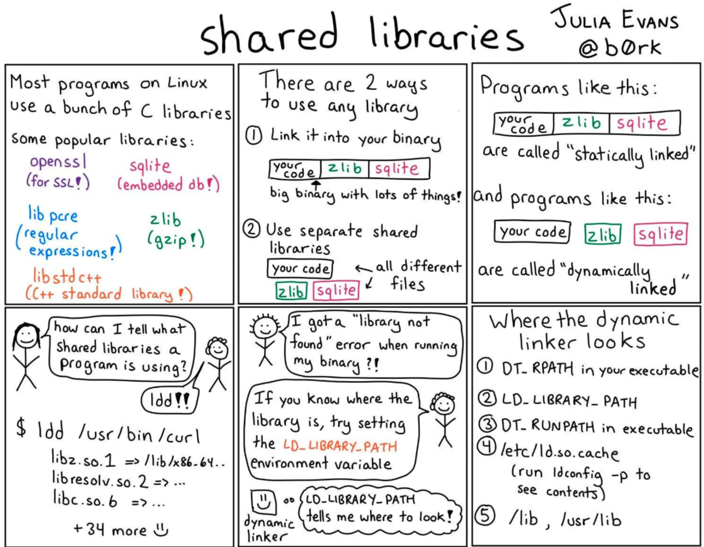

# Memoria

# Reflexion

# Memoria

Interposición: se pone entre los procesos y los recursos, se interpone entre ambos

cada proceso accede directo a memoria fisica 

## Problemas

### donde cada proceso accede directo a memoria

uno no debería poder meterse en la clase del rector

No se puede dar mas memoria que lo que tiene el sistema

El programador se encarga de la participación de información y memoria

se hacen duplicados y ocupan memoria

el dato tiene que estar cargado necesariamente en 0x402000 porque sino apunta a cualquier lado

el stack crece para abajo mientras que el heap crece para arriba, haciendo que pueda haber problemas

si nadie se interpone entonces todos tienen los mismos permisos

## Solucion

### Espacio de direcciones

numero marcado vs ubicacion/telefono

un mismo numero esta asociado a distintos servicios

cada instancia de bash tiene su propio espacio de direcciones, y después SO se encarga de evitar direcciones. Cada rayita es un mapeo realizado por el SO

# Falta una parte de paginación

# Analisis de Costos

la sola ejecución de una instrucción requiere acceso a memoria, podemos tener multiples accesos a memoria por cada instrucción

un dato puede no estar alineado (estar en dos paginas diferentes)

## Translation Lookaside buffer

se hacen muchas referencias a pocas paginas ya que la informacion esta junta

la tabla muestra frecuencia absoluta y el numero de pagina

porque cambiarias el page frame?

## Tabla de Pagina Multinivel

## Tablas de Paginas Invertidas

una entrada por cada PAGINA FISICA

asi se ahorra espacio de EDV

hace falta hacer una tabla hasheada de la virtual page, esto hace de indice de la PF correspondiente

# Algoritmo de remplazo de paginas

## Not recently used (NRU)

## First-in-First Out

## Second-Chance(SC)

si es la ultima y no fue referenciada entonces la borro, sino la paso al principio

## Clock(C)

## Least Recently Used(LRU)

la realidad es que esto no es mas que una estimacion

## Not Frecuently Used (NFU)

---

<!-- notas-relacionadas:inicio -->

## Notas relacionadas

**Misma materia (SO)**

- [Memory Management](Memory%20Management.md) — algoritmos de gestión
- [Procesos](Procesos.md) — espacio de direcciones del proceso

**Otras materias**

- **Arqui**  [Intro Sistemas Operativos(Paginación)](Intro%20Sistemas%20Operativos%28Paginación%29.md) — paginación y MMU en el hardware
- **Arqui**  [Memoria Cache](Memoria%20Cache.md) — jerarquía de memoria
- **PI**  [PI - Punteros en C](PI%20-%20Punteros%20en%20C.md) — qué es realmente una dirección

<!-- notas-relacionadas:fin -->
