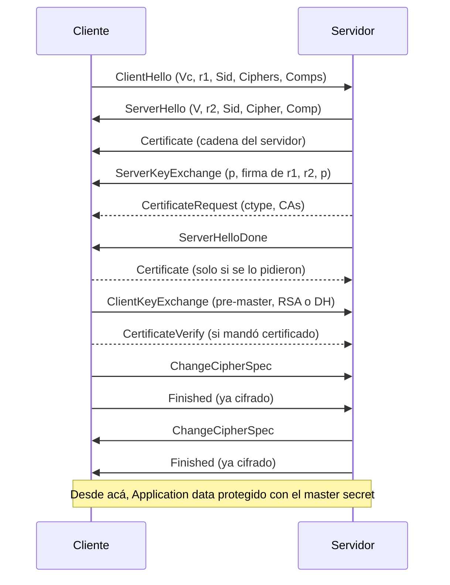

---
categories:
  - "[[ITBA.base|ITBA]]"
Tags: []
Created: "2026-09-1816:39"
Materia: "[[Criptografía y Seguridad.base|Criptografia y seguridad]]"
temas:
  - Protocolos criptográficos
  - Ataques activos
  - Man in the middle
  - PKI (Public Key Infrastructure)
  - Certificados digitales
  - Autoridad certificante
  - Cadena de confianza
  - AC raíz
  - Certificación cruzada
  - X.509
  - Validación de certificados
  - Revocación de certificados
  - CRL
  - OCSP
  - OCSP Stapling
  - Certificate Transparency
  - Needham-Schroeder
  - KDC (Key Distribution Center)
  - Kerberos
  - Token
  - Claves de sesión
  - Nonce
  - Challenge-response
  - Timestamp
  - Replay
  - Key reuse
  - Denning-Sacco
  - Canal seguro
  - TLS
  - SSL
  - TLS Record
  - TLS Handshake
  - Cipher suite
  - Master secret
  - Change Cipher Spec
  - TLS Alert
  - mTLS
  - Forward secrecy
  - Downgrade attack
  - Criptografía de umbrales
  - Secret sharing
  - Método de Shamir
  - Interpolación de Lagrange
---
# Protocolos

> [!abstract] De qué va la clase
> Un **protocolo criptográfico** combina de una forma concreta las primitivas que ya vimos (cifrado, MACs, hashes, firmas, intercambio de claves) para obtener servicios que ninguna da por separado. Hay cientos; la clase recorre cuatro, salteados, elegidos por los recursos que dejan y porque casi seguro aparecen en la vida profesional:
> 1. **PKI** — cómo atar una clave pública a una identidad (certificados). Resuelve el MITM que dejó abierto Diffie-Hellman en la [[Clase 4 - Criptografía - Cifrado asimétrico y Firma digital|clase anterior]].
> 2. **Needham-Schroeder** — intercambio de claves usando **solo** criptografía simétrica y un KDC. Lo que importa no es el protocolo sino los cuatro recursos que introduce: *token*, claves de vida corta, *nonce* + *challenge-response* y *timestamp*.
> 3. **TLS** — el protocolo más usado del planeta: construye un **canal seguro** sobre uno inseguro mezclando todo lo anterior.
> 4. **Criptografía de umbrales** (Shamir) — un bloque básico distinto: $n$ claves, y $t$ cualesquiera alcanzan para recuperar el secreto.
>
> Bibliografía: Bishop, *Computer Security: Art and Science*, **capítulo 11** (acá la materia pasa de criptografía "dura" a seguridad, y Bishop lo cubre mejor que el Katz) y el **RFC 8446** (TLS 1.3).

## PKI - Public Key Infrastructure

**De dónde veníamos.** Lo más avanzado que teníamos era el **criptosistema autenticado** (CCA-secure): da confidencialidad **e** integridad, con una condición que se venía escondiendo — que las dos partes *mágicamente* tengan la misma clave. Para conseguirla vimos el intercambio de claves:

$$\Pi: (n) \rightarrow \textit{Trans},\; k_a,\; k_b \qquad\text{con}\qquad k_a = k_b$$

y la prueba de seguridad de ese intercambio (el experimento $KE_{A,\Pi}$ de la clase 4) supone un atacante **pasivo**: escucha, obtiene información, pero no la modifica.

### Ataques Activos
para que helman funcione se asumen atacantes pasivos
el atacante activo puede:
- omitir mensajes
- Reescribir contenido de mensajes
- Reordenar mensajes
- repetir mensajes

Los esquemas de intercambio vistos hasta ahora no sirven con atacantes activos

los esquemas de intercambios de claves que vimos hasta ahora no funcionan

tipo de ataque: **man in the middle**

| Capacidad | Ejemplo |
|---|---|
| **Omitir** | el mensaje que $A$ le manda a $B$ nunca llega |
| **Reescribir** | cambia partes del contenido en tránsito |
| **Reordenar** | tal vez no puede tocar dos mensajes, pero sí hacerlos llegar en otro orden |
| **Repetir** | reenvía a propósito un mensaje válido, una o muchas veces (*replay*) |

> [!important] Error fortuito vs atacante
> Varias de estas cosas ya aparecían en otras materias: un paquete que se duplica en la red o una cola de mensajes que reentrega, y por eso se diseña con **idempotencia** (ver [[Resumen Protos]]). La diferencia que remarcó la clase es de fondo: en seguridad, el mensaje repetido o modificado **no** es ruido ni una falla del medio. Es un atacante **activo e inteligente** que lo hace a propósito, con una intención, y elige cuándo. A veces la solución se parece, pero el modelo de amenaza es otro: hay que asumir el peor caso, no el caso probable.

## Problemas
![[Pasted image 20260918164841.png]]

El problema no está en los criptosistemas: RSA o ElGamal siguen siendo seguros, con su prueba. Está en una de sus hipótesis. Para cifrar hacia $B$ hace falta $pk_B$, y en la clase 4 dijimos "no es problema, es pública, se la damos a todo el mundo". Era una simplificación: en la práctica $A$ se la **pide a alguien** (a $B$, a un endpoint, a un directorio — el REP de la slide), y ese pedido viaja por el mismo canal donde está el atacante. Si el atacante reenvía el pedido, intercepta la respuesta y cambia $pk_B$ por $pk_E$, $A$ no tiene cómo darse cuenta.

## Man in the middle
![[Pasted image 20260918164921.png]]

pide la clave de B y recibe la clave publica, A pensando que usa la clave de B en realidad usa otra clave y el man in the middle tiene la clave de B

Para entender un MITM conviene mirarlo desde cada punta:

$$A \xrightarrow{\;e_{pk_E}(M)\;} E \xrightarrow{\;e_{pk_B}(M')\;} B$$

- **Lo que cree $A$**: pidió la clave de $B$, le llegó *una* clave, cifra con ella y tiene confidencialidad (y si eligió bien el esquema, hasta integridad).
- **Lo que pasa**: cifró con $pk_E$. $E$ descifra con $sk_E$, **lee** $M$, puede **modificarlo** a $M'$, y lo vuelve a cifrar con la $pk_B$ legítima, que él sí pidió bien.
- **Lo que cree $B$**: le llegó un mensaje cifrado con su clave. Todo en orden.

Ninguno de los dos se entera, y se perdió confidencialidad **e** integridad sin romper ninguna primitiva. Es el mismo ataque que el MITM sobre Diffie-Hellman de la clase 4, con $pk$ en lugar de $g^x$. El problema entra en la esfera de la **administración de claves**.

## infrastructura de claves (PKI)

busca asociar identidad a las claves
![[Pasted image 20260918165402.png]]

busca evitar el man-in-the-middle

es un problema de identidad

> [!note] Identidad, integridad y autenticación
> En clase se preguntó con qué servicio de seguridad se asocia esto, y la respuesta fue **integridad**: igual que con los MACs, no se puede *evitar* que el atacante cambie la clave en tránsito, pero sí se puede **detectar** que la clave que llegó no es la que se pidió. Un reemplazo es un tipo de modificación.
> Las dos lecturas son compatibles: lo que se protege es la integridad de la **asociación** identidad ↔ clave. En general esto se llama **problema de autenticación**, y es el mismo que aparece en cualquier sistema entre una persona (algo externo) y el usuario que la representa (un concepto interno): si esa asociación se rompe, un tercero puede dar órdenes en nombre de otro.

**Objetivo**: que **cualquier** entidad del sistema pueda obtener la clave pública de **cualquier** otra, con garantías (ojalá criptográficas) de que corresponde a la identidad que necesita. No se puede evitar que exista un $E$ en el medio, pero si pedí la clave de $B$ y me llega otra, tengo que poder decir "esta no es la clave de $B$".

**Por qué no aplica a lo simétrico**: la solución va a ser un documento **público**, que cualquiera puede ver y reenviar. Eso tiene sentido para una clave pública; una clave simétrica publicada deja de servir.

La respuesta es un bloque básico nuevo: el **certificado**.

## Certificados
![[Pasted image 20260918165547.png]]

aparece en cualquier problema que requiera seguridad asimetrica

Es un bloque de información **estandarizado** (no es magia negra). Si alguna vez configuraron un servidor HTTPS, un firewall o un proxy, ya lidiaron con uno. De todos sus campos, los dos que importan son los dos primeros: **información de identidad** + **clave pública**. Básicamente dice "la clave de este bloque es de Pablo", seguido de un número gigante. Todo lo demás existe para **sostener** esa asociación en el tiempo:

- **Fecha de emisión e intervalo de validez.** La analogía de la clase es la tarjeta de crédito (y el diseño de hecho viene de ahí): la nueva llega un mes antes de que venza la vieja, para no quedarse sin ninguna, y el certificado se puede renovar antes de que expire. Las claves, como las llaves de casa, se pierden; y a diferencia de una llave física, son información, así que se **copian**. O las conocía alguien que se fue de la empresa. Cuanto más tiempo pasa, más chances de que la privada haya sufrido algún contratiempo, así que **todo certificado vence**. Según el uso, el intervalo va de años a minutos.
- **Firma digital de una autoridad competente** sobre **todo** el contenido. Sin esto no garantiza nada: que alguien escriba "esta es la clave de Pablo" no prueba nada; cualquiera podría cambiar el nombre por el de Rodrigo, o dejar el nombre y cambiar la clave. Es el equivalente digital de un documento firmado ante **escribano**.
- **Tipo de uso de la clave** — firmar mensajes, cifrar mails, firmar certificados, sitios web.

Estructura mínima:

$$\text{Cert}_B = \Big(\underbrace{\text{ID}_B,\; pk_B,\; \text{emisión},\; \text{validez},\; \text{uso},\;\dots}_{\text{TBS: lo que se firma}},\;\; \sigma = \operatorname{Sign}_{sk_{CA}}\big(H(\text{TBS})\big)\Big)$$

La identidad toma formas distintas según el dueño, pero siempre lo identifica **unívocamente**:

| Dueño | Identidad |
|---|---|
| Servidor | nombre de dominio o IP |
| Email (para mandar mails cifrados, también estandarizado) | la dirección de mail |
| Empresa | razón social |
| Persona física | un identificador nacional único (DNI, CUIT) |

> [!tip] Por qué importa el "tipo de uso"
> Si una misma clave se permite para combinaciones de uso distintas, aparecen ataques — sobre todo mezclando **cifrado y firma**. El ejemplo concreto está en la [[Clase 4 - Criptografía - Cifrado asimétrico y Firma digital|clase 4]]: en textbook RSA, *firmar* $m$ es calcular $m^d \bmod n$, que es exactamente lo mismo que *descifrar* $m$. Si la clave sirve para las dos cosas, pedirle a alguien que "firme" un criptograma es pedirle que lo descifre. Por eso el certificado declara para qué sirve la clave, y el que lo valida lo tiene que chequear.

> [!question] ¿El certificado no debería estar hecho a medida del mensaje? (pregunta de la clase)
> La duda: si no depende del mensaje, un atacante en el medio podría agarrar el certificado de un mensaje anterior y usarlo para uno nuevo.
> **No hace falta**, porque lo que certifica es una **clave pública**, no un mensaje. Si el atacante reenvía el certificado legítimo de $B$, genial: $A$ cifra con $pk_B$ y el atacante no puede hacer nada, porque para descifrar necesita $sk_B$, que obviamente nunca viaja en un certificado. De hecho se **quiere** que sea independiente del mensaje: se intercambia una vez y se usa hasta cansarse. (En el mundo simétrico la objeción sí valdría — otra razón por la que esto es de clave **pública**.)
> ¿Y si el atacante deja el nombre de $B$ y pone **su** clave? Rompe la firma de la CA, y eso es justo lo que detecta la verificación de integridad. Esa firma no la hace $B$ ni se genera en el momento: la hace una autoridad competente, cuando se emite el certificado.

### Uso de certificados

1. $A$ **solicita el certificado** de $B$ (en lugar de pedir la clave). Se lo puede dar $B$ mismo, como parte de la comunicación ("dame tu certificado", "tomá, este es el mío"), o cualquier otra entidad, por ejemplo un directorio público.
2. $A$ **verifica la identidad** del certificado: el campo *Common Name* (CN) y sus subcampos, con las convenciones de la tabla de arriba (`CN=<hostname>`, `CN=<email>`, `CN=<razón social>`).
3. $A$ **obtiene la clave pública**: viene en el certificado, junto con **para qué criptosistema** es (no llega "una clave en el éter", porque no hay un único criptosistema): RSA-2048, ECDSA P-256, etc.
4. $A$ **verifica la validez**: que el **tipo de uso** sea el que necesita (si quiere mandar mensajes cifrados, que no le pasen un certificado de firma) y la **vigencia** (que no haya expirado).
5. $A$ **verifica la integridad**: valida la firma digital de la autoridad. Y acá aparece el problema de fondo: **validar una firma requiere una clave pública**. ¿Cómo se obtiene la de la autoridad? → cadenas de firmas.

> [!warning] CN vs SAN: qué se verifica hoy
> La slide y la clase dicen que la identidad de un servidor se compara con el **CN**. Eso era así, pero hoy los navegadores **ignoran el CN** para servidores y comparan contra la extensión **Subject Alternative Name (SAN)**: Chrome sacó el soporte de CN en la versión 58 (2017), y el RFC 9525 (2023), que reemplazó al RFC 6125, ya no usa el CN como identificador. El certificado del ejercicio de más abajo trae justamente `SANs: www.itba.edu.ar`.
> Detalle de la slide: "DSA-EC 320" se llama **ECDSA**, y las curvas que se usan en la PKI web son P-256 y P-384. Con 256 bits ya se tienen 128 bits de seguridad.

## Cadena de firmas
![[Pasted image 20260918170706.png]]

los AC raices son grupos muy chicos que todos conocemos (ya vienen instaladas) son la base de confianza y son muy controlados

**Autoridad competente** = alguien en quien las partes de la comunicación **confían**. Y "confiar", en la práctica, significa algo muy concreto: **tener su clave pública** en la computadora donde corre el algoritmo que verifica el certificado. Si la tengo, la firma valida o no valida, y se acabó.

El problema es de escala. Uno confía en quien conoce; con alguien desconocido es difícil hablar de confianza. Y se quiere alcance **universal**: que dos partes cualesquiera, que no se conocen de antes, puedan certificarse.

| Ámbito | Quién firma | ¿Funciona? |
|---|---|---|
| Una empresa | la autoridad de la empresa; todos los empleados están subordinados a ella. A cada empleado nuevo se le genera un par de claves y se le da el certificado | Sí: hay una jerarquía única |
| Un país | el gobierno | Sí, para empresas y personas radicadas ahí |
| Universal | ¿? | No existe una autoridad en la que *todos* confíen. ¿El gobierno argentino acepta como válido un certificado firmado por el gobierno español? La respuesta corta es no |

La salida es convertir la confianza en una **cadena**: no conozco al que firmó, entonces él me da **su propio certificado** — mismo formato, diciendo "la CA *Pepito* tiene esta clave pública, con esta validez, y es una clave especial, que sirve para **firmar certificados**" —, firmado por otra CA. Si tampoco la conozco, me da el de esa, y así. La confianza se va trasladando eslabón por eslabón. Se corta en una **AC raíz**, cuyo certificado está **autofirmado** (emisor = sujeto).

El pilar de la PKI es que las raíces son un grupo **muy chico** de organizaciones que todos conocemos: vienen **precargadas** en los sistemas operativos, los navegadores y los runtimes que usan esta infraestructura (la JVM trae su propio almacén, `cacerts`). Hoy son más de un centenar, con un control muy riguroso, porque son la base de confianza de todas las comunicaciones que consideramos seguras en internet.

> [!warning] Instalar una raíz falsa es un ataque en sí mismo
> Si alguien logra meter una CA raíz trucha en el almacén de una máquina, esa CA puede emitir certificados totalmente apócrifos para cualquier sitio, que pasan todos los chequeos locales. Muchos ataques, más que instalar malware que corra en la máquina, **cambian los certificados** de la máquina: a partir de ahí se puede interceptar cualquier conexión.

## Cadenas de firmas (2)

Concepto de AC raíz: se confía en **una** autoridad certificante, y esa autoridad **delega** en otras la capacidad de firmar certificados. Se acostumbra a mandar cada certificado junto con los de las autoridades que lo respaldan:

$$\underbrace{C_A = C'_A \,\|\, C_{CA3} \,\|\, C_{CA2} \,\|\, C_{CA1}}_{A \text{ firmado por } CA3} \qquad\qquad \underbrace{C_B = C'_B \,\|\, C_{CA1}}_{B \text{ firmado por } CA1}$$

donde $C'_X$ es el certificado propio de $X$ y $CA3$ está firmada por $CA2$, que está firmada por $CA1$. En la práctica es raro que una raíz firme directamente un certificado final: las empresas grandes firman certificados **intermedios** para sus filiales de cada país, y esas emiten los de las empresas. Pero al fondo de la cadena siempre hay una raíz.

> [!question] ¿Quién consigue los certificados de las CAs intermedias? (pregunta de la clase)
> Existe un protocolo estandarizado para pedirle su certificado a cualquier CA (la URL viene en el propio certificado, en la extensión *Authority Information Access*), pero en la práctica **el que presenta el certificado manda la cadena entera**: el certificado, el de la autoridad que lo firmó, y así hasta la raíz. Del lado de $A$, pide el certificado y le llega todo el paquete para validar de una. No es un tema de seguridad sino de ingeniería: evita *round trips*. Pedir cada eslabón por separado queda como *fallback*, porque a escala es muy ineficiente. En TLS 1.3 la raíz incluso puede omitirse, porque el cliente ya la tiene (RFC 8446, §4.4.2).
> A la otra pregunta — ¿se usa cualquiera de las ~100 raíces? — la respuesta fue que, parado en un certificado, la verificación tiene que **llegar a una de ellas**, y cuál depende de la CA que intervino cuando el dueño pidió el certificado. Con **certificación cruzada** puede haber más de un camino válido hasta raíces distintas; el ejercicio de más abajo es un caso.

## Validaciones entre C.A
![[Pasted image 20260918171506.png]]


- **Opción 1**: $A$ confía directamente en la CA de $B$ (la agrega a su almacén).
- **Opción 2 — certificación cruzada**: cada CA emite un certificado con la identidad de la otra. El ejercicio de abajo es exactamente esto: *Amazon Root CA 1* aparece firmada por una raíz más vieja (*Starfield Services G2*), para que clientes que todavía no tenían a Amazon en su almacén igual pudieran validar.
- **En la práctica**: listas de CAs reconocidas en el sistema operativo, en los navegadores y en runtimes como la JVM.

### El sistema detrás: control cruzado

Acá la clase salió de la criptografía dura y pasó al sistema que se arma alrededor, para cubrir lo que no se puede cubrir solo a nivel técnico (lo que se va a ver más en la segunda parte de la materia). La historia mostró que los gobiernos no son buenos custodios de esto (suelen tener intereses cruzados), así que las raíces terminaron siendo de **empresas** — GoDaddy, Thawte, CertiSur, VeriSign y muchas más. Y también mostró que empresas y gobiernos son muy malos para proteger sus claves privadas. Entonces:

- **Registro público de certificados.** Lo que describió la clase — cada CA publica todo lo que emite, y todas escanean los certificados que circulan por internet y los buscan en el registro; si aparece uno que no está, se sanciona a la CA — es **Certificate Transparency** (RFC 6962): logs públicos *append-only* basados en árboles de Merkle. Chrome exige que todo certificado emitido desde el 30/4/2018 esté logueado; si no, lo rechaza directamente. Y los que vigilan los logs no son solo otras CAs: cualquiera puede hacerlo (por ejemplo, crt.sh).
- **Sanciones.** Una CA que emite mal puede ser sacada de los almacenes, y para una empresa que vive de esto es la quiebra. Casos: **DigiNotar** (2011, quebró), **Symantec** (Chrome y Mozilla dejaron de confiar en 2018; vendió el negocio a DigiCert), **Entrust** (Chrome dejó de confiar en los certificados que emitiera después del 31/10/2024).
- **Quién decide las raíces**: un grupo cerrado formado sobre todo por los desarrolladores de sistemas operativos y navegadores (el **CA/Browser Forum** y los *root programs* de Mozilla, Apple, Microsoft y Google). Ante un certificado firmado por una CA que no está en su registro, se actualizan las listas como si fuera un problema de seguridad y se saca a esa entidad.

> [!bug] El caso de Irán: no fue una CA alemana ni Telegram
> En clase se contó que el gobierno de Irán consiguió la CA de "una empresa alemana" y la usó para interceptar conexiones a **Telegram**. Los datos verificados:
> - La CA era **DigiNotar**, **holandesa**. En 2011 le entraron a los servidores y emitió más de 500 certificados fraudulentos, entre ellos uno para `*.google.com`.
> - Se usó para un MITM a escala país contra usuarios iraníes de **Gmail** (la investigación de Fox-IT identificó unas 300.000 cuentas). Telegram ni existía todavía (salió en 2013).
> - Se detectó porque **Chrome** tenía *pinning* de los certificados de Google.
> - DigiNotar fue removida de todos los almacenes y **quebró el 20/9/2011**: es el ejemplo típico de "empresas que quebraron" que mencionó la clase. Quién estuvo detrás tampoco quedó del todo claro (se lo atribuyó el mismo hacker iraní que había atacado a Comodo ese año).
>
> La mecánica sí es la que se explicó: con la clave de una CA confiable se generan en tiempo real certificados para el sitio al que el usuario se quiere conectar, y el navegador no ve nada raro.

> [!warning] Cómo se agrega o se saca una raíz
> Se dijo en clase que para introducir una CA raíz nueva por los canales regulares, el pedido tiene que venir **avalado y firmado por otras $n$ autoridades certificantes**, y que el software rechaza las actualizaciones que no vengan así. No es así como funcionan los *root programs*: cada programa (por ejemplo, el de Mozilla) decide la inclusión después de **auditorías** (WebTrust o ETSI) y una **discusión pública** del pedido (en Mozilla, en la lista `dev-security-policy`). La actualización le llega al usuario como una actualización del SO o del navegador, firmada por su proveedor, no por otras CAs.

### Cómo se protege la clave de una raíz

> [!question] "Si trabajo en una CA y me emito un certificado para bankofamerica.com, ¿qué pasa?" (pregunta de la clase)
> Lo peor que le puede pasar al sistema es que roben la clave privada de una raíz: a partir de ahí se puede generar cualquier cosa. Las defensas que contó la clase:
> - **Usar la raíz lo menos posible.** La raíz firma unos pocos certificados de **nivel 1** (por ejemplo, 10, uno por país) y **no se vuelve a usar**. Cada nivel 1 firma certificados de **nivel 2** (por ejemplo, uno por año), que son los que firman todo lo demás. Generar un certificado requiere una firma, una firma requiere acceder a la clave privada, y ese acceso es justamente cuando te la pueden robar o copiar. Cuanto más potente la clave, menos se usa.
> - **Custodia física.** Las raíces y las de nivel 1 se generan en computadoras **sin conexión a internet** (una especie de cámara estanca), y la clave privada se **parte** en 3 o 4 pedazos que se mandan físicamente a lugares distintos, para que nunca esté entera en una computadora. Se guarda para una crisis monumental.
> - **Validez decreciente hacia abajo.** Las raíces duran mucho (las primeras, unos 30 años); los certificados finales, poco. Es lo contrario de lo que diría la intuición: cuanto más potente la clave, **más** dura.
>
> Lo que responde la pregunta de verdad es **Certificate Transparency**: el certificado trucho para bankofamerica.com tiene que aparecer en un log público o los navegadores lo rechazan, y ahí lo ve el banco. Además están los registros DNS **CAA** (RFC 8659, que las CAs están obligadas a respetar desde 2017), donde el dueño del dominio declara qué CAs pueden emitirle certificados.

> [!note] ¿La validez del hijo tiene que estar contenida en la del padre?
> En clase se dijo que a cada CA se le pide que el período de validez de lo que firma esté **contenido** en el suyo (una raíz válida hasta 2020 no puede firmar un certificado de 2024). La slide *Verificación de certificados X.509* pide algo más débil: que la CA esté vigente **al comienzo** del período del certificado que firma.
> El RFC 5280 (el que define la validación de caminos X.509) no exige ninguna de las dos: pide que **todos** los certificados de la cadena estén vigentes **en el momento de verificar**. El anidamiento es una buena práctica, no una regla del estándar, y el propio ejercicio de la clase la viola: *Amazon Root CA 1* vale hasta **2037**, y quien la firma (*Starfield Services Root G2*, en su versión cruzada) solo hasta **2034**. Es una cadena real, que fue válida.

### Certificados X.509

Para que interoperen empresas de distintos países, con distintas tecnologías y clientes de todo tipo, hace falta estandarizar un montón de cosas. El formato de certificados que quedó de facto con alcance mundial es **X.509**, versión 3: un empaquetado binario (ASN.1/DER) muy bien definido.

| Campo | Qué es |
|---|---|
| Versión | `3 (0x2)` — la versión 3 se codifica como 2 |
| Número de serie | identificador único dentro de la CA; es la forma rápida de buscarlo en su registro público y en las listas de revocación |
| Algoritmo de firma | con qué firmó la CA |
| Emisor (*issuer*) | nombre de la CA |
| Validez | `Not Before` / `Not After` |
| Sujeto (*subject*) | a nombre de quién está la clave (el CN va acá) |
| Clave pública del sujeto | algoritmo + clave |
| Extensiones (v3) | uso de la clave, *Basic Constraints* (¿es CA?), SAN, etc. |
| Firma | firma de la CA sobre el hash de todo lo anterior |

El certificado real que mostró la clase (el volcado legible de un certificado binario), anotado:

```
Certificate:
    Data:
        Version: 3 (0x2)
        Serial Number: 1 (0x1)
        Signature Algorithm: md5WithRSAEncryption              ← MD5 + RSA (obsoleta)
        Issuer: C=ZA, ST=Western Cape, L=Cape Town, O=Thawte Consulting cc,
                OU=Certification Services Division,
                CN=Thawte Server CA/Email=server-certs@thawte.com
        Validity
            Not Before: Aug  1 00:00:00 1996 GMT                ← 24 años de validez
            Not After : Dec 31 23:59:59 2020 GMT
        Subject: C=ZA, ST=Western Cape, L=Cape Town, O=Thawte Consulting cc,
                 OU=Certification Services Division,
                 CN=Thawte Server CA/Email=server-certs@thawte.com  ← = Issuer → raíz
        Subject Public Key Info:
            Public Key Algorithm: rsaEncryption                ← para qué criptosistema
            RSA Public Key: (1024 bit)
                Modulus (1024 bit):                            ← el n de RSA
                    00:d3:a4:50:6e:c8:ff:56:6b:e6:cf:5d:b6:ea:0c:
                    68:75:47:a2:aa:c2:da:84:25:fc:a8:f4:47:51:da:
                    85:b5:20:74:94:86:1e:0f:75:c9:e9:08:61:f5:06:
                    6d:30:6e:15:19:02:e9:52:c0:62:db:4d:99:9e:e2:
                    6a:0c:44:38:cd:fe:be:e3:64:09:70:c5:fe:b1:6b:
                    29:b6:2f:49:c8:3b:d4:27:04:25:10:97:2f:e7:90:
                    6d:c0:28:42:99:d7:4c:43:de:c3:f5:21:6d:54:9f:
                    5d:c3:58:e1:c0:e4:d9:5b:b0:b8:dc:b4:7b:df:36:
                    3a:c2:b5:66:22:12:d6:87:0d
                Exponent: 65537 (0x10001)                      ← el e de RSA
        X509v3 extensions:
            X509v3 Basic Constraints: critical
                CA:TRUE                                        ← la usa una CA
    Signature Algorithm: md5WithRSAEncryption
        07:fa:4c:69:5c:fb:95:cc:46:ee:85:83:4d:21:30:8e:ca:d9:    ← σ, la salida de Sign
        a8:6f:49:1a:e6:da:51:e3:60:70:6c:84:61:11:a1:1a:c8:48:
        3e:59:43:7d:4f:95:3d:a1:8b:b7:0b:62:98:7a:75:8a:dd:88:
        4e:4e:9e:40:db:a8:cc:32:74:b9:6f:0d:c6:e3:b3:44:0b:d9:
        8a:6f:9a:29:9b:99:18:28:3b:d1:e3:40:28:9a:5a:3c:d5:b5:
        e7:20:1b:8b:ca:a4:ab:8d:e9:51:d9:e2:4c:2c:59:a9:da:b9:
        b2:75:1b:f6:42:f2:ef:c7:f2:18:f9:89:bc:a3:ff:8a:23:2e:
        70:47
```

Lo que hay que saber leer: el **subject** es a nombre de quién está la clave pública, y el **subject public key info** es la clave. Normalmente el subject es el que pedimos y el issuer es quien lo firmó. Acá son **iguales**, y así se reconoce una **raíz**: cuando la verificación de una cadena llega a un certificado así, se termina. O está en el almacén local y pasa todo, o no está y muere todo.

> [!success] Verificado
> El módulo ocupa 129 bytes en el volcado, pero el primero es el `00` que DER agrega para que el entero no se lea como negativo (el byte siguiente, `d3`, tiene el bit alto en 1). Sin él quedan 128 bytes = **1024 bits** exactos, como dice el encabezado. El exponente es el clásico $e = 65537 = 2^{16}+1$.

> [!bug] Thawte no es de Estados Unidos
> En clase se leyó el emisor como "una empresa que está en Estados Unidos, en Cape Town". `C=ZA` es **Sudáfrica** (Cape Town está en la provincia de Western Cape, que es el `ST`). Thawte la fundó Mark Shuttleworth en Sudáfrica en 1995, y VeriSign la compró en 1999.

> [!warning] Por qué este certificado hoy sería inaceptable
> Además de estar vencido: firmar certificados con **MD5** está roto en la práctica. En diciembre de 2008 (25C3) Sotirov, Stevens y otros usaron una colisión de prefijo elegido de MD5 para fabricar un **certificado de CA trucho** a partir de uno legítimo de RapidSSL. Y RSA-1024 está prohibido por NIST desde 2013 (ver la [[Clase 4 - Criptografía - Cifrado asimétrico y Firma digital|clase 4]]).

### Verificación de certificados X.509

La idea es la misma de antes, y todo se hace **offline**: llega el bloque de información y todas las verificaciones son locales.

1. **Obtener la clave pública del emisor** — de la cadena que vino con el certificado, o del almacén del sistema si es raíz. Si no conozco al que firmó, **verificar recursivamente** su certificado, y así hasta llegar a una raíz.
2. **Verificar la integridad** — validar la firma con el algoritmo indicado y la clave del emisor. A partir de acá se puede asumir que **ningún dato cambió** desde que se emitió.
3. **Verificar el intervalo de validez** — tiene que estar vigente, y la CA tenía que estar vigente al comienzo de ese período.
4. **Verificar la identidad** — comparar el nombre con el que espera la aplicación: si pedí la clave pública de $B$, que el certificado diga "esta clave es de $B$" y no de $E$ o de $J$. Depende del uso.
5. **Verificar el uso** — que esté autorizado para lo que lo quiero usar (si quiero cifrar, que diga que la clave es para cifrar).

Si pasa todo, tengo la clave pública y la uso para lo que haga falta.

> [!important] Por qué se llama infraestructura de clave **pública**
> Todo este andamiaje no produce mensajes seguros ni canales seguros: produce **una clave pública con garantías de que nadie la modificó**. Después se usa para lo que se necesite — a veces para cifrar, a veces para verificar firmas. Es independiente del uso.

### Ejercicio: validar una cadena real

![[Clase 5 - Ejercicio validacion de certificados.png|600]]

*Describir todas las validaciones necesarias.* Es la cadena del certificado de `www.itba.edu.ar` en 2017:

| # | Certificado | Emisor | Validez |
|---|---|---|---|
| 1 | `www.itba.edu.ar` | Amazon (Server CA 1B) | 6/6/2017 – 7/7/2018 |
| 2 | Amazon, *Server CA 1B* | Amazon Root CA 1 | 21/10/2015 – 18/10/2025 |
| 3 | Amazon Root CA 1 | Starfield Services Root CA - G2 | 25/5/2015 – 30/12/2037 |
| 4 | Starfield Services Root CA - G2 | Starfield Technologies, Inc. | 1/9/2009 – 28/6/2034 |

1. **Armar la cadena**: el emisor de cada uno tiene que ser el sujeto del siguiente. 1 → 2 → 3 → 4 cierra. Pero el 4 **no es raíz**: su emisor (*Starfield Technologies, Inc.*, la *Starfield Class 2 Certification Authority*) no es él mismo. La cadena termina en un certificado que **no vino** en el paquete: tiene que estar en el almacén local, o la validación falla.
2. **Firmas**, de arriba hacia abajo: la del 4 con la clave de Starfield Class 2 (del almacén), la del 3 con la del 4, la del 2 con la del 3, la del 1 con la del 2. Todas `sha256WithRSAEncryption`.
3. **Vigencia** de **los cuatro** en el momento de conectarse. Con la regla de la slide (la CA vigente al comienzo del período del hijo): el 1 empieza en 2017 y el 2 ya valía ✓; el 2 empieza en octubre de 2015 y el 3 ya valía ✓; el 3 empieza en mayo de 2015 y el 4 ya valía ✓.
4. **Identidad**: que `www.itba.edu.ar` esté en el **SAN** del certificado 1. Ojo: `itba.edu.ar` a secas **no** matchearía.
5. **Uso**: el 1 tiene que estar habilitado para autenticar servidores (*Extended Key Usage* `serverAuth`); el 2, el 3 y el 4 tienen que ser CAs (`CA:TRUE` y uso `keyCertSign`).
6. **Revocación** de todos los que no son raíz (CRL u OCSP).
7. **Algoritmos**: SHA-256 con RSA es aceptable; MD5 o SHA-1 ya no.

> [!bug] Las etiquetas de la imagen están mal
> El segundo certificado dice **Root**, pero es una CA **intermedia** (*Server CA 1B*, firmada por *Amazon Root CA 1*). Y **ninguno** de los cuatro es raíz: el último también está firmado por otro. Es una cadena con **certificación cruzada**: *Amazon Root CA 1* está firmada por *Starfield Services G2*, y esta a su vez por *Starfield Class 2* (operada por GoDaddy), que ya estaba en todos los almacenes. Así los clientes viejos, que todavía no tenían a Amazon, igual podían validar.

> [!success] Verificado contra los certificados reales, y el resultado en 2026
> El número de serie del cuarto (`12037640545166866303` = `0xa70e4a4c3482b77f`, lo chequeé) y su validez (2009–2034) coinciden con el certificado real de *Starfield Services Root CA - G2* firmado por *Starfield Class 2*.
> Hoy esta cadena **falla por tres lados**: el certificado del servidor venció en 2018, la intermedia *Server CA 1B* venció en octubre de 2025, y Chromium y Mozilla anunciaron que dejaban de confiar en *Starfield Class 2* desde abril de 2025 (por eso AWS dejó de usar esa firma cruzada en agosto de 2024).

## Revocacion de claves
puedo no confiar en que la clave esta segura
![[Pasted image 20260918172035.png]]

Revocar = **invalidar un certificado antes de su vencimiento**. Si llega la fecha de expiración, listo, no hace falta revocar nada. Pero puedo tener todos los certificados del mundo bien configurados y otro problema de seguridad por otro lado: me entraron al servidor, el administrador que generó la clave se fue de la empresa, le instalaron un virus a alguien con acceso a la privada... y el certificado vence recién el año que viene.

> [!important] El choque con la validación offline
> Todas las operaciones de validación de un certificado se diseñaron para ser **offline**. Si el dueño quiere invalidar un certificado que hoy es válido y el cliente recibe el viejo, va a creer que sigue valiendo. Hace falta un mecanismo para saber que un certificado que a todas luces parece válido **no** está revocado — y eso rompe la idea: obliga a empezar a llamar a servidores ("¿este está revocado? ¿y este?"). Todo lo que sigue son formas de escalar eso.

**No revocar lo que no hay que revocar.** Revocar no puede ser una operación tan fácil: si la competencia pudiera apretar un botón diciendo "robaron el certificado del sitio de mi competencia", y eso lo revocara automáticamente, habría un tendal de sitios muertos. Cómo lo manejan las CAs:

- **La prueba fuerte: la clave privada.** Si ya creo que está comprometida, no tiene sentido no mostrarla: ya se perdió. Y si la muestro, la CA sabe con certeza que dejó de ser privada, así que no tiene sentido no revocar. En ACME, el protocolo de Let's Encrypt (RFC 8555), alcanza con **firmar** el pedido de revocación con esa clave: prueba la posesión sin tener que entregarla.
- **Si perdí la privada** (me destrozaron el servidor y ni yo tengo acceso): canales complementarios — llamadas, verificación de identidad — y una **compuerta temporal**: la CA le manda un mensaje al dueño registrado (al mail que registró, por ejemplo) y le da 24 horas para anular la revocación. Si alguien se hizo pasar por el dueño por ese otro canal, hay una medida compensatoria.

## Listas de revocacion

La primera optimización: en vez de preguntar por cada certificado, **bajar la lista**. La analogía de la clase: cuando las tarjetas de crédito permitían procesar transacciones offline (el voucher impreso en una maquinita, en algún punto perdido sin conectividad, que el negocio llevaba a fin de mes), el primer lugar al que iría alguien con una tarjeta robada era uno de esos. Entonces se distribuían libros gigantes, ordenados, con los números de tarjetas robadas, y el comercio buscaba el número antes de aceptar.

- **CRL** (*Certificate Revocation List*): la misma idea, online. Cada CA ofrece un servicio para bajar la lista (firmada) de sus certificados revocados. Listado actual (vigentes y revocados) o histórico (expirados y revocados).
- En X.509 **solo el emisor** de un certificado puede revocarlo; se agrega a la CRL de esa CA.
- La lista se puede bajar para validar offline, o consultarla online.
- **No crece infinitamente**: cuando un certificado revocado vence, sale de la lista (ya falla por la validación de fechas).
- El problema: **no hay una lista, hay una por CA**, y hay que bajarlas y mantenerlas actualizadas. Igual es una primera forma de que, por ejemplo, un servidor que hace muchas validaciones todo el tiempo no tenga que consultar online cada vez.

## online Certificate Status Protocol
![[Pasted image 20260918172521.png]]

La clase presentó dos formas de usarlo:

1. **Consulta online** (la primera generación, que sigue existiendo y se usa): el cliente le pregunta a la CA por un certificado que firmó y le responde si está revocado. La URL del servicio viene en el propio certificado — no hay que saberla de memoria. Es caro: una consulta por cada cliente y cada conexión.
2. **OCSP Stapling** (el "estado del arte" según la clase): una **prueba de vida**, por poco tiempo y **en positivo**. En vez de que el cliente pregunte "¿está revocado?", el **dueño** del certificado consigue periódicamente una respuesta firmada por la CA que dice "en este momento verifiqué que este certificado es válido", y la **abrocha** (*staple*) a la cadena que manda. El costo pasa del que pide al que emite: un servidor al que se conectan millones de clientes hace **una** consulta cada tanto, en lugar de que cada uno de esos millones haga la suya. Y la validación del cliente vuelve a ser **offline**.

Es configuración extra: es típico en sitios de mucho tráfico; el sitio de cinco visitas por día que solo quiere el candadito (porque hoy sin él la gente no se conecta) probablemente no tiene nada configurado. Las bibliotecas de validación suelen **fallar por defecto** si no les llega toda la información — no se quiere un código que ante cualquier certificado empiece a hacer llamadas a cualquier sitio del planeta —, y hay que habilitarles explícitamente que verifiquen revocación online, por qué proxy, con qué restricciones. El navegador, en cambio, trae todo eso resuelto, con *fallback* para ir a buscar lo que no le llegó.

> [!bug] OCSP no es un certificado X.509
> A la pregunta de si X.509 "tiene adentro" OCSP, en clase se respondió que la respuesta OCSP es "un certificado X.509 con otros campos, un caso particular", y la slide dice *"Es un certificado"*. No: la respuesta OCSP es **otra estructura ASN.1** (`BasicOCSPResponse`, RFC 6960), con sus propios campos (`thisUpdate`, `nextUpdate`, el estado de cada certificado consultado), **firmada** por la CA o por un *responder* designado por la CA. Lo que puede traer adentro son certificados X.509: los que hacen falta para verificar la firma del *responder*. Comparte con los certificados la codificación (DER) y la idea de "dato firmado por la CA", no el formato.
> Lo que sí es correcto: si la cadena de confianza tiene $N$ certificados y viene con stapling, llegan $N$ certificados **más** una respuesta OCSP aparte.

> [!bug] ¿Cuánto dura una respuesta OCSP?
> Tres números distintos: la clase dijo **5 o 10 minutos**, la slide dice **1 hora a 7 días**, y las *Baseline Requirements* del CA/Browser Forum (las reglas que tienen que cumplir las CAs de la web) exigen entre **8 horas y 10 días**. Vale el último.

> [!warning] Cómo está esto en 2026
> El panorama de la revocación cambió después de que se armaron las slides:
> - **Chrome no consulta OCSP** desde 2012 (usa sus propias listas, *CRLSets*), y Firefox usa *CRLite*: la tendencia es que el navegador procese del lado del proveedor todas las CRLs conocidas y distribuya un resumen.
> - En **agosto de 2023** el CA/Browser Forum hizo OCSP **opcional** y las CRL **obligatorias**. **Let's Encrypt apagó su OCSP el 6/8/2025**, por privacidad: cada consulta le dice a la CA qué IP está visitando qué sitio.
> - La otra salida es que los certificados **duren poco**. La votación SC-081 del CA/Browser Forum bajó la validez máxima de los certificados TLS: **398 días** hasta el 14/3/2026, **200 días** desde el 15/3/2026 (lo vigente hoy), **100** desde el 15/3/2027 y **47** desde el 15/3/2029. Con 47 días, la revocación importa mucho menos.
> - Typo de la slide: es *Stapling*, con una sola p.

## Resumen de certificados
![[Pasted image 20260918172646.png]]

**¿Qué es, entonces, una PKI?** Los **certificados** (el corazón de todo) **+** un **protocolo estandarizado** para pedirlos, recibirlos y revocarlos. Todo está en RFCs públicos — cómo es la URL, en qué formato se pasa la información, qué vuelve —, igual que el formato de los certificados, porque el objetivo es alcance mundial: empresas distintas, con stacks distintos, de países e idiomas distintos. La revocación también es parte de la PKI.

| Pregunta | Respuesta |
|---|---|
| ¿Qué problema resuelven? | La **integridad** de las claves públicas: la asociación clave ↔ identidad |
| ¿Con qué primitiva? | **Firma digital**, usada de forma creativa |
| ¿Se validan online? | No, **offline**, salvo la revocación |
| ¿Quién los garantiza? | Otra entidad, formando **cadenas de confianza** hasta una raíz preinstalada |
| ¿Qué hay que cuidar? | La revocación: configurar la validación para que no la chequee y sea siempre offline es asumir un riesgo |


# Intercambio Simetrico 

En la clase 4 vimos el **KDC** (*Key Distribution Center*) como tercero de confianza que ayuda a establecer la comunicación segura. Es la solución a un problema más general: el intercambio de claves también tiene solución usando **solo criptografía simétrica**. El problema ya lo conocemos (hasta vimos una prueba de seguridad y Diffie-Hellman como implementación); el interés acá está en desarmar el protocolo y sacar **cuatro recursos** que sirven para diseñar cualquier comunicación segura.

## Protocolo Needham-Schroeder

- Protocolo de intercambio de claves **simétricas** (Needham y Schroeder, 1978). Es la base de Kerberos, de Active Directory y de la gran mayoría de los KDC, con modificaciones.
- Requiere un **servicio centralizado** (el KDC) y genera **claves de sesión** entre pares.
- Hipótesis: cada entidad comparte **de antemano** una clave de larga duración con el KDC — $k_a$ entre $A$ y el KDC, $k_b$ entre $B$ y el KDC. Eso es lo que significa que "el KDC conoce a $A$ y a $B$" y que ellos confían en él. Lo que **no** existe es una clave entre $A$ y $B$, ni entre ningún par de entidades cualesquiera del sistema. Por eso escala cuando hay muchas.

Notación del paper (un poco distinta a la que veníamos usando): $\{M\}_k = e_k(M)$.

## Primera aproximacion

![[Clase 5 - Needham-Schroeder primera aproximacion.png|560]]

La idea más simple: $A$ le pide ayuda al KDC, y el KDC **se inventa** una clave nueva $k_s$ y se la devuelve a $A$ **dos veces**, cifrada para cada uno.

$$\begin{aligned}
&1.\ A \rightarrow \text{KDC}: && \{\text{Sesión } A \rightarrow B\}_{k_a}\\
&2.\ \text{KDC} \rightarrow A: && \{k_s\}_{k_a} \,\|\, \{k_s\}_{k_b}\\
&3.\ A \rightarrow B: && \{k_s\}_{k_b}
\end{aligned}$$

$A$ descifra la primera parte y recupera $k_s$. ¿Y qué puede hacer con la segunda? La respuesta corta es **nada**: viene cifrada con una clave que $A$ no tiene; si es un cifrado autenticado, ni siquiera la puede modificar sin que se note. Para $A$ es un bloque aleatorio. Lo único que puede hacer es **reenviársela a $B$**, que sí la descifra. Después de estos tres mensajes los dos conocen $k_s$ y se pueden comunicar de forma segura. Súper simple.

> [!tip] Recurso 1: token
> Una pieza de información ofuscada (generalmente cifrada) que alguien **recibe para pasársela a otro**, que es quien le saca la utilidad. Se dice que $A$ recibe la clave de sesión y un **token para $B$**: $\{k_s\}_{k_b}$. Este concepto de recibir algo solo para pasarlo de mano es súper importante en un montón de protocolos.

El problema es que es demasiado simple y tiene veinte mil problemas de seguridad. Los dos de la slide que sigue:

![[Pasted image 20260918173446.png]]

- **Replay**: desde el punto de vista de $B$, la comunicación **empieza en el mensaje 3**: recibe una $k_s$ y a partir de ahí mensajes cifrados con ella. Si un atacante grabó el mensaje 3 y todo lo que $A$ y $B$ se mandaron después, puede repetir la comunicación entera otro día, y pasa todos los chequeos de seguridad. $B$ no sabe que no está hablando con $A$.
- **Key reuse**: un atacante activo graba los dos primeros mensajes. Otro día, cuando $A$ hace un pedido nuevo, lo ignora (no lo deja llegar) y le contesta con el mensaje 2 **grabado**. $A$ lo descifra sin problema, pero termina usando **la misma $k_s$ del día anterior**. Se puede forzar a $A$ y $B$ a usar siempre la misma clave.

> [!tip] Recurso 2: claves de vida corta y de vida larga
> Si $A$ y $B$ repiten el protocolo cada vez que se comunican, cada sesión usa una $k_s$ **distinta**. Si alguien guarda sesiones y logra sacar una clave, solo ve el contenido de **esa** sesión, no de todas las siguientes. Por eso las $k_s$ suelen ser de **vida corta**, y las $k_a, k_b$ (de **vida larga**) se usan poco: solo para transportar las cortas. En muchos sistemas se trabaja con múltiples claves así.
> La justificación técnica: las pruebas de seguridad tienen una dimensión que cuantifica el esfuerzo del atacante en función de la **cantidad de mensajes** que tiene disponibles. Igual que en la primera clase (un mensaje chiquito es más difícil de descifrar que uno grande), a más bloques cifrados con una misma clave, más chances de montar algún ataque — y eso se puede cuantificar matemáticamente.
> El mismo concepto aparece en **OAuth** (el "loguearse con la cuenta de Google"): un *access token* de vida corta y un *refresh token* de vida larga.
>
> Por eso es grave que un protocolo permita **forzar** la repetición de una clave que debería ser de vida corta.

## segunda aproximacion 


![[Pasted image 20260918173643.png]]

Este sí es el protocolo **Needham-Schroeder** (en colores, lo que cambia respecto de la primera versión):

$$\begin{aligned}
&1.\ A \rightarrow \text{KDC}: && A \,\|\, B \,\|\, r_1\\
&2.\ \text{KDC} \rightarrow A: && \{A \,\|\, B \,\|\, r_1 \,\|\, k_s \,\|\, \underbrace{\{A \,\|\, k_s\}_{k_b}}_{\text{token}}\}_{k_a}\\
&3.\ A \rightarrow B: && \{A \,\|\, k_s\}_{k_b}\\
&4.\ B \rightarrow A: && \{r_2\}_{k_s}\\
&5.\ A \rightarrow B: && \{r_2 - 1\}_{k_s}
\end{aligned}$$

Los primeros tres pasos son conceptualmente iguales: $A$ pide ayuda, el KDC le devuelve un token (lo azul) que $A$ le reenvía a $B$. Qué garantiza cada cambio (slide *Explicación*):

- **Mensaje 1** — $A$ avisa que quiere una comunicación **entre $A$ y $B$** y manda un número aleatorio $r_1$.
- **Mensaje 2** — cifrado con $k_a$, así que proviene del KDC. **No es una repetición**, porque el $r_1$ recibido coincide con el enviado: mañana $A$ va a iniciar otra conversación con otro número, y si alguien le repite un mensaje 2 viejo, los números no van a coincidir y $A$ se da cuenta. Además repite $A$ y $B$ adentro, para que $A$ sepa que no le están reutilizando una respuesta de una comunicación **con otras entidades**.
- **El token ahora lleva la identidad del origen** ($A$) además de $k_s$: cuando le llega a $B$, sabe **con quién** se está conectando. Pero eso solo no alcanza: un atacante podría interceptar el mensaje 3 hoy y mandárselo mañana a $B$. Eso lo validan los pasos 4 y 5.
- **Mensaje 4** — solo $B$ puede mandarlo (solo él pudo sacar $k_s$ del token). Le avisa a $A$ de un intento de comunicación.
- **Mensaje 5** — $A$ confirma la comunicación, y $B$ sabe que no es una repetición gracias a $r_2$.

> [!tip] Recurso 3: nonce + challenge-response
> - **Nonce** ($r_1$, $r_2$; en algunos protocolos se lo llama número aleatorio, en otros *nonce*): es una de las dos herramientas más efectivas que tenemos para evitar **ataques de repetición**.
> - **Challenge-response** (pasos 4 y 5): $B$ quiere asegurarse de una información que recibió sin suficiente garantía criptográfica — que del otro lado está $A$. La única otra parte que conoce $k_s$ (ignorando al KDC) debería ser $A$, así que $B$ le lanza un desafío: "si conocés $k_s$, te mando un número; devolvémelo cifrado con la clave de sesión, pero modificado". La forma más básica: devolver $r_2 - 1$. Como $B$ genera un número distinto en cada desafío, repetir un challenge-response viejo no sirve.
>
> ¿Por qué hacen falta trucos así? Los ataques de *replay* violan la integridad (violan la confianza en el sistema), pero **ninguna primitiva criptográfica los detecta**: se puede detectar si a un mensaje le cambian algo o lo hacen más largo o más corto, pero un mensaje repetido llega con su control de integridad **válido** y pasa la verificación. Es el truco favorito de las películas tipo *Misión Imposible*: ponerle a la cámara de vigilancia del pasillo la imagen en loop. Cualquier sistema de seguridad que no sea muy berreta tiene técnicas para detectarlo, pero no salen de los mecanismos tradicionales.

> [!note] ¿Por qué $r_2 - 1$ y no $r_2$ de vuelta?
> Porque $\{r_2\}_{k_s}$ es exactamente el mensaje 4. Si la respuesta esperada fuera la misma que el desafío, un atacante podría **reflejarle** a $B$ su propio mensaje como respuesta, sin conocer $k_s$. Sirve cualquier transformación que solo pueda hacer quien descifró; $-1$ es la más simple.

### El ataque de Denning-Sacco

![[Clase 5 - Ataque Denning-Sacco.png|560]]

Según la clase, durante mucho tiempo esto fue lo que se usó. En 1981, Denning y Sacco plantearon un escenario un poco tirado de los pelos pero que se volvió importante: un atacante graba una sesión hoy, le dedica **cinco años** y de alguna manera logra sacar la $k_s$ de esa sesión, con lo que puede leer todos los mensajes que se intercambiaron. La premisa de las claves cortas decía: listo, eso le sirve solo para esa sesión, información obsoleta hace cinco años.

El problema: con esa $k_s$ vieja, $E$ entra en el **paso 3**, que es donde empieza a interactuar $B$. Le manda el token viejo $\{A \,\|\, k_s\}_{k_b}$; $B$ le lanza el desafío $\{r_2\}_{k_s}$ para ver si es $A$, y $E$ **lo puede contestar**, porque conoce esa clave de sesión vieja. **$E$ logra impersonar a $A$**: al repetir el mensaje viejo, forzó a $B$ a volver a usar la clave de sesión de hace cinco años.

Nada en el token dice **cuándo** se generó. Es un problema de **repetición**, con un horizonte de tiempo mucho más largo: se abusa de que la clave larga ($k_b$) sigue siendo válida para repetir, quizás años después, un mensaje que la obliga a reusar una clave corta ya descubierta. Si pasa, se pierde otra vez la posibilidad de una comunicación segura entre $A$ y $B$.

### Modificacion Denning-Sacco

![[Clase 5 - Modificacion Denning-Sacco.png|560]]

El arreglo, que es la base de Kerberos y de Active Directory: agregar una pieza de información que tiene que ir y volver — un **timestamp** $T$, una marca de tiempo (lo rojo de la slide):

$$\begin{aligned}
&2.\ \text{KDC} \rightarrow A: && \{A \,\|\, B \,\|\, r_1 \,\|\, k_s \,\|\, \{A \,\|\, T \,\|\, k_s\}_{k_b}\}_{k_a}\\
&3.\ A \rightarrow B: && \{A \,\|\, T \,\|\, k_s\}_{k_b}
\end{aligned}$$

$T$ es una lectura del reloj en el momento en que el KDC generó el token: segundos desde el *epoch* o algo legible ("este token se generó el 2 de abril de 2026 a las 12:14:15"). $A$ ni siquiera lo ve: el token está cifrado para $B$. Cuando $B$ lo descifra ("mirá, una comunicación de $A$, vamos a usar esta clave de sesión"), mira cuándo se generó: si fue hace un par de segundos o un minuto, la usa y sigue; si fue hace un año, "acá hay algo raro" y aborta. La condición del paper original:

$$\lvert \text{Clock} - T \rvert < \Delta t_1 + \Delta t_2$$

donde $\text{Clock}$ es la hora local, $\Delta t_1$ la discrepancia normal entre el reloj del KDC y el local, y $\Delta t_2$ el retardo esperado de la red.

> [!tip] Recurso 4: timestamp
> **Nonces y timestamps** son los dos recursos más importantes que existen contra la repetición, cada uno con sus mejores usos:
> - **Nonce**: no necesita relojes, pero obliga a un ida y vuelta (el que verifica tiene que haber generado el número **antes**).
> - **Timestamp**: sirve en un solo mensaje, sin ida y vuelta, pero requiere **relojes sincronizados**. Kerberos, por ejemplo, rechaza por defecto diferencias de más de 5 minutos.

> [!bug] Es Denning, no "Demming"
> El título de la slide dice *Modificación **Demming**-Sacco* (y en la transcripción quedó "Bemin Saco"). Los autores son **Dorothy Denning** y **Giovanni Maria Sacco**, *"Timestamps in Key Distribution Protocols"*, Communications of the ACM 24(8), 1981.
> Otro detalle: en la versión original de Denning-Sacco los timestamps **reemplazan** a los nonces — el mensaje 1 queda $A \,\|\, B$ y desaparecen los pasos 4 y 5 ("si las claves privadas son seguras, se puede eliminar el handshake agregando un timestamp a los pasos 2 y 3"). La slide conserva $r_1$ y el challenge-response y le **suma** $T$, que se parece más a lo que termina haciendo Kerberos (que además hace que $A$ mande su propio *authenticator* con timestamp).

> [!success] Verificado
> Implementé las dos versiones con AES-GCM como cifrado ($k_a$, $k_b$ y $k_s$ de 128 bits) y simulé el ataque. Con la segunda aproximación, un atacante que tiene una $k_s$ "de hace cinco años" reinyecta el token viejo, resuelve el desafío y **$B$ acepta que habla con $A$**. Con el timestamp (tolerancia de 300 s), el mismo token se **rechaza** por viejo. También reproduje el *key reuse*: en la segunda aproximación, un mensaje 2 repetido se descarta porque el $r_1$ no coincide.

> [!note] La otra solución: el nonce de Bob
> Needham y Schroeder publicaron en 1987 (*Authentication Revisited*) otra forma de arreglarlo sin relojes: que $B$ genere un nonce **antes** de que $A$ hable con el KDC, y que ese nonce viaje hasta el KDC y vuelva dentro del token. Es la variante del ejercicio 5 de la Guía 4 (ver el mini-resumen de la [[Clase 4 - Criptografía - Cifrado asimétrico y Firma digital|clase 4]]).

### Los cuatro recursos

| Recurso | Qué es | Contra qué | Dónde reaparece |
|---|---|---|---|
| **Token** | dato cifrado que uno recibe para pasárselo a otro | permite que un tercero entregue un secreto sin que el intermediario lo lea | tickets de Kerberos, tokens de OAuth |
| **Claves cortas / largas** | la larga solo transporta; la corta se usa y se descarta | que una clave caída exponga muchas sesiones | $k_s$ vs $k_a$; *access* vs *refresh token*; claves de sesión de TLS |
| **Nonce + challenge-response** | número de un solo uso que hay que devolver procesado | replay, key reuse, impersonación | $r_1$, $r_2 - 1$; los nonces del handshake de TLS |
| **Timestamp** | hora de generación, verificada con tolerancia | replay a largo plazo (Denning-Sacco) | Kerberos, el $T$ del token |

Con esta combinación se construye un protocolo que, usando **solo criptografía simétrica**, logra un intercambio de claves equivalente a Diffie-Hellman — con la condición de que involucra un tercero de confianza. Kerberos le agrega una definición binaria precisa de cada campo y veinte mil complicaciones más, pero lo importante son los recursos: se usan en un montón de escenarios.

# Canal Seguro: TLS

## Canal seguro

**Canal inseguro**: prácticamente cualquier cosa por donde se pueda transmitir información — internet, una LAN, una secuencia de mails o de mensajes en una cola. **Canal seguro**: uno donde no existen problemas de **confidencialidad ni integridad**, de ningún tipo y contra ningún tipo de atacante. Tenerlo es la meca: resuelto esto, uno se puede olvidar de la mitad de los problemas de seguridad.

TLS es la conclusión de más de 15 años de ingeniería, reingeniería, romper y arreglar: un protocolo que funciona de forma universal, que **no es perfecto pero es muy, muy bueno**, y que se logró desplegar a nivel mundial. Es el protocolo con el que hoy se securizan prácticamente todas las comunicaciones, y el punto fuerte de la clase.

## SSL / TLS

- **SSL** (*Secure Socket Layer*) es el nombre original: la versión inicial, creada por Netscape. **TLS** (*Transport Layer Security*) es su evolución, que corrige las deficiencias encontradas, y es el estándar actual. Según la literatura o el sistema se lo encuentra con cualquiera de los dos nombres.
- Seguridad a nivel **transporte**, sobre un transporte **confiable** (tipo TCP, orientado a *streams*). Para los transportes de datagramas (tipo UDP) existe una variante, **DTLS** (*Datagram TLS*). Entre los dos cubren lo que haya abajo: TLS está definido de forma agnóstica, no depende de TCP. La implementación típica es sobre TCP/IP, la que popularizó internet.
- Provee confidencialidad, integridad y autenticación de los participantes: el servidor siempre, el cliente es opcional.

| Versión | Año | Estado |
|---|---|---|
| SSL 2.0 | 1995 | Prohibido (RFC 6176) |
| SSL 3.0 | 1996 | Prohibido (RFC 7568) |
| TLS 1.0 | 1999 | Deprecado (RFC 8996, 2021) |
| TLS 1.1 | 2006 | Deprecado (RFC 8996, 2021) |
| TLS 1.2 | 2008 | Vigente, como *fallback* |
| TLS 1.3 | 2018 | Vigente: el que se usa si se puede |

Todo lo que se llama "SSL algo" tiene problemas graves de seguridad y no debería usarse. De TLS se usa 1.3 si se puede y 1.2 como *fallback*; el resto se evita porque tiene problemas conocidos, aunque sean difíciles de explotar.

> [!note] "TLS 1.2 = SSL 3.3"
> Tiene sentido literal: en el cable, el campo de versión de TLS 1.2 vale `{3, 3}` (`0x0303`), y TLS 1.0 se codifica como `{3, 1}`. TLS se numera como una continuación de SSL 3.

> [!warning] Discrepancia con lo que se dio en Protos
> En [[Resumen Protos]] quedó como verdadera la afirmación *"TLS se diferencia de SSL en que la conexión se inicia sin seguridad por el puerto estándar y luego se negocia TLS sobre la misma conexión (STARTTLS), vs SSL que requería puerto especial"*. Desde esta materia, eso **mezcla dos ejes distintos**:
> - **SSL vs TLS** = versiones del **protocolo** (TLS es el sucesor de SSL 3.0).
> - **Puerto dedicado vs STARTTLS** = **cómo se arranca**: desde el primer byte en un puerto propio (HTTPS 443, SMTPS 465, IMAPS 993) o actualizando una conexión que empezó en claro (STARTTLS, por ejemplo en SMTP por el 587). Hoy se usa TLS **de las dos formas**.
>
> La asociación "SSL = puerto dedicado" es histórica, no una definición. Para el parcial de Protos vale lo que dio esa cátedra; acá, SSL y TLS son versiones del mismo protocolo.

## Concepto

![[Clase 5 - TLS concepto.png|520]]

Dos aplicaciones que se comunican por una capa de transporte. TLS se agrega **entre la aplicación y el transporte** y crea una abstracción que, desde el punto de vista de la aplicación, es **transparente** — casi: en el *setup* de la conexión hay que configurarle parámetros a la biblioteca (el handshake es re complicado); una vez abierta la conexión, sí es transparente. Recicla todo lo que hay abajo en el stack (TCP, IP, Ethernet) y garantiza la parte protegida.

## TLS Record

![[Clase 5 - TLS Record.png|560]]

Obviamente TLS transforma la información: no se transmite el mismo mensaje. Esquemáticamente:

1. **Divide** el mensaje en bloques.
2. **Comprime** cada bloque por separado.
3. Le agrega un **control de integridad** — la slide dice *hash*, pero ahora que lo podemos ver, es un **MAC**.
4. **Cifra** cada bloque con su MAC.
5. Le pone un **header** propio del protocolo y lo manda a la capa inferior (TCP, por ejemplo, aunque funciona sobre otros).

Lo que era un mensaje se convierte en una serie de bloquecitos cifrados y con control de integridad.

> [!bug] El límite es $2^{14}$, no $2^{16}$
> La slide dice que se divide en bloques de no más de $2^{16}$ bytes. SSL 3.0 (RFC 6101), TLS 1.2 (RFC 5246, §6.2.1) y TLS 1.3 (RFC 8446) fijan el fragmento de texto plano en **$2^{14}$ = 16.384 bytes** como máximo. La confusión probablemente viene de que el campo de longitud del header tiene 16 bits: $2^{16}-1$ es lo máximo que *se puede escribir* ahí, no lo permitido.

> [!warning] Dos pasos del record que hoy ya no se hacen así
> - **Compresión**: el ataque **CRIME** (2012) mostró que comprimir antes de cifrar filtra información (el tamaño del criptograma depende de cuánto se repite el secreto con lo que controla el atacante). TLS 1.3 **eliminó la compresión**.
> - **MAC y después cifrar** (*MAC-then-encrypt*) con CBC dio lugar a ataques como POODLE y Lucky 13. TLS 1.3 solo admite **AEAD**: el cifrado autenticado de la [[Clase 3 - Criptografia - MACs y modo autenticado|clase 3]] reemplaza al par "cifrado + MAC".

## TLS – Tipo de mensajes

En el header de cada *record* se explicita el tipo; hay cuatro:

| Tipo | Para qué |
|---|---|
| **Handshake** | configuración inicial, autenticación y negociación del material criptográfico. Es donde está la gran complejidad: el **80% de la especificación** |
| **Application data** | la información del protocolo encapsulado (HTTP, SMTP, ...) |
| **Alert** | comunica problemas **fuera de banda** |
| **Change Cipher Spec** | marca el paso a parámetros recién negociados; tiene que ver con claves cortas y largas |

## TLS - Criptografía

TLS combina prácticamente **todo** lo que vimos en la materia: intercambio de claves, cifrado simétrico, funciones de hash y MACs, firmas digitales. Y como lleva más de 30 años en existencia, vio pasar de todo. Algo que ya en la segunda generación del protocolo quedó patente: **no importa qué criptografía se elija, hay chances de que se vuelva obsoleta**. Entonces crearon un protocolo que sobreviva a eso: TLS no fija "el intercambio es con Diffie-Hellman y el cifrado con AES", tiene una **etapa de negociación** con un menú para cada pieza. Cada combinación completa se llama ***cipher suite***. Imagínense lo que implica una implementación robusta: tiene que implementar todo el menú, porque la negociación es dinámica.

Lo azul es lo que la slide marca como más usado, y lo tachado, lo que ya considera obsoleto:

| Pieza | Opciones en la slide | En TLS 1.3 (RFC 8446) |
|---|---|---|
| Intercambio de clave | **RSA**, **DH con certificado RSA o DSS**, DH anónimo, ECDH, Kerberos, variantes *export* de 512 bits | solo **(EC)DHE** efímero, o PSK. RSA y DH estático, eliminados |
| Cifrado simétrico | ~~RC4~~, ChaCha20, ~~DES-CBC~~, 3DES, **AES-CBC/CCM/GCM**, IDEA, ARIA, variantes *export* de 40 bits | solo AEAD: **AES-GCM**, **ChaCha20-Poly1305**, AES-CCM |
| Integridad | HMAC-MD5, HMAC-SHA1, **HMAC-SHA2**, **AEAD** | va dentro del AEAD; SHA-256/384 solo para derivar claves |
| Autenticación | firmas RSA, **firmas DSS** | RSA-PSS, ECDSA, EdDSA; **DSA no está soportado** |

> [!note] Cómo leer la columna de la slide hoy
> - **DH anónimo** no autentica a nadie: es exactamente el DH puro de la clase 4, que cae con un MITM.
> - **AEAD** (*Authenticated Encryption with Associated Data*) es un nombre súper fancy para decir "no va a haber un hash aparte porque usamos un criptosistema autenticado".
> - **RC4** está prohibido en TLS (RFC 7465, 2015); **3DES** cae por Sweet32 (bloques de 64 bits).
> - **Kerberos** como intercambio de claves (RFC 2712) es historia.

> [!important] La criptografía como "munición de guerra"
> Durante un tiempo, en EE.UU. la criptografía fuerte estaba clasificada como **munición de guerra**, y **exportar** software con, por ejemplo, clave pública de más de 512 bits estaba prohibido (la restricción era a la exportación, no a tenerlo instalado). De ahí salen las cipher suites con sufijo **`EXPORT`**: 512 bits de clave pública y 40 de simétrica, diseñadas para ser de juguete, rompibles con una computadora pulenta.
> Eso ya no existe, pero dejó dos ataques famosos en 2015 contra servidores que **todavía las aceptaban**: **FREAK** (RSA export) y **Logjam** (DH export, ver más abajo). Las implementaciones actuales las banearon, y las nuevas ni las soportan: eran un agujero esperando ser explotado.

## Sesión y conexión TLS

El handshake es pesado: es el delay de más o menos un segundo, sin que cargue nada, la primera vez que uno se conecta a un sitio seguro, y que después no se repite. Por eso TLS inventa la **sesión**: no es una sesión *per se*, es un hack para poder ahorrarse el 90% del handshake en algunos casos.

| | Sesión TLS | Conexión TLS |
|---|---|---|
| Qué es | una asociación entre dos pares; puede soportar **múltiples conexiones** | cómo intercambiar datos en **una** conexión |
| Contiene | identificador único de sesión, certificado X.509v3 del otro extremo (opcional), método de compresión acordado, método de cifrado y MAC acordado, **master secret** de 48 bytes | secuencia aleatoria de calidad criptográfica, **claves de escritura para cada lado (distintas)**, claves de MAC para cada lado, IVs si hacen falta, **números de secuencia** de cliente y servidor |

Las claves por dirección y los números de secuencia no son un detalle: si las dos direcciones usaran la misma clave, un atacante podría **reflejarle** a un lado sus propios mensajes; y el número de secuencia, que entra en el MAC de cada *record*, es lo que detecta **replay, omisión y reordenamiento** dentro de una conexión — tres de las cuatro capacidades del atacante activo del principio.

## TLS Handshake

> [!important] Qué hay que saber para el parcial (según la clase)
> **No** los pasos al detalle ni los IDs: el handshake tiene una familia infernal de combinaciones y acá se vio el caso feliz, el de las cipher suites más usadas. **Sí** hay que entender la idea: poder explicar, por ejemplo, **para qué un servidor pediría un certificado** (para autenticar al cliente: mTLS, típicamente servidor a servidor) o **por qué el cliente sugiere una versión y el servidor la elige** (el cliente ofrece todo lo que sabe hablar; el servidor, que conoce su propia política, elige lo mejor que tienen en común). Y poder decir si en un escenario TLS está bien usado: si lo que se necesita no tiene nada que ver con confidencialidad e integridad, TLS no es la respuesta; y al revés, si hay TLS, ¿tengo garantía de detectar si modifican lo que mandé?

El caso completo (TLS 1.2), con las piezas opcionales en línea punteada:



A pesar de las muchas etapas conceptuales, son request-response: el cliente manda, el servidor responde con una ráfaga, el cliente manda, el servidor responde. **Dos *round trips***. El delay es en parte esa latencia de red y en parte que las validaciones entre mensajes implican criptografía pesada para la CPU.

### Parte 1 — Hello

$$C \rightarrow S:\ \{V_c \,\|\, r_1 \,\|\, S_{id} \,\|\, \text{Ciphers} \,\|\, \text{Comps}\}$$

$$S \rightarrow C:\ \{V \,\|\, r_2 \,\|\, S_{id} \,\|\, \text{Cipher} \,\|\, \text{Comp}\} \qquad V = \min(V_c,\, V_s)$$

- **ClientHello** es el "hola" del cliente, donde cuenta qué capacidades tiene: qué versión del protocolo conoce ($V_c$: TLS 1.0, 1.1, 1.3...), un **nonce** $r_1$ (ya sabemos para qué: evitar repeticiones), un identificador de sesión, la lista de ***cipher suites*** (los stacks criptográficos que tiene implementados) y la de algoritmos de compresión.
- **El servidor decide siempre.** Responde con un **ServerHello** o con un *alert* de "no podemos comunicarnos". Fija la versión (el cliente puede decir "conozco 1.3" y el servidor "vamos a hablar 1.2"), elige **una** cipher suite y **un** método de compresión de las listas del cliente, y manda su propio nonce $r_2$, que evita la repetición a partir del segundo mensaje. A partir de acá quedaron fijados los algoritmos y cómo sigue el handshake.
- **Nonces**: en TLS 1.2 son 4 bytes de timestamp + 28 aleatorios (en 1.3, 32 aleatorios).
- **Session ID** (el hack): el cliente que habla por primera vez con el servidor no manda ninguno; el que ya habló manda el ID con el que terminaron el handshake anterior, y el servidor decide si lo usa. Si **devuelve el mismo ID**, acepta **reanudar** la sesión y el handshake se abrevia: se saltea certificados e intercambio de claves y va directo a Change Cipher Spec y Finished. Si devuelve uno distinto, sigue el handshake completo.

> [!note] "0 para iniciar una nueva"
> La slide (y la clase: "manda todos ceros") dice que $S_{id} = 0$ pide una sesión nueva. En el RFC el campo es de **longitud variable** y para una sesión nueva va **vacío** (longitud 0), no lleno de ceros.

### Parte 2 — Certificado e intercambio de claves del servidor

Si todo va bien, el servidor contesta con una ráfaga de paquetes:

- **Certificate**: si está configurado así (el 99% de las veces), el servidor manda su certificado **antes de que se lo pidan**, porque sabe que el cliente lo va a necesitar. Es lo que le permite al cliente usar una clave pública contra el servidor, después de validarla con todo lo de la PKI.
- **ServerKeyExchange**: el primer mensaje del intercambio de claves. Su contenido depende de lo que se esté usando:

$$S \rightarrow C:\ \{p \,\|\, \operatorname{Sign}_{sk_S}\big(\operatorname{hash}(r_1 \,\|\, r_2 \,\|\, p)\big)\}$$

  $p$ son los parámetros criptográficos (para DH: $p$, $g$ y $g^a$). La firma es con la **clave privada del servidor**, la que corresponde a la pública del certificado, y cubre los dos nonces: toda esta comunicación ocurre sobre un canal **todavía inseguro**, y los nonces impiden reusar un ServerKeyExchange de otra conexión.
- **CertificateRequest** (opcional): el servidor avisa que espera un **certificado del cliente** — autenticación en dos vías, sobre todo máquina a máquina — y le dice de antemano qué tipos de certificado acepta (`ctype`) y qué **CAs raíz** tiene que tener la cadena que le mande.
- **ServerHelloDone**: sin contenido. Estos subpaquetes pueden llegar en datagramas o paquetes distintos; este es el servidor diciendo "ya te mandé todo lo que te iba a mandar, ahora te toca a vos, cliente".

> [!bug] Es una firma, no un MAC, y no detecta cualquier manipulación
> En clase se dijo que el servidor manda *"siempre también un hash con clave, o sea, un MAC"* de los nonces y $p$, y que eso *"detectaría cualquier manipulación"*, como la de un atacante que intercepta el ClientHello y baja la versión. Dos correcciones:
> 1. **Es una firma digital** con la clave privada del certificado (la propia slide lo dice: $K_s$ = clave privada del servidor). Un MAC necesitaría una clave compartida, que en este punto todavía no existe: para eso es el handshake.
> 2. **No cubre la versión ni la cipher suite elegida**: solo $r_1$, $r_2$ y $p$. Eso lo explotó **Logjam** (2015): el atacante cambia el ClientHello para pedir `DHE_EXPORT`, el servidor firma parámetros DH de 512 bits, y como el mensaje tiene exactamente el mismo formato que en DHE normal, el cliente acepta la firma. El atacante calcula el logaritmo discreto casi en tiempo real y, con el master secret, falsifica los **Finished**. Lo que detecta la manipulación del handshake es el **Finished** (parte 4), mientras el atacante no pueda calcular el master secret. TLS 1.3 lo arregló firmando **toda** la transcripción y poniendo un centinela anti-downgrade (`DOWNGRD`) en el aleatorio del servidor. (La defensa que mencionó la clase, configurar en el servidor qué versiones tolera, también ayuda.)
>
> Además, con intercambio **RSA** el ServerKeyExchange directamente **no se manda**: la clave pública ya vino en el certificado. La variante "$e, n$ para RSA" de la slide era solo para `RSA_EXPORT` (y "$r$ para Fortezza" es de SSL 3.0).

### Parte 3 — Del lado del cliente

![[Clase 5 - TLS Handshake parte 3.png|560]]

- **Certificate** del cliente, si se lo pidieron.
- **ClientKeyExchange**, la parte del intercambio que le corresponde:
  - **RSA**: el cliente genera un **pre-master secret** (una secuencia aleatoria que después se usa para derivar la clave) y lo manda cifrado con la **clave pública del servidor**, sacada del certificado, de forma que solo el servidor lo puede leer. Adentro va también $V$, la versión que el cliente informó originalmente: eso **previene downgrade attacks**.
  - **DH**: manda su parte, $g^b \bmod p$ (con los $g$ y $p$ que informó el servidor), y los dos calculan $\text{PRE} = g^{ab} \bmod p$.

> [!bug] La slide cifra con $K_s$, que es la clave **privada** del servidor
> La slide anterior define $K_s$ como *"clave privada del servidor correspondiente a la pública del certificado"*, y esta escribe $\{V \,\|\, \text{PRE}_{rand}\}_{K_s}$ y $\{g^b \bmod p\}_{K_s}$. No cierra: el cliente **no tiene** la privada del servidor, y si cifrara con algo que se descifra con la pública, cualquiera podría leer el pre-master.
> - En la versión **RSA** se cifra con la **pública** del servidor: $\{V \,\|\, \text{PRE}_{rand}\}_{pk_S}$ (2 bytes de versión + 46 aleatorios = 48 bytes, RFC 5246).
> - En la versión **DH**, el valor $g^b \bmod p$ va **en claro**: es público por diseño (lo que DH protege es $g^{ab}$, no $g^b$). En clase se lo intentó leer como "firmado con la clave pública del servidor", que tampoco existe: se firma con privadas.

> [!note] Lo que falta en la slide: CertificateVerify
> Si el cliente manda certificado, eso **solo no prueba nada**: un certificado es público, y cualquiera puede reenviar el de otro (es la misma respuesta a la pregunta de la sección *Certificados*). Por eso en TLS el cliente además manda **CertificateVerify**: una **firma con su clave privada** sobre los mensajes del handshake hasta ese punto. Es un challenge-response: como los mensajes incluyen los nonces, la firma no sirve para otra conexión.

### Parte 4 — Change Cipher Spec y Finished

![[Clase 5 - TLS Handshake parte 4.png|560]]

Recién cuando el servidor recibe el ClientKeyExchange, cliente y servidor comparten un secreto: el **pre-master secret**. No es la clave que se usa — por eso el *pre*; en ese momento todavía no hay clave de sesión. De él, cliente y servidor derivan por separado el **master secret**, que sí es la clave de la sesión. Se calcula siempre de la misma manera, venga de donde venga el pre-master. La fórmula de la slide:

$$\begin{aligned}
\text{Master} = \;&\operatorname{MD5}\big(\text{pre} \,\|\, \operatorname{SHA}(\texttt{'A'} \,\|\, \text{pre} \,\|\, r_1 \,\|\, r_2)\big) \;\|\\
&\operatorname{MD5}\big(\text{pre} \,\|\, \operatorname{SHA}(\texttt{'BB'} \,\|\, \text{pre} \,\|\, r_1 \,\|\, r_2)\big) \;\|\\
&\operatorname{MD5}\big(\text{pre} \,\|\, \operatorname{SHA}(\texttt{'CCC'} \,\|\, \text{pre} \,\|\, r_1 \,\|\, r_2)\big)
\end{aligned}$$

Tres MD5 de 16 bytes concatenados = **48 bytes**, el tamaño del master secret de la slide *Sesión TLS*. Por qué un encadenado tan raro:

- **Depende de los nonces** $r_1$ y $r_2$: aunque alguien fuerce a reusar el pre-master, el master cambia en cada handshake. Es el *key reuse* de Needham-Schroeder otra vez.
- **Encadena dos hashes distintos**, por si alguno tiene una debilidad. La clase lo llamó paranoia extrema: no hubo un problema concreto que lo justificara.
- **Es de un solo sentido**: del master no se puede recuperar el pre-master.
- Tiene un aire a la estructura del **MAC** (prefijo, hash, y usar el resultado como parte de otro hash — el procesamiento doble), con el pre-master en el papel de clave. La diferencia es que acá se usa para generar una secuencia de **tamaño fijo** que sirve como clave para cualquier algoritmo, a partir de lo que sea que se haya acordado con la clave pública.

Después, cada lado manda:

- **Change Cipher Spec** (vacío): "a partir de acá, todo lo que mande lo voy a cifrar y autenticar con el master secret y los algoritmos que definimos".
- **Finished**: el primer mensaje protegido. Es un control de integridad con estructura de MAC y clave master sobre la **concatenación binaria de todos los mensajes del handshake** hasta ese momento, en el mismo orden y con el mismo contenido. Y además viaja **cifrado** con la clave de sesión:

$$\text{Finished} = h\big(\text{master} \,\|\, \text{opad} \,\|\, h(\text{msgs} \,\|\, \text{master} \,\|\, \text{ipad})\big)$$

El servidor recibe el Finished del cliente y, si está todo bien, hace lo mismo: su propio Change Cipher Spec ("yo también te mando todo cifrado desde acá") y su Finished, cuyos `msgs` ahora incluyen también los mensajes del cliente. Si el cliente no lo valida: **alert**, se cierra la comunicación y hay que empezar de vuelta. Si valida, los dos acordaron master secret, criptosistema y MAC, y todo lo que sigue va protegido así.

> [!important] Por qué el Finished es lo que cierra el handshake
> Todo el handshake viaja por un canal **todavía inseguro**: el atacante puede sacar, poner o cambiar lo que quiera (bajar la versión, sacar cipher suites de la lista del ClientHello). El Finished es el control de integridad de **toda la conversación**: si cualquiera de los dos vio algo distinto, los valores no coinciden. Y solo lo puede calcular quien tiene el master secret.

> [!bug] La fórmula del master es de SSL 3.0, no de TLS
> Las fórmulas de la slide (el master con `'A'`, `'BB'`, `'CCC'`, y el Finished con `ipad`/`opad`) son las de **SSL 3.0** (RFC 6101). En TLS la derivación cambió:
> - **TLS 1.2** (RFC 5246): $\text{master} = \operatorname{PRF}(\text{pre}, \texttt{"master secret"}, r_1 \,\|\, r_2)$ truncado a 48 bytes, con una PRF basada en HMAC-SHA256; y el Finished es $\operatorname{PRF}(\text{master}, \texttt{"client finished"}, H(\text{msgs}))$, truncado a **12 bytes**.
> - **TLS 1.3**: todo sale de **HKDF** (ver el mini-resumen de la clase 4).
>
> Dos detalles más de la slide, contra el RFC 6101:
> - Los pads no son de **20 bytes**: `pad_1` es `0x36` repetido **48 veces para MD5 o 40 para SHA**, y `pad_2` es `0x5C`, con las mismas longitudes. Los valores sí están bien: $\texttt{00110110} = \texttt{0x36}$ (ipad) y $\texttt{01011100} = \texttt{0x5C}$ (opad). En la [[Clase 3 - Criptografia - MACs y modo autenticado|clase 3]] la slide de HMAC los tenía intercambiados; esta no.
> - El Finished de SSL 3.0 mete además un identificador de quién lo manda (`Sender`: `CLNT` o `SRVR`) dentro del hash interno, y se calcula dos veces, una con MD5 y otra con SHA. El `Sender` separa el Finished de cada lado, para que no se pueda reflejar el de uno como si fuera del otro.

> [!tip] Forward secrecy: por qué TLS 1.3 sacó RSA como intercambio
> Con intercambio **RSA**, el pre-master viaja cifrado con la clave pública del certificado. Si alguien graba el tráfico hoy y dentro de cinco años roba la clave privada del servidor, **descifra todo lo grabado**. Con **DH efímero**, el pre-master sale de $g^{ab}$, con $a$ y $b$ que se descartan al terminar: robar la clave del certificado después no sirve para el pasado. Es la misma preocupación de Denning-Sacco (¿qué pasa si una clave cae años después?).

## TLS Change Cipher Spec

- Se usa durante el handshake, pero **puede aparecer en cualquier momento**, y lo puede pedir tanto el cliente como el servidor.
- No tiene contenido (en el cable es un único byte, de valor 1): es un **tipo de mensaje** del protocolo.
- Implica una renegociación (cambio) de las claves de sesión: se repite la parte del intercambio de claves, se elige otra clave y se sigue con la nueva. Es la idea de claves cortas llevada a TLS, de forma **transparente** para el pobre que hizo la aplicación: el stack mismo puede renegociar cada tanto sin que la aplicación tenga que pensar en esto.

> [!warning] Change Cipher Spec no inicia la renegociación
> La slide dice que *concluye* una renegociación, y la clase lo presentó como un paquete que podría *forzar* a renegociar. Lo primero es lo correcto: una renegociación **arranca** con un ClientHello nuevo (o con un `HelloRequest` del servidor) y es un handshake completo dentro de la conexión ya cifrada; el Change Cipher Spec aparece **al final**, marcando el cambio a los parámetros nuevos, igual que en el handshake inicial.
> La renegociación tuvo una vulnerabilidad seria, **CVE-2009-3555** (Marsh Ray y Steve Dispensa, 2009): el atacante abría una conexión con el servidor, mandaba un pedido propio y después "empalmaba" el handshake legítimo de la víctima como si fuera una renegociación. El servidor pegaba los dos pedidos y ejecutaba el del atacante con la cookie de la víctima (el ejemplo del paper es un `GET` a una página de transferencias de un banco). Es el paper de Thierry Zoller de la *Lectura recomendada*. Se arregló con el RFC 5746, y **TLS 1.3 eliminó la renegociación** (y el Change Cipher Spec) y la reemplazó por un mensaje `KeyUpdate`.

## TLS Alert

Eventos **fuera de banda**. Hay un montón de controles que agrega el protocolo y que pueden fallar; si falla alguno, además de cortar de su lado, se le manda un alert al otro para que los dos aborten, sepan que pasó algo y empiecen de vuelta.

| Tipo | Ejemplos | Qué pasa |
|---|---|---|
| **Fatal** | mensaje no esperado, MAC incorrecto, error al descomprimir, error en el handshake, parámetro ilegal | invalida la conexión |
| **Advertencia** (a elección de quien la recibe y del contexto) | no hay certificado, certificado no válido, no soportado, expirado o revocado | el receptor decide si sigue |
| **CloseNotify** | fin de la sesión | no se mandan mensajes nuevos, y si llega uno, se ignora. Sin esto, un atacante podría cortar la conexión y hacer pasar un mensaje **truncado** por completo |

Hay una discusión casi filosófica sobre si los errores de certificado no deberían ser fatales también. Que no lo sean es lo que habilita que un navegador, ante un certificado mal configurado o vencido, **le pregunte al usuario** si quiere seguir igual — y si dice que sí, se continúa con todas las ventajas de TLS menos la autenticación. Es un tema que vuelve en la segunda parte de la materia; la slide *Panorama* lo resume como "problemas de diseño (en los clientes) hicieron que pierda parte de su utilidad".

## TLS - Panorama

- **Estándar** de comunicación segura en servicios. En general, todo protocolo de bajo nivel cuya variante termina en **S** es ese protocolo sobre TLS: **HTTPS**, **SMTPS**, **IMAPS**, **FTPS**, **LDAPS**. Como es agnóstico, se monta sobre cualquier protocolo, y también se puede usar directo como abstracción sobre sockets, punta a punta.
- **Depende de la PKI**. Los servidores casi siempre mandan certificado; que el **cliente** mande uno es raro, y si el cliente es un navegador, rarísimo: configurar un certificado a nombre del cliente es algo que el común de los mortales no sabe hacer, y hasta para informáticos es súper engorroso de mantener. Donde sí se usa es **servidor a servidor**: se lo llama **mTLS** (*mutual TLS*). Es el mismo protocolo, con los dos lados intercambiando certificados.
- Soportado por todos los navegadores, todos los sistemas operativos y cualquier biblioteca de comunicación más o menos robusta, con **diferencias sutiles en cómo responden a las alertas**.
- Prácticamente nadie **implementa** TLS: ya están las implementaciones, uno las usa (y se va a aburrir de usarlas). Lo que sí hay que hacer es configurarlas bien: versiones, cipher suites, validación.

> [!warning] SSH no es "SSH sobre TLS"
> La regla de la S tiene excepciones importantes: **SSH** tiene su propio protocolo de transporte (con su propio DH autenticado), y **SFTP** corre sobre SSH, no sobre TLS. Ver [[9. Protos - SSH]]. El "FTP sobre TLS" es **FTPS**.

> [!question] ¿TLS usa criptografía asimétrica para el contenido? (pregunta de la clase)
> La asimétrica se usa **solo en el handshake**: el cliente puede mandarle información al servidor de forma segura porque tiene su clave pública (por el certificado), y con eso se arma el intercambio de claves. Una vez que las dos partes acuerdan una clave, **todo el contenido se cifra con criptografía simétrica**, y las cipher suites solo ofrecen simétricos para esa parte.
> No es por seguridad sino **práctico**: los criptosistemas asimétricos son **uno o dos órdenes de magnitud más lentos** (son operaciones aritméticas pesadas, mientras que hay simétricos pensados para vectorizarse en la computadora). Que un cifrado asimétrico tarde 10 o 50 veces más sobre un mensaje del mismo tamaño no es raro. Un protocolo pensado por gente que quería que **todo internet** estuviera cifrado no puede meter un delay tan perceptible que la gente prefiera no usarlo: si la velocidad de transmisión cae a un décimo, nadie lo usaría. Hoy no hay asimétricos de velocidad equiparable; quizás eso cambie.
> (En la transcripción, la respuesta quedó como que "se usa criptografía asimétrica" para el contenido: es un error de transcripción, la respuesta fue *simétrica*.)

### TLS 1.2 (las slides) vs TLS 1.3 (la lectura recomendada)

Las slides describen el handshake de SSL 3.0 / TLS 1.2. La lectura recomendada es el RFC 8446 (TLS 1.3, 2018), que cambió bastante:

| | TLS 1.2 (slides) | TLS 1.3 (RFC 8446) |
|---|---|---|
| *Round trips* del handshake | 2 | **1** (0 al reanudar) |
| Intercambio de claves | RSA, DH, DHE, ECDHE, ... | solo **(EC)DHE** efímero o PSK: siempre *forward secrecy* |
| Cifrado | CBC + HMAC, RC4, AEAD, ... | solo **AEAD**, 5 cipher suites |
| Compresión | sí | **eliminada** (CRIME) |
| Qué viaja en claro | todo el handshake hasta el Finished | solo los Hello: **todo** lo posterior al ServerHello va cifrado, certificado incluido |
| Derivación de claves | PRF (MD5/SHA en SSL 3.0) | **HKDF** |
| Firma del servidor | sobre $r_1$, $r_2$ y $p$ | sobre **toda** la transcripción (CertificateVerify) |
| Anti-downgrade | el Finished | Finished + centinela `DOWNGRD` en el aleatorio del servidor |
| Renegociación y Change Cipher Spec | sí | **eliminados**: `KeyUpdate` |
| Firmas DSA | sí | **no** |

# Criptografía de umbrales (Threshold Cryptography)

Lo último de la clase no es un protocolo sino un bloque básico **distinto** a los que vimos. Es de lo más esotérico, pero tiene una utilidad práctica súper importante y abre la cabeza para una serie de problemas de la segunda parte de la materia.

## Criptosistema de umbrales

Son criptosistemas con una particularidad: en vez de trabajar con una clave, o con dos, trabajan con **$n$ claves**. Se cifra, se descifra, se comporta como cualquier criptosistema, pero para **descifrar alcanza con $t$ cualesquiera** de esas $n$. Por ejemplo, se generan 10 claves y se configura para que alcancen 3 **cualesquiera** de las 10 (no *estas* 3). Por eso se llama de umbrales: hay que llegar a cierto umbral de claves.

$$\begin{aligned}
\operatorname{Gen}&: () \rightarrow \mathcal{K}^N && \text{generador de claves}\\
\operatorname{Enc}&: \mathcal{K}^T \times \mathcal{P} \rightarrow \mathcal{C} && \text{cifrado}\\
\operatorname{Dec}&: \mathcal{K}^T \times \mathcal{C} \rightarrow \mathcal{P} && \text{descifrado}
\end{aligned}$$

**Propiedad básica**: para todo $m$ y todo $k^n$ válidos, y para **cualquier** par de subconjuntos $k' = \{k^n\}_t$ y $k'' = \{k^n\}_t$ de $t$ claves,

$$d_{k''}\big(e_{k'}(m)\big) = m$$

| Concepto | Significado |
|---|---|
| $N$ | sombras, o cantidad de claves disponibles |
| $T$ | umbral, o cantidad de claves necesarias |
| $K^X$ | $X$ claves, cada una perteneciente a $K$ |
| $\{K^X\}_n$ | subconjunto de $n$ claves cualesquiera de $K^X$ |

> [!note] ¿Se cifra con las $n$ o con $t$?
> En clase se dijo que para **cifrar** se usan **las $n$** claves ("lo cual parece un despropósito"), y $t$ para descifrar; la slide define $\operatorname{Enc}: \mathcal{K}^T \times \mathcal{P}$, o sea que cifra con $t$. Con Shamir, que es el ejemplo que sigue, ninguna de las dos lecturas calza literal: el que tiene el secreto **no usa ninguna clave** para "cifrar"; arma un polinomio, y las $n$ sombras son la **salida**. Por eso a Shamir se lo llama más precisamente **secret sharing** (compartir un secreto). Los criptosistemas de umbral "de verdad" (por ejemplo, ElGamal o RSA con umbral) permiten que $t$ partes **descifren juntas sin reconstruir nunca la clave** en un solo lugar.

**Para qué sirve**: estos criptosistemas existen, tienen las garantías fuertes de la criptografía, y son la implementación de un tipo de control que de otra forma es muy difícil de hacer: que una tarea **súper crítica no la pueda ejecutar una sola entidad**. El ejemplo exagerado de las películas: para lanzar los misiles nucleares hay que poner dos llaves y girarlas al mismo tiempo. La diferencia es que no es un `if (llave1 && llave2)` en un sistema, sino una garantía criptográfica. Y se puede usar muy creativamente:

- **Respaldo**: para proteger el código real de lanzamiento sin que lo tenga nadie, se generan 3 sombras con umbral 2. Se les dan 2 a las personas correctas, y la tercera se guarda por si pasa una catástrofe.
- **Jerarquías**: con 5 sombras y umbral 3, al de más jerarquía se le dan 2. Así recuperan el secreto él más uno cualquiera, **o** todos los demás juntos.

## Método de Shamir

![[Clase 5 - Metodo de Shamir.png|560]]

El más fácil y el más conocido es el de **Shamir** (Adi Shamir, la S de RSA: *"How to share a secret"*, 1979). Se basa en un principio algebraico conocido: **un polinomio de grado $k$ queda definido exactamente por $k+1$ puntos**. Un polinomio de grado 1 (una recta) se define con 2 puntos; uno de grado 2 (una parábola), con 3. Y con **menos** puntos, hay **infinitos**: por un solo punto pasan infinitas rectas; por 2 puntos, infinitas parábolas. A un polinomio se le pueden calcular todos los puntos que se quiera (100.000, si hace falta); cualesquiera $k+1$ de ellos lo reconstruyen, y con menos no alcanza.

**Construcción** de un esquema $(t, n)$ — $n$ sombras, umbral $t$:

1. Sea $s$ el secreto. Elegir un primo $p > s$ y $p > n$.
2. $a_0 = s$, y $a_1, \dots, a_{t-1} \leftarrow \mathbb{Z}_p$ al azar.
3. Armar $P(x) = a_{t-1}x^{t-1} + \dots + a_1 x + s \bmod p$: el **término independiente es el secreto**.
4. Las sombras son los pares $\big(i,\, P(i)\big)$ para $i = 1, \dots, n$ — cada una es una de las $n$ claves. Nunca se reparte $i = 0$: $P(0)$ **es** el secreto.

El grado del polinomio fija cuántas sombras hay que juntar para recuperar el secreto, y la cantidad de puntos en que se lo evalúa, cuántas claves se generan. "Cifrar" es esto: inventar el polinomio embebiendo el valor en el término independiente, y generar todas las claves.

> [!bug] Grado $t$ con $t$ puntos no alcanza
> La slide dice *"un polinomio de grado $t$ puede ser especificado mediante su evaluación en $t$ puntos diferentes"* y construye $P(x) = a_t x^t + \dots + a_0$. Son dos errores:
> - Un polinomio de grado $t$ necesita **$t+1$** puntos (en clase se dijo bien: "grado $n$, $n+1$ puntos").
> - Para un umbral de $t$ sombras, el polinomio tiene que ser de grado **$t-1$**. Con el $P$ de la slide harían falta $t+1$ sombras, no $t$.
>
> El propio ejemplo de la slide lo confirma: esquema $(3,5)$ con un polinomio de grado **2**.
> Detalles: $a_1, \dots \leftarrow \{0, p-1\}$ quiere decir el **conjunto** $\{0, 1, \dots, p-1\} = \mathbb{Z}_p$, no el par $\{0, p-1\}$. Y $p$ tiene que ser **primo**, cosa que la slide no dice: Lagrange divide, y en $\mathbb{Z}_p$ solo se puede dividir por cualquier valor no nulo si $p$ es primo.

> [!tip] Por qué es seguro: secreto perfecto
> Con $t-1$ sombras, **todos** los valores posibles del secreto son igual de probables: para cada $s' \in \mathbb{Z}_p$ hay **exactamente un** polinomio de grado $t-1$ que pasa por esas $t-1$ sombras y vale $s'$ en 0. Tener una sombra de menos no da **ninguna** información: es seguridad **incondicional** (como el one-time pad), no depende de que un problema sea difícil.
> Verificado para el ejemplo $(3,5)$ mod 11: con las sombras $(2,0)$ y $(5,4)$, para cada uno de los 11 secretos posibles hay exactamente **un** polinomio compatible.

## Reconstrucción del secreto

Con $t$ sombras cualesquiera $(i_1, s_{i_1}), \dots, (i_t, s_{i_t})$, se **interpola** el polinomio con la fórmula de interpolación de Lagrange y se evalúa en 0 — se van todos los términos salvo el constante, y queda el secreto:

$$P(x) = \sum_{a=1}^{t} s_{i_a} \prod_{\substack{b=1\\ b \neq a}}^{t} \frac{x - i_b}{i_a - i_b} \pmod p \qquad\qquad s = P(0)$$

Cada término vale $s_{i_a}$ en su propio punto $i_a$ y **0** en todos los demás (por eso el producto tiene todos los $(x - i_b)$ **menos** el suyo). Si solo interesa el secreto, se puede evaluar directo en 0 sin expandir:

$$s = \sum_{a=1}^{t} s_{i_a} \prod_{b \neq a} \frac{-\,i_b}{i_a - i_b} \pmod p$$

> [!bug] $b \neq a$, no $b \neq s$
> Las slides *Método de Shamir* y *Ejemplo Descifrado* escriben el producto con $b \neq s$. El índice que se excluye es el del propio término, $a$; $s$ es el secreto.

## Ejemplo

![[Clase 5 - Shamir ejemplo cifrado.png|560]]

Un ejemplo tonto (esto se hace con números grandes): secreto $s = 7$, esquema $(3,5)$ — 5 claves, 3 cualesquiera recuperan el secreto. Polinomio de grado 2; el 5 y el 3 son al azar, el 7 no es cualquiera: es el secreto. Mod 11, para que no crezca al infinito (con un millón de claves, los números se van a cualquier lado):

$$P(x) = 5x^2 + 3x + 7 \bmod 11$$

| $x$ | $P(x)$ | $\bmod 11$ |
|---|---|---|
| 1 | $5 + 3 + 7 = 15$ | 4 |
| 2 | $20 + 6 + 7 = 33$ | 0 |
| 3 | $45 + 9 + 7 = 61$ | 6 |
| 4 | $80 + 12 + 7 = 99$ | **0** |
| 5 | $125 + 15 + 7 = 147$ | 4 |

Sombras: $(1,4),\ (2,0),\ (3,6),\ (4,0),\ (5,4)$.

> [!bug] $P(4) = 0$, no 2
> La slide (y la clase, que la leyó) da $P(4) = 80 + 12 + 7 \bmod 11 = 2$. Pero $99 = 9 \cdot 11$, así que $P(4) = \mathbf{0}$ y la sombra correcta es $(4, 0)$.
> No es un detalle menor: **cualquier** terna que incluya la sombra $(4,2)$ de la slide reconstruye un secreto **equivocado**. Probé las seis y dan 4, 9, 0, 2, 8 y 10; ninguna 7. El ejemplo de descifrado "funciona" solo porque usa $(2,0), (3,6), (5,4)$, que esquiva justo esa.

![[Clase 5 - Shamir ejemplo descifrado.png|560]]

Tomando tres cualesquiera, por ejemplo $(2,0)$, $(3,6)$ y $(5,4)$: tres términos, uno por punto. En cada uno va el valor del polinomio en ese punto, multiplicado por los $(x - \cdot)$ de los **otros** dos puntos; el denominador es lo mismo pero evaluado en el punto del término (2, 3 y 5):

$$P(x) = 0\cdot\frac{(x-3)(x-5)}{(2-3)(2-5)} + 6\cdot\frac{(x-2)(x-5)}{(3-2)(3-5)} + 4\cdot\frac{(x-2)(x-3)}{(5-2)(5-3)} \pmod{11}$$

- Primer término: **se anula** (la sombra vale 0).
- Segundo: $\dfrac{6}{(1)(-2)} = -3$, así que queda $-3\,(x^2 - 7x + 10)$.
- Tercero: $\dfrac{4}{(3)(2)} = \dfrac{4}{6}$, que multiplica a $(x^2 - 5x + 6)$.

> [!tip] $4/6$ no es $0{,}66$
> Todo es mod 11: dividir es **multiplicar por el inverso**. $6^{-1} \equiv 2 \pmod{11}$, porque $6 \cdot 2 = 12 \equiv 1$. Entonces $\frac{4}{6} \equiv 4 \cdot 2 = 8$. Del mismo modo, $-3 \equiv 8$.

Se aplica distributiva y se juntan los términos en $x^2$, en $x$ y los constantes, siempre mod 11:

$$\begin{aligned}
P(x) &\equiv -3(x^2 - 7x + 10) + 8(x^2 - 5x + 6)\\
&= -3x^2 + 21x - 30 + 8x^2 - 40x + 48\\
&= 5x^2 - 19x + 18\\
&\equiv 5x^2 + 3x + 7 \pmod{11}
\end{aligned}$$

$$s = P(0) = 7 \;\checkmark$$

> [!success] Verificado
> Con Python: las 10 ternas posibles de sombras (correctas) reconstruyen $s = 7$, y la interpolación de $(2,0), (3,6), (5,4)$ devuelve los coeficientes $5x^2 + 3x + 7$.

La clase dejó claro que no importa tanto saberse el algoritmo: se va a jugar con esto en las prácticas (Guía 6).

## Ejercicios de la Guía 6

Estos dos aparecen resueltos en *Cripto - Primeros Parciales.pdf* (carpeta `examenes`).

**Ejercicio 14.** Cuatro personas en una habitación, **una es un agente extranjero**. A las otras tres se les dieron sus pares de un esquema de Shamir en el que **cualquier par** de personas determina el secreto. Pares (mod 11): $A(1,4)$, $B(3,7)$, $C(5,1)$, $D(7,2)$. ¿Quién es el agente y cuál es el mensaje?

Cualquier par alcanza → umbral 2 → polinomio de grado 1, una **recta** $f(x) = ax + s$. Las tres sombras legítimas están sobre la misma recta; la del espía, no. Con $A$ y $B$:

$$a = \frac{7 - 4}{3 - 1} = \frac{3}{2} \equiv 3 \cdot 6 = 18 \equiv 7 \pmod{11} \qquad\qquad s = 4 - 7 \cdot 1 \equiv 8$$

$f(x) = 7x + 8$. Chequeo: $f(5) = 43 \equiv 10 \neq 1$ → $C$ **no** está en la recta; $f(7) = 57 \equiv 2$ ✓ → $D$ sí. **$C$ es el agente**, y el mensaje es $f(0) = \mathbf{8}$.

> [!bug] La resolución del PDF de parciales tiene mal la cuenta
> Plantea bien el sistema, pero despeja $s = 3$ y $a = 1$: esa recta pasa por $A$ ($1 + 3 = 4$) pero **no por $B$** ($3 + 3 = 6 \neq 7$). El error está en $1 - 2s = 7$: de ahí sale $-2s \equiv 6$, o sea $s \equiv 8$, no 3. La conclusión ($C$ es el espía) sale igual, pero **el mensaje es 8**, no 3.
> Verificado probando las 6 rectas posibles: solo $7x + 8$ contiene tres de los puntos ($A$, $B$ y $D$).

**Ejercicio 15.** Un cuartel con un general, dos coroneles y cinco suboficiales. El misil se lanza si lo decide **el general**, o **los dos coroneles**, o **los cinco suboficiales**, o **un coronel y tres suboficiales**. *Pista: una persona puede tener más de un par de claves.*

Dos formas de armarlo:

- **Por composición** (la del PDF, que está bien): cuatro caminos independientes al secreto. El general lo recibe directo; los coroneles, un $(2,2)$; los suboficiales, un $(5,5)$; y el cuarto camino se parte en dos mitades con un $(2,2)$: una mitad va a los coroneles con un $(1,2)$ (cada coronel la tiene entera) y la otra a los suboficiales con un $(3,5)$.
- **Por pesos** (la idea de la clase: "al de más jerarquía le doy más claves"): un solo Shamir con umbral **10** y 30 sombras — **10 al general, 5 a cada coronel, 2 a cada suboficial**. General: 10 ✓. Dos coroneles: 10 ✓. Cinco suboficiales: 10 ✓. Un coronel y tres suboficiales: 11 ✓. Y los que **no** tienen que poder: un coronel y dos suboficiales suman 9 ✗; cuatro suboficiales, 8 ✗; un coronel solo, 5 ✗.

> [!success] Verificado
> Revisé los $2^8 = 256$ subconjuntos de personas: el esquema por pesos autoriza **exactamente** a los que autoriza la consigna.

# Preguntas de parciales anteriores

Lo que corresponde a esta clase en *Cripto - Primeros Parciales.pdf*.

**1C-2018, ejercicio 1 — Needham-Schroeder.**

$$\begin{aligned}
&(1.1)\ A \rightarrow T: && A, B, N_A\\
&(1.2)\ A \leftarrow T: && E_{K_{AT}}\big(N_A, B, k, E_{K_{BT}}(k, A)\big)\\
&(1.3)\ A \rightarrow B: && E_{K_{BT}}(k, A)\\
&(1.4)\ A \leftarrow B: && E_k(N_B)\\
&(1.5)\ A \rightarrow B: && E_k(N_B - 1)
\end{aligned}$$

- *¿Para qué está el nombre del destinatario en 1.1 y 1.2?* En 1.1, para que el KDC sepa **con quién** armar la clave (y con qué $K_{BT}$ cifrar el token). En 1.2, porque 1.1 viaja **en claro**: un atacante podría cambiar $B$ por $E$, y el KDC le armaría a $A$ un token **para $E$**. Si 1.2 no repitiera $B$ adentro del cifrado, $A$ creería hablar con $B$ y le estaría entregando la clave a $E$. Repetirlo cifrado con $K_{AT}$ le permite a $A$ **detectar** el cambio.
- *¿Qué problema tiene el protocolo?* **Denning-Sacco**: $B$ no tiene cómo saber si el token de 1.3 es fresco. Con una $k$ vieja, un atacante reinyecta 1.3 y contesta el desafío.
- *Denning-Sacco agrega timestamps a 1.2 y 1.3: ¿con qué objetivo?* Que $B$ pueda verificar **cuándo** se generó el token y rechazar uno viejo: $\lvert \text{Clock} - T \rvert < \Delta t_1 + \Delta t_2$.

**1C-2018, ejercicio 2.1 — "La validación de un certificado digital incluye..."** La correcta es la **(c)**: verificar que sea válida la firma de la CA incluida en el certificado. Las otras dos hablan de una clave **privada** "contenida en el certificado" o que la pública "encripte adecuadamente" a la privada: un certificado nunca contiene una clave privada.

**1C-2018, ej. 3 y 1C-2023, ej. 3 — Confidencialidad e integridad sobre un canal inseguro.**

| | Afirmación | |
|---|---|---|
| a | SSL ofrece integridad y autenticación de los participantes mediante un **KDC centralizado** | **Falso**: usa PKI (certificados), no un KDC |
| b | SSL ofrece confidencialidad, integridad y **no repudio** mediante PKI | **Falso**: no hay no repudio. Los datos se protegen con MACs o AEAD de clave **compartida**, así que cualquiera de las dos puntas pudo haberlos generado |
| c | TLS ofrece confidencialidad, integridad y autenticación de los participantes bajo un esquema PKI | **Verdadero** |

**1C-2023, ejercicio 1 — un handshake tipo TLS.** $E$ es cifrado simétrico y $\text{Sgn}$, firma digital.

| | Mensaje | Del lado del receptor |
|---|---|---|
| 1.1 | $C \rightarrow S$: $C, C\#, N_C$ | |
| 1.2 | $C \leftarrow S$: $S, S\#, N_S, \text{Cert}(S, \text{Sgn}_{kS}(S))$ | verificar el certificado |
| 1.3 | $C \rightarrow S$: $E_{K_0}(kS), N$ | $k_1 = H(K_0, N_C, N_S)$ |
| 1.4 | $C \rightarrow S$: $E_{K_{cs}}(\text{finished}, \text{MAC}_{k_1}(\text{timestamp}))$ | $K_{cs} = H(N, k_1)$ |
| 1.5 | $C \leftarrow S$: $E_{K_{cs}}(\text{finished}, \text{MAC}_{k_1}(\text{timestamp}))$ | |
| 1.6 y 1.7 | $E_{K_{cs}}(\text{data})$ en los dos sentidos | |

- *¿Qué tipo de protocolo es?* Un intercambio de claves **autenticado** (el servidor, con certificado) para construir un **canal seguro**: la misma estructura que el handshake de TLS.
- *¿Para qué sirven 1.4 y 1.5?* Son los **Finished**: cada lado prueba que derivó **la misma** $K_{cs}$ y que conoce $k_1$ antes de mandar datos (confirmación de clave), y el timestamp los hace frescos.
- *¿Por qué se deriva $K_{cs}$ y no se usa $K_0$?* Es la pregunta pre-master → master: $K_{cs}$ depende de los nonces **de las dos partes** ($N_C$ y $N_S$) y de $N$, así que cada sesión tiene una clave **fresca** aunque $K_0$ se repita. Si un atacante repite el 1.3 de una sesión vieja, el servidor genera otro $N_S$ y la clave derivada es otra: no sirve ni para replay ni para *key reuse*. Y $K_0$ queda como secreto "largo", que solo se usa para derivar.

> [!warning] La resolución del PDF para (c) no cierra
> Responde que no se usa $K_0$ *"porque es la clave pública del servidor"*. Si $K_0$ fuera pública, como $N_C$, $N_S$ y $N$ viajan en claro, **cualquiera** podría calcular $K_{cs}$ y el protocolo no protegería nada. $K_0$ es el secreto que elige el cliente (el pre-master). El enunciado escribe $E_{K_0}(kS)$, muy probablemente con los subíndices invertidos: $K_0$ cifrado con la clave $kS$ del servidor que vino en el certificado.

# Lectura recomendada

- **Matt Bishop**, *Computer Security: Art and Science*, **capítulo 11**. Con los protocolos criptográficos la materia está justo en la transición entre criptografía y seguridad, y Bishop recoge mejor esta parte que el Katz, que se centra en la criptografía más hardcore.
- **RFC 8446** — TLS 1.3. La especificación completa, con nivel de detalle suficiente como para implementarlo. Es larga y compleja, pero si hay una duda puntual sobre la última versión, en los libros no va a estar (tienen TLS en general); está acá. Referencia a varios otros RFCs.
- **Thierry Zoller (G-SEC)**, *TLS / SSLv3 renegotiation vulnerability explained* (`g-sec.lu/practicaltls.pdf`). Para ir haciendo la transición a la otra parte de la materia: cómo es un paper de una vulnerabilidad en un protocolo criptográfico, y lo fácil o no tan fácil que es explicar y encontrar una. TLS, por ser tan usado e importante, es un protocolo muy estudiado. Resumen en la sección *TLS Change Cipher Spec*.

> [!abstract] Lo que hay que llevarse (el cierre de la clase)
> - **Certificados**: en el fondo son **firmas digitales** usadas de forma creativa para **asociar identidades** a claves.
> - **Intercambio de claves**: recursos nuevos — **nonces, timestamps, challenge-response y tokens** — para construir cosas que no se pueden construir solo con las primitivas.
> - **TLS**: una abstracción completa, el canal seguro, mezclando creativamente primitivas criptográficas.
> - Con lo visto hasta acá y paciencia, se puede leer la especificación de cualquiera de estos tres protocolos y explicar **por qué** es seguro y cumple sus propiedades. Hay cientos de familias más — *commitment schemes*, *zero-knowledge proofs*, *secure computation* (por ejemplo, dos partes que "tiran un dado", ven el mismo número y ninguna puede hacer trampa para forzarlo, algo muy usado en juegos) — y todas son combinaciones creativas de los mismos bloques, cada una con su escenario y lo que garantiza.

---

<!-- notas-relacionadas:inicio -->

## Notas relacionadas

**Misma materia (Criptografía y Seguridad)**

- [[Clase 4 - Criptografía - Cifrado asimétrico y Firma digital]] — clase anterior: el MITM sobre Diffie-Hellman que resuelve la PKI, la firma digital sobre la que se arman los certificados, el KDC que formaliza Needham-Schroeder, y el mini-resumen de la Guía 4 (ataques a protocolos, certificados con openssl y TLS)
- [[Clase 3 - Criptografia - MACs y modo autenticado]] — el HMAC con ipad/opad que reaparece en el Finished y en el master secret, y el cifrado autenticado (AEAD/GCM), lo único que admite TLS 1.3
- [[Criptografia y seguridad Clase 2 - Cifrado]] — los cifrados de bloque y modos (DES, 3DES, AES-CBC/GCM) que forman el menú de cipher suites
- [[Materia - Criptografía y Seguridad]] — índice de la materia

**Otras materias**

- **Protos** — [[4. Protos - MAIL]] — la sección TLS/SSL, con el handshake de SSL y el listado de entidades certificantes; SMTPS y STARTTLS son TLS aplicado al correo
- **Protos** — [[9. Protos - SSH]] — el mismo problema de autenticar la clave pública del servidor, resuelto sin CAs; y SSH no corre sobre TLS
- **Protos** — [[Resumen Protos]] — idempotencia (tolerar repeticiones accidentales, frente al replay malicioso de esta clase) y la afirmación "TLS vs SSL = STARTTLS vs puerto dedicado", que choca con la definición de esta materia
- **Protos** — [[Direccionamiento y HTTP - Practica]] — Basic Auth solo sobre HTTPS y la terminación TLS en nginx: hasta dónde llega el canal seguro

<!-- notas-relacionadas:fin -->
