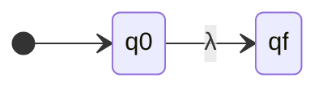
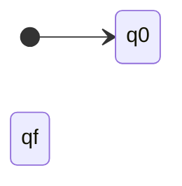
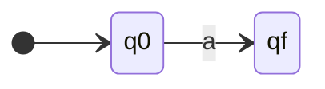

---
categories:
  - "[[ITBA.base|ITBA]]"
Tags: []
Created: "2026-03-25"
Materia: "[[TLA.base|TLA]]"
temas:
  - Expresiones Regulares
  - Propiedades de ER
  - Lema de Arden
  - Equivalencia ER-AF
  - Composición de autómatas
---
# TLA - Expresiones Regulares (Resumen)

Resumen de la clase 4 — *Autómatas, Teoría de Lenguajes y Compiladores* (Lic. Ana María Arias Roig).

---

## Expresiones Regulares

Las expresiones regulares definen los mismos lenguajes que describen los autómatas finitos: los **lenguajes regulares**. Ofrecen una forma **declarativa** para expresar las cadenas que se desea aceptar.

### Definición (Construcción Recursiva)

Dado un alfabeto $\Sigma$, los símbolos $\emptyset$, $\lambda$ y los operadores $+$ (unión), $\cdot$ (concatenación) y $*$ (clausura), definimos una **Expresión Regular (ER)** sobre $\Sigma$:

**BASE:**
- $\emptyset$ es una ER
- $\lambda$ es una ER
- Cualquier símbolo $a \in \Sigma$ es una ER

**PASO INDUCTIVO:**
- Si $\alpha$ y $\beta$ son ER, entonces $\alpha + \beta$ es una ER
- Si $\alpha$ y $\beta$ son ER, entonces $\alpha \cdot \beta$ es una ER
- Si $\alpha$ es una ER, entonces $\alpha^*$ es una ER
- Si $\alpha$ es una ER, entonces $(\alpha)$ es una ER

---

### Lenguaje descripto por una Expresión Regular

**BASE:**
- Si $\alpha = \emptyset$, entonces $L(\alpha) = \emptyset$
- Si $\alpha = \lambda$, entonces $L(\alpha) = \{\lambda\}$
- Si $\alpha = a$ y $a \in \Sigma$, entonces $L(\alpha) = \{a\}$

**PASO INDUCTIVO:**
- $L(\alpha + \beta) = L(\alpha) \cup L(\beta)$
- $L(\alpha \cdot \beta) = L(\alpha) \cdot L(\beta)$
- $L(\alpha^*) = (L(\alpha))^*$
- $L((\alpha)) = L(\alpha)$

---

### Precedencia de operadores

| Prioridad | Operador | Descripción |
|---|---|---|
| 1 (mayor) | $*$ | Clausura |
| 2 | $\cdot$ | Concatenación (asocia por izquierda) |
| 3 (menor) | $+$ | Unión (asocia por izquierda) |

> [!example] Ejemplo
> $012$ se interpreta como $(01)2$ por la asociatividad por izquierda de la concatenación.

---

## Equivalencia de Expresiones Regulares

Dos expresiones regulares $r_1$ y $r_2$ son **equivalentes** si describen el mismo lenguaje:

$$r_1 = r_2 \iff L(r_1) = L(r_2)$$

---

## Propiedades de las Expresiones Regulares


### Propiedad asociativa de $+$

Si $\alpha$, $\beta$ y $\gamma$ son ER:

$$(\alpha + \beta) + \gamma = \alpha + (\beta + \gamma)$$

> [!info] Demostración
> $L((\alpha + \beta) + \gamma) = L(\alpha + \beta) \cup L(\gamma) = L(\alpha) \cup L(\beta) \cup L(\gamma)$
>
> $L(\alpha + (\beta + \gamma)) = L(\alpha) \cup L(\beta + \gamma) = L(\alpha) \cup L(\beta) \cup L(\gamma)$

---

### Propiedad conmutativa de $+$

$$\alpha + \beta = \beta + \alpha$$

> [!info] Demostración
> $L(\alpha + \beta) = L(\alpha) \cup L(\beta) = L(\beta) \cup L(\alpha) = L(\beta + \alpha)$

---

### Neutro de $+$

$$\alpha + \emptyset = \alpha$$

> [!info] Demostración
> $L(\alpha + \emptyset) = L(\alpha) \cup L(\emptyset) = L(\alpha) \cup \emptyset = L(\alpha)$

---

### Idempotencia de $+$

$$\alpha + \alpha = \alpha$$

> [!info] Demostración
> $L(\alpha + \alpha) = L(\alpha) \cup L(\alpha) = L(\alpha)$

---

### Neutro de la concatenación

$$\alpha \cdot \lambda = \alpha$$

> [!info] Demostración
> $L(\alpha \cdot \lambda) = L(\alpha) \cdot L(\lambda) = L(\alpha) \cdot \{\lambda\}$
>
> Por definición de concatenación de lenguajes: $L(\alpha) \cdot \{\lambda\} = \{\omega = \omega_1 \cdot \lambda \mid \omega_1 \in L(\alpha)\} = L(\alpha)$

---

### Concatenación con el neutro de $+$

$$\alpha \cdot \emptyset = \emptyset$$

> [!info] Demostración
> $L(\alpha \cdot \emptyset) = L(\alpha) \cdot L(\emptyset) = L(\alpha) \cdot \emptyset$
>
> Por definición: $L(\alpha) \cdot \emptyset = \{\omega = \omega_1 \cdot \omega_2 \mid \omega_1 \in L(\alpha) \wedge \omega_2 \in \emptyset\}$. Como $\omega_2 \in \emptyset$ es siempre falso, el resultado es $\emptyset$.

---

### Propiedad asociativa de la concatenación

$$(\alpha \cdot \beta) \cdot \gamma = \alpha \cdot (\beta \cdot \gamma)$$

---

### Propiedad distributiva de la concatenación respecto de $+$

$$\alpha \cdot (\beta + \gamma) = \alpha \cdot \beta + \alpha \cdot \gamma$$

> [!info] Demostración (esquema)
> $L(\alpha \cdot (\beta + \gamma)) = L(\alpha) \cdot (L(\beta) \cup L(\gamma))$
>
> $= \{\omega = \omega_1 \cdot \omega_2 \mid \omega_1 \in L(\alpha) \wedge (\omega_2 \in L(\beta) \vee \omega_2 \in L(\gamma))\}$
>
> Dado que la conjunción es distributiva con la disyunción:
>
> $= \{\omega \mid \omega \in L(\alpha) \cdot L(\beta)\} \cup \{\omega \mid \omega \in L(\alpha) \cdot L(\gamma)\} = L(\alpha \cdot \beta + \alpha \cdot \gamma)$

---

### Clausura $*$ de $\lambda$

$$\lambda^* = \lambda$$

> [!info] Demostración
> $L(\lambda^*) = (L(\lambda))^* = \{\lambda\}^* = \{\lambda\} \cup \{\lambda\} \cup \dots = \{\lambda\}$

---

### Clausura $*$ de $\emptyset$

$$\emptyset^* = \lambda$$

> [!info] Demostración
> $L(\emptyset^*) = (L(\emptyset))^* = \emptyset^* = \bigcup_{i=0}^{\infty} \emptyset^i = \emptyset^0 \cup \emptyset^1 \cup \emptyset^2 \cup \dots = \{\lambda\} \cup \emptyset \cup \emptyset \dots = \{\lambda\}$

---

### Cuadro resumen de propiedades

| Propiedad | Expresión |
|---|---|
| Asociativa de $+$ | $(\alpha + \beta) + \gamma = \alpha + (\beta + \gamma)$ |
| Conmutativa de $+$ | $\alpha + \beta = \beta + \alpha$ |
| Neutro de $+$ | $\alpha + \emptyset = \alpha$ |
| Idempotencia de $+$ | $\alpha + \alpha = \alpha$ |
| Neutro de $\cdot$ | $\alpha \cdot \lambda = \alpha$ |
| Absorbente de $\cdot$ | $\alpha \cdot \emptyset = \emptyset$ |
| Asociativa de $\cdot$ | $(\alpha \cdot \beta) \cdot \gamma = \alpha \cdot (\beta \cdot \gamma)$ |
| Distributiva | $\alpha \cdot (\beta + \gamma) = \alpha \cdot \beta + \alpha \cdot \gamma$ |
| Clausura de $\lambda$ | $\lambda^* = \lambda$ |
| Clausura de $\emptyset$ | $\emptyset^* = \lambda$ |

---

## Autómatas Finitos y Expresiones Regulares

> [!info] Teorema de Análisis de Kleene
> Todo lenguaje definido mediante un AFD también se define mediante una expresión regular.

> [!info] Teorema de Síntesis de Kleene
> Todo lenguaje definido por una expresión regular puede definirse mediante un AFND-$\lambda$.

Como los AFD, AFND y AFND-$\lambda$ definen los mismos lenguajes, alcanza con mostrar:
1. Todo lenguaje definido por un AFD también se define mediante una ER.
2. Todo lenguaje definido por una ER puede definirse mediante un AFND-$\lambda$.

---

## Conversión de AFD en Expresión Regular

### Ecuaciones de expresiones regulares

Una **ecuación de expresiones regulares** con incógnitas $x_1, x_2, \dots, x_n$ tiene la forma:

$$x_i = \alpha_{i0} + \alpha_{i1}x_1 + \dots + \alpha_{in}x_n$$

donde cada coeficiente $\alpha_{ij}$ es una expresión regular. Una solución para $x_i$ es una expresión regular.

A una ecuación de la forma $X = \alpha X + \beta$, donde $\alpha$ y $\beta$ son expresiones regulares, se la llama **ecuación fundamental**.

---

### Lema de Arden

> [!info] Lema de Arden
> Sea $X = \alpha X + \beta$ la ecuación fundamental. Entonces $X = \alpha^* \beta$ es una solución y es **única** si $\lambda \notin L(\alpha)$.
>
> Es decir: $X = \alpha \cdot X + \beta \iff X = \alpha^* \beta$

**Demostración:**

**Parte 1** ($X = \alpha^* \beta \Rightarrow X = \alpha X + \beta$):

$$X = \alpha^* \beta \Rightarrow X = (\alpha^+ + \lambda) \cdot \beta \Rightarrow X = \alpha^+ \cdot \beta + \beta \Rightarrow X = (\alpha \cdot \alpha^*) \cdot \beta + \beta$$

Esto equivale a: $X = \alpha \cdot (\alpha^* \cdot \beta) + \beta = \alpha \cdot X + \beta$

**Parte 2** ($X = \alpha X + \beta \Rightarrow X = \alpha^* \beta$):

Se quiere demostrar que $X \subseteq \alpha^* \beta$ y $\alpha^* \beta \subseteq X$.

*Primera parte:* $X \subseteq \alpha^* \beta$. Por inducción en $|\omega|$:

- **Base** ($|\omega| = 0$): $\omega = \lambda$. Como $\lambda \notin L(\alpha)$, entonces $\omega \notin \alpha X$, y necesariamente $\omega = \lambda \in \beta$. Como $\beta \subseteq \alpha^* \beta$, se cumple $\omega \in \alpha^* \beta$.
- **Paso inductivo** ($|\omega| = n$): Si $\omega \in \beta$, entonces $\omega \in \alpha^* \beta$. Si $\omega \notin \beta$, como $\omega \in X = \alpha X + \beta$, necesariamente $\omega \in \alpha X$. Existen $\omega_1 \in \alpha$ y $\omega_2 \in X$ con $\omega = \omega_1 \omega_2$ y $|\omega_1| \geq 1$, por lo que $|\omega_2| < n$. Por hipótesis inductiva, $\omega_2 \in \alpha^* \beta$. Luego $\omega = \omega_1 \omega_2 \in \alpha(\alpha^* \beta) = \alpha^+ \beta \subseteq \alpha^* \beta$.

*Segunda parte:* $\alpha^* \beta \subseteq X$. Se demuestra de manera similar.

---

### Algoritmo para obtener la ER a partir de un AF

**Entrada:** $M = \langle Q, \Sigma, \delta, q_0, F \rangle$
**Salida:** $\alpha$ tal que $L(\alpha) = L(M)$

1. **Obtener las ecuaciones características del autómata:**
   - $\forall q_i \in Q$: la ecuación tiene $q_i$ en el primer miembro y una suma de términos $a \cdot q_j$ por cada $\delta(q_i, a) = q_j$ en el segundo miembro.
   - Si $q_i \in F$, agregar el término $\lambda$ al segundo miembro.

2. **Resolver el sistema de ecuaciones** usando el Lema de Arden y las propiedades de ER.

3. $\alpha \leftarrow$ solución para la ecuación correspondiente al **estado inicial**.

> [!example] Ejemplo
> Sea $M = \langle \{q_0, q_1, q_2\}, \{0,1\}, \delta, q_0, \{q_1\} \rangle$
>
> ```mermaid
> stateDiagram-v2
>     direction LR
>     [*] --> q0
>     q0 --> q0 : 0
>     q0 --> q1 : 1
>     q1 --> q0 : 0
>     q1 --> q2 : 1
>     q2 --> q2 : 0
>     q2 --> q1 : 1
>     q1:::final
>     classDef final stroke-width:3px
> ```
>
> **Ecuaciones características:**
>
> $$q_0 = 0 \cdot q_0 + 1 \cdot q_1$$
> $$q_1 = 0 \cdot q_0 + 1 \cdot q_2 + \lambda$$
> $$q_2 = 0 \cdot q_2 + 1 \cdot q_1$$
>
> **Resolución:**
>
> De (3), por Lema de Arden: $q_2 = 0^* \cdot 1 \cdot q_1$
>
> Sustituyendo en (2): $q_1 = 0 \cdot q_0 + 1 \cdot 0^* \cdot 1 \cdot q_1 + \lambda$
>
> Por Lema de Arden: $q_1 = (1 \cdot 0^* \cdot 1)^* \cdot (0 \cdot q_0 + \lambda)$
>
> Sustituyendo en (1): $q_0 = 0 \cdot q_0 + 1 \cdot (1 \cdot 0^* \cdot 1)^* \cdot (0 \cdot q_0 + \lambda)$
>
> Distribuyendo: $q_0 = 0 \cdot q_0 + 1 \cdot (1 \cdot 0^* \cdot 1)^* \cdot 0 \cdot q_0 + 1 \cdot (1 \cdot 0^* \cdot 1)^*$
>
> Factorizando: $q_0 = (0 + 1 \cdot (1 \cdot 0^* \cdot 1)^* \cdot 0) \cdot q_0 + 1 \cdot (1 \cdot 0^* \cdot 1)^*$
>
> Por Lema de Arden:
>
> $$q_0 = (0 + 1(10^*1)^*0)^* \cdot 1(10^*1)^*$$

---

## Conversión de Expresión Regular en Autómata Finito

### Método de composición de autómatas

> [!info] Teorema
> Si $L$ es un lenguaje asociado a la expresión regular $\alpha$, existe un autómata finito $M$ tal que $L(M) = L(\alpha)$. Este autómata tiene un **único estado de aceptación** y ningún arco que entre al estado inicial o que salga del estado de aceptación.

**Demostración:** Por inducción estructural sobre $R$.

### BASE

**Caso $\alpha = \lambda$:** $L(\alpha) = \{\lambda\}$



$M = \langle \{q_0, q_f\}, \Sigma, \delta, q_0, \{q_f\} \rangle$ con $\delta(q_0, \lambda) = q_f$

**Caso $\alpha = \emptyset$:** $L(\alpha) = \emptyset$



$M = \langle \{q_0, q_f\}, \Sigma, \delta, q_0, \{q_f\} \rangle$ sin transiciones.

**Caso $\alpha = a$ con $a \in \Sigma$:** $L(\alpha) = \{a\}$



$M = \langle \{q_0, q_f\}, \Sigma, \delta, q_0, \{q_f\} \rangle$ con $\delta(q_0, a) = q_f$

---

### PASO INDUCTIVO

Suponemos que el teorema es verdadero para las subexpresiones inmediatas de una ER dada. Sean $M_1$ y $M_2$ los AFND-$\lambda$ que existen para $R_1$ y $R_2$ respectivamente.

#### 1. Unión: $R = R_1 + R_2$

Se construye $M = \langle Q_1 \cup Q_2 \cup \{q_0, f_0\}, \Sigma, \delta, q_0, \{f_0\} \rangle$ con:
- $\delta(q_0, \lambda) = q_1$ (inicio de $M_1$)
- $\delta(q_0, \lambda) = q_2$ (inicio de $M_2$)
- $\forall q_i \in F_1 \cup F_2: \delta(q_i, \lambda) = f_0$

$$L(M) = L(R_1) \cup L(R_2)$$

#### 2. Concatenación: $R = R_1 \cdot R_2$

Se construye $M = \langle Q_1 \cup Q_2, \Sigma, \delta, q_1, \{f_2\} \rangle$ con:
- $\delta(f_1, \lambda) = q_2$ (conecta la aceptación de $M_1$ con el inicio de $M_2$)

$$L(M) = L(R_1) \cdot L(R_2)$$

#### 3. Clausura: $R = R_1^*$

Se construye $M = \langle Q_1 \cup \{q_0, f_0\}, \Sigma, \delta, q_0, \{f_0\} \rangle$ con:
- $\delta(q_0, \lambda) = q_1$ (permite entrar a $M_1$)
- $\delta(q_0, \lambda) = f_0$ (acepta $\lambda$)
- $\delta(f_1, \lambda) = q_1$ (permite repetir $M_1$)
- $\delta(f_1, \lambda) = f_0$ (permite salir)

$$L(M) = L(R_1)^*$$

#### 4. Paréntesis: $R = (R_1)$

El autómata de $R_1$ sirve directamente, ya que $L((R_1)) = L(R_1)$.

> [!example] Ejemplo: $ER = a \cdot a^* \cdot b + b$
> Por distributiva: $ER = (a \cdot a^* + \lambda) \cdot b$
>
> Por propiedad $\alpha \cdot \alpha^* + \lambda = \alpha^*$ y conmutativa: $ER = a^* \cdot b$
>
> Construcción paso a paso:
> 1. Autómata para $a$ (caso base)
> 2. Autómata para $a^*$ (clausura del anterior)
> 3. Autómata para $b$ (caso base)
> 4. Autómata para $a^* \cdot b$ (concatenación de 2 y 3)

---

## Preguntas

---

<!-- notas-relacionadas:inicio -->

## Notas relacionadas

**Misma materia (TLA)**

- [TLA -Lenguajes Regulares](TLA%20-Lenguajes%20Regulares.md) — tema anterior
- [TLA -Autómatas Finitos Determinísticos](TLA%20-Autómatas%20Finitos%20Determinísticos.md) — equivalencia ER-AF
- [TLA -Autómatas Finitos No Determinísticos](TLA%20-Autómatas%20Finitos%20No%20Determinísticos.md) — construcción de Thompson
- [frontend](frontend.md) — las ER del scanner en Flex

**Otras materias**

- **BD**  [BD clase 8 SQL consultas](BD%20clase%208%20SQL%20consultas.md) — LIKE y patrones en SQL

<!-- notas-relacionadas:fin -->
